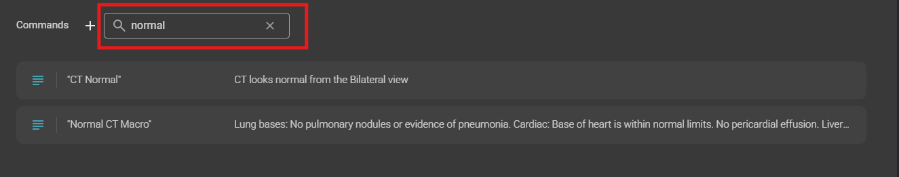

# 🆕 Voice Command Search Enhancement  

We are excited to introduce a new update to improve the **Voice Command** experience. With this enhancement, users can now efficiently locate and manage commands, making workflows more seamless and intuitive.

## 🔹 What's New?  

- **🔍 Search Functionality** – Users can now search for specific voice commands, eliminating the need for manual scrolling.  
- **✏️ Edit Commands Directly** – Once a command is found, it can be modified instantly for greater flexibility.  
- **🚀 Improved Accessibility** – Quickly access the tools and commands you need, optimizing efficiency.  

For information on voice commands in OmegaAI, see [Voice Recognition and Voice Command Features](/docs/Document-Viewer/dv_voice_command)

