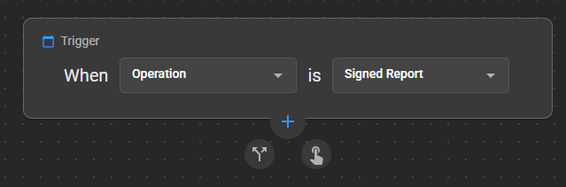

# **Signed Report Trigger in Workflow Automation (WFA)**

We are pleased to announce the **Signed Report** Trigger under the **Operations Trigger Type** in **Workflow Automation (WFA)**. This new trigger automates post-report actions (e.g., distribution, notifications) immediately after a diagnostic report is finalized, effectively eliminating delays caused by asynchronous DICOM processing. This mainly improves support for customers who are using external reporting solutions, while adding more granular control over other report creation scenarios.

## Trigger Activation Scenarios

The **Signed Report** Trigger could be activated when any of the following occurs:

1. A diagnostic report is **uploaded** as a final report via the **Document Viewer (DV) GUI**.  
2. A report is **received** in **OmegaAI** through HL7 or FHIR integrations.  
3. A **Structured Report** is ingested via **DICOM ingestion** through [OmegaAI Link](/docs/OmegaAI-Link/OmegaAI_Link).  
4. A final report (DICOM encapsulated) **imported** using the [Import Feature](/docs/Getting-Started/import#import).  
5. A final report is **created** or **saved** in **OmegaAI’s Document Viewer (DV)**, including **Signed Amendments**.

> **Note:** Ensure that you add the appropriate **conditions** after the trigger to prevent the final sign-off from being activated when not required.

**Workflow Automation** allows you to automate processes and tasks, increasing efficiency and reducing manual intervention. With the **Signed Report Trigger**, we’re taking another step toward streamlining your reporting workflow. 

For more information, see [Workflow Automation](/docs/Workflow-Automation/workflow_automation).
