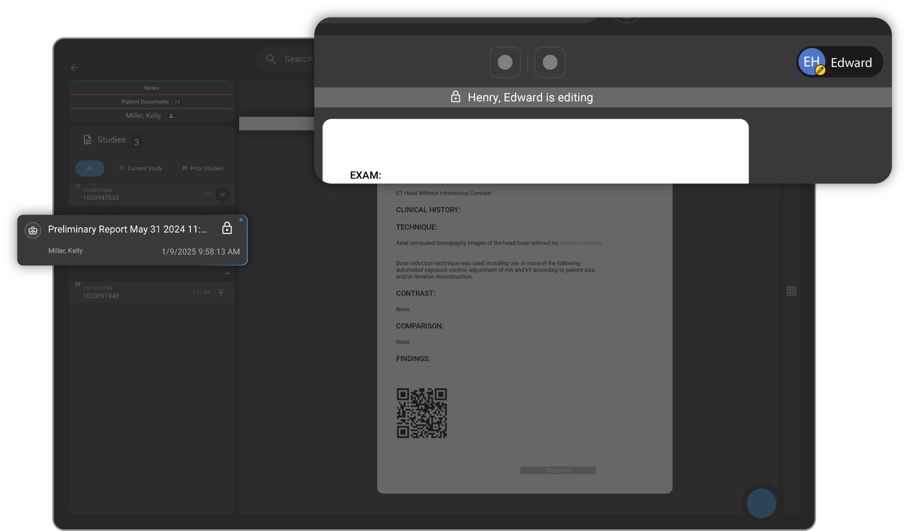

# 🆕 Avoid Concurrent Reporting  

We are excited to announce the launch of new feature **Avoid Concurrent Reporting**, a simple yet powerful enhancement designed to improve visibility and coordination among radiologists and clinicians working on reports.

## 🔹 What is it?  
The Report Access Indicator shows in real-time when someone is currently viewing or editing a report. This helps reduce conflicts, confusion, and duplicate efforts when multiple users access the same report.

💡**Key Highlights**:

**Live Indicator**: Easily see who is actively viewing or editing the report.

**Improved Collaboration**: Prevents accidental overwrites and ensures seamless handoffs.

**Enhanced Efficiency**: Reduces unnecessary communication and guessing around report status.

For more information about this feature in OmegaAI, see [Report access indicator](/docs/Document-Viewer/document_explorer#report-access-indicator)
