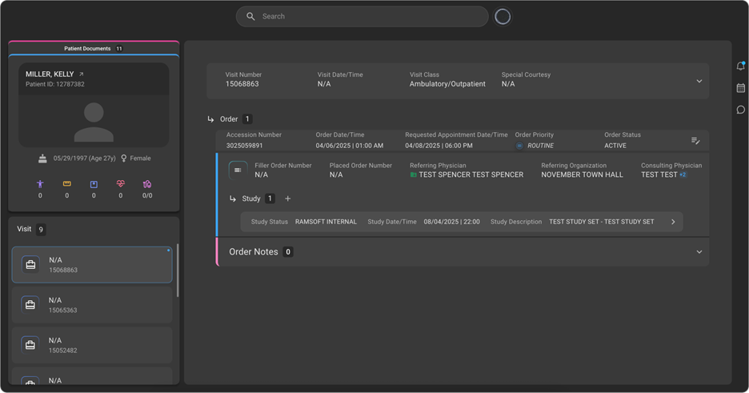

# 🆕 Revamped Info Pages 

We are pleased to announce the launch of the revamped **Info pages**. With this enhancement, we have streamlined the interface and improved the accessibility of the Order and Study details of the pateint. We have now introduced Visit section which would contain the orders. Thus, the hierarchy is Visit --> Order --> Study.  

## 💡**Key Highlights**  

- **Visit Section** – The Newly added Visit section contains the Patient Visit details including the Visit Date/Time, Patient Vitals, Accident notes, Special Courtesy, Visit Class (Inpatient or Outpatient etc.,).

- **Reassign Order to a different patient** – Now Orders can be easily reassigned to the correct patient by searching and assigning directly to them. This will move the Order and all associated studies from one patient to another.

- **Navigate to the Study page easily** – Now users can easily view all the studies under the Order and can click on each study tile to open the Study details page.

- **Quick Access panel on Study Page** – Users can now have upfront and easy access to Image Viewer, Document Viewer, Prior Auth and Post Charge action buttons directly from the Study Page.

For more information on Revamped Patient Page in OmegaAI, see [New Info Pages](/docs/Getting-Started/Visit_Order_Study).
