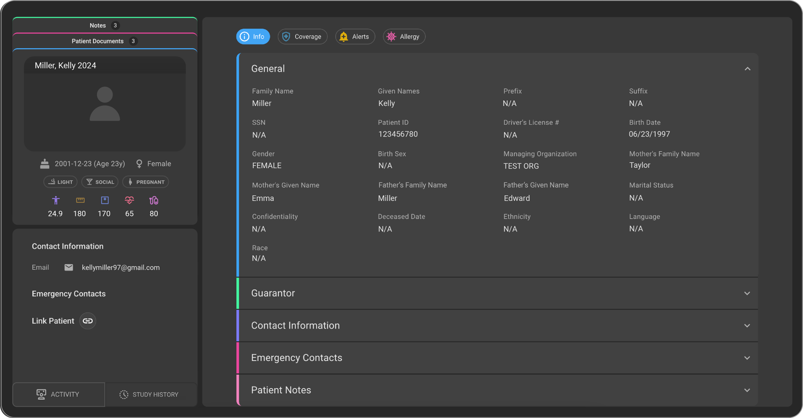

# 🆕 Revamped Patient Page 

We are excited to announce the launch of the revamped **Patient Page** crafted for more intuitive and efficient user experience. This update brings enhanced accessibility, streamlined interface and new functionalities designed to optimize the workflow.

## 💡**Key Highlights**  

- **General Section** – All the basic patient details such as Name, Gender, DOB, SSN etc., are available within this section.  

- **Guarantor Section** – The user can now add the Guarantor details of the patient. 

    **Note**: A guarantor refers to the person who agrees to repay a patient's medical bills if the patient cannot pay.

- **Contact Information Section** – We have now moved the Contact information section within the Info tab for easy accessibility. Users can now **Add/Edit/Delete** multiple email ids and contact numbers.

- **Emergency Contacts Section** – Users can add the Emergency contact details for the patient​.

- **Patient Notes Section** – Users can **Add/Edit/Delete** multiple patient notes​. 

- **Coverage Section** - Users can **Add/Edit/Delete** multiple coverage details for the patient.

For more information on Revamped Patient Page in OmegaAI, see [Managing Patient Record](/docs/Advanced-Topics/managing_patient_record)
