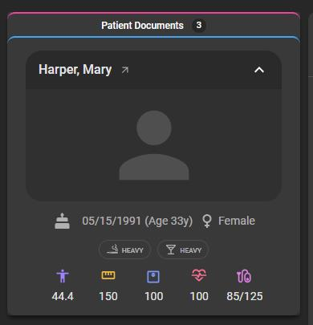

# 🆕 Patient chart  

We are excited to announce the new **Patient Chart** feature, designed to streamline patient information and patient document access.

## 🔹 What's New?  

**Patient Card:** Displays high-level patient details and vital stats for quick reference.
**Patient Documents**: View all uploaded documents (from patients or technicians) and upload new ones directly. Easily access the patient’s registration form without extra navigation.
**Split View**: Effortlessly view patient documents side by side, enhancing workflow efficiency.

For information on Patient chart in OmegaAI, see [Patient chart](/docs/Document-Viewer/document_explorer#accessing-and-using-the-patient-chart-module-in-document-viewer)