# Login Process and Multi-factor Authentication (MFA)

RamSoft’s OmegaAI offers heightened account security measures through its Multi-factor Authentication (MFA) procedure ensuring information confidentiality and safety for all users.

The section in subject will provide you with a walk through of the Login and Account Creation for RamSoft’s OmegaAI as well as the MFA process applied to several scenarios:
- Login from Regular Browser
- Incognito Browser (without closing browser)
- Incognito Browser (close browser)
- Different Browser
- Different IP Address
- Different Device and OTP Fingerprinting

## New User Account Verification (One-Time-Password/verification code)

If you have chosen to create an account, you will enter the required fields and click “Continue”. You will be prompted to verify your account. You will receive a One-Time Password (OTP) via email or SMS.

The scenario below displays the email OTP:

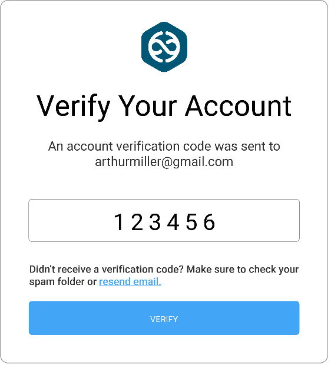

Retrieve your OTP from your email inbox and enter it into the required field.

Note: If you did not receive the verification code for the first time click the “resend email” hyperlink and follow Step 1.

Press “Verify”. Your account has now been successfully verified.

## Existing User Login Process

Access [https://www.omegaai.com/](https://www.omegaai.com/). Once you are on the Log in page follow the steps below to access your account:

Click OmegaAI.

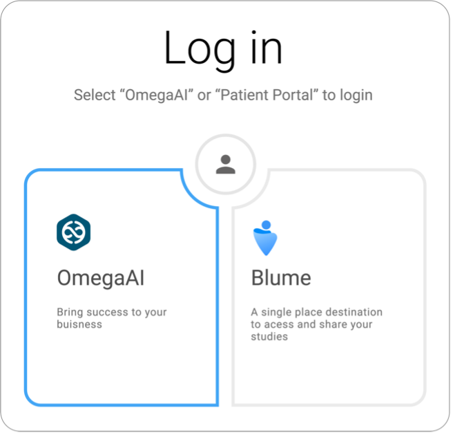

You will now see the Welcome to OmegaAI section.

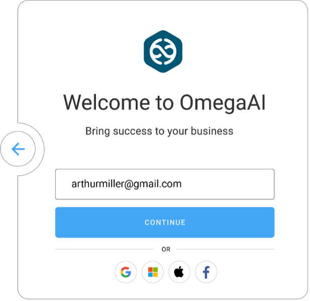

Enter your email address.
Click “Continue”.
You will now see the Enter PIN section. Enter your pin.

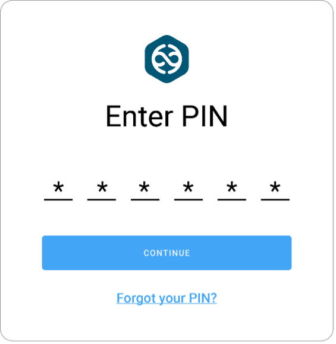

Click “Continue”. You have now successfully logged into OmegaAI and you will be directed to the OmegaAI Home page.

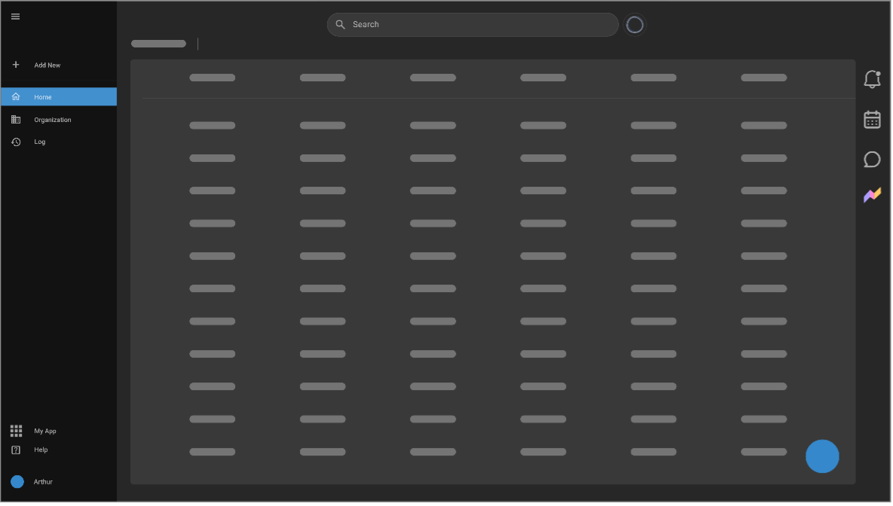

## MFA Procedure Applied to Multiple Login Scenarios

MFA login flow differs as per scenarios displayed in the below diagrams.
- Login via Regular Browser

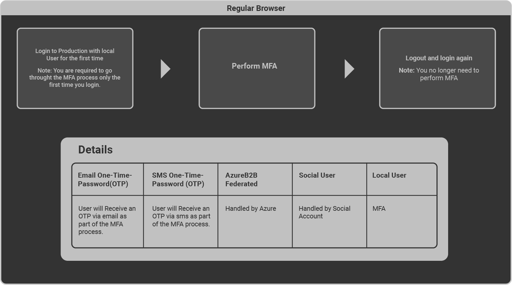

- Login via Incognito Browser (without closing browser)

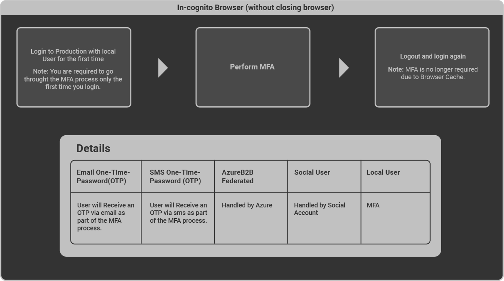

- Login via Incognito Browser (close browser)

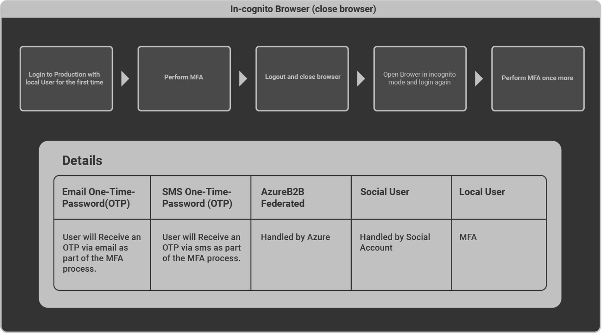

- Login with Different Browser

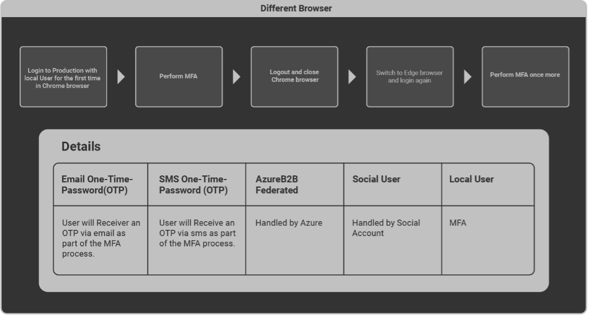

- Login with Different IP Address

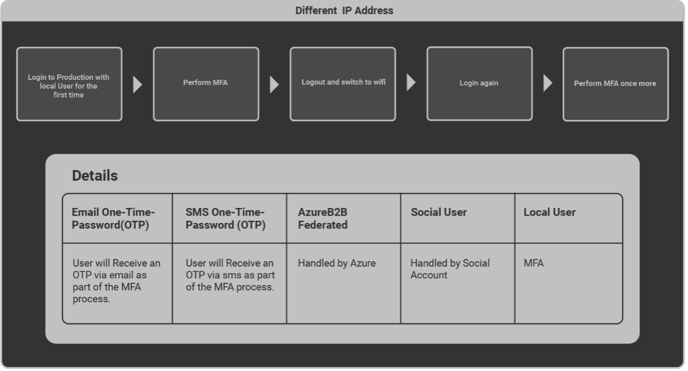

- Login with Different Device

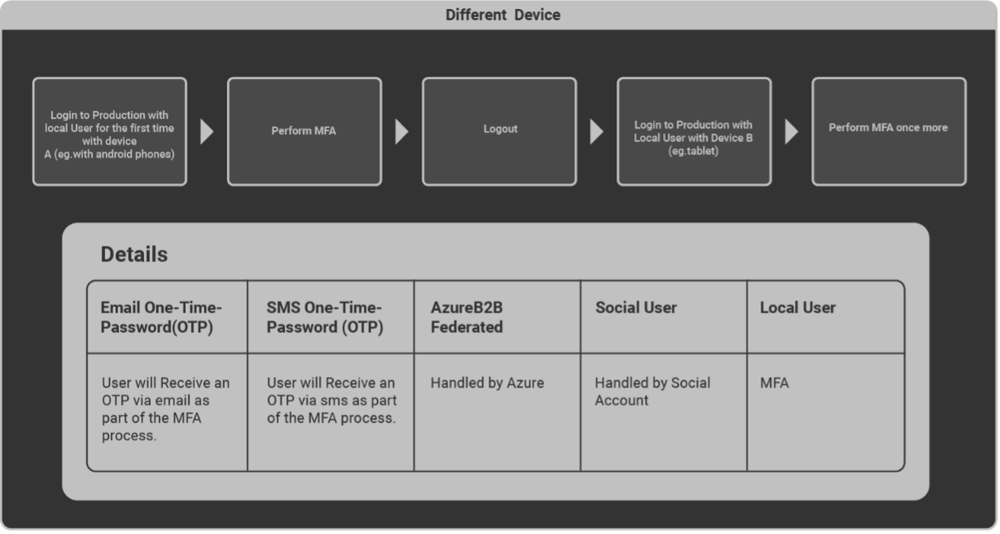

- Login via OTP Fingerprinting

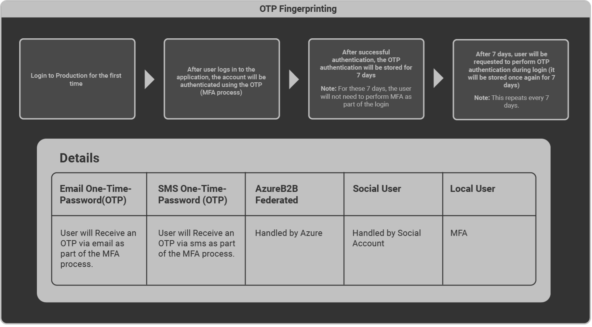

## How to prevent having to perform MFA every single time you login

Note: MFA triggers are tracked by the browser's local storage.

However, in some cases, browser security settings are set up to delete data stored in the browser’s local storage (as shown below) requiring the user to perform MFA every time they log in to OmegaAI.

### Solution

Access your respective browser settings (for example Chrome) and follow the below steps:
- Select Privacy and Security from the left navigation menu.
- Select Site settings.
- Select the third-last option from the list On-device site data.
- Select the first option Allow sites to save data on the device.

Your login details will now be stored in the browser’s local storage thus no longer triggering an MFA request.
