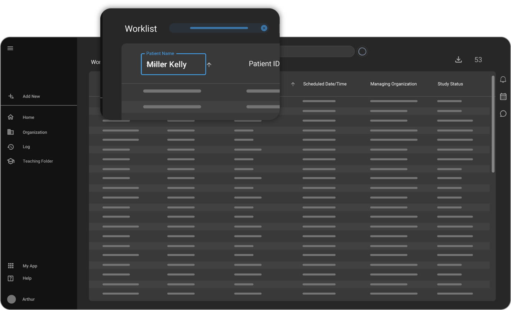
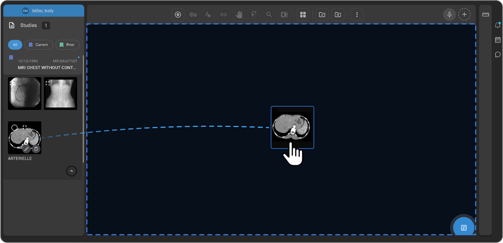

**_Omega AI Quick Reference Guide for Referring Physicians_**

## Introduction

Welcome to **OmegaAI**, a powerful and intuitive platform designed for
referring physicians to manage patient studies seamlessly. This guide
covers account setup, navigating the worklist, searching for studies,
using emergency access, and working with imaging tools.

**A**.  **Account Setup**

I. **Sign-Up Process**

1. **Receive an Invitation:** Once an organization grants you access,
    you will receive an _invitation email_.

2. **Create Your Account:** Click the _Create Your Account_ button to
    open the account creation form on a new tab on the browser.

3. **Fill in Details:** Enter your _name_ and specify the desired _PIN_
    _code_ for your location. (Note: The name will be auto filled, but
    you can edit it if needed.)
4. **Complete Setup:** Click _Continue_ to finalize account creation.

II. **Troubleshooting:** If you haven't received the invitation email,
  check your spam folder or contact the organization for a re-send.

**B**.  **Logging In**

<!-- -->

1. Enter your registered email and password.

2. When prompted, complete the email _verification_ _process_ by
    entering the _code_ sent to your email (2-factor authentication).

3. Click _Verify_ to proceed.

(**Tip:** If you don't receive the verification email, check your spam
folder or contact your organization for assistance.)

**C**. **_Navigating the OmegaAI Worklist_**

I. **Accessing the Worklist**

Once you log in to _OmegaAI_, you will be directed to the **Default
Worklist**, where you can view assigned patient studies.

For the best experience, we recommend using **Google Chrome** or
**Microsoft Edge**.

II. **Adjusting Display Settings**

If the text appears too large or too small, adjust the zoom settings in your browser for better readability.

III. **Understanding Worklist Assignments**

The studies displayed in your worklist are only those assigned to you
as: -

1. _Referring Physician_

2. _Consulting Physician_

3. A _member_ of the _same referring organization._

IV. **Filtering the Worklist**

To quickly locate a specific study or patient:

- Click on the column header corresponding to the data you want to filter. (For example: To search for a specific patient, click on the _Patient_ _Name_ or _Modality_ column header.)

- Enter Search Criteria. (For example: Type the patient's name in the search field.)

- The worklist will automatically update to display only the records that match or closely resemble the entered name.

V. **Viewing More Columns:**

 Scroll left or right to access additional columns in the worklist.
>

VI. **Clearing Filters:**

<!-- -->

- Click the (X) button to remove a specific filter.

- Use the _Clear All_ button to reset all filters.

<!-- -->

VII. **Downloading or Burning Studies**

 To download or burn a study to a disk:

- Select the _desired_ _study_ from the worklist.

- Choose the _Download_ or _Burn_ option as per the need.

VIII. **Troubleshooting**

 Not seeing your patient's study in the worklist?

- The study _may not be assigned_ to you or your organization.

- Use the _Emergency_ _Access_ feature to search for the study or
  patient (refer to the _Using Emergency Access_ section).

For more information on the worklist, including how to create custom worklists, refer to the user guide:

[Worklist Documentation](https://help.omegaai.com/docs/category/worklist)

**D**.  **Searching for Patient Studies**

I. **Accessing Global Search**

- Click the _Global Search Bar_ at the top of the homepage.

- Enter the patient's _name_, _study ID_, or other identifiers.

- Matching studies will appear in the search results.

- _Double-click_ on the desired study to open it.

(Need More Results? Click View More to expand the search.)

II. **Troubleshooting**

 If you can't find a patient's study:

- Use the _Emergency_ _Access_ feature.

For more information on _Global_ _Search_, refer to the user guide:

[Global Search Documentation](https://help.omegaai.com/docs/Global%20Search/Global%20Search)

**E**.  **_Emergency Access_**

I. **What is Emergency Access?**

<!-- -->

- The _Emergency Access_ feature in _OmegaAI_ _allows_
  physicians to retrieve patient studies and records in urgent
  situations quickly.

- This feature _bypasses_ organizational _restrictions_,
  ensuring access to critical information when needed.

(Note: All Emergency Access actions are _audited_ for security and compliance.)

In critical situations, use **Emergency Access** to bypass organization restrictions.

II. **How to Use Emergency Access**

- Click on the _Search Bar_ at the top of the screen.

- Select _Emergency Access_ from the dropdown menu.

- To access a patient's studies, reports, and images enter _First_ & _Last_ Name (mandatory) and at least one of the following:

  - Date of Birth

  - Phone Number

  - Email Address

- Once all required fields are filled, the _Continue* button will turn blue, allowing you to proceed.

- After verification, you will be directed to the _Patient_ _History_ _Page_.

- Hover over the desired study in the worklist.
    You will see two options:

  - _Final_ _Images_ & _Reports_

  - _Forms_

- You can click on the desired study to open the _Omega Dial menu_,
    which provides multiple study management tools.

- The Omega Dial menu options are as follows:

1. **STUDY**

2. **DOCUMENT VIEWER**

3. **ORDER**

4. **IMAGE VIEWER**

5. **SEND**

**Note:** You can find detailed information on Omega Dial, on the link below: -

[**Introduction to OmegaAI Worklists \| OmegaAI User
Guide**](https://help.omegaai.com/docs/Worklist/worklist_omegaai#omegaai-dial)

III. **Troubleshooting**

 Study Not Found?

- Double-check the patient details for accuracy.

- The patient may not exist under the provided information, contact the imaging organization for further assistance.

**F**. **_Using the Image & Document Viewer_**

I. **Accessing the Image Viewer**

- When you open the Image Viewer in OmegaAI, patient images will be displayed in the center of the screen.

- You can scroll through each series to view all the images contained within.

<!-- -->

II. **Key Features of the Image Viewer**

- _Patient & Study Details_

  - Location: Top-left corner of the screen

  - Displays _patient_ and _study details_ for quick reference.
  - Hover over this section to expand and view additional details.

- _Study Explorer Panel_

  - Location: Side panel (left side of the screen)

  - Shows all series contained in the opened study.

  - Displays _prior studies_ (marked with a _green flag_) and the _current study_ (marked with a _blue flag_).
  - _Double-click_ on a _series_ or _drag_ and _drop_ it into the main image viewer.

- _Image Annotations_
  - Location: All four corners of the image
  - Displays important details, such as image measurements, timestamps,etc.

- _Viewing Reports & Images Simultaneously_

  - Click the _Document_ _Viewer_ button (bottom right corner).
  - This will open the _document_ _viewer_ alongside the _image_ _viewer_,
  allowing you to review both at the same time.

- _Customizing the Viewer Layout_

  - Click the _Change Layout* Button on the top of the Image Viewer to add multiple image display sections, for image series.

- _Downloading Studies & Images_

  - Click the _three-dot_ menu on the toolbar located at the top of the image viewer.
  - Select the _Download_ option to view the dropdown: _Download Image_ (for individual images) or _Download Study_ (for the entire set).

- _Advanced Features_

 The image viewer offers various features, including tools, hanging protocols, and customization options.

For detailed information, please refer to the user guide: -

 [Image Viewer Documentation](https://help.omegaai.com/docs/category/image-viewer)

**G**.  **Using Document Viewer**

 The Document Viewer in OmegaAI allows referring physicians to view, download, and print patient reports efficiently.

I. **How to Access the Document Viewer**

<!-- -->

- Open the Document Viewer from either:

  1. The _Worklist_

  2. The _Study History Page_

- On the _report document_ at the bottom of the screen locate and hover over the small _black_ _bar_ to reveal _Download_ and _Print_ options.

II. **How to Download & Print Reports**

<!-- -->

- Click the Download button (follow the steps mentioned above to locate
  it)

- The report will be saved as a _PDF_ in your Downloads folder.

- Click the _Print_ button.

- This will open the print dialog in your web browser, allowing you to select printer settings.

<!-- -->

III. **Troubleshooting**

 If you are unable to find a report, try the following:

- Verify the Correct Study: Ensure you have opened the right study for the patient.

- Check Report Status: If the report is not signed, it may not be
  available yet.

- Go to the Worklist and check if the study status is _SIGNED_.

- Contact the Imaging Center: If the report is still missing, reach out to the imaging center for further assistance.

For more details on document viewer, see the user guide:

[Document Viewer Documentation](https://help.omegaai.com/docs/category/document-viewer)

**H**.  **Downloading & Accessing Studies**

 Once you download a study in OmegaAI, it will begin streaming in the background. The study will not immediately appear in your Downloads folder until the download is fully completed.

I. **How to Track Download Progress**

<!-- -->

- Click on the Downloads Button in the right panel to open the download area.

- Monitor the progress of your study download.

- Once the download is complete, the study will appear in your
  _Downloads folder_ _(location may vary by browser and OS)._

<!-- -->

II. **Accessing Downloaded Studies on Windows**

<!-- -->

- Go to your Downloads folder.

- Extract the _ZIP_ file before accessing the study.

- Click on the ZIP file.

- Press _"Extract All"_ to open the extraction prompt.

- Choose a destination folder and click **"_Extract_"**.

- Open the extracted folder.

<!-- -->

 _**Viewing the Study on Windows:**_

<!-- -->

- Click VIEWER.EXE to launch the Image Viewer.

- **Note:** _.EXE files work only on Windows OS._

<!-- -->

 _**Accessing DICOM Files:**_

<!-- -->

- Open the numbered folder inside the extracted directory.

- Each folder contains _DICOM images_ for the exported patient.

<!-- -->

III. **Accessing Downloaded Studies on _MacOS_**

<!-- -->

- Windows VIEWER.EXE will not work on MacOS.

- Use a _third-party DICOM viewer_ to open the images.

- Recommended **DICOM viewers for MacOS** (_RamSoft Inc._ has no
  affiliation with these products.Use at your own risk):

- OsiriX Lite:
  
  [Download OsiriX Lite](https://www.osirix-viewer.com/osirix/osirix-md/download-osirix-lite/)

   [MIPAV](https://mipav.cit.nih.gov/index.php)

<!-- -->

IV. **Troubleshooting:**

<!-- -->

- The DICOM files may not be recognized by default.

- Rename the file to _add ". dcm" at the end_ to ensure compatibility
  with most DICOM viewers.

- Alternatively, open the file _directly from the DICOM viewing
  software.*

**I**.  **_Final Notes_**

- Ensure your Worklist is regularly refreshed for the latest updates.

- Use appropriate access levels to maintain security.

- Explore additional features in the OmegaAI user guide for advanced functions.

For further assistance, visit
[**help.omegaai.com**](https://help.omegaai.com) or contact support.
