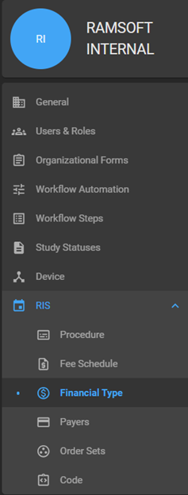
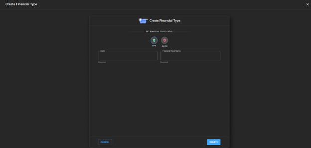
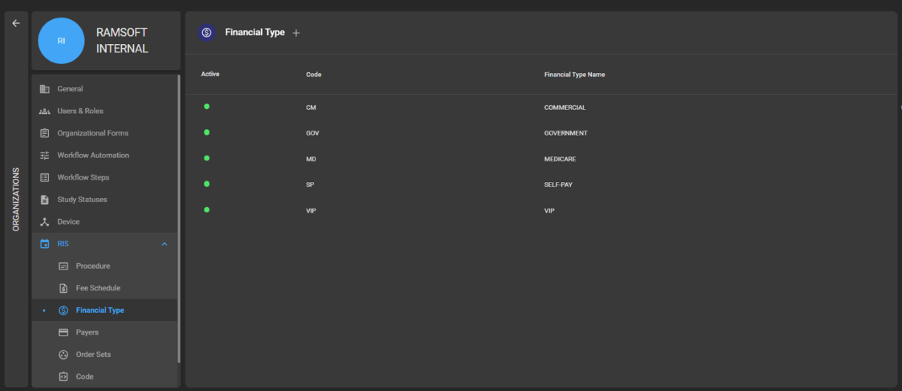
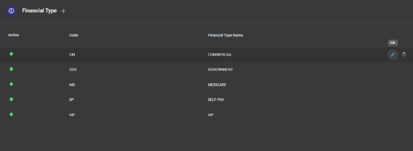
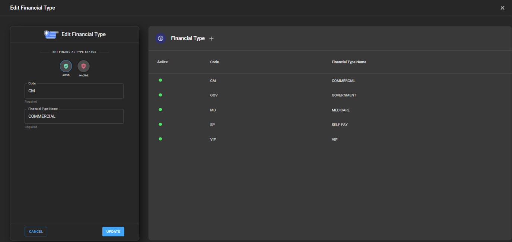
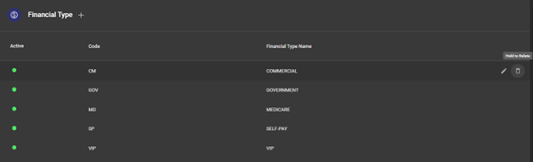

# RIS Settings - Financial Type

## Adding Financial Type to the Organization

- Click on Organization option on the left panel and open the respective
  organization details page.

- Within the Organization detail page, click on RIS. It will expand and
  display the Financial Type.

- Click on the Financial Type. It will open the Financial Type details
  where the user can Add new financial type, edit the existing financial
  types and delete the existing financial types.

  

- Click on the + icon to add a new financial type. It will open the Add
  new financial type drawer.

- Enter the Financial Type code and Financial type name.

- Click on Create button to create this financial type record.

 

- Once the financial type record is saved, it will reflect in the
  financial type list.

 

- Note: Financial Type can only be added in the Managing organization,
  and it will inherit across all the child organizations.

## Editing/Deleting a Financial Type Record

- When you hover over the Financial Type record on the Financial type
  list page, you will see the Edit and Delete icon.

  

- When you click on the Edit icon, the Edit Financial type drawer will
  open.

- Users should be able to edit the details and on click on Update
  button, the details would be saved.

 

- To delete a Financial type record, you should click on the Delete
  icon.

 

- On click of the Delete icon, the corresponding Financial type record
  would be deleted, and it would disappear from the Financial type list.
