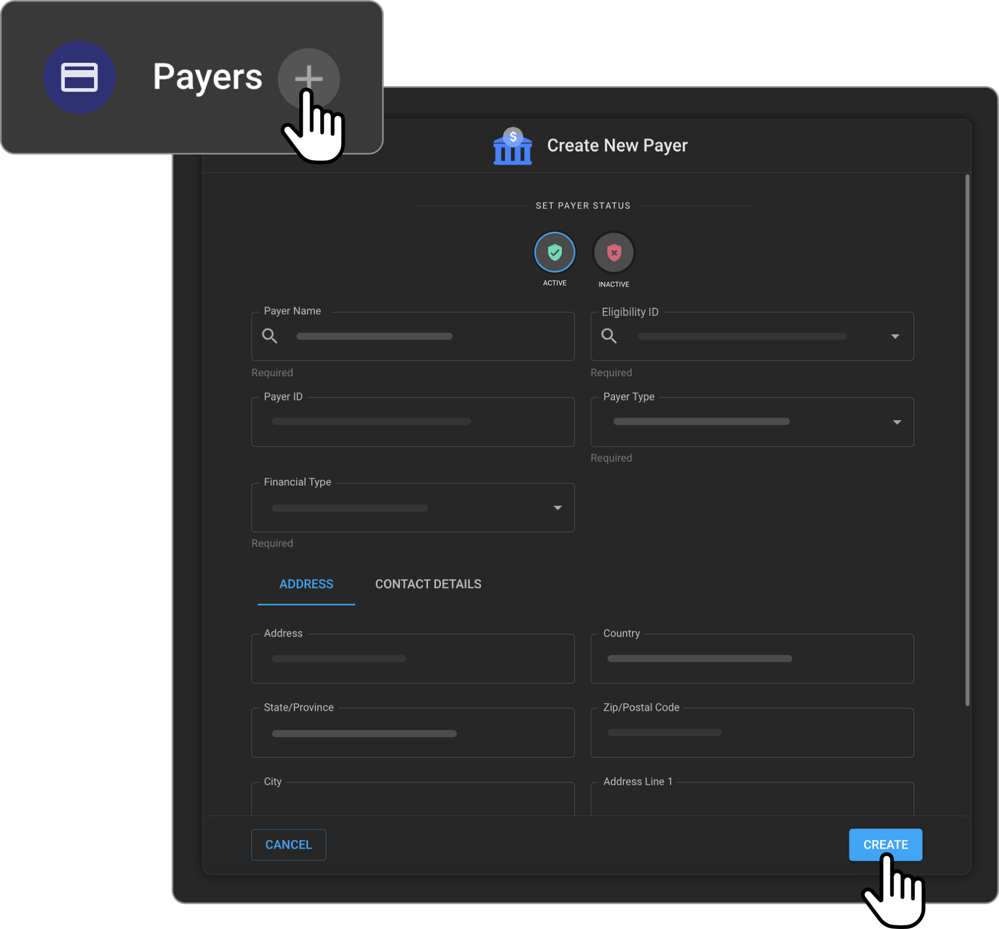

# RIS Settings - Payers

## Adding Payers to the Organization

- Click on Organization on the left panel and open the respective
  organization details page.

- Within the Organization detail page, click on RIS. It will expand and
  display the Payers.

- Click on the Payers. It will open the payers where the user can Add
  new insurance payers, edit the existing insurance payers and delete
  the existing insurance payers. 

- Click on the + icon to add a new payer. It will open the Add new
  insurance payer drawer.

- Search for insurance payer name you wish to add. It will search the
  list of insurance payers from the provided list along with their
  Eligibility ID.

- Select the Payer name from the list and it will auto populate the
  Eligibility Payer ID and Payer ID fields.

- Eligibility Payer ID field would be used for doing Eligibility check
  for the patients Insurance.

- Payer ID field would be used for Billing software integration
  purposes.

- User can then fill in the other details like Payer Type, Financial
  Type, Address and Contact Details and click on Create button to create
  this payer.

- Once the payer is saved, it will reflect in the Payers list.

- Users can create Payers with or without the Eligibility Payer ID field
  based on their needs. The Eligibility Payer ID field is not a
  mandatory one.

- **Note:** Payers can only be added in the Managing organization, and
  it will inherit across all the child organizations.

## Editing/Deleting a Payer Record

- When you hover over the Payer record on the Payer list page, you will
  see the Edit and Delete icon.

- When you click on the Edit icon, the Edit Payer drawer will open.

- Users should be able to edit the details and on click on Update
  button, the details would be saved.

- To delete a Payer record, you should click on the Delete icon.

   

- On click of the Delete icon, the corresponding Payer record would be
  deleted, and it would disappear from the Payer list.
