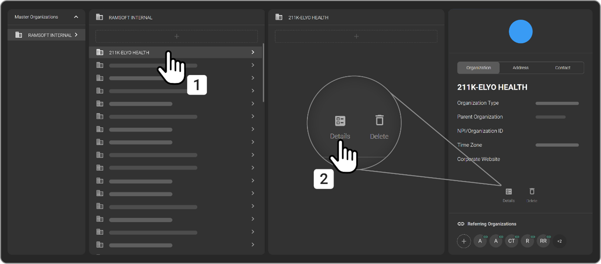
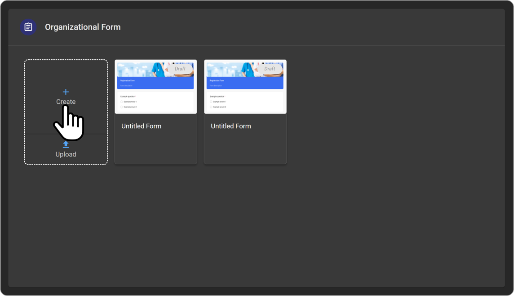
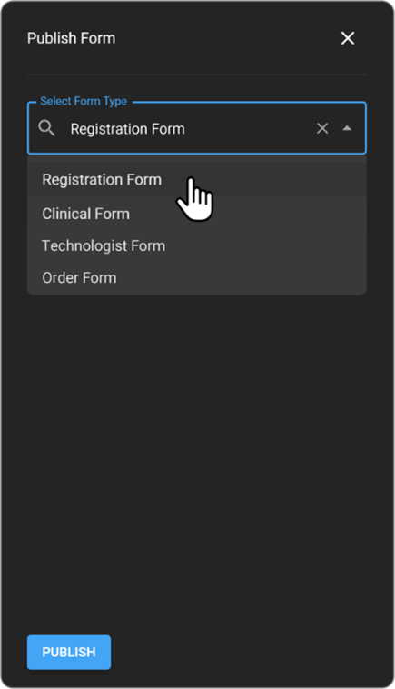
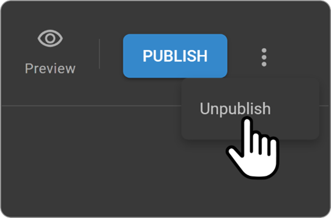
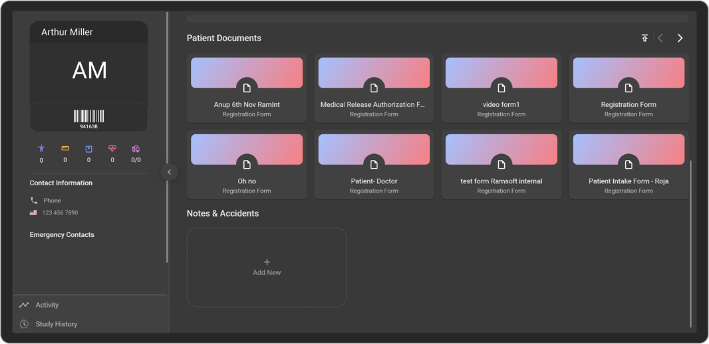
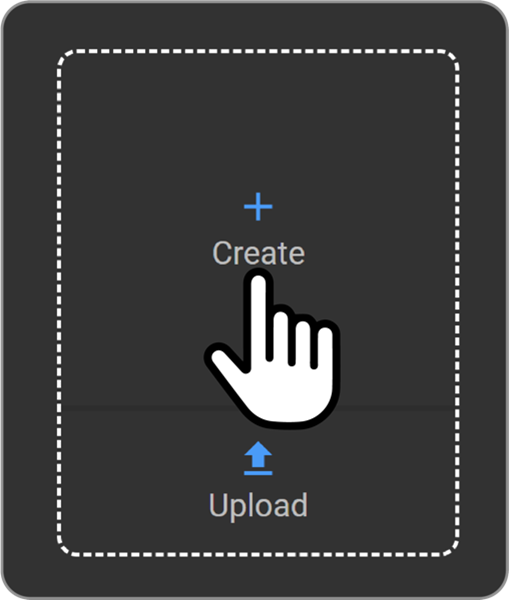
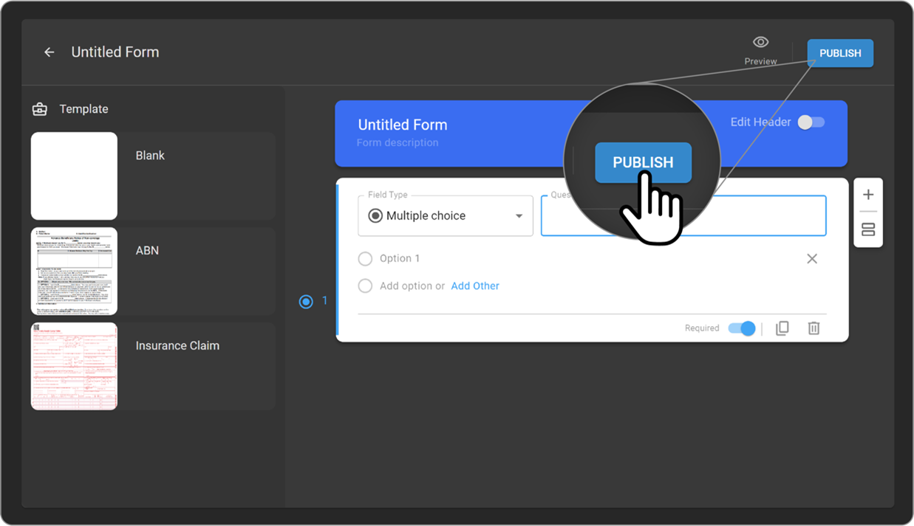
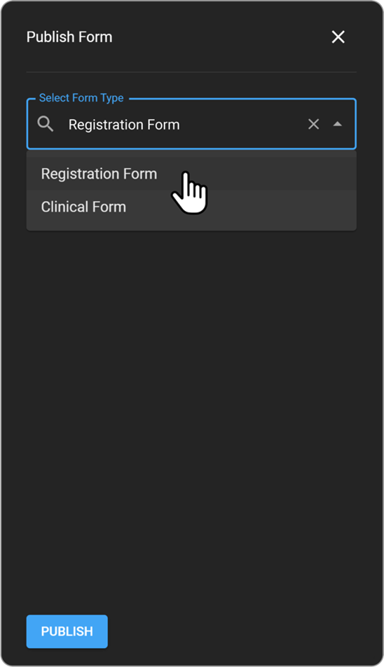
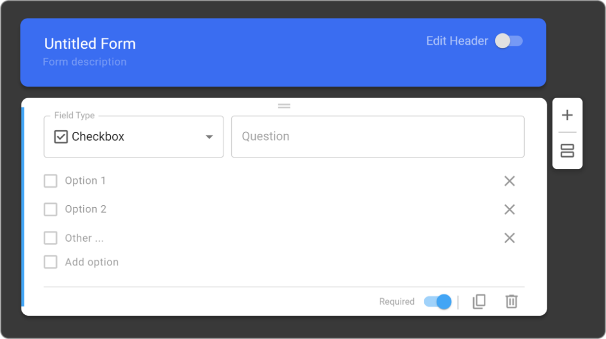

# Setting Up Forms

This section provides instructions for managing organizational forms in OmegaAI, including creating, publishing, and filling out various types of forms necessary for patient care and operational procedures. It covers both internal forms used by healthcare providers and external forms, known as Blume Forms (filled out by patients). The guide walks through the stages of form management, including drafting, publishing, viewing, and editing
forms, and well as handling question cards.

## Accessing Organizational Forms

To access the Organizational Form in OmegaAI, follow these steps:

1.  Navigate to the **OmegaAI homepage**.

2.  Click on **Organizations**.

3.  Click on a specific organization

4.  Select Details which is next to the Delete button to open
    **Organizational Forms**.

    

## Understanding Form Types

OmegaAI supports different categories and types of forms:

- **Internal Forms or Organizational Forms**: Accessible to service
  providers, technologists, front desk staff, and physicians.

- **External Forms or Blume Forms**: Created by service providers and
  filled out by patients. For more details, see the section on Blume
  Forms.

#### Available Form Types:

- **Registration Form**: This is a patient-level form issued to all new patients in OmegaAI.
  - The Registration Form template is obtained from the patient's managing organization.

- **Clinical Form**: This is a study-level form issued when a relevant study is scheduled.
  - The Clinical Form template is obtained from the imaging organization associated with the respective study. 

- **Technologist Form**: This is a study-level form required to be filled out before viewing images in the Image Viewer.
  - The Technologist Form template is obtained from the imaging organization associated with the respective study. 
  
- **Order Form**: This is a study-level form required to be filled out during the creation of new orders in OmegaAI.
  - The Order Form template is obtained from the imaging organization for which the order is being placed.

  

### Creating and Publishing Forms

#### Creating a Form Draft:

1.  Click on the **+** button.

2.  Select either **Registration form** or **Clinical Form**.

3.  An **Untitled Form** appears. Toggle the **Edit Header** button.

4.  Use the **Add Banner** button to upload a banner image.

5.  Click on **Add Logo** to upload a company logo.

6.  Choose a header colour from the colour panel.

7.  Add a title and description for the form.

8.  Select a question type from the **Field Type** dropdown.

9.  Enter the question and define up to three subcategory levels for
    multiple-choice questions.

    

#### Publishing the Form:

1.  Use the **Publish** option to finalize and publish the form.

2.  The form will then be accessible in the Blume application and will
    start being issued for new patients or studies.

    
    
    

    

### Viewing Issued Forms

Forms can be viewed in various sections within OmegaAI:

- **Study History**: Access forms via the Forms icon.

 

- **Patient Documents**: View patient-specific forms.

 

 

- **Document Viewer**: For studies and clinical forms.

 

 

## Managing Blume Forms

1.  From OmegaAI, access **Apps** and click on the **Settings icon**
    embedded in the Blume icon.

    

2.  Navigate to **Blume Form** and select the appropriate organization
    from drop down.

3.  Create a new form by clicking the **Create Plus** icon or upload a
    fillable PDF form.

    

4.  Preview the form, then publish it by selecting the **Publish**
    button.

    

    

5.  Unpublish a form using the **three dots menu**.

    

### Inserting Question Cards in Blume Forms

1.  Access the Question Card list in the Blume Form.

2.  Select the desired question card from **Field Type**.

    

3.  Enter questions and define answer options.

4.  Toggle the **Required** button to make questions mandatory.

    

5.  Manage questions with the **Duplicate** and **Delete** icons, and
    use the **Page break** icon for longer questions.

    

#### Types of Question Cards:

- Short Answer, Paragraph, Multiple Choice, Dropdown, Checkbox, Multiple
  Choice Grid, Checkbox Grid, Date, Signature, Text Box, and Upload
  Image.

  **Note**: A mini-map with numbers helps track the addition of
questions to ensure they are organized correctly.
