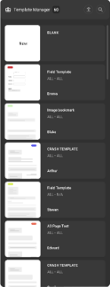
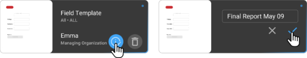
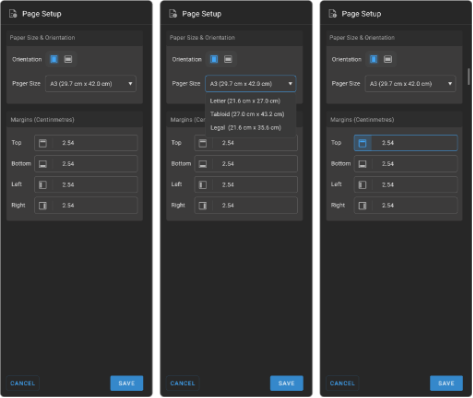
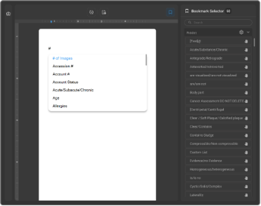
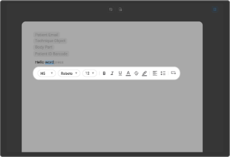
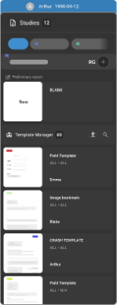

# Setting Up Workflow

## Setting up Report Templates

The Document Manager Report Template Setup feature in OmegaAI
simplifies the creation of patient reports for radiologists and
reading physicians. This feature offers tools for manually creating
reports using a bookmarks editor and expedites the process using
predefined templates. This guide provides detailed steps on how to use
this feature effectively.

Using Predefined Templates

Predefined templates are designed to standardize the formatting and
content of reports, reducing the need for manual input, and ensuring
consistency across documents.

**How to Use Predefined Templates**:

Goal is to allow users to create a report when templates are
available. When radiologist opens the Document Viewer, the best
matched template is loaded with a cursor in it.

The best matched template in the browser is created as a preliminary
report which has the yellow icon signifying the icon for template.

If user deletes the best matched template, system loads the blank
report, and all the templates will be available in the templates
drawer. In the browser, beneath the open reports, there are reports
and documents with a separator. User can add at the maximum three open
reports.

1.  Go to **Document Viewer**.

2.  Click on the three dots on top of the window to open the menu
    dropdown.

3.  Select **Template Manager** from the list.

4.  All the templates appear in the thumbnail navigation.

5.  Select the template.

6.  The selected template displays blue dot in thumbnail.

7.  **Preview** and **Edit** icons show up on top of the window.

8.  Click on **Edit** icon to edit the template.

9.  Click on **Publish** icon to Publish the Template.

    

    

If template name is not changed it will save under existing template,
if name is changed it can be published as a new template.

While applying templates in drawer, only the best matched templates in
decreasing order of match points of the same modality, as study will
be shown.

Templates are arranged based on most recent publication. Time stamps
are displayed in report card, template card, version history and
amendment history in EST.

Unique name is given for reports including reportname and timestamp.

The Report Name Format is *Final Report Month Date Year hh:mm:ss*.

Partial search capability is functional in Template Manager.

### Creating and Editing Templates

Create or modify templates to meet specific reporting needs with
customizable elements such as bookmarks, signatures, and more.

**Steps to Create/Edit a Template**:

1.  **Open Template Manager**: Upload an existing template or create a
    new one.

2.  **Define Page Setup**: Choose the appropriate page size (e.g., A4,
    A3, A5, Letter, Tabloid, Legal).

    

3.  **Use Bookmark Selector**:

    - **Picklist**: Set up customizable drop-down lists for selecting
      specific options.

    - **Fields**: Define parts of the document like Title, Body Part,
      Patient Name, etc.

    - **Categories**: Organize documents by criteria like Date of Birth,
      Order Time, etc.

4.  **Insert Bookmarks**: Place bookmarks in the template for quick
    access to information based on the defined fields and categories.

    

### Adding Text and Formatting in Templates

Enhance the visual appeal and clarity of templates using text
formatting tools.

Select a word or letter of the text to find formatting template to
choose from.

**Formatting Tools Available**:

- Bold, Italics, Underline, Align text

- Highlight, Bullet points, and other text enhancements

  

**Preview and Publish**:

- Preview the template in real-time to ensure it meets the desired
  standards.

- Once finalized, publish the template to make it available for
  organizational use.

#### Best Match Template Selection Criteria for Prelim Reports

The Best Match Template algorithm auto-applies a reporting template
based on the highest matching score between study metadata and available
templates.

**Matching Flow:**

- **Filtering Criteria (Pre-scoring stage):**

Before any scoring happens, templates are filtered based on the
following exact match conditions:

  - Imaging Organization / Managing Organization

  - Modality

  - Laterality

  - Sex

  - Procedure Code

  - Study Status

Templates that do not match **these filters** are **not considered for
scoring**.

- **Scoring Criteria (Post-filter stage):**

Each remaining template is scored based on how well it matches the
study's metadata. Points are assigned.

The total score is calculated for each template. The template with the
highest score is auto applied to the report.

**Scoring System**

Each published template carries matchable criteria, and each criterion
has an associated score. The total score determines the best match.

| Criteria                                                  | Points |
|-----------------------------------------------------------|--------|
| **Modality**                                              | 10     |
| **Procedure Code**                                        | 10     |
| **Laterality**                                            | 10     |
| **Body Part**                                             | 10     |
| **Sex**                                                   | 10     |
| **Reading Physician**                                     | **70** |
| **"All" Option** (e.g., All Modalities or All Body Parts) | 9      |

For Example: If a template has All Modalities, it earns 9 points
instead of 10 for that criterion.

**Template Selection Order:**

- The best match is auto applied to the report.

- The remaining best match templates (with descending scores) are also
  shown in a list for the user to choose from if needed.

**Total Matching Process**

- Each available template is compared against the study metadata.

- The total matching score is calculated.

- The template with the highest total score is automatically applied to
  the report.

- In case of multiple templates with similar matches, the one higher in
  the hierarchy and published most recently will be selected.

**For Example: Template Matching in Action**

A radiologist opens a **Chest X-Ray** study with the following
metadata:

| Field             | Value          |
|-------------------|----------------|
| Modality          | CR             |
| Procedure Code    | CXR01          |
| Laterality        | None           |
| Body Part         | Chest          |
| Set               | Default        |
| Reading Physician | Dr. Jane Smith |

Consider the following template published by Organization:

| Template Criteria | Value in Template | Match Result   | Points Awarded |
|-------------------|-------------------|----------------|----------------|
| Modality          | CR                | ✅ Match       | 10             |
| Procedure Code    | CXR01             | ✅ Match       | 10             |
| Laterality        | All               | ✅ Match       | 10             |
| Body Part         | Chest             | ✅ Broad Match | 9              |
| Sex               | Default           | ✅ Match       | 10             |
| Reading Physician | Dr. Jane Smith    | ✅ Match       | **70**         |

Total Score = 10 + 10 + 9 + 10 + 10 + 70 = 119

This template will be auto applied because it has the highest score
among all evaluated templates.

**Template Management**:

- Multiple templates can be created and published to cater to various
  reporting needs and preferences.

- Organizations can maintain a library of templates, allowing users to
  select the most suitable one for their reports.

  
