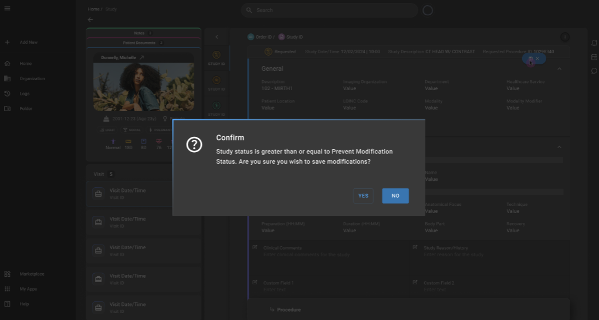

# OmegaAI Study Locking Mechanism

OmegaAI has a Study Locking feature designed to protect studies marked as "PRIOR" from accidental or unauthorized changes. This can be bypassed by specific trusted users with a unique User Access Control (UAC) privilege - **Modify Locked Study**.

## What is Study Locking?

When a study reaches the "PRIOR" status, it is automatically locked, making it read-only across the Worklist and Study pages. The lock is applied through a **Workflow Step** setting: **PREVENT MODIFICATION>= PRIOR**.

**Note**: The **Prevent Modification** workflow step mapping with **Study Status** is configurable.

### Scope of Locked Study

#### Modules Affected

*   **Worklist Page**: All editable components are read-only (except for specific UAC-enabled users).
    
*   **Study Page**: All fields are non-editable when locked.
    
#### No Edit Button Behavior (Default Users)

Users without the Modify Locked Study privilege won't see edit buttons, instead a lock icon is displayed. 

Hovering over this icon displays the below message.

#### Popup Confirmation for Users with Privilege

Users with the Modify Locked Study privilege will see the Edit button. On attempting to save changes, a confirmation popup appears: *“This study is currently locked. Are you sure you want to proceed with modifications?”*

*   \[Yes\] → Changes are saved
    
*   \[No\] → Action is canceled

    
## Modify Locked Study - UAC Privilege

This new UAC privilege allows select users (e.g., QA, Lead Techs) to edit locked studies while maintaining the system’s integrity. These privileges are GUI-based role UAC controlled and assignable to all roles at each organization level.

### UAC Permission

*   If a user has this UAC permission ON, they can modify studies even when the study is locked due to **PRIOR** status.
    
*   If a user does not have this UAC permission (UAC OFF), they should have read-only access to locked studies (all fields of Study/Player assignment).
    

### Behavior Based on UAC Permission

*   **UAC ON (privileged user)**: Can edit locked **PRIOR** studies, with confirmation popup.
    
*   **UAC OFF (non-privileged user)**: Read-only access, no edit buttons, see tooltip on hover.

