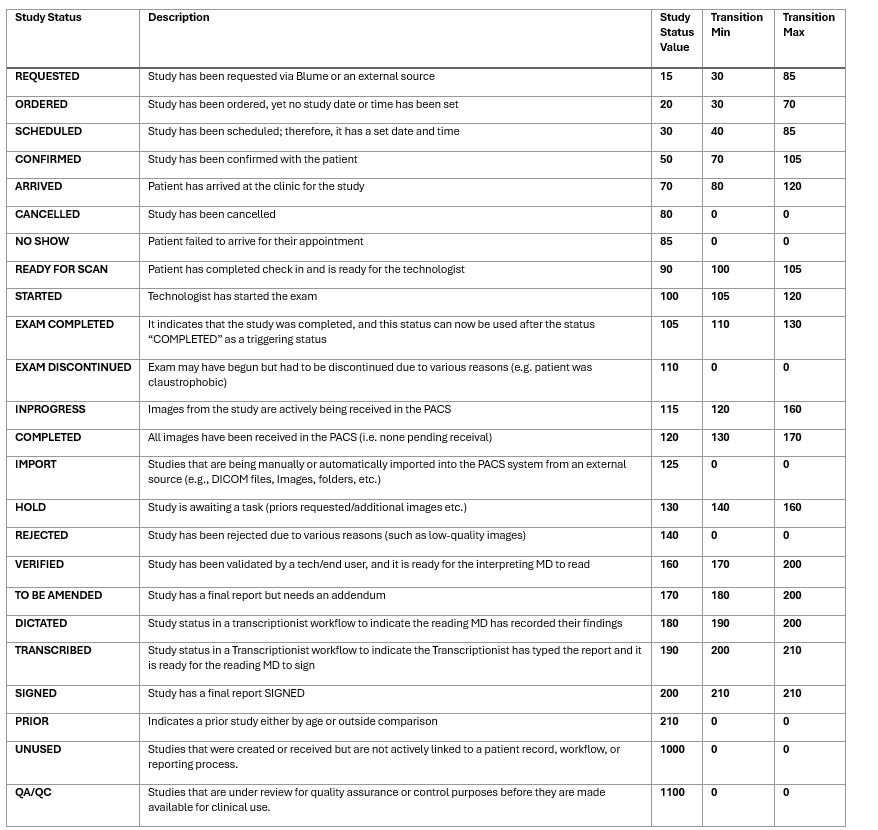

# What is Study Status?

Study Status in OmegaAI represents the lifecycle of a radiology study within the system. It indicates the progress of a study from initial request to final reporting and archiving. Each status is associated with specific workflow steps and transition rules to ensure smooth operation within radiology workflows. 

The Study Status feature in OmegaAI ensures that radiology workflows function smoothly by enforcing predefined study progression rules, transition values, and workflow mappings. Proper handling of study statuses prevents workflow disruptions and ensures traceability via audit logs. Administrators can customize statuses within defined constraints while ensuring compliance with radiology workflow best practices.

## What are Workflow Steps?

A **Workflow Step** defines a stage in the radiology process that corresponds to specific study statuses. Workflow steps are used to categorize and track the study's progress from request to completion.

## Study Status & Workflow Step Mapping

Study statuses are mapped to workflow steps to maintain consistency and compliance with radiology workflows. This mapping ensures that each study follows a predefined sequence of statuses.

### How Mapping Works

Each study status is associated with one or more workflow steps.

When a study progresses to a new workflow step, its status updates accordingly.

Transition rules (min/max values) define the allowable movement between statuses to prevent unintended workflow disruptions.

## Study Status Values & Transition Rules

Study statuses have predefined values, along with transition minimum and maximum values. These values dictate how studies move between statuses. Currently, study statuses can be marked inactive even if they are mapped to a workflow step. Every study status transition against its Transition Min and Max values. 

**Note:**

Transition min/max rules apply in the Worklist and Study Information pages. 

Transition Min and Max values apply only to manual updates (not for automated updates via Workflow Automation, DICOM ingestion, or appointment sync).

