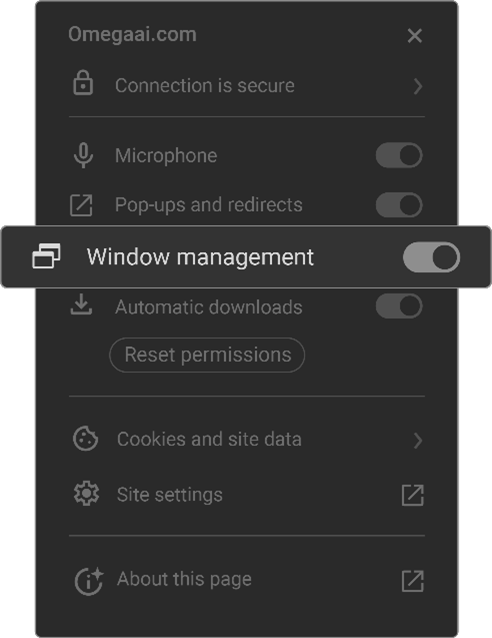

# System Requirements

## Hardware Specifications for General User:

| Requirement      | Specification                                                                 |
| ---------------- | ----------------------------------------------------------------------------- |
| **CPU**          | Intel Core i5 (10th Gen or newer) / AMD Ryzen 5 5000 series. Base clock speed ≥ 2.0 GHz, 4 physical cores, support for AVX2 instruction set |
| **RAM**          | 16 GB                                                                         |
| **Free Storage** | 50 GB SSD                                                                     |
| **Display**      | 1920 x 1080 resolution or higher                                               |

## Hardware Specifications for Diagnostic Image Review User:

| Requirement      | Specification                                                                                 |
| ---------------- | --------------------------------------------------------------------------------------------- |
| **CPU**          | Intel Core i7 or i9 (11th Gen or newer) or AMD Ryzen 9 (5000 series or newer). Base clock ≥ 3.0 GHz, boost clock ≥ 4.0 GHz. High single-thread and multi-thread performance is essential |
| **RAM**          | 32 GB                                                                                         |
| **Graphics**     | Dedicated GPU with at least 4 GB VRAM (e.g. NVIDIA GTX 1060)                                  |
| **Display**      | 2560 x 1440 resolution or higher, medically calibrated                                        |
| **Free Storage** | At least 100 GB SSD (drive used for browser caching)                                          |
| **Network**      | 1 Gbps wired Ethernet connection                                                              |

## Software Requirements

| Requirement       | Specification                                    |
| ----------------- | ------------------------------------------------ |
| **Operating System** | Windows 10 or later, macOS Catalina or later |
| **Browser**          | Latest version of Chrome, Edge, or other Chromium-based browsers |
| **Plugins/Add-ons**  | HTML5 and JavaScript enabled for full functionality |
| **Browser Settings** | Enable hardware acceleration for better image rendering and processing |

## Browser Considerations

| Specification                            | Details                                             |
| ---------------------------------------- | --------------------------------------------------- |
| **Browser Compatibility**                | The software is compatible exclusively with Chromium-based browsers. |
| **Browser Version**                      | Ensure the latest stable browser version is used. Avoid experimental or beta versions. |
| **Credential Storage & Cache**           | Cookies and Local Storage should be enabled to store login credentials and preferences. |
| **Browser Zoom Level**                   | Ensure that the zoom level is set to 100% unless adjustments are needed for lower-resolution monitors. |
| **GPU Utilization**                      | Ensure hardware acceleration is enabled in browser settings (Chrome: `chrome://settings/system`). |
| **Internet Connection and Speed**        | Minimum recommended download speed is 100 Mbps. Check the actual internet speed using tools like Speedtest by Ookla. |
| **VPN Usage**                            | Assess whether using a VPN is necessary as it can impact performance. If possible configure settings to bypass VPN when using the platform. |
| **Intel GPU Issue**                      | If rendering issues occur with specific Intel GPUs visit `chrome://flags/#ignore-gpu-blocklist` and enable 'ignore-blacklist'. Configure the browser for compatible Angle settings at `chrome://flags/#use-angle`. |

## Intel GPU Issue: Chrome Rendering Problems

Users with specific Intel GPU models may encounter rendering issues in the OmegaAI Image Viewer.

### Solution Steps:

1. **Check GPU Blacklist Status:** 
   - Go to `chrome://flags/#ignore-gpu-blocklist` and enable 'ignore-blacklist’.
2. **Configure Browser for Compatible Angle Settings:** 
   - Visit `chrome://flags/#use-angle`.
   - Select a compatible angle setting (options: d3d11on12, vulkan, and OpenGL).

### Additional Recommendations for Mac Users:
- Stick with the Default Angle settings.

## Browser Configuration Guide

### Browser Compatibility and Requirements

Our software is compatible only with chromium-based browsers including Google Chrome, Microsoft Edge, and Opera. These browsers provide the required functionalities and software compatibilities.

### Browser Version

Review your browser version regularly to ensure it is up to date but avoid experimental or beta versions.

### Credential Storage & Cache

It is essential for a browser to accept cookies and allow local storage to store login credentials and preferences.

#### Google Chrome

1. Open Settings from the menu.
2. Click on “Show Advanced settings”.
3. Under Privacy select 'Content settings'.
4. Enable 'Allow local data to be set (Recommended)' and disable 'Block third-party cookies and site data'.
5. Click Done.

#### Microsoft Edge

1. Select **More** (...) > **Settings** > **View advanced settings**.
2. Under **Cookies** select **Don't block cookies**.

### Multimonitor Setup

To use the system in a multimonitor environment you need to make sure the browser has proper permissions. This is done through Window management that will be asked from the browser after the user logs in first. In case they selected no they can change this by clicking on the view site information icon (left side of the browser address box).

Then make sure window management is allowed:

### Browser Zoom Level

Ensure that the browser's zoom level is appropriately set. Incorrect zoom levels may impact the user interface display.

### Scale and Display Resolution

Use the recommended values for the scale and display resolution as suggested by the operating system.

### GPU Utilization for Image Viewer

Ensuring hardware acceleration is enabled in the browser for better image rendering and processing.

- Chrome: Navigate to `chrome://settings/system`.

### Access Controls

Check if OmegaAI has the required permissions.

- Microphone (for voice recording and VR solutions)
- Window management (for multimonitor mode)
- Automatic Downloads (for downloading studies or burning to CD)
- Review Site Settings for changes from defaults at `chrome://settings/content/siteDetails?site=https://www.omegaai.com`.

### Internet Connection and Speed

Check your Internet speed using tools such as the Speedtest by Ookla (https://www.speedtest.net/). A download speed between 50–100 Mbps is recommended for smooth operation. Please note that slow upload speeds or high latency (ping) may negatively impact the responsiveness of image viewing and other real-time features.

### VPN Usage

Review the necessity of VPN usage as it can affect performance. If possible consider bypassing VPN for OmegaAI as OmegaAI communication is already secure and utilizes the latest web-based encryption methods.
