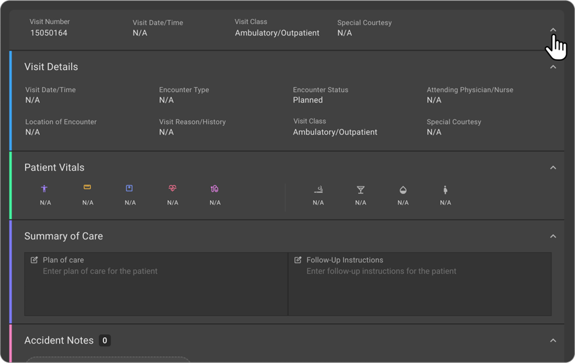

## Visit/Order/Study Page

### Order Page

The Order page is the primary page where the patient order details are
available. Let see how to manage the Order details.

#### Accessing the Order details

The patient Order details can be accessed from the worklist by
clicking on the wheel icon and then clicking on the Order icon.

This is how the Order page would be visible with all the Visit and Study
details.

#### Order Details

The Users would be able to View the following information as part of the
Order section.

- Accession Number

- Order Date/Time

- Requested Appointment Date/Time

- Order Priority

- Order Status

- Filler Order Number

- Placed Order Number

- Referring Physician

- Referring Organization

- Consulting Physician

If there are more than one consulting physician for the order, then it
will be displayed as + Number next to the Consulting physician and on
hover the user would be able to see all the consulting physician details.

#### Editing an Order

Users would be able to Edit an Order by clicking the Edit icon on the
Order.

When the user clicks on the Edit Order icon, the Edit Order Side drawer
opens where the user would be able to see and edit all the order related
details.

Users can search for Referring/Consulting Physician and the search
results will showcase the Referring Physician Name, Their NPI,
Specialty, Referring Organization name and their Practice address.

If the User is not able to find the Referring/Consulting Physician they
are searching for, then they would be able to create a New Referring
Physician.

Similarly, if they are not able to find a Referring Organization to
associate the Referring Physician, then they would be able to create a
New Referring Organization as well.

#### Reassign Order to another Patient

When the Order is created under wrong patient, the users can use the
Reassign Order to another Patient feature to move the Order to the
correct patient. This saves time for the users instead of deleting the
order, downloading and reimporting the images under the new order etc.,

Users would be able to move the Order to another patient by clicking the
Reassign Order icon on the Order.

When the user clicks on the Reassign Order icon, it opens a small
drawer, where the user would be able to search for the patients to whom
the Order must be reassigned. The search results will showcase Patient
Name, DOB, Mobile Number, SSN, Patient ID, Managing Organization name
and the address. Users would be able to find the correct patient using
the above details.

Once they have selected the correct patient to whom the Order must be
reassigned, they can click on the Save button. The Order will be
reassigned to the new patient now.

#### Studies under an Order

An Order can have one or more studies associated with it. In the Order
Page, users would be able to see all the associated Studies under that
Order. When the user clicks on each study tile, it would take the user
to the corresponding Study page.

#### Order Notes

- On the Order page, below the Study tile, the Order Notes section is
  present.

- Expand the Order Notes section to view the Notes details of the Order.

- Users would be able to View/Add/Edit/Delete the notes from the Order
  Notes section.

- When the user clicks on the Add New Order Note button, a small card to
  enter the Notes details will open.

- Enter the Notes information to be added as part of the Order.

- Once all the information is added, click on the Tick mark button to
  Save the Notes information.

- Click on the Close button would discard the changes.

- If you want to Edit or Delete the Order Notes information, hover on
  the Notes card.

- You will get Pencil/Trash icon.

- On Click of the Edit button, the Notes card will open in the Edit mode.

- Make necessary changes and save the information.

- Once all the information is added, click on the Tick mark button to
  Save the Notes information.

- Click on the Close button would discard the changes.

- On click of the Delete button, the Notes information would be deleted.

### Visit Page

An Order is created as part of the Visit. A Visit can have one or more
Orders.

The Visit details can be accessed from the Order page. The Visit details
are available on top of the Order page.

#### Visit Top Section

The top section of the Visit displays the following fields:

- Visit Number

- Visit Date/Time

- Visit Class

- Special Courtesy

All the above fields are not editable in this section. These data can be
accessed and edited as part of the Visit details section.

When the top section is expanded, it will show up all the details about
that Visit.

#### Visit Details

The Users would be able to View the following information as part of the
*Visit details* section:

- Visit Date/Time

- Encounter Type

- Encounter Status

- Attending Physician/Nurse

- Location of Encounter

- Visit Reason/History

- Visit Class

- Special Courtesy

**Review/Edit Visit Details information**

- On hover of each field, the in-line edit for each of the fields would
  be enabled.

- Users would be able to update the information of each field by
  clicking on each of them.

- Once they have updated the information, they can click the Save
  button appearing on the right-hand side of the Visit details section.

- If the user wants to discard the changes made, they can click the
  Cancel button appearing on the right hand side of the Visit details
  section

#### List of Visits

On the Left hand side, the List of Visits is displayed. Users would be
easily able to navigate to the Visit which they want to review. On click
of a specific visit, the visit details along with the Orders and Studies
associated with those Visits would be loaded.

#### Patient Vitals Section

The Users would be able to View the following information as part of the
*Patient Vitals* section:

- Height in CM

- Weight in KG

- Heart Rate in BPM

- Blood Pressure ΓÇô Systole and Diastole in MMHG

- Smoking Habit

- Drinking Habit

- Last Mensural Period

- Pregnancy Status

**Review/Edit Visit Details information**

- On hover of each field, the in-line edit for each of the fields would
  be enabled.

- Users would be able to update the information of each field by
  clicking on each of them.

- Once they have updated the information, they can click the Save
  button appearing on the right-hand side of the Patient Vitals section.

- If the user wants to discard the changes made, they can click the
  Cancel button appearing on the right hand side of the Patient Vitals
  section.

#### Summary of Care Section

The Users would be able to View the following information as part of the
*Summary of Care* section.

- Plan of Care

- Follow-up Instructions

**Review/Edit Visit Details information**

- On hover of each field, the in-line edit for each of the fields would
  be enabled.

- Users would be able to update the information of each field by
  clicking on each of them.

- Once they have updated the information, they can click the Save
  button appearing on the right-hand side of the Summary of Care section.

- If the user wants to discard the changes made, they can click the
  Cancel button appearing on the right hand side of the Summary of
  Care section.

#### Accident Notes Section

- On the Visit page, below the Summary of Care section, the Accident
  Notes section is present.

- Expand the Accident Notes section to view the Accident Notes details
  of the Patient.

- Users would be able to View/Add/Edit/Delete the Accident notes from
  the Accident Notes section.

- When the user clicks on the Add New Accident Note button, a small card
  to enter the Accident Notes details will open.

- Enter the Accident Notes information to be added as part of the Visit.

- Once all the information is added, click on the Tick mark button to
  Save the Accident Notes information.

- Click on the Close button would discard the changes.

- If you want to Edit or Delete the Accident Notes information, hover on
  the Accident Notes card.

- You will get Pencil/Trash icon.

- On Click of the Edit button, the Accident Notes card will open in the
  Edit mode.

- Make necessary changes and save the information.

- Once all the information is added, click on the Tick mark button to
  Save the Accident Notes information.

- Click on the Close button would discard the changes.

- On click of the Delete button, the Accident Notes information would be
  deleted.

### Study Page

The Study page is the primary page where the patients Study details are
available. Let see how to manage the Study details.

#### Accessing the Study details

The patient Study details can be accessed from the worklist by
clicking on the wheel icon and then clicking on the Study icon.

This is how the Study page would be visible with all the Study details.

#### Study General Section

The Users would be able to View the following information as part of the
Study General section:

- Study Status

- Study Date/Time

- Study Set Code

- Study Description

- Requested Procedure ID

- Imaging Organization

- Department

- Healthcare Service

- Patient Location

- Exam Room

- Modality

- Modality Modifier

- LONIC Code

**Review/Edit Visit Details information**

- On hover of each field, the in-line edit for each of the fields would
  be enabled.

- Users would be able to update the information of each field by
  clicking on each of them.

- Once they have updated the information, they can click the Save
  button appearing on the right-hand side of the Study General section.

- If the user wants to discard the changes made, they can click the
  Cancel button appearing on the right hand side of the Study General
  section.

#### Study Clinical Section

The Users would be able to View the following information as part of the
Study Clinical section.

- Pharmaceutical Sub Section

  - Type

  - Dosage(ml)

  - Name

- Scan Details Sub Section

  - Laterality

  - Type of View

  - Anatomic Focus

  - Technique

  - Body Part

  - Preparation (HH:MM)

  - Duration (HH:MM)

  - Recovery (HH:MM)

- Comments Sub Section

  - Clinical Comments

  - Study Reason/History

  - Custom Field 1

  - Custom Field 2

**Review/Edit Visit Details information**

- On hover of each field, the in-line edit for each of the fields would
  be enabled.

- Users would be able to update the information of each field by
  clicking on each of them.

- Once they have updated the information, they can click the Save
  button appearing on the right-hand side of the Study Clinical section.

- If the user wants to discard the changes made, they can click the
  Cancel button appearing on the right hand side of the Study Clinical
  section.

#### Study Care Team Section

The Users would be able to View the following information as part of the
Study Care Team section.

- Performing Technologist

- Performing Physician

- Reading Physician

- Reading Organization

- Transcriptionist

- Transcription Organization

**Review/Edit Visit Details information**

- On hover of each field, the in-line edit for each of the fields would
  be enabled.

- Users would be able to update the information of each field by
  clicking on each of them.

- Once they have updated the information, they can click the Save
  button appearing on the right-hand side of the Study Care Team section.

If the user wants to discard the changes made, they can click the
Cancel button appearing on the right hand side of the Study Care Team
section.

#### Study Procedure Codes Section

The Users would be able to View the following information as part of the
Study Procedure Codes section.

- Procedure Code

- Procedure Code Description

- Modifiers

- Dx Code

- Dx Reason

**Add Procedure Code and Dx Code**

- When the User clicks on the + icon appearing next to the Procedure
  Code section title, an empty row to enter the Procedure Code,
  Modifiers, DX Code would open

- Users would be able to search and select the Procedure Code from the
  drop down menu.

- Similarly, Users would be able to search and select the DX Code from
  the drop down menu.

- Users would be able to add multiple DX code under one Procedure Code.

- Once they have updated the information, they can click the Tick mark
  button appearing on the right-hand side to Save the Procedure Code.

- If the user wants to discard the changes made, they can click the
  Cancel button appearing on the right hand side.

- Clicking the + icon would on the DX code row would allow the users to
  enter multiple DX code under the same Procedure Code.

- Similarly, if the User wants to add more Procedure codes for one
  study, then should click on the + icon appearing next to the Procedure
  Code section title.

**Edit/Delete of Procedure Code and Dx Code**

- On hover of the Procedure Code row, Users would see the Pencil/Trash
  icon.

- On Click of the Edit button, the Procedure Code row and the associated
  Dx Code rows will open in the Edit mode.

- Make necessary changes and save the information.

- Once all the information is added, click on the Tick mark button to
  Save the Procedure Code and Dx Code information.

- Click on the Close button would discard the changes.

- On click of the Delete button, the Procedure Code or Dx Code
  information would be deleted.

#### Study Notes

- On the Study page, below the Study Procedure Codes section, the Study
  Notes section is present.

- Expand the Study Notes section to view the Notes details of the Study.

- Users would be able to View/Add/Edit/Delete the notes from the Study
  Notes section.

- When the user clicks on the Add New Study Note button, a small card to
  enter the Notes details will open.

- Enter the Notes information to be added as part of the Study.

- Once all the information is added, click on the Tick mark button to
  Save the Notes information.

- Click on the Close button would discard the changes.

- If you want to Edit or Delete the Study Notes information, hover on
  the Notes card.

- You will get Pencil/Trash icon.

- On Click of the Edit button, the Notes card will open in the Edit mode.

- Make necessary changes and save the information.

- Once all the information is added, click on the Tick mark button to
  Save the Notes information.

- Click on the Close button would discard the changes.

- On click of the Delete button, the Notes information would be deleted.

#### Accessing the Image Viewer from the Study Page

On the Study Page, top right corner, you can see an icon bay. On hover
of the Image Viewer icon, a tool tip will appear saying Image Viewer.
On Click of this icon, the Image Viewer page will open for the Study

#### Accessing the Document Viewer from the Study Page

On the Study Page, top right corner, you can see an icon bay. On hover
of the Document Viewer icon, a tool tip will appear saying Document
Viewer. On Click of this icon, the Image Viewer page will open for the
Study

#### Accessing the Prior Authorization Drawer from the Study Page

On the Study Page, top right corner, you can see an icon bay. On hover
of the Prior Authorization icon, a tool tip will appear saying Prior
Authorization.

On Click of this icon, the Prior Authorization side drawer will open for
the Study.

Users would be able to see all the Coverage added to the Patient. For
each of the Coverage, the following Prior Authorization information can
be added/updated

- Prior Authorization Status

- Case Number

- Prior Authorization Code

- Effective Date

- Expiry Date

#### Post Charge from the Study Page

On the Study Page, top right corner, you can see an icon bay. On hover
of the Post charge icon, a tool tip will appear saying Post Charge.

On Click of this icon, Charges will be posted for the Study. Once the
Charges are successfully posted, you will get a toast message saying
Charges Posted Successfully.

Once the Charges are posted for the Study, on hover of the Post charge
icon, the tool tip will appear saying Repost Charges.

