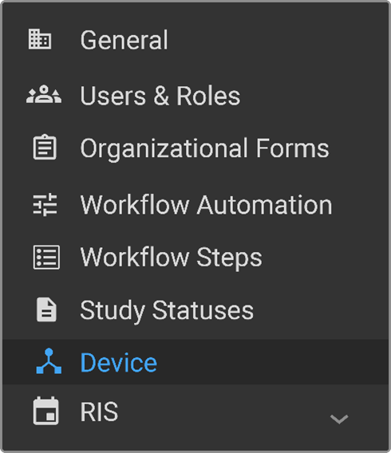
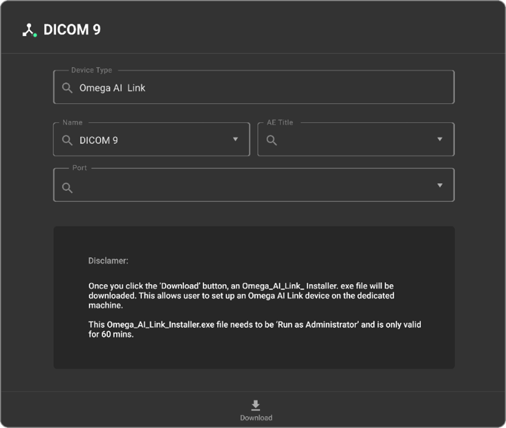
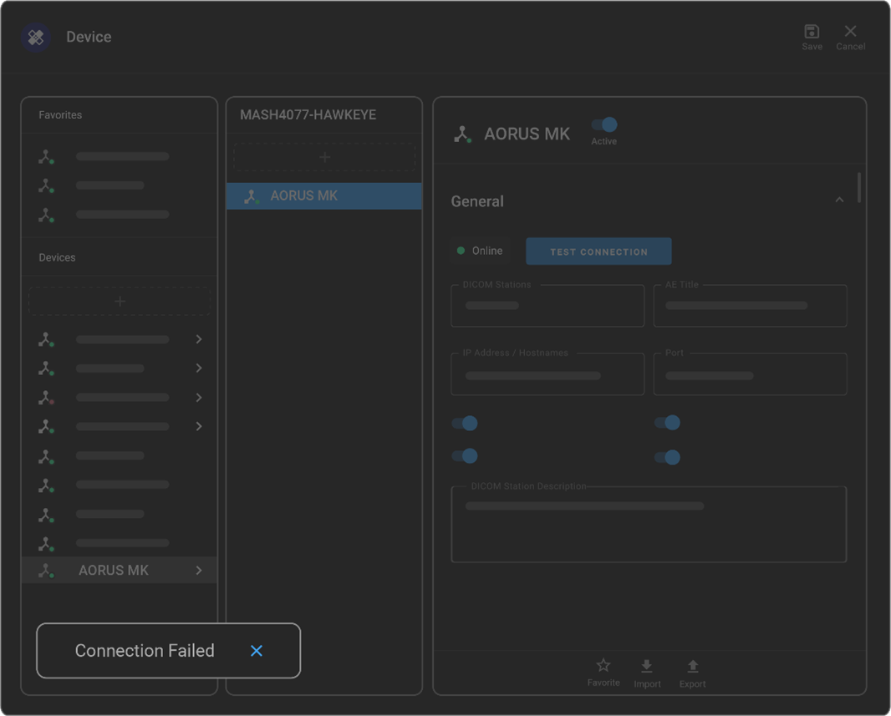

# Device Setup

This section of your organization setup allows you to view a list of
DICOM Web and DICOM proxies connected to the organization. Adding a new
device is a simple two-step process: first, add the device itself, and
then add a DICOM station to link it to OmegaAI.

This process involves setting up a virtual router through OmegaAI-LINK,
which acts as a supercharged router for medical images and seamlessly
connects devices and clinics. There are no extra fees, regardless of
whether you have one or ten locations. The LINK ensures an uninterrupted
flow of studies, even if a machine is turned off, owing to its failover
queue feature. In addition, it offers caching for fast access to the
images.

The installation is straightforward, with approximately 60 minutes from
download to installation. You can download it yourself as an executable
file. RamSoft support is available if assistance is needed.

It is crucial to ensure that the LINK is on the same network as your
devices or where images come from, whether it is your modality or an
external facility. Once set up, LINK efficiently routes images, enabling
seamless communication between medical equipment and the OmegaAI
platform.

## Adding a New Device and Sending an OmegaAI-LINK

1.  On your organization details page, select **Device**. The device
    page will open.

    

2.  The details are as follows:

- **Device Type**: By default, the device type is OmegaAI-LINK. This
  field cannot be modified.

- **Name:** A default name will be provided, but you have the option of
  creating a unique name for your workstation.

- **AE Title:** This serves as a distinct identifier, comparable to your
  Mac or Windows address, or even akin to a street name or house number.
  It is specifically assigned to the DICOM devices for identification
  within the network.

- **Port Number:** Specific entry points for data on devices, allowing
  them to exchange imaging information efficiently. Typically<u>,</u>
  105 for OmegaAI, and 104 for PowerServer.

  

3.  Select Download from the bottom of the page to download the
    installation file. If you need to send the OmegaAI-LINK installation
    file to someone, please send the zip file with password protection
    or via the company's OneDrive or SharePoint, to ensure safety.

**Note**: You have 60 minutes to install the installation link.

## Adding DICOM Station

1.  As soon as a device is created, the panel opens adjacent to the list
    of devices. Select **+** in the panel.

2.  Perform the following in the General section:

- **DICOM Stations**: Enter the name of the DICOM station you want to
  add.

- **AE Title** (mandatory field): Enter the title of the Application
  Entity (AE).

- **IP Address/Hostname**: Enter the IP Address of the station that will
  be used for DICOM communication. If the IP Address is dynamic, enter
  the name of the machine.

- **Port** (mandatory for DICOM send and optional for receive): Enter
  the port number of the station that will be used for DICOM
  communication.

- **Enable TLS**: This checkbox is selected to encrypt the DICOM
  communication.

- **Is Archive Server**: Select this checkbox if it is an archive
  server.

- **Need IOCM Notification**: Select this if Imaging Object Change
  Management (IOCM) notification is required.

- **DICOM Station Description**: Enter a description of the DICOM
  station.

- **Export**: Click to export the DICOM station configuration to JSON
  format. The exported configuration can then be updated or edited.

- **Import**: After modifying the configuration details, click on Import
  to upload it.

- **Active**: Click Active to set the DICOM station to active.

- **Enable Heartbeat**: Select this button to enable heartbeat.

- **Character Set**: Select a preferred character set from the dropdown. The character set is associated with the station for processing incoming DICOM requests.  

- **Test Connection**: After you have completed all the details for the
  DICOM station, click this button to test the connection.

- **Status**: This field is automatically populated. It indicates the
  status of the DICOM status based on the heartbeat. Depending on the
  status, this field displays the following values:

  1.  **Active**: Indicates that the DICOM station is active. If the
      DICOM heartbeat is enabled, and the station is up and responding
      to the pings, then the status of the station appears as Online and
      a green indicator is displayed.

  2.  **Unknown**: Indicates that the DICOM station is unknown. If the
      DICOM heartbeat is enabled, and the station is up and responding
      to the pings, then the status of the station appears as Online,
      and a green indicator is displayed.

  3.  **Offline**: Indicates that the DICOM station is offline. If the
      DICOM station is offline, the system will not try to actively
      perform DICOM-send. If the DICOM heartbeat is enabled, and the
      station is up and responding to the pings, then the status of the
      station appears as Online and a green indicator is displayed.

3.  Select the following options in the DICOM Stations features section,
    as required:

    - **Enable Heartbeat:** Select this button to enable heartbeat.

    - **Send to device DICOM stations:** Select this checkbox to allow
      OmegaAI to send studies to the DICOM station.

    - **Query/Retrieve** Select this checkbox to allow the DICOM station
      to service DICOM queries or retrieve studies.

    - **Sending Original Patient ID and Issuer:** Select this checkbox
      to preserve and send the original Patient ID and Issuer of Patient
      ID DICOM tag.

      **Note**: This refers to the information that was originally received.

## Testing Connection of OmegaAI LINK

Select Test Connection, a status update will appear on the bottom left-hand corner of your OmegaAI platform screen indicating results.

In the above example, the connection failed. As the administrator, you need to ensure the OmegaAI-LINK and device are both online at the same time for connection to be successful.

**Note**: If the connection fails even when both OmegaAI-LINK and the device are online, it's best to reach out to your local IT department, as it is likely a network issue. Make sure to verify that you have the correct IP address, AE title, and port number, and ensure that the other side is set up to accept the linked AE title.