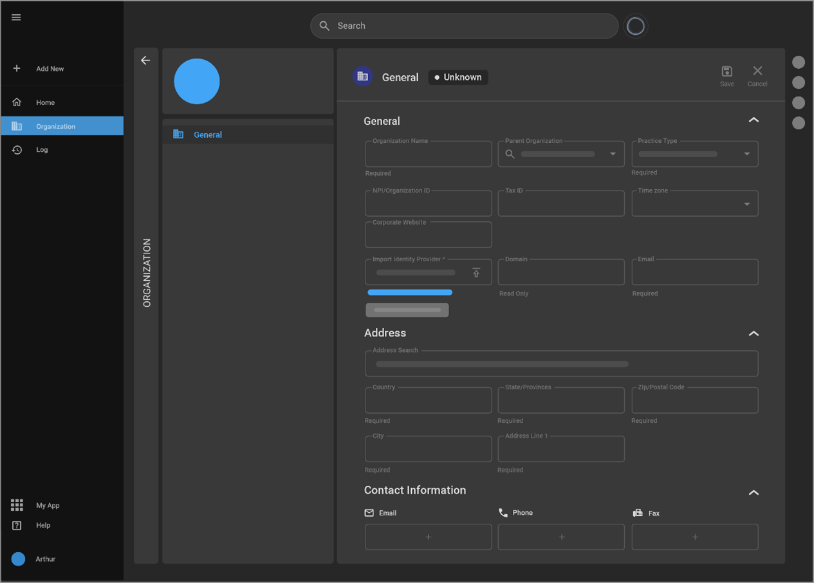

# Adding & Managing Organizations

## Accessing Organizations in OmegaAI

### Opening the Organization Panel

To start managing organizations, click on the Organizations tab. This serves as the main gateway for all organization-related functions.

### Master Organizations Tab

The Master Organizations tab on the left shows the master organization(s) you are part of. The number of organizations listed here depends on the user profile settings.

### Adding a New Organization

To add a new organization, click on the '+' icon located at the top of the organization list. The new organization is added as a subordinate to the selected master organization.

### Viewing the Organization Card

The Organization Card displayed on the right provides details of the current organization such as name, type, National Provider Identifier (NPI), time zone, website address, and contact information.

### Managing Organization Details

For more information or to modify the details of the organization, click 'Details'. Here the organization can also be deleted if necessary.

### Managing Referring Organizations

Access and manage referring organizations at the bottom of the panel. Here you can add new referring organizations as needed.

## Creating a New Organization

Perform the below steps to create a new organization.

1. Selecting a Parent Organization

Choose an existing organization to act as a parent for a newly created organization.

2. Entering Organization Details

After clicking the '+', the following details are entered for the new organization:
- **Name and Parent Organization**: Specify the name and select or modify the parent organization.
- **Practice Type and Identifiers**: Define the type of practice and add the NPI, tax ID, time zone, and corporate website.
- **Identity Provider Setup**: Import an XML file to set up an identity provider. 
  - *Note: Templates for this setup are available for downloading on the same screen.*

3. Adding Address Information

The address search feature is utilized to automatically populate address fields.

4. Providing Contact Information

Enter details such as email, phone, and fax numbers in the Contact Information section. 
- *Note: Multiple entries can be added for each type of contact information.*

5. Finalizing the Creation

Click 'Save' to confirm the creation of the new organization or 'Cancel' to discard changes.

## Understanding Hierarchy and Usage

### Master Organization

This is a top-level organization that manages crucial configurations, patient data, role configurations, status customizations, and workflow automation.

### Sub Organizations

Suborganizations are beneficial for managing different user groups, healthcare resources (particularly with the scheduler feature), and associating devices for imaging data (such as DICOM).

## Accessing and Managing Referring Organizations

### Viewing Referring Organizations

At the bottom of the organization card, a list of referring organizations associated with the organization can be viewed.

### Managing Referring Organization Details

Click on the referring organization's name to view detailed information including the number of referring physicians, type, NPI, time zone, and website.

### Editing or Unlinking Referring Organizations

Click Details for more options to edit or unlink the referring organization.

### Adding/Linking a New Referring Organization

Click the '+' icon to initiate linking to a new or existing referring organization.
- A search box appears to allow you to find and select a referring organization.
- After searching, select 'Link' to associate the referring organization with your organization.
- To create a new referring organization, click on the '+ New Organization' icon and enter the necessary details such as name, time zone, and corporate website. 
  - *Note: The practice type is set as 'Referring' and cannot be changed.*
  - The address search feature is used to automatically fill in the address fields.
  - Add contact information such as email, phone, and fax with the option of including multiple entries.
  - Click Save to confirm the creation of the new referring organization or Cancel to abort the process.

Upon creation, the new organization is automatically linked to the parent organization.