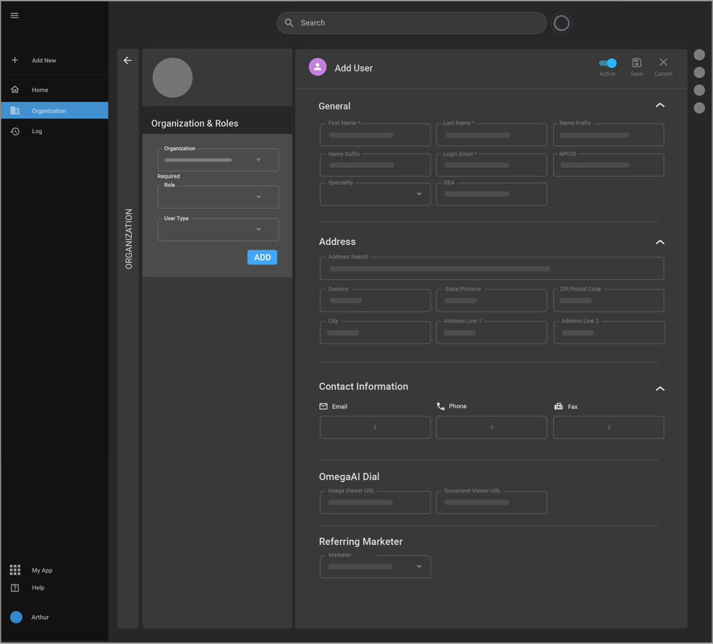

## Adding Users & Roles

After setting up or modifying an organization in OmegaAI, it is important to manage users by adding individuals and assigning them specific roles and responsibilities within the organization.

### Accessing User Management Features

**Edit Organization**:

Begin by navigating to the organization detail page. Click the 'Edit' option in the top right corner to enter edit mode.

 **Navigation Tabs**: Upon entering edit mode, several new tabs will appear on the left, including **General**, **Users and Roles**, **Organization Forms**, **Workflow Automation**, **Devices**, and **RIS Settings**. The presence of the **General** tab indicates you are on the correct page for editing.

### Adding Users to an Organization

1.  **Selecting 'Users and Roles' Tab**: Click on the 'Users and Roles'
    tab to access the list of current users.

2.  **Adding a New User**: To add a user, click the '+' icon. This
    action takes you to the 'Add User' page.

3.  **User Status**: By default, the 'Active' toggle for new users is
    set to 'On'. This setting can be adjusted to 'Off' if you need to
    deactivate a user temporarily or permanently.

4.  **Entering User Details**:

    - **Personal Information**: This includes the user's first name,
      last name, and login email, which links to an identity provider.

    - **Optional Details**: You may also add a name prefix, suffix,
      National Provider Identifier (NPI), Drug Enforcement
      Administration (DEA) number, and specialty.

    - **Address**: Use the address search feature to automatically fill
      in address fields.

    - **Contact Information**: Provide email, phone, and fax. You can
      enter multiple contacts for each type.

5.  **Integration Settings**: Adjust settings to integrate third-party
    images or document viewers. Contact RAM software was used for the
    setup assistance.

6.  **Assigning Organization and Role**:

    - **Organization Tab**: This is pre-filled with your current
      organization but can be changed if necessary.

    - **Role Selection**: Choose an appropriate role from predefined
      options available within the master’s organization.

    - **Multiple Organizations**: You have the option to add the user to
      more than one organization on this screen.

7.  **Finalizing Changes**:

    - **Save**: Click 'Save' to confirm all the entered details and add
      the user to the system.

    - **Cancel**: Click 'Cancel' if you wish to exit without saving any
      changes.

**Note**: Effective user management in OmegaAI is essential for
maintaining structured access and defining responsibilities in
healthcare environments. Each user's role and access privileges were
carefully calibrated to ensure operational efficiency and security.
