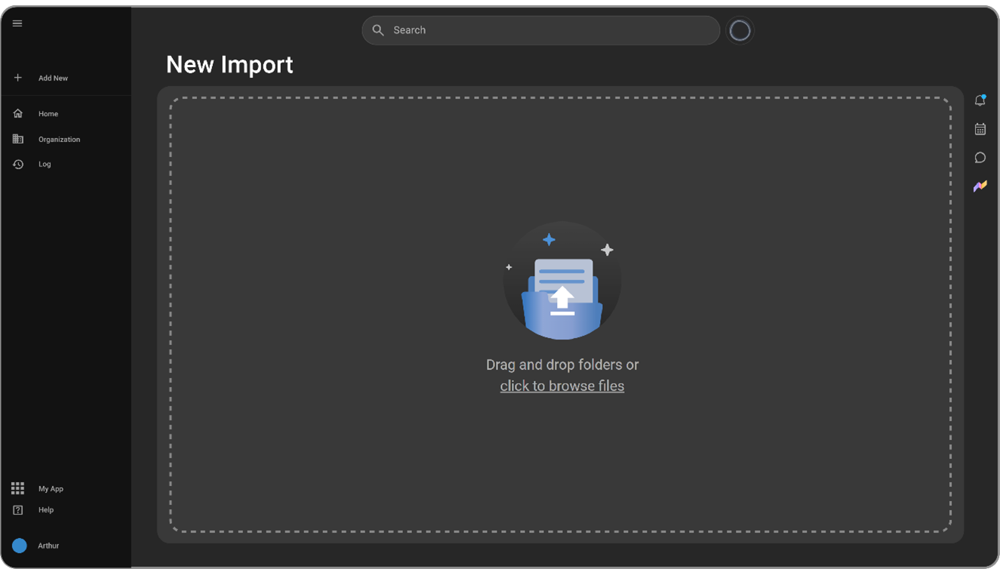
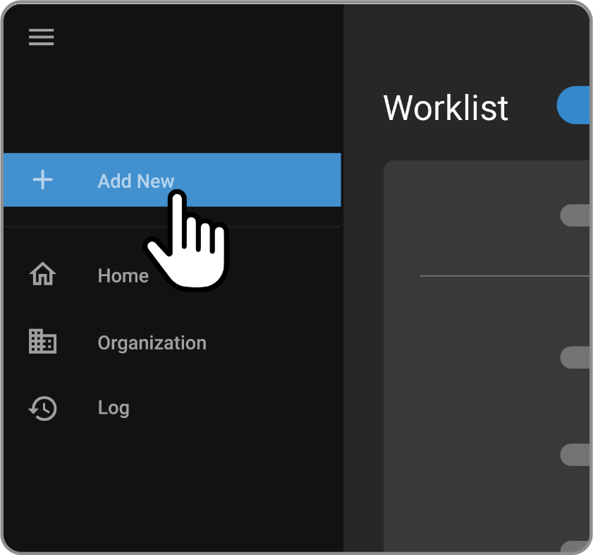
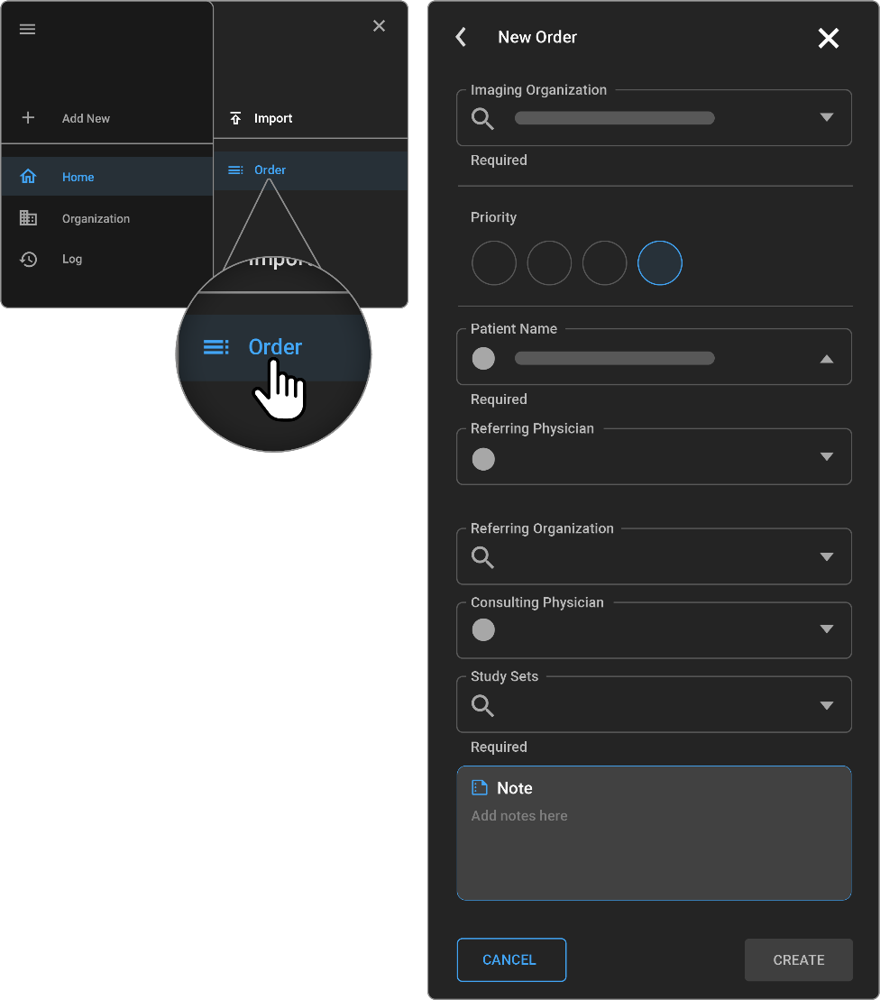
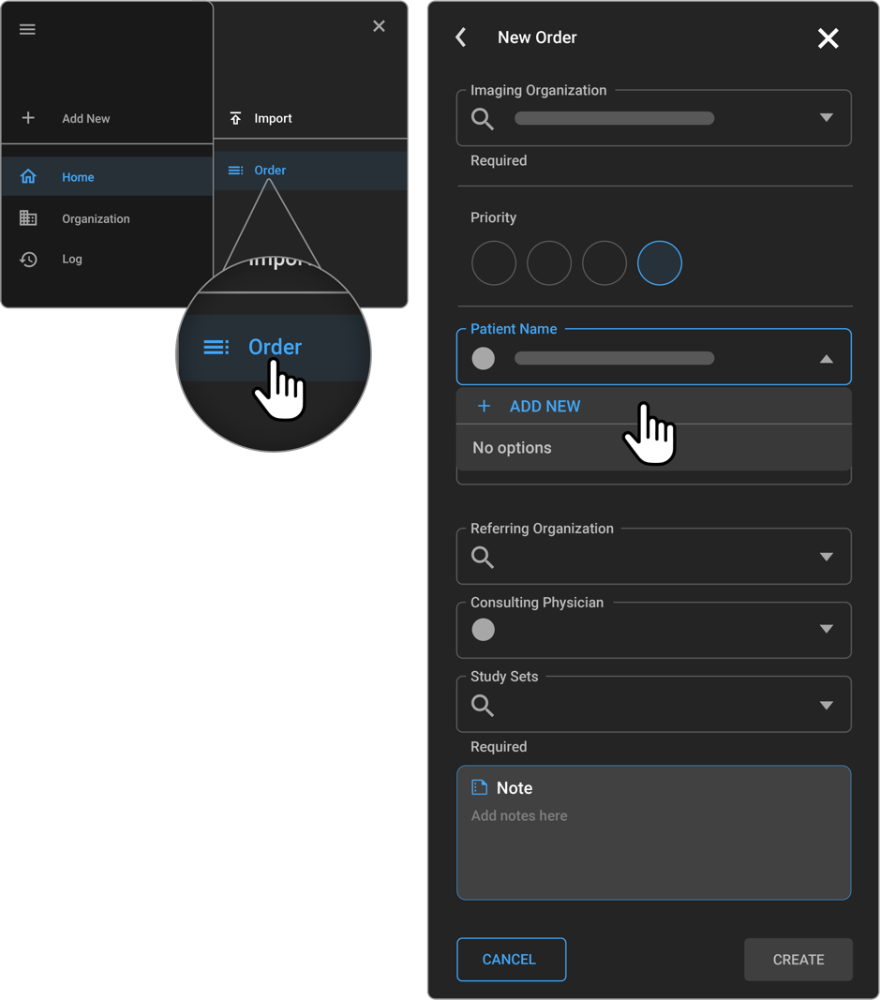
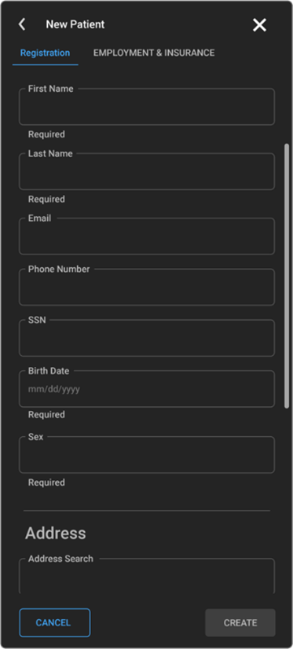

# Import & New Order

## Import
This guide explains how to import both DICOM and non-DICOM files into
the OmegaAI system using the web interface. It details the steps to
initiate an import, handle files, manage import settings, and monitor
the import process. This functionality supports various file types and
provides options for managing file import status and error handling.

### Importing Studies

1.  **Access Import Feature**

    - Navigate to the left sidebar and click the **+** (plus) icon.

    - Select **Import** from the menu that appears.

      

2.  **Uploading Files**

    - You can either drag and drop files directly onto the interface or
      click **Browse Files** to select files from your file manager.

    - Supported file types include:

      - DICOM Objects

      - JPEG 

      - PDF 

      - MP4

      - PNG

3.  **Managing Import Details**

    - After selecting or dragging files, an **Import Details** drawer will
      appear on the right.

    - **Mandatory Field:** **Managing Organization** must be specified to
      define the imaging organization.

    - **Study Details:** For non-DICOM files, enter the study name in
      the **Study** field.

    - **Study Status:** Optionally, select a status from the **Study
      Status** dropdown. If not set, the imported study will have an
      **Empty** status.

4.  **Starting the Import Process**

    - Review the list of files ready for import, each annotated with the
      detected file type.

    - To start importing, click **Start**.

    - To cancel all operations, click **Cancel**.

    - Individual files can be removed by hovering over the file entry,
      clicking, and holding on the **Delete** option.

5.  **Monitoring and Managing Import Progress**

    - Successful imports will display a success message.

    - Failed imports will show a failure message. Click on **Error Log**
      to view details or **Retry Failed** to attempt re-importing the
      failed items.

    - Simultaneous imports are possible by repeating the import steps.

6.  **Handling Special File Types**

    - When importing DICOM files with SR objects containing
      measurements, do not set a study if you want to display
      measurements in the image viewer. Setting a specific study will
      convert SR objects into a PDF document added to the study
      documents.

7.  **Reviewing Import Progress**

    - Navigate to **Task Logs**.

    - Filter the **Status Reason** column to check the status of imports.

## Creating a New Order
The purpose of creating a new order is to create one or more studies for
existing or new patients. In addition, new patients can also be created
via the New Order screen. Note that you must have the required
privileges to be able to perform these tasks. This section explains the
step-by-step process to add a new order in the OmegaAI software,
including setting the imaging organization, attaching faxes, setting the
order priority, and selecting patient and physician details. Follow
these detailed instructions to efficiently create a new medical imaging
order.

### How to Add a New Order

1.  **Access the New Order Screen:**

    - Click on the **Plus Icon (+)** located in the navigation bar on
      the left to access the New Order screen.

      

2.  **Set the Imaging Organization:**

    - Ensure the **Imaging Organization** is set correctly. This setting
      defaults to the organization selected during your last order
      creation.

3.  **Review and Attach Incoming Faxes (If available):**

    - If you have **Fast Fax Integration**, a list of recent faxes will
      be displayed.

    - Click on a fax to review it. To attach it to the order, ensure it
      is selected (indicated by a check mark or the fax number).

4.  **Set the Order Priority:**

    - By default, the priority is set to **Routine**. Change it to
      **Stat**, **ASAP**, or **Urgent** if required by your specific
      workflow.

5.  **Enter Patient Information:**

    - Search for the patient by their **Name**, **Phone Number**, or
      **Date of Birth**.

    - The search results will display relevant patient details along
      with the organization the patient record was created under.

6.  **Select the Referring Physician:**

    - Enter the referring physicians information in the provided field
      if the order was referred to you.

    - The **Referral Vision** field will auto-populate based on the
      selected referring physician. This field shows the referral
      organization and adjusts if the physician is linked to multiple
      organizations.

7.  **Add a Consulting Physician (Optional):**

    - To give another physician access to the study, search and add them
      under the **Consulting Physician** section.

8.  **Attach Study Sets:**

    - Link the order to specific **Procedure Codes** by searching and
      selecting the appropriate study sets. Each list's top will
      indicate the organization the study sets belong to, allowing for
      correct selection if multiple options are available.

9.  **Add Order Notes:**

    - Utilize the **Notes** section to add any relevant details or
      special instructions related to the order.

10. **Finalize the Order:**

    - Click **Create** to finalize and create the order, or click
      **Cancel** if you need to abandon the order creation process.

## Creating a New Patient in OmegaAI

This guide provides detailed instructions on how to create a new patient
record in OmegaAI. A new patient can only be added through the New
Order screen. Users must have the appropriate privileges to create
patient records. 

**Note**: This process is restricted to patients associated with the Master Organization to which the user belongs.

### Accessing the New Order Page

- **Location**: Main navigation menu of OmegaAI.

- **Steps**:

  1.  Click on the **+** icon, then select New Order. This action will
      navigate you to the New Order page.

      

### Initiating New Patient Creation

- **Location**: New Order page.

- **Steps**:

  1.  Locate the **Patient** field and click on the **+** icon adjacent to
      it.

  2.  The New Patient page will appear.

### Entering Patient Details

- **Required Fields**:

  - **First Name and Last Name**: Enter patient's full name.

  - **Sex**: Select the patient's sex.

- **Optional Fields**:

  - **Email**: Enter the patient's email address.

  - **Phone Number**: Provide a contact number.

  - **Social Security Number (SSN)**: Enter if available.

  - **Birth Date**: Specify the patient's date of birth.

  - **Address**: Use the address search feature to auto-populate this
    field, or manually enter the patient's address.

- **Additional Information**:

  - **Managing Organization**: Specify if different from the default.

  - **Special Courtesy**: Indicate any special courtesies applicable to
    the patient.

    

### Adding Eligibility and Insurance Information

- **Location**: Second tab on the New Patient page, labelled **Eligibility
  and Insurance**.

- **Steps**:

  1.  Enter the patient's employment status and employer details.

  2.  Add insurance information by specifying one or multiple insurance
      payers.

### Saving or Discarding the New Patient Record

- **To Save**: Click Create on the top navigation bar to save the new
  patient record and exit.

- **To Cancel**: Click Cancel to discard any changes and exit the New
  Patient creation process.

### Usage Notes

- Ensure all mandatory fields are filled out to avoid errors during the
  creation process.

- Double-check the accuracy of all entered information, especially
  sensitive data like SSN and birth date.

- Utilize the address search functionality to ensure address accuracy
  and save time.

