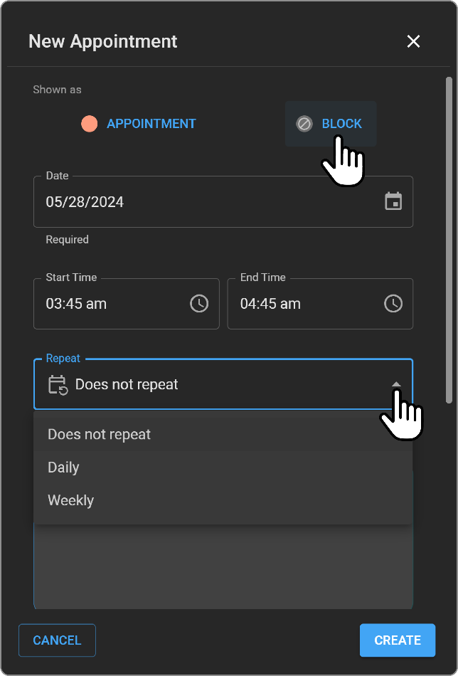

# Setting Up Scheduler

OmegaAI's Scheduler is an essential tool that integrates seamlessly
within the workflow, displaying appointments directly within the
software.

## Steps to Access and Use the In-Grid Calendar:

1. **Access the Calendar**: Click on the **Calendar** icon located on
    the right-side navigation bar to open the in-grid calendar.

    

2. **View Appointments**: By default, the calendar displays the
    appointments for the current day.

3. **Navigate to a Specific Date**: Click the down arrow next to the
    date to open the monthly calendar, then select the desired date.

    

4. **Change Calendar View**: Click on the three dots next to the date
    to choose between today's view or weekly view.

    

5.  **Filter by Appointment Status**: Click the dropdown menu next to
    the 'double click Status' icon, which is right under date and day
    (default set to **All**) to filter appointments by statuses such as
    Requested, Scheduled, Confirmed, Arrived, Ready for Scan, and No
    Show.

6.  **Expand the Calendar**: Use the expand button to access expanded
    calendar views including Today, Weekly, and Monthly options.

### Customizing Calendar Settings

1. **Adjust Visible Hours**:

    - Hover over the **Settings** gear icon and select **Visible Hours** to
  toggle between 8-hour and 12-hour display formats.

2. **Manage Resources**:

    - Select **Resource** under the settings gear to open up the
  **Healthcare Services** list. Here, you can search for and select the
  services that should be displayed in your Scheduler.

      

3. **Edit Healthcare Services**:

    - Click **Edit Healthcare Services** to access and modify the list of
  all healthcare services available within the system.

      

4.  **Delete Healthcare Services**:

- Click **Edit Healthcare Services** to access and modify the list of
  all healthcare services available within the system.

- Search for the Healthcare Service name and on hover you will see the
  Delete icon.

- When you click on the Delete icon, if the Healthcare Service does not
  have any future appointments, it will allow you to proceed with
  Deleting the Healthcare Service.

- If the Healthcare Service does have any future appointments, then it
  will throw a warning pop up, which will not allow you to Delete the
  Healthcare Service until all the future appointments are moved out.

## Setting Up Healthcare Services
This section provides a step-by-step guide on how to set up new
healthcare services in OmegaAI. You will learn how to access the
healthcare services settings, create a new service, configure its
properties, and manage its availability and booking options.

### Steps to Set Up a New Healthcare Service

1.  **Accessing Healthcare Services Settings**

    - Navigate to the main dashboard of OmegaAI.

    - Click the **Edit Healthcare Services** button to open the list of
      all healthcare services available within the system.

2.  **Creating a New Healthcare Service**

    - Click the + icon to start creating a new Healthcare Service.

      

3.  **Selecting the Organization**

    - In the **Organization** field, select the organization under which
      the new Healthcare Service is to be listed. This ensures the
      service is categorized correctly within the system.

      

4.  **Naming the Healthcare Service**

    - Enter the desired name for the Healthcare Service in the field
      labelled **Resource Name**.

5.  **Choosing the Display Colour**

    - Select the colour for the Healthcare Service from the dropdown
      menu near the **Resource Name** field. This colour will represent
      the service in the system's calendar.

6.  **Selecting the Modality**

    - Choose the appropriate modality of the Healthcare Service from the
      **Modality** dropdown menu. This helps categorize the service
      based on the type of medical equipment or procedure used.

7.  **Setting the Default Duration**

    - In the Default Duration field, enter the duration each
      appointment should last, shown in hours and minutes. For example,
      to set a 30-minute duration, enter 00:30.

8.  **Configuring Working Hours**

    - In the working hours section, configure the following:

      - Specify the days the Healthcare Service will operate by clicking
        the days displayed; they will highlight in blue.

      - Set the start and end time for each operational day.

      - Days that turn grey upon clicking indicate that the Healthcare
        Service will not operate on those days, and you cannot set
        working times for these.

9.  **Enabling Overbooking**

    - If you wish to allow more than one booking for the same time slot,
      enable the **Overbook** toggle next to the Working Hours section.

10. **Saving or Discarding Changes**

    - Click **Save** to create the new Healthcare Service with the
      specified settings.

    - Click **Close** if you wish to discard the changes made.

11. **Activating/Deactivating a Healthcare Service**

    - Use the Active toggle to activate or deactivate the Healthcare
      Service at any time, making it available or unavailable for
      booking.

## Setting New Block Time from Calendar
The block time functionality in OmegaAI allows for efficient management
of healthcare service availability by reserving specific times for
certain activities or needs.

### Steps to Set New Block Time

1. **Initiate Block Time Setup**:

    - Click on the desired timeslot within the Healthcare Service calendar.

      

2. **Configure Block Time**:

    - The New Appointment drawer opens. Navigate to the **Block** section to
fill in the required details.

    - Choose whether to create a single event or a recurring event.

3. **Setting Recurrence Options**:

    - **Does not repeat**: Select this option for a single block time
      event.

    - **Daily**: Set as a daily recurring event. Specify the Repeat
      Frequency.

    - **Weekly**: Opt for a weekly recurring event. Select/unselect the
      weekdays (Sunday to Saturday) for the event and specify the Repeat Frequency.

4. **Finalize Block Time Event**:

    - Click **Create** to establish the block time event or **Cancel** to
  discard the changes.

      

