# Workflow Automation Email Template Guide

## Overview

The email templates outlined in this guide support OmegaAI and Blume-related communications. The email content (verbiage) is fully customizable to align with your organization's specific requirements.

The **Email Template** feature within Workflow Automation has been enhanced to offer a more organized and user-friendly experience. While the core functionalities remain the same, the interface has been updated from a tile/card layout to a structured grid format, allowing for improved clarity and ease of use.

This guide covers the following:

- Navigating the updated email template interface
- Creating and editing email templates
- Configuring the Reply-To email functionality
- Previewing and saving templates

**A**. **_Accessing Email Templates_**

- Navigate to the **Workflow Automation** section.

  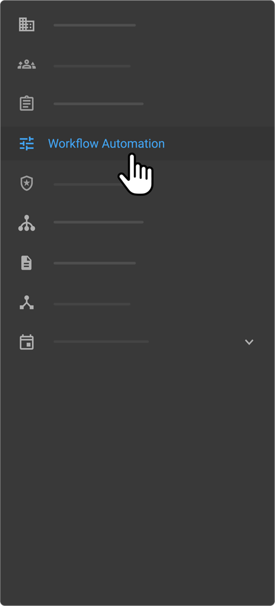

- The **Email Templates** will be displayed in a table format for improved visibility.

  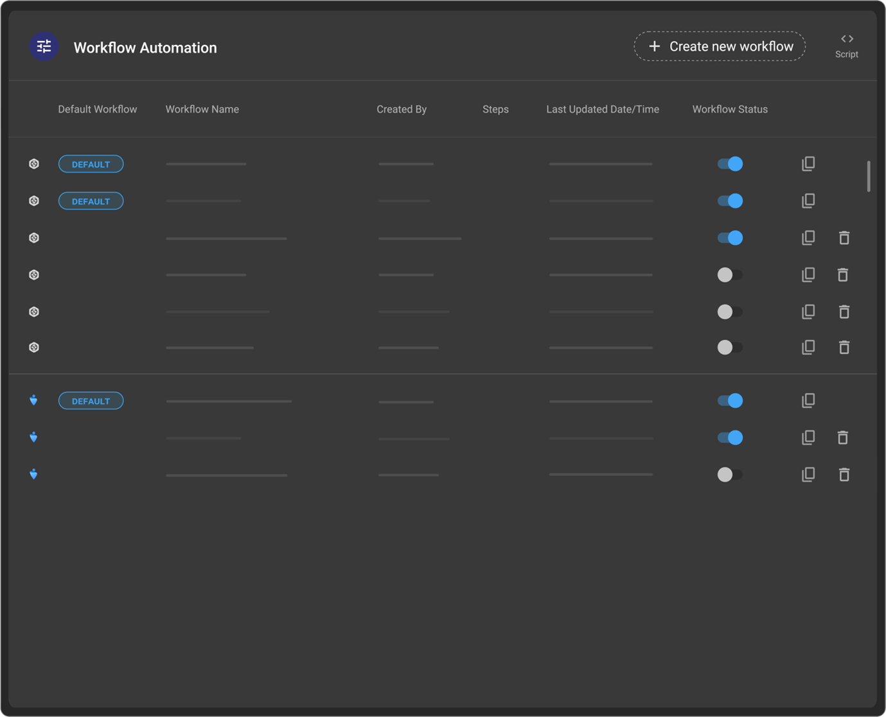

- Click on a workflow automation item to access the Email Template screen.

- From this screen, you can:

  **i.** Create a New Template

  **ii.** Edit an Existing Template
  
  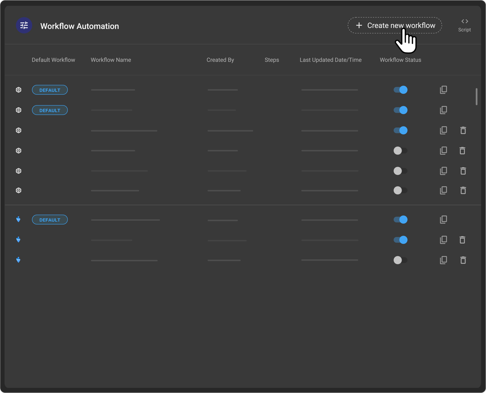

**B**. **_Default Email Templates_**

All organizations are provided with a set of default email templates—for example, Invite Email, Appointment Email, Cancellation Email, etc., each pre-filled with standard verbiage.

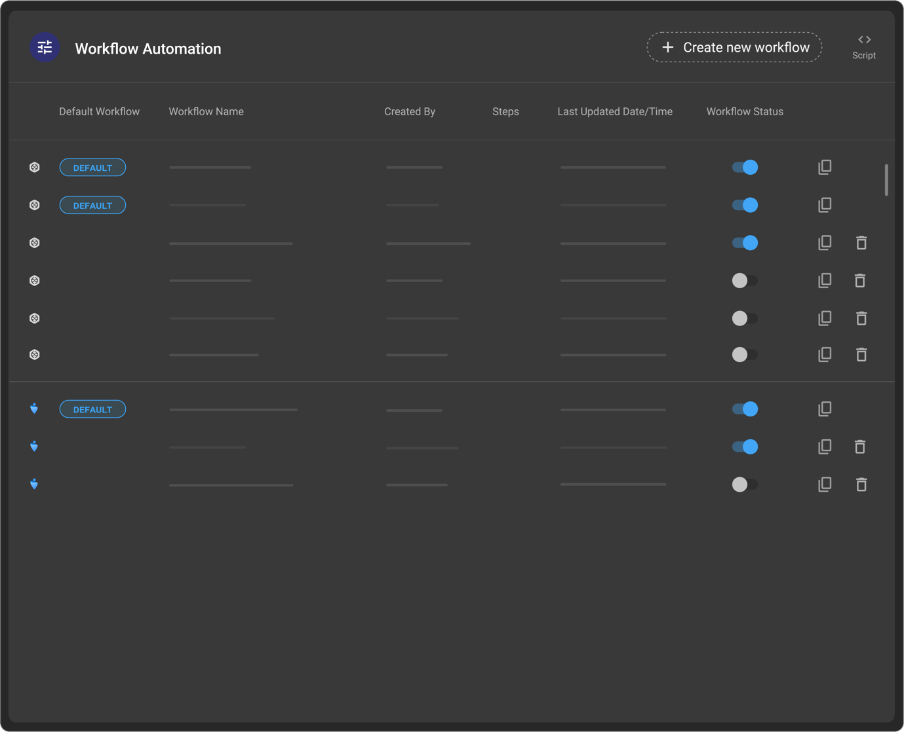

- These templates can be **edited** by clicking the (pen) icon next to the template in the list.
- Organizations can choose to **update the existing template** or save it as a **new template** after making changes.
- If a template is not needed, it can be **deactivated** at any time.

These templates apply to **both OmegaAI and Blume Communications**, and the content can be tailored as per organizational needs.

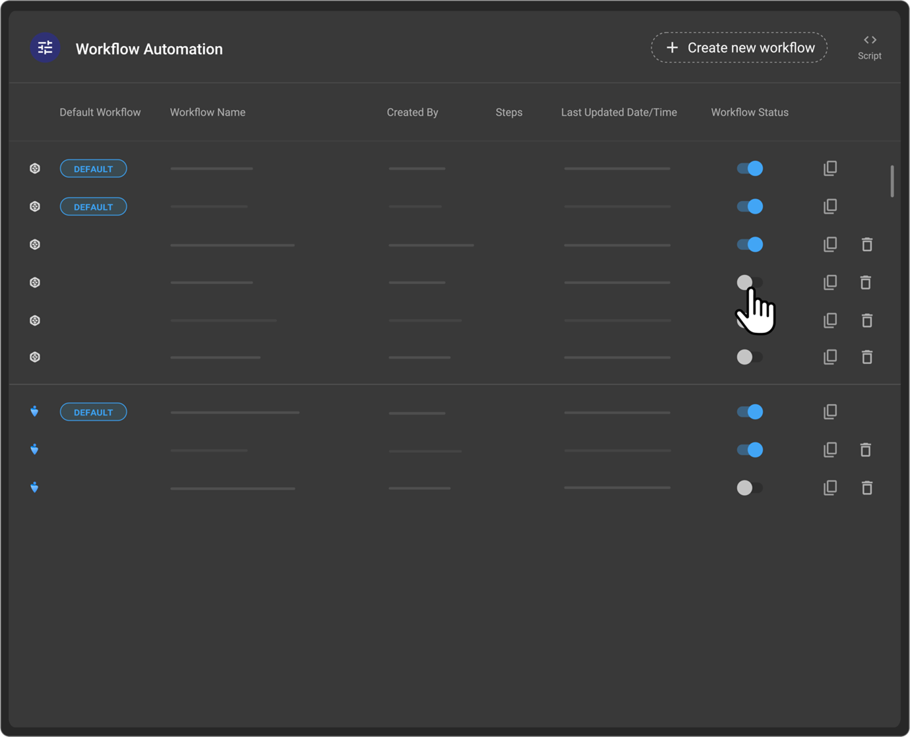

**C**. **_Creating a New Email Template_**

To create a new email template:

- Click **Create New Template**.

   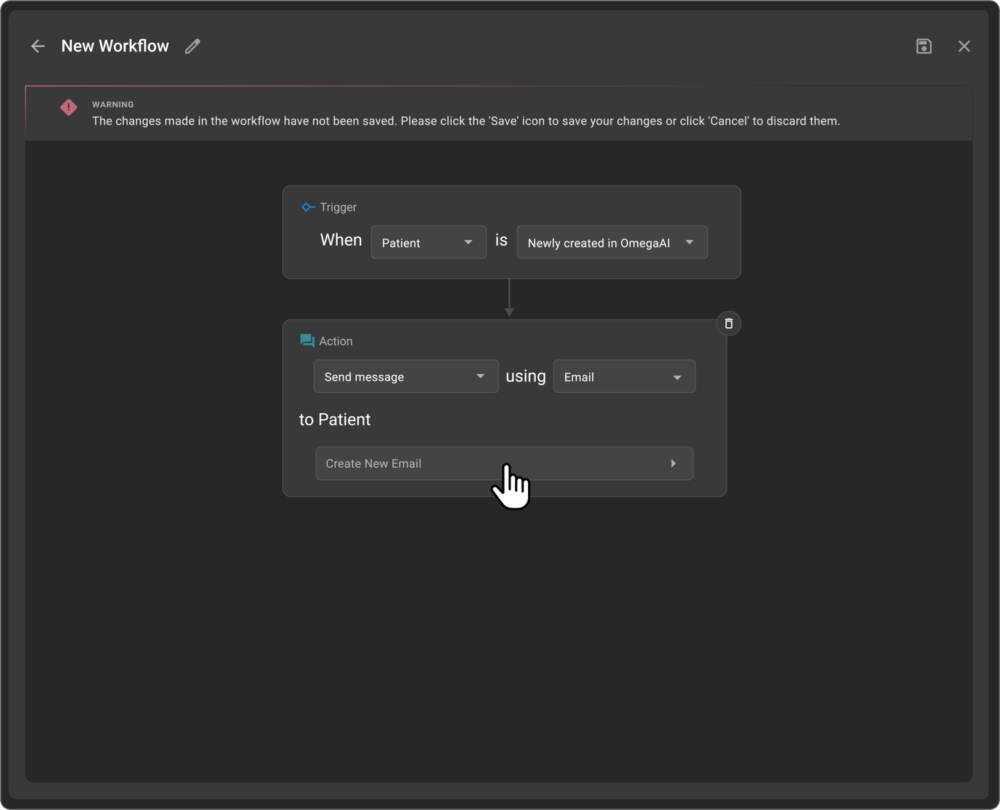

- Enter a **Subject Line**, which will appear as the **email subject** in the recipient’s inbox. Additionally, this subject line will be reflected as the **header** of the email template.

  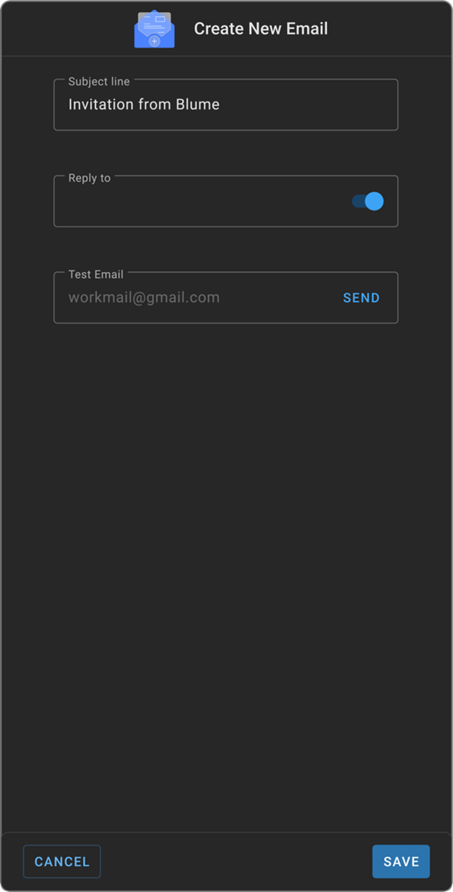

- Specify a **Reply-To Email** (optional). This is the designated address for recipient replies.

  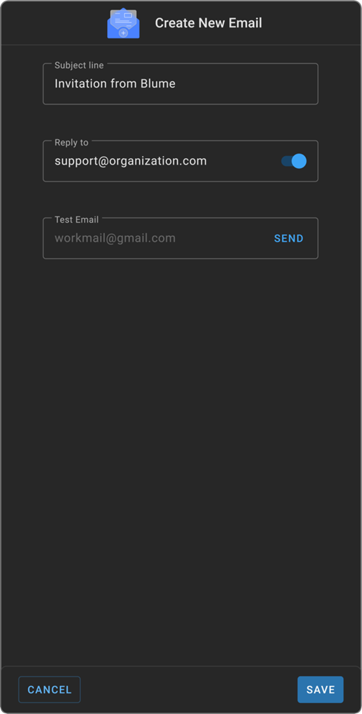

- Customize the template using the **Email Editor**:

  a. Adjust **font styles, sizes, and colours**
  b. Format **text alignment and layout**
  c. Design the email to align with organizational requirements

  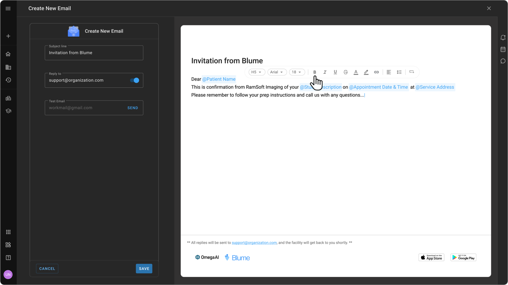

- Before finalizing, use the **Test Email** feature.

- Enter a recipient email address in the **Test Email** field.
- Click **Send** to preview how the email will appear in an inbox.

  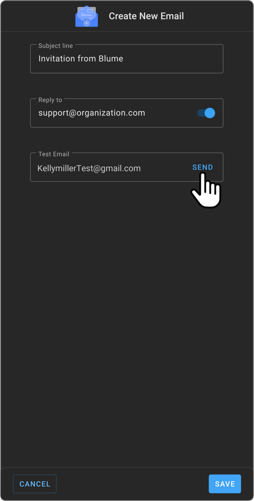

**D**. **_Editing an Existing Email Template_**

1. Select the desired template from the grid view.
2. Modify the content as needed using the Email Editor.
   1. To adjust font style or colour or insert an image, simply click on the text/content you wish to modify, right-click to open the rich text editor, and make your changes accordingly.
3. Use the **Test Email** option to validate the formatting and structure.
4. Click **Save** (bottom-left) to apply the updates.

    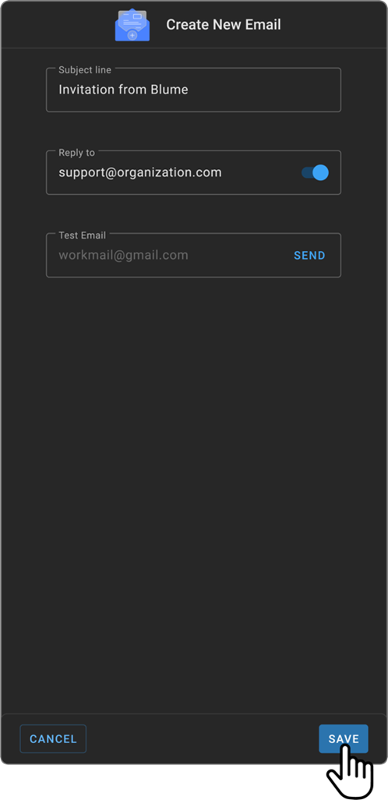

_Once saved, the updated template will be reflected in the table view._

**E**. **_Reply-To Email & Footer Configuration_**

- The **Reply-To email field is optional** and is **disabled by default**.

- If left **disabled**, the footer will remain unchanged, and no support email or text will appear.

- If the **Reply-To** toggle is **OFF**, a default footer message will appear: _“This is an auto-generated email. Please do not reply.”_
  
- To enable it:

  **a.** Toggle the **Reply-To** option ON.

  **b.** Enter the preferred email address (not limited to a support email).

  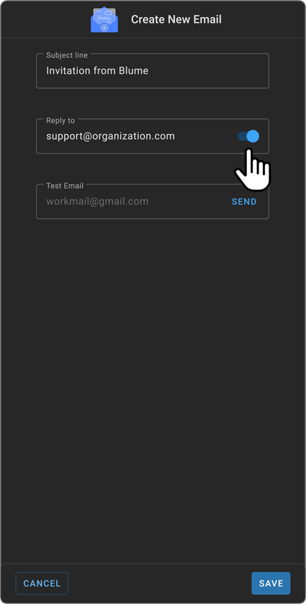

- Once enabled, the **Reply-To email** will be displayed in the **footer of the email template**. In this case, a new footer message will read:
_“All replies will be sent to the provided email, and the facility will get back to you shortly.”_

**F**. **_Saving & Managing Templates_**

1. Click **Save** (bottom-left) to store changes.
2. Once saved, the template will appear in the **table view** within the Workflow Automation module.
3. Users can **modify, delete, activate, or deactivate** templates as needed.

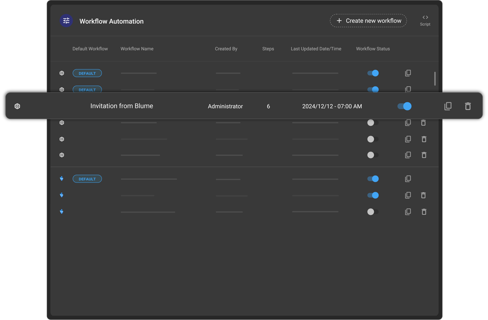

**G**. **_Key Enhancements in the Updated Interface_**

- **Layout Change:** Transition from **tile/card view** to **grid/table view** for better organization.
  
- **Footer Update:**

  **a.** Previously, users could select a footer; now, it remains **fixed**.

  **b.** The **Reply-To email** will only appear if manually enabled.

- **Enhanced Flexibility:**

  **a.** The **Reply-To field is now editable** and not restricted to a support email.

  **b.** Users have full control over email customization and distribution settings.

**Note:**

The **updated Email Template feature** provides a streamlined, efficient approach to managing email communications. With an improved **grid layout**, flexible **Reply-To settings**, and enhanced customization options, users can create **professional, well-structured email templates** with ease.

_Optimize your workflow by leveraging these enhancements today!_
