# What is Workflow Automation?

Workflow Automation allows you to automate certain processes and tasks
within the software based on personal preferences. This guide will walk
you through the GUI, explain its capabilities, and guide you in
creating, saving, deleting, copying and editing workflows.

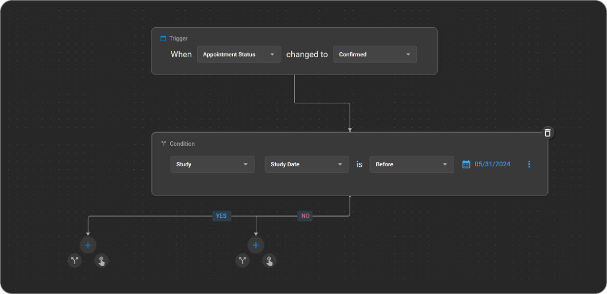

## Workflow Automation Interface

The Workflow Automation interface presents different types of workflows
created for an organization. Each workflow can be turned on or off,
which determines if the workflow is active or not.

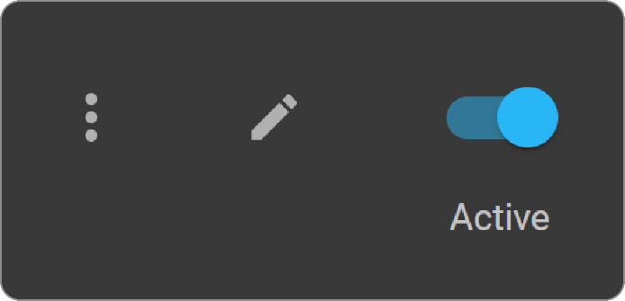

## Creating a New Workflow

To create a new workflow:

1.  Click the "+" button.

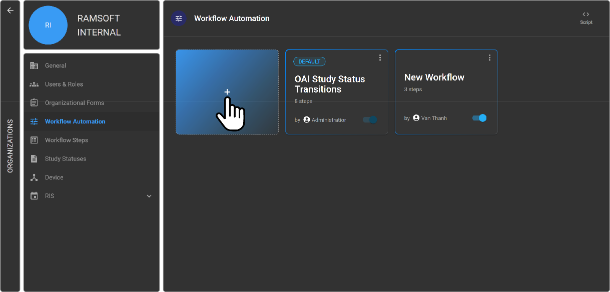

3.  The user interface will open to allow you to create your workflow.

4.  Name your workflow by clicking the "edit" button.

5.  Make your desired changes and click the "save" button.

6.  Close the workflow.

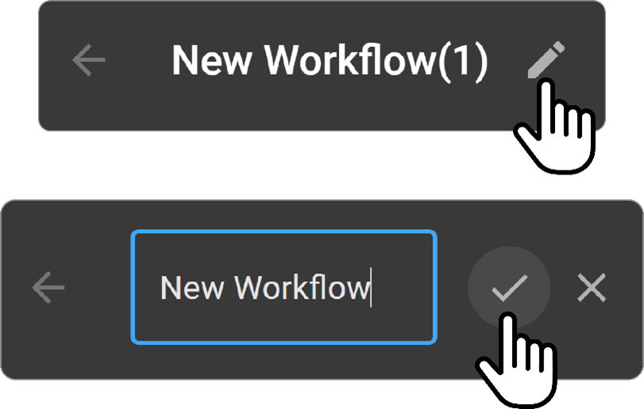

## Editing a Workflow

To edit an existing workflow:

1.  Click the three-dot button next to the workflow you want to edit.

2.  Make the changes you want.

3.  Click the "save" button.

## Deleting a Workflow

To delete a workflow:

1.  Click the three-dot button next to the workflow you want to delete.

2.  Click "delete."

3.  Confirm your decision.

## Copying a Workflow

To copy a workflow:

1.  Click the three-dot button next to the workflow you want to copy.

2.  Click "copy."

3.  A copy of the workflow will be created that you can then edit as
    needed.

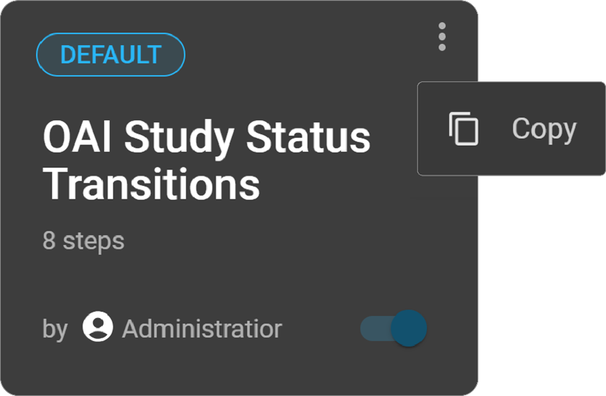

## Default Workflows

The default workflow is the sample workflow available for every
organization that boards into the software. This workflow is read-only
and cannot be edited.

**Note**: The Default Workflow can be copied if you want to create a
similar workflow, in which case editing will be enabled.

## Understanding Workflow Components

### Triggers

Triggers are events that cause a workflow to execute. There are
different types of triggers like patient, appointment status, operation,
and study status. Triggers are associated with various individual
sections.

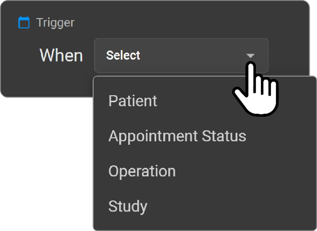

### Conditions

Conditions, or filters, allow you to specify that a workflow should only
execute for a particular group or under certain circumstances.
Conditions can be based on patient information or study information.

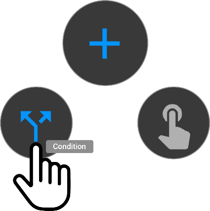

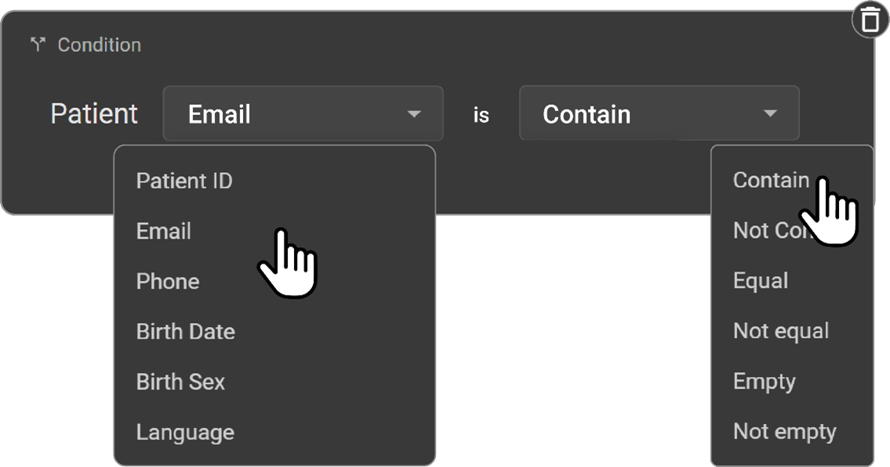

### Actions

Actions can be set up to trigger a specific result once a condition is
met.

There are different types of actions such as:

- Change Study

- Send Message

- Send Notification

- Assign

- Unassign

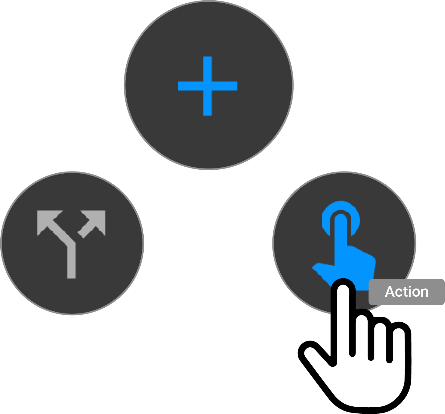

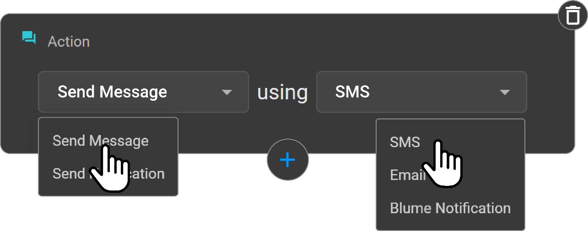

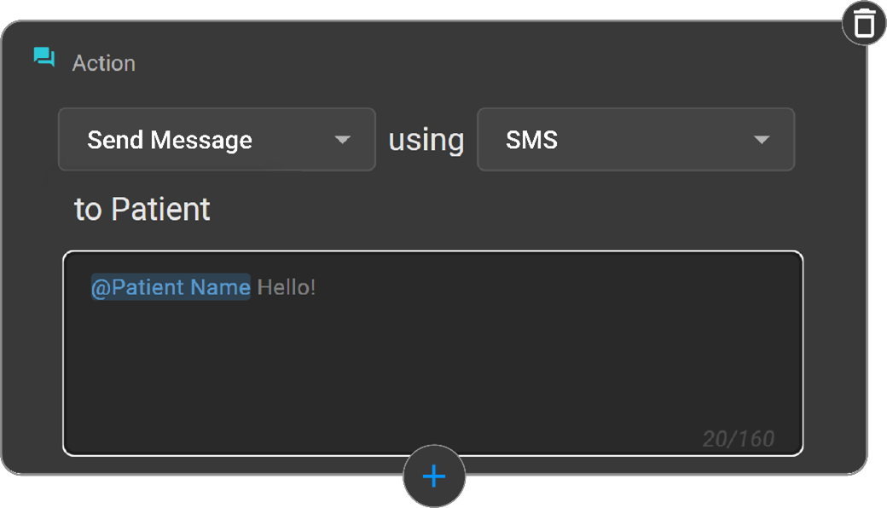

## Signed Report Trigger (Operation Trigger Type)

The **Signed Report** trigger is under the **Operations** Trigger Type in Workflow Automation (WFA). This trigger is especially used to automate actions such as report 

distribution and notifications immediately after a diagnostic report is created, ensuring seamless and timely processing without delaying DICOM workflows. The trigger 

should function independently and should not interfere with existing **Study Status SIGNED** workflows. Prevents delays in workflow automation due to asynchronous DICOM 

processing.

**Scope**

The **Signed Report** trigger applies to:

* Final Reports

* Signed Amendments

**Exclusions**:

Preliminary reports are not included.

**Trigger Activation Criteria**

The **Signed Report** trigger is activated when any of the following events occur:

* A diagnostic report is uploaded as a final report via the Document Viewer (DV) GUI.

* A report is received in OmegaAI through HL7 bundle transaction ingestion.

* A Structured Report is ingested via DICOM ingestion through OmegaAI Link.

* A final report with DICOM tags is imported using the IMPORT GUI.

* A final report is created or saved in OmegaAI’s Document Viewer (DV), including Signed Amendments (Done-Signoff).

**Distribute Report Action**

A single fax is sent per unique fax number to avoid duplicate transmissions. 

Use case: When same fax number is used for both referring physician and referring organization. A single email is sent per unique email address, ensuring no duplicate emails are sent.

## Pull Prior Action

Allows users to retrieve prior medical studies from different Picture Archiving and Communication Systems (PACS) into the Omega platform. The Pull Prior Action is designed to help users pull prior studies from any connected PACS system into Omega. This capability is crucial for accessing historical patient data across multiple organizations and stations.

**Setting Up**

Multi-Organization and Station Selection: With the updated feature, users can now select multiple organizations and stations to pull priors from various locations. This is particularly useful for patients with studies distributed across different systems.

**Usage**

Multi-Select Fields: Users can now enter multiple organizations and stations in the pull prior action settings. For instance, if a patient has prior studies in two different stations, the user needs to enter the respective organizations and stations to pull the data from both.

- **Matching Model**: This is a filtering criterion used to select relevant prior studies. Users can filter by the following:    

- **Patient name or ID**

- **Modality** (e.g., CT, MRI)

- **Description keywords**

**Scheduling**: Users can now schedule when the priors are pulled. This feature is helpful when the system is busy, and the retrieval process can be scheduled for a less busy time, like midnight.

**Limiting the Number of Priors**

To manage the volume of data and ensure system efficiency, users can limit the number of prior studies to be pulled. This prevents overwhelming the system with large volumes of data, particularly in large organizations with numerous patients.

**Post Configuration Steps**

By configuring the pull prior action, users can select multiple organizations and stations, apply the relevant matching model, and schedule the action. This ensures that the necessary prior studies are pulled efficiently and effectively, tailored to the user's specific needs.

## Centralization of Management of Study Statuses at the Master Organization Level

Restrict access of management of study status at child organizations to ensure consistency and prevent conflicts. This leads to uniformity and standardization of 
study statuses across the organization. Potential conflicts and inconsistencies in study statuses between the master and child organizations are eliminated. 
Administrative complexity is reduced by managing study statuses from a single point.

## Workflow Automation Usability

Every workflow can accommodate multiple actions and conditions. This
flexibility eliminates the need to create multiple workflows for similar
processes. The last person to edit a workflow is displayed in the GUI.
The software does not support the creation of duplicate workflows.

## Study Report Signoff

The **Study Report Signoff** action is a feature within the Workflow Automation (WFA) module in OmegaAI. 

Preliminary report gets converted into Final Report and study status automatically changes to SIGNED when a report is Signed by Reading Physician or Performing Physician. 

As per the enhancement, it enables the system to automatically assign the reading physician when a report is signed, ensuring that the study record reflects the correct information. This action applies only during the initial signoff of a study report.

**When a user signs a study report:**

The system validates whether the user is authorized as a Reading MD or Interpreting MD.

If the user is authorized, the system automatically assigns this user as the Reading Physician for the study.

**Amendment Handling: If a report is being amended after the initial signoff:**

The system does not auto-assign or change the Reading Physician.

The action only applies to the initial signoff of a report.

## Scripting

### DICOM Scripting

DICOM Scripting attributes DICOM Proxy and DICOM Wb.

### DICOM Proxy

**Operations:**

DICOM scripting within the DICOM Proxy currently supports 4 operations:

- **DICOM Send (CSTORESCU):** Sending DICOM objects to another entity.

- **DICOM Receive (CSTORESCP):** Receiving DICOM objects from another
  entity.

- **Outbound Find (CFINDSCP):** Applying scripts on the result dataset
  of C-FIND operations, which return search results.

- **Inbound Find (CFINDSCU):** Applying scripts on the request dataset
  of C-FIND operations, which contain search parameters.

Operation Types are defined as enums in **DICOMOperationType.cs** of
**RamSoft.Common**. This provides users flexibility to determine the
scenario in which they want to execute their logic.

**Sample Script:**

This script modifies the accession number by pre-pending it with 'RAM'
when receiving objects. If accession number is '1234', then the result
will be 'RAM1234'.

```javascript
(function() {
    var accessionNum;

    // For Operation DICOM Send
    if (Operation === 'CSTORESCU') {
        // Read for AccessionNumber
        if (DICOMObject["00080050"]) {
            accessionNum = DICOMObject["00080050"]["Value"];
        }

        // Update for AccessionNumber
        if ("00080050" in DICOMObject) {
            DICOMObject["00080050"] = {"vr" : "SH", "Value": [ 'RAM ' + accessionNum]}
        }
    }
})();
```

### DICOM Web

**Operations:**

DICOM scripting within the DICOM Web involves several operations:

- **Search Inbound (SearchInbound):** Searching for DICOM objects in the
  inbound direction.

- **Search Outbound (SearchOutbound):** Searching for DICOM objects in
  the outbound direction.

- **Retrieve Inbound (RetrieveInbound):** Retrieving DICOM objects in
  the inbound direction.

- **Retrieve Outbound (RetrieveOutbound):** Retrieving DICOM objects in
  the outbound direction.

- **Store Inbound (StoreInbound):** Storing DICOM objects in the inbound
  direction.

- **Store Outbound (StoreOutbound):** Storing DICOM objects in the
  outbound direction.

Operation Types are defined as enums in **DICOMOperationType.cs** of
**RamSoft.Common**.

**Sample Script:**

This script demonstrates various scenarios of modifying DICOM attributes
based on different operations.
```javascript
(function () {
    var patientName;
    if (Operation === 'SearchOutbound') {
        // Read for PatientName
        if (DICOMObject['PatientName']) {
            patientName = DICOMObject['PatientName'];
        }
        // Update for PatientName
        if ('PatientName' in DICOMObject) {
            DICOMObject['PatientName'] = 'SearchOut^' + patientName;
        }
    }

    if (Operation === 'SearchInbound') {
        // Read for PatientName
        if (DICOMObject['PatientName']) {
            patientName = DICOMObject['PatientName'];
        }
        // Update for PatientName
        if ('PatientName' in DICOMObject) {
            DICOMObject['PatientName'] = 'SearchIn^' + patientName;
        }
    }

    var accessionNum;

    if (Operation === 'StoreOutbound') {
        // Read for AccessionNumber
        if (DICOMObject['00080050']) {
            accessionNum = DICOMObject['00080050']['Value'];
        }

        // Update for AccessionNumber
        if ('00080050' in DICOMObject) {
            DICOMObject['00080050'] = { vr: 'SH', Value: ['StoreOut^' + accessionNum] };
        }
    }

    if (Operation === 'StoreInbound') {
        // Read for AccessionNumber
        if (DICOMObject['00080050']) {
            accessionNum = DICOMObject['00080050']['Value'];
        }

        // Update for AccessionNumber
        if ('00080050' in DICOMObject) {
            DICOMObject['00080050'] = { vr: 'SH', Value: ['StoreIn^' + accessionNum] };
        }
    }

    if (Operation === 'RetrieveOutbound') {
        // Read for AccessionNumber
        if (DICOMObject['00080050']) {
            accessionNum = DICOMObject['00080050']['Value'];
        }

        // Update for AccessionNumber
        if ('00080050' in DICOMObject) {
            DICOMObject['00080050'] = { vr: 'SH', Value: ['RetrieveOut^' + accessionNum] };
        }
    }

    if (Operation === 'RetrieveInbound') {
        // Read for AccessionNumber
        if (DICOMObject['00080050']) {
            accessionNum = DICOMObject['00080050']['Value'];
        }

        // Update for AccessionNumber
        if ('00080050' in DICOMObject) {
            DICOMObject['00080050'] = { vr: 'SH', Value: ['RetrieveIn^' + accessionNum] };
        }
    }
})();
```

## Workflow Scripting Using the Script Editor

The Workflow Script Editor empowers users to tailor workflows using
JavaScript scripting. This feature grants managing organizations the
flexibility to design custom scripts that define their workflow, which
can then be inherited by child or imaging organizations. The Script
Editor provides shortcuts for commonly used operations, JSON DICOM
resources, and other parameters, facilitating seamless customization.

## Steps to Configure Workflow Using the Script Editor:

1.  **Access Workflow Scripting:** Navigate to the Workflow Automation
    section.

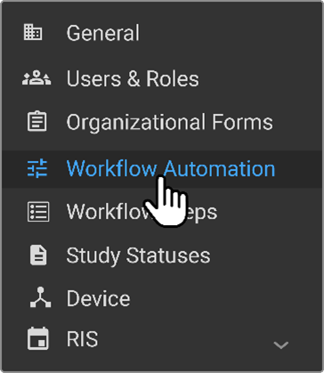

2.  **Open Script Editor:** Click on top right side of Workflow
    Automation, which will direct you to the Workflow Scripting page.

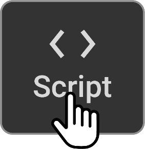

3.  **Edit Script:** Click on the "Edit" button to open the script in
    the Workflow Script Editor. This action will reveal the Tools
    drawer, containing various options to streamline script creation.

4.  **Utilize Tools Drawer:** The Tools drawer offers several
    functionalities:

> **Operations:** Features shortcuts for Fetch, Retrieve and Route,
> Route, and Status Transition operations, facilitating workflow
> customization.
>
> **DICOM JSON:** Helps compose the DICOM JSON structure necessary for a
> Fetch operation.
>
> **FHIR Fields:** Provides access to commonly used FHIR fields for easy
> integration. You can drag and drop these fields into the Script
> editor.
>
> **Devices:** Displays the list of stations associated with the
> specific organization.
>
> **Study Statuses:** Displays a list of study statuses for reference.

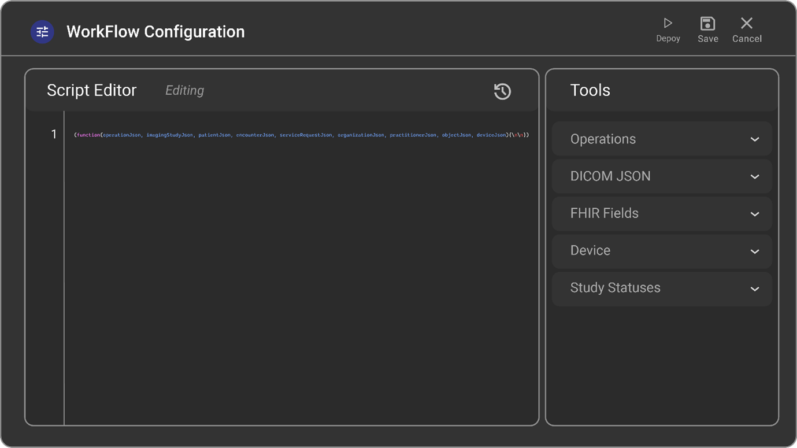

5.  **Script Creation:** You can either directly type the workflow
    script in the Workflow Script Editor or utilize the shortcuts
    provided in the Tools drawer to streamline script creation.

6.  **Deploy Script:** Once the script is created, click on "Deploy."
    This action ensures that the script is ready and executed when the
    relevant event occurs.

7.  **Save or Discard Changes:** After creating or editing the script,
    you can choose to "Save" to retain the changes or "Cancel" to
    discard them.

## Customizing Workflow with Operations:

1.  **Fetch Operation:** Executes a C-FIND against all archive stations
    associated with the managing organization using the OmegaAI Link
    device. This operation searches for studies based on defined search
    parameters within the C-FIND JSON structure. Note: Only DICOM
    stations with the "Archive Server" option enabled will be searched.

2.  **Retrieve and Route Operation:** Fetches a study from an archive
    station and subsequently routes it to another station. The common
    use case is to send a study within the system along with the
    pre-fetched prior studies.

**Sample Fetch and Routing Script:**
```javascript
(function(operationJson, imagingStudyJson, patientJson, encounterJson, serviceRequestJson, organizationJson, practitionerJson) {
    function getExtensionValue(imagingStudyJson, url, type) {
        let data = imagingStudyJson['extension'].find((item) => {
            return item.url == url;
        });
        return data ? data[type] : null;
    }

    if (getExtensionValue(imagingStudyJson, 'http://hl7.org/fhir/us/core/StructureDefinition/status', 'valueString') == 'COMPLETED') {
        let findDICOMJson = {};
        findDICOMJson["00100020"] = { "vr": "LO", "Value": [ patientJson.identifier[0].value ] };
        findDICOMJson["00100010"] = { "vr": "PN", "Value": [ patientJson.name[0].text ] };
        // Find related studies
        host.fetch(imagingStudyJson, patientJson, findDICOMJson);
    }

    if (operationJson.type == 'Fetched Studies') {
        let studies = operationJson.studies;

        // determine which studies is relevant
        for (let study of studies) {
            if (study.description == 'PET/CT SKULL TO MILD THIGH') {
                host.retrieveAndRoute(study, 'toronto-hgua', 3);
            }
        }

        // Route to device
        host.route('toronto-hgua', 3);
    }
})();
```

3.  **Route Operation:** Sends a study within OmegaAI to another system.
    This operation is accomplished by posting a DICOM store task, which
    is then processed by the OmegaAI Link device. Note: A common use
    case involves sending a study within the system along with
    pre-fetched prior studies.

**Sample Script for Routing Objects:**

This script will send individual objects as soon as they are received
or imported.

```javascript
(function(operationJson, imagingStudyJson, patientJson, encounterJson, serviceRequestJson, organizationJson, practitionerJson, objectJson, deviceJson) {
    if (operationJson.type == 'DICOM Object Received' || operationJson.type == 'DICOM Object Imported' ) {
        // Route object to device (objectJson, imagingStudyJson, deviceName,deviceId)
        host.routeObject(objectJson, imagingStudyJson, '11MED PACS LitePowerServer', 51);
    }
})
```
