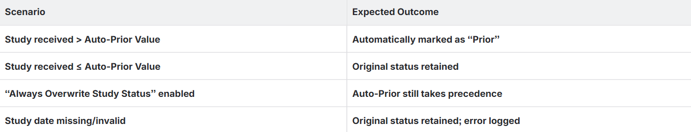

# Auto-Prior Configuration

The Auto-Prior Configuration feature can be set at the Managaing Organization level and allows administrators to automatically mark incoming studies as “Prior” based on study date. 

By default, Auto-Prior is enabled for all organizations with a 30-day limit, which can be customized (up to 365 days).

## Configuring Auto-Prior Threshold

Follow the below steps to configure Auto-Prior Threshold

1.  Open **Workflow Step** and select **Settings**.
    
2.  Locate the **Auto-Prior Threshold** field.
    
3.  Enter the number of days (default = 30 days).
    
    *   **Maximum allowed value**: 365 days
        
4.  Click **Save** to apply changes.
    
    **Note**: If you navigate away without saving, your changes will be discarded.
        

## How Auto-Prior Functions

When a study is received:

1.  The system compares the **Study Date** with the current date.
    
2.  If the study is older than the **Auto-Prior Value**, the system automatically assigns the study status "**Prior**".
    
3.  If the study is within the **Auto-Prior** limit, the original status is retained.

> **Important Note**: Even if the station has the "**Always Overwrite Study Status**" setting enabled, the **Auto-Prior** logic takes precedence and will still set the study status to “**Prior**” when applicable.
> 
> **Default Behavior**

1. **Default Setup**: Enabled by default for all customers/organizations. Default Value is 30 days.
    
2.  **Configuration**: Configurable per organization by administrators.

## Auto-Prior Scenarios

In the case that the **Study Date** is missing or invalid, the system retains the original status and logs an error. This ensures no incorrect automatic status assignment.

 

## User Access Controls (UAC)

1. Only users with the **Workflow Step UAC** permission can modify settings.
    
2. Users with read-only access can view settings but cannot edit them.**
    
3. **Auto-Prior** uses the existing **Workflow Step UAC**.
