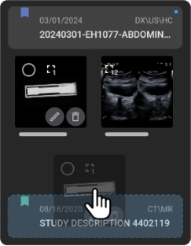

# Image Quality Control (QC)

## Overview

OmegaAI Image Viewer provides a robust set of Quality Control (QC)
features that enhance the management and organization of medical imaging
studies. This guide will walk you through accessing and utilizing these
features efficiently.

## Accessing the QC Module

To access the QC features in OmegaAI:

1.  Open the **Study Explorer** from the left side panel of the Image Viewer.

## Delete Series

You have two methods to delete a series:

1.  **Hover and Hold:**

    - Hover the mouse over the thumbnail of the series you want to
      delete.

    - Left-click and hold for a few seconds until the series is deleted.

    - A message will appear in the lower-left section of the screen with
      a 10 second counter, allowing you to undo the deletion.

      

2.  **Select and Delete:**

    - Click the checkbox on the top left of the image thumbnail to
      select one or multiple series.

    - In the series menu, left-click and hold the mouse on the delete
      option to delete all selected series.

      

## Move Series between Studies

To move series between studies for the same patient:

1.  **Drag and Drop:**

    - Drag and drop the series from one study to another in the Study
      Explorer.

    - You can drag and drop one or multiple series.

    - To move multiple series, select them using the checkbox method
      mentioned above.

      

## Create a New Study from Selected Series

To create a new study from selected series:

1.  Select the series you want to move to a new study.

2.  Click the **+** icon in the series menu.

3.  Create a new order for the study, which defaults to the image
    organization of the current study.

4.  Optionally, set a priority, referring physician, and study set for
    the new study.

    

## Rename Series

To rename a series:

1.  Hover the mouse over the thumbnail of the series.

2.  Click on the **Rename Series** icon.

3.  Enter the new name and press **Enter** to save it.

    

## Merge Studies

To merge studies that belong to the same patient:

1.  Hover over the study card.

2.  Click on the checkbox to select the study.

3.  Select additional studies you want to merge.

4.  Click the **Merge** option in the study menu. The **Select merge
    destination** panel will appear.

5.  Select the destination for the merged studies from the available
    options and confirm the merge.

    

## Unmerge Studies

To unmerge studies:

1.  Click on the study that was merged from the left side Image Viewer
    Study Explorer. An arrow icon will pop-up below the study.

2.  Hover over the arrow to see the **Split Study** option.

3.  Click on **Split Study** to revert the study to its original
    components.

    

## Delete Studies

To delete a study:

1.  Select the study using the checkbox in the Image Viewer Study
    Explorer.

2.  Click on the **Delete** option (garbage can icon) in the study menu.

3.  Alternatively, hover over the collapsed thumbnail icon to see the
    delete option, then click and hold to delete the study.

## Import Files
For information on importing files, see [Import Images, Videos and Documents](../6-Image-Viewer/20_importfiles.md)

