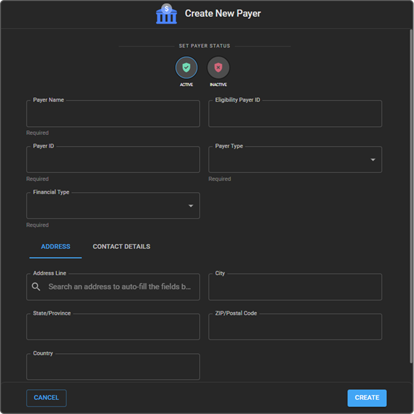
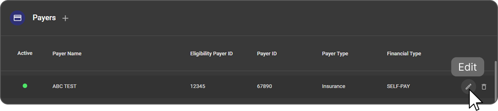
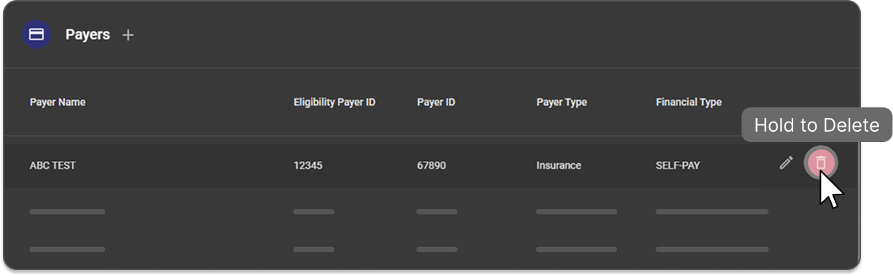
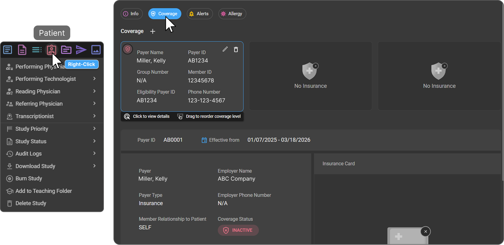
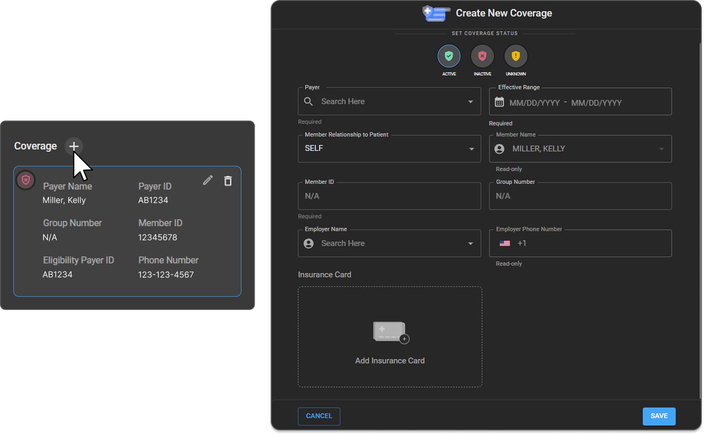
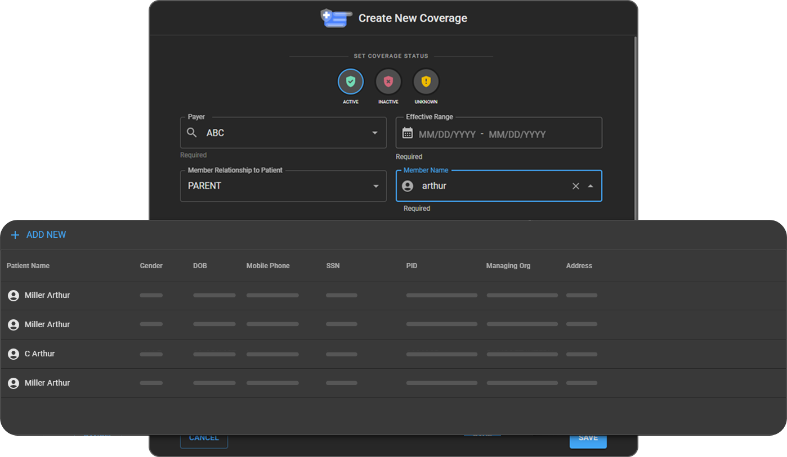
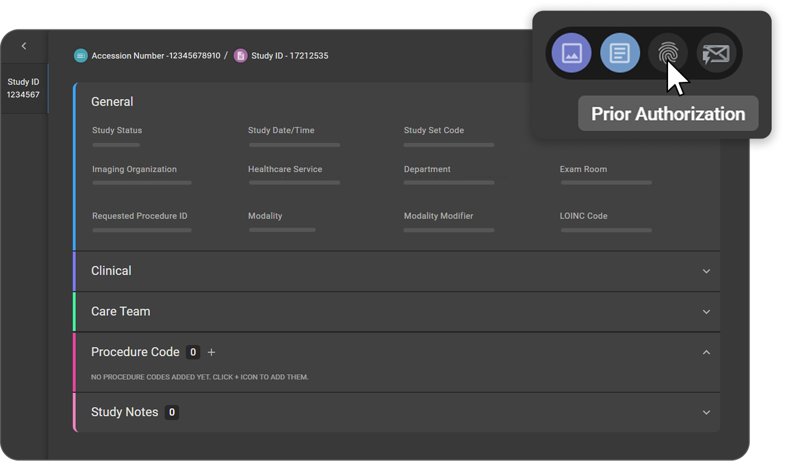
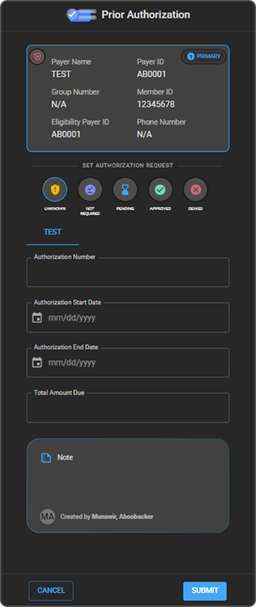

# Insurance Eligibility and Prior Authorization

## Adding Payers to the Organization
1.  Click **Organization** from the left navigation panel and open the
    required organization's details page.
    

2.  In the Organization details page, click **RIS** to expand the menu
    and select **Payers**.
    

3.  The Payers page opens, displaying the list of existing payers. From
    this page, users can add new payers, edit existing payers, or delete
    payers.

4.  Click the **+ (Add)** icon to add a new payer. The **Create New
    Payer** drawer opens.
    

5.  Enter the **Payer Name** and other fields, including **Payer ID**,
    **Payer Type**, and **Financial Type**.

6.  Fill in the **Address** and **Contact Details** as required.

7.  Set the payer status to **Active** (default) or **Inactive**.

8.  Click **Create** to save the payer.
   

9.  Once saved, the newly created payer appears in the **Payers** list.

## Editing/Deleting a Payer Record

Follow the steps below to edit or delete a payer record:

1.  Navigate to the **Payers** list page within the selected
    Organization.

2.  Hover over the required payer record in the list to display the
    **Edit** and **Delete** icons.

3.  Click the **Edit** icon to open the **Edit Payer** drawer.

4.  Update the required payer details, including status, payer
    information, address, or contact details.

5.  Click **Update** to save the changes. The updated information is
    reflected in the Payers list.
    

6.  To delete a payer, hover over the payer's record and click and hold
    the **Delete** icon.
    

7.  The payer record is removed and no longer appears in the Payers
    list.

## Adding Coverage for a Patient

1.  Navigate to the **Patient Info** page and locate the **Coverage**
    section.
    

2.  Click the **+** button to open the **Create New Coverage** drawer.
    

3.  In the **Payer Name** field, search and select a payer from the list
    of payers added to the organization.

4.  Set the **Coverage Status** at the top of the Create New Coverage
    page.

5.  Enter the patient's coverage details, including the **Coverage
    dates** **Effective Range**.

    By default, the **Member Relationship** is set to **Self**, and the
    **Member Name** is prepopulated with the patient's name. 
6.  To changethe member, select a different relationship from the dropdown and
    search for the appropriate member.
    

7.  If the required member does not exist in OAI, click **Add New** to
    create a new patient record for the member.
    
    
8.  After creating the new member's record, select the relationship and
    populate the newly created member.

9.  Enter the **Member ID** and **Group Number** details.

10. Select the **Employer Name** by searching from the list of employers
    in OAI.
    

11. If the employer does not exist, click **Add New** to create a new
    employer record and then select it.
    
 
12. Upload the member's **Insurance Card** image.

13. Click **Save** to store the coverage information.

## Adding Prior Authorization to a Patient Study

1.  Navigate to the **Worklist**, locate and open the required **patient
    study**.
    

2.  From the patient study page, select **Prior Authorization** from the
    **top-right corner** of the screen.
    <!-- small -->
  
3.  The **Prior Authorization drawer** opens on the **left side** of the
    screen.
    
    <!-- small -->
  
4.  In the **Prior Authorization panel**, the patient's **coverage
    information** is displayed at the top.

5.  Under **Set Authorization Request**, select the appropriate value
    that represents the current authorization status for the study:

    - Unknown

    - Not Required

    - Pending

    - Approved

    - Denied

6.  Enter the authorization details:

    - **Authorization Number**

    - **Authorization Start Date**

    - **Authorization End Date**

    - **Total Amount Due**

7.  Add **Notes** (optional) for remarks or additional context.

8.  Review all entered information for accuracy.

9.  Click **Submit** to save prior authorization.
