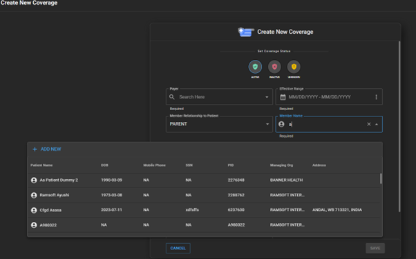

:::info
**Disclaimer**: All features on this page that require automated eligibility and prior authorization checks depend on a separately purchased third-party integration. Please contact your customer success manager for more informaiton. 
:::

# Insurance Eligibility and Prior Authorization

In OAI, the automated Insurance Eligibility and Prior Authorization is
done through the integration with a third-party solution.

## Adding Insurance Payers to the Organization

- Click on **Organization** on the left panel and open the respective
  organization details page

- Within the **Organization** detail page, click on **RIS**. It will expand and
  display the **Insurance Payer**

- Click on **Insurance Payers**. It will open the insurance payers where
  the user can add new insurance payers, edit existing insurance
  payers, and delete existing insurance payers

  

- Click on the **+** icon to add a new insurance payer. It will open the **Add
  new insurance payer** drawer.

- Search for the insurance payer name you wish to add. It will search the
  list of insurance payers supported by the third-party integration,
  along with the ID for the corresponding insurance payer.

  

- Select the **Insurance payer name** and fill in the other details like
  Financial Type, Address, and Contact Details, then click on **Create** to
  create this payer

- Once the payer is saved, it will be reflected in the **Insurance Payers**
  list displayed

  

## Editing/Deleting a Insurance Payer Record

- When you hover over the Payer record on the **Payer list** page, you will
  see the **Edit** and **Delete** icon

  

- When you click on the **Edit** icon, the **Edit Payer** drawer will open

- Users should be able to edit the details and, on clicking the **Update**
  button, the details would be saved

  

- To delete a Payer record, click on the **Delete** icon

- On clicking the **Delete** icon, the corresponding Payer record would be
  deleted, and it would disappear from the Payer list

## Adding Coverage for a Patient

A patient’s coverage information can be added from the **Patient Info**
page, under the **Coverage** section.

- On clicking the **+** button, the **Add New Coverage** drawer will open.

- While entering the **Payer Name**, the user can search and select from the
  list of payers added to the organization.

  

- Set the **Coverage status** from the top of the **Add coverage** page.

- Fill in the patient’s coverage details, including the **Payer Name** and
  **Coverage Effective** date range.

- By default, the **Member relationship** to the patient is selected as
  “Self,” and the **Member Name** is prepopulated with the Patient’s Name.

- The user can change the **Member relationship** by clicking the dropdown
  and selecting the appropriate relationship.

- Make necessary changes by selecting the relationship to the patient and
  searching for the **Member** name.

  

- Once the Member is selected, the **Member name** field would be populated
  with the selected record.

- If the Member is not present in OAI, then the Member record must be created
  in OAI.

- Click on **Add New** to create a patient record for the Member.

  

- Once the new Member record is created in OAI, the user should be able to
  select the relationship and populate the newly created Member record.

- Enter the **Member ID** and **Group Number** details.

- The user can select the **Employer** name by searching from the list of
  employers in OAI.

  

- If the **Employer Name** is not present in OAI, then the Employer record
  can be created in OAI.

- Click on **Add New** to create an Employer record for the Member.

  

- Once the new Employer record is created in OAI, the user should be able
  to select it and populate the newly created Employer record.

- The user can optionally add the Member’s insurance card image.

- Once the user is done adding all the details, clicking the **Save** button
  will save the coverage information.

- Once the patient’s coverage information is saved, if the organization
  has subscribed for the eligibility check product, then—irrespective of
  the value selected under the **Eligibility coverage status** field—
  the third-party eligibility check API will be called with the entered
  information.

- The API results will come instantly and update the coverage details.

  

- If the coverage is **active**, it will automatically update the
  **Eligibility coverage status** field, and the coverage details card will
  be updated with a link to the eligibility report.

  

- If the coverage is **inactive** due to incorrect information or if there is
  no active coverage for the user, it will be instantly visible on the
  screen as a toast message, and the subsequent coverage details card is
  updated.

  

- Whenever any of the coverage-related information is updated, the
  eligibility check API will be called again to reflect the latest status
  of the coverage.
