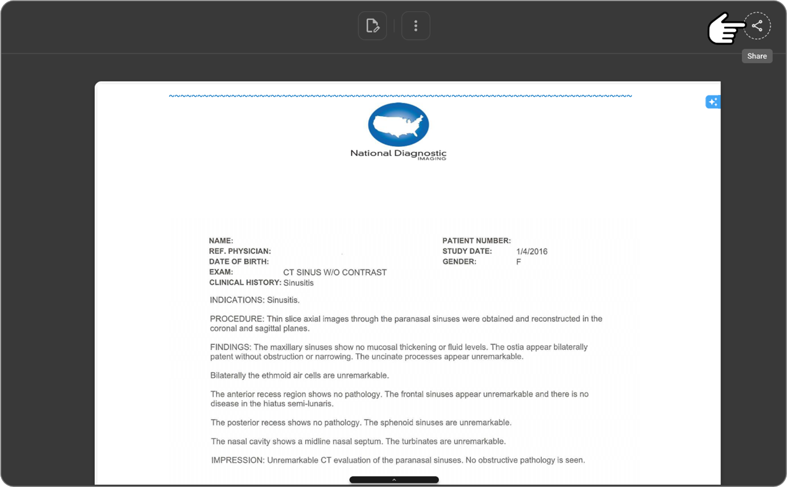
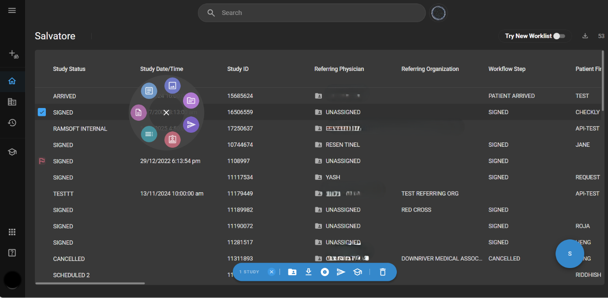
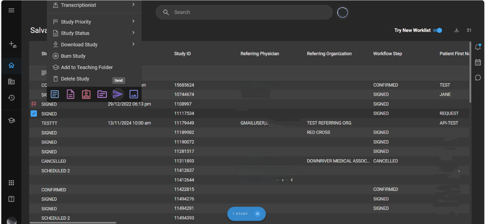
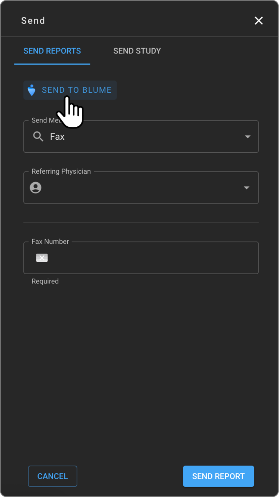
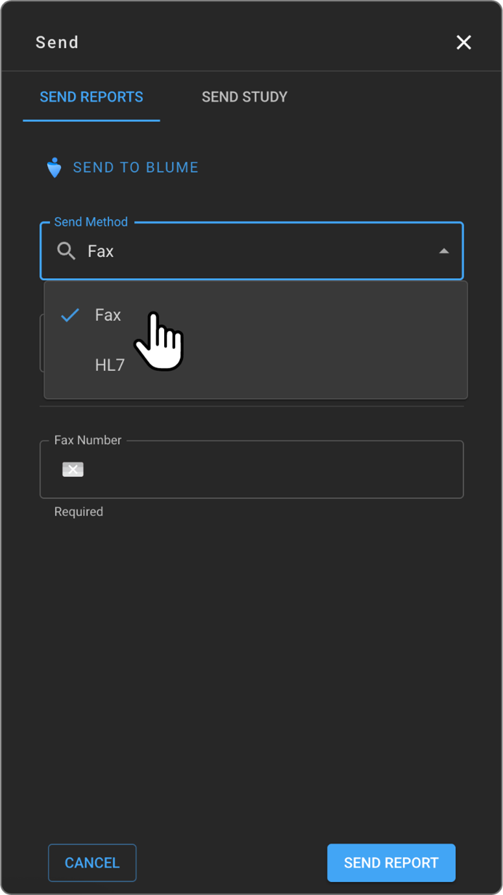
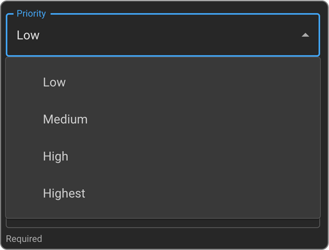

---
sidebar_position: 14
title: Study/Report Share – OmegaAI
---

# Study/Report Share – OmegaAI

OmegaAI has the **Share** functionality across the **Worklist**, **Image Viewer (IV)**, and **Document Viewer (DV)**, providing a unified and intuitive sharing experience.

## Accessing Share Options

- Open the **Document Viewer** or **Image Viewer** and select the desired study or image.
- Tap the **Share** icon (top-right corner).

  

- Two main tabs will appear:
  - **Send Reports**
  - **Send Study**

### Worklist Access

- In the **old Worklist**, after selecting a study:
  - The **Omega Dial** opens, allowing you to click the **Send** button to share the study.
  - Alternatively, a **blue toolbar** appears at the bottom—click **Send** from there.

  

- In the **new Worklist** (toggle available on the top-right corner of the worklist):
  - Select the desired study and **right-click** on it.
  - The new **menu** appears—choose the **Send** option to proceed.

  

### Send Reports

#### 1. Send to Blume

- A separate button located just below the tab headers.
- Use this option to send the report directly to the patient's Blume account.

  

#### 2. Send Method

- Use the Send Method dropdown to choose:
  - **Fax**
    - Search and select the referring physician via meta search.
    - The fax number auto-populates if available; otherwise, it can be entered manually.
  - **HL7**
    - No additional fields required.
    - Simply select HL7 and click Send.

    

_Note: The interface dynamically adjusts based on the selected method._

### Send Study

To share a study:

1. Select **Send Study** from the top tabs.

   

2. Choose the recipient type:
   1. **Imaging Organization**
      1. **Send Method** defaults to **DICOM SEND**

         

3. Set the **Priority**: Low, Medium, High, or Highest

  

4. Use **meta search** to select the **Imaging Organization** and the **Device**
   
5. Optional: Toggle **Anonymize** to anonymize the study before sending
   
      2. **External User**
   
          a. **Send Method** defaults to **Email**

          b. Click the **+** button to enter the recipient’s email address

          c. A warning message will appear:       
      _External User_
_You are about to send this study to a user who is NOT part of your organization in OmegaAI (External User) and will require the patient's birthdate or patient ID to access the study._
_Anyone with the link and the patient's birthdate or patient ID will be able to access the study_

         d. After reviewing the warning, proceed by clicking **Send Study**

         e.  Click **Cancel** to exit if needed.

         

### **Key Highlights**

- Available across **Worklist**, **DV**, and **IV**.
- Secure, trackable sharing with simplified workflows.
- Designed for seamless communication with referring physicians, imaging partners, and patients.
