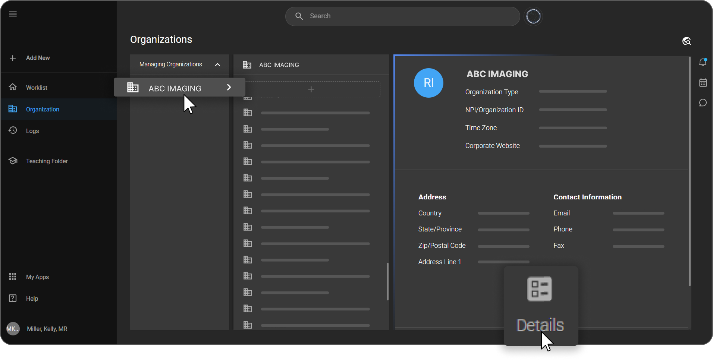
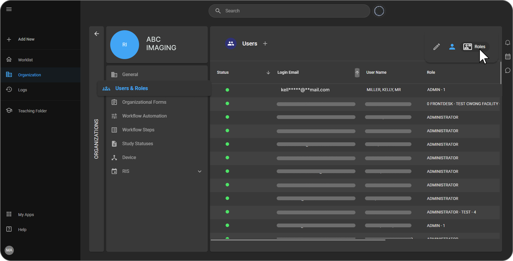
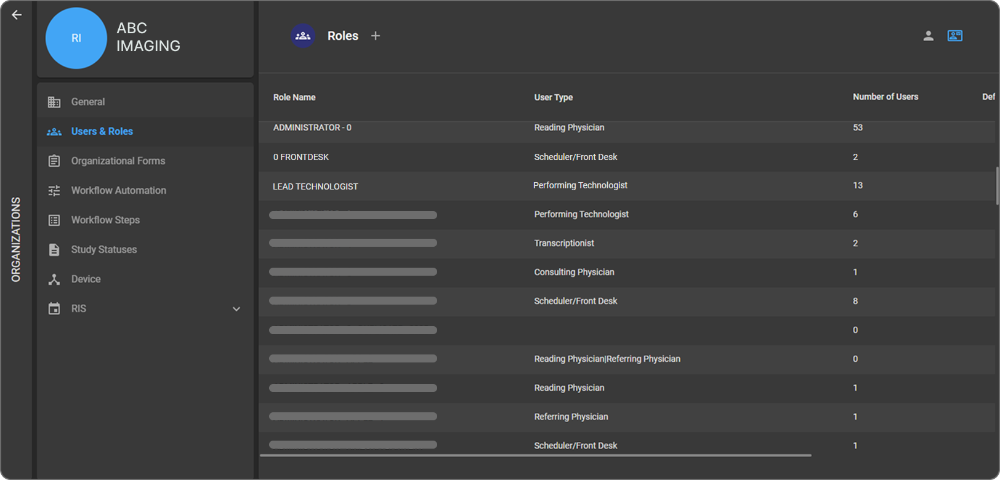
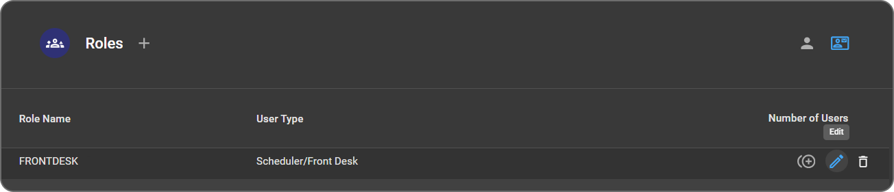
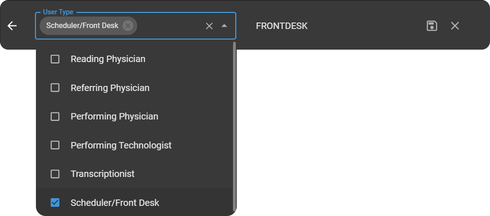
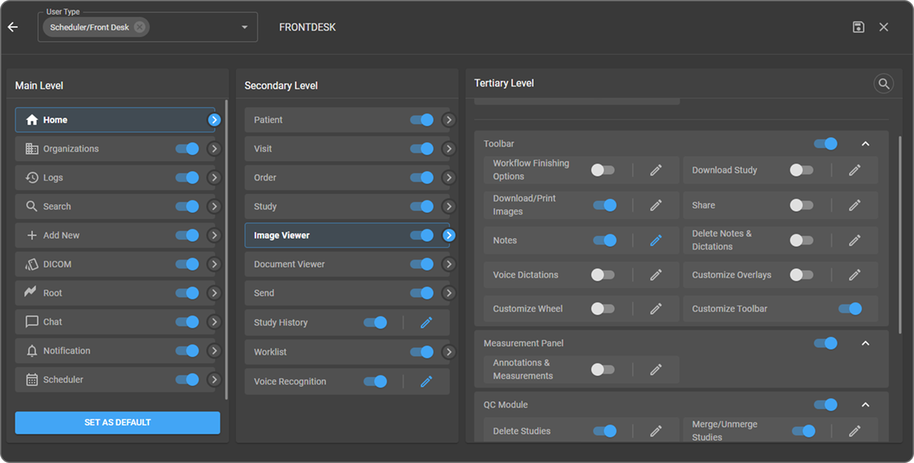
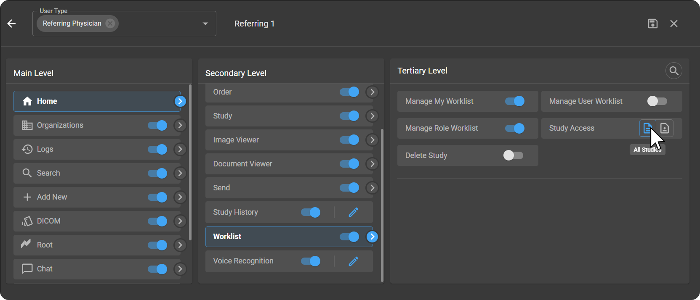
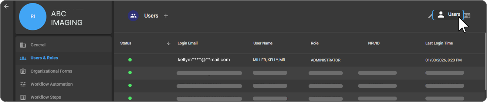
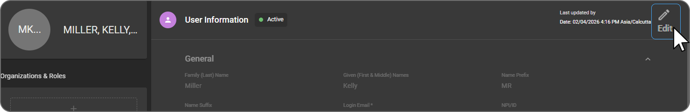
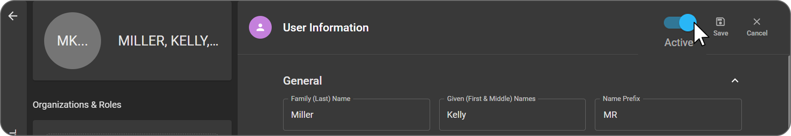

# User Access Control, Roles, and Privileges

In OmegaAI, users are associated with managing organizations. The
organization they are affiliated with will determine what information
the user is able to access. Furthermore, each user or device has a role.
A role determines what privileges the user has within the system.

However, referring and Consulting Physicians can access multiple
organizational studies even if they are not associated with any
organization. If their names are assigned under the Referring or
Consulting Physician field, they are granted the following privileges:

- **Image Viewer**: Read only

- **Worklist**: View studies they are assigned to

- **Diagnostic Report**: Read only, access to final reports only

- **Study Search**: Full access to records they are associated with

- **Patient Search**: Full access to records they are associated with

## User Access Control (UAC)

UAC is an essential part of OmegaAI that restricts the ability of users
to access only the information that they are authorized to access.

Since a user is part of the managing organization, the user can access
all information, including that of the sub-organization(s) associated
with it, if any. However, the user's access to information is determined
by the role assigned to the user.

### Roles

The combination of roles and user privileges determines what functions a
user will perform on the system. OmegaAI has pre-configured roles and
user types based on the general tasks performed by users at medical
facilities.

### Accessing Role Configuration

To manage user roles within OmegaAI, follow these steps:

1.  **Select the Organization:**

    - Click **Organization** from the left navigation panel and open the
     required organization's **Details** page.
     Note that user role configuration can only be performed at the
     top-level or master organization.

     

2.  **User Page:**

    - From the organization's dashboard, go to the **Users and Roles**
      page.

3.  **Role Configuration Icon:**

    - Click on the roles icon located at the top right of the screen to
      open the role configuration screen.

     

### Role Configuration Screen

The Role Configuration screen displays the following details for each
role:

- **Role Name**: The name assigned to the specific role.

- **User Type**: Indicates the category of users associated with the
  role.

- **Number of Users**: Displays the total number of users currently
  linked to the role.

- **Default**: Indicates whether the role is set as the default role for
  newly created users.

  

### Managing Roles

**Add a New Role**

- To create a new role, click the **+ (Plus)** icon next to the
  **Roles** header at the top of the screen.

**Role Actions**

When you hover over a role, the following action icons appear:

- **Duplicate**: Click the first icon to create a copy of the selected
  role.

- **Edit**: Click the second icon to modify the role settings.

- **Delete**: Click the third icon to delete the role.

*Note: A role can be deleted only if no users are currently assigned
 to it.*

### User Types and their Roles

OmegaAI supports several user types, each corresponding to different
roles within the healthcare workflow:

- **Reading Physician**

- **Referring Physician**

- **Performing Physician**

- **Performing Technologist**

- **Transcriptionist**

- **Scheduler/Front Desk**

**Purpose:**

- These types are used to group users and define what data populates in
  specific fields, like assigning a study to a reading physician.

  

### Editing Roles

The **Role Editing** screen allows administrators to configure what
features and actions are available to a specific user role. Permissions
are structured in three hierarchical levels---**Main**, **Secondary**,
and **Tertiary**---to provide fine-grained access control across the
application.

This setup ensures users can only view or perform actions relevant to
their responsibilities.

- The **Main Level** represents the top-level modules or primary screens
  of the application.

- The **Secondary Level** displays features or functional areas within
  the selected Main Level.

- The **Tertiary Level** provides **fine-grained, action-based
  permissions** within a selected secondary feature.

Clicking on any level expands it to display the associated permissions
and configuration options.

  

**Functionalities:**

**Toggle**

- Toggle switches are used to **enable or disable access** to specific
  features for a selected role.

- Toggles are available at **Main**, **Secondary**, and **Tertiary**
  levels.

- When a toggle is:

  - **ON (enabled):** The feature is accessible to users assigned to the
  role.

  - **OFF (disabled):** The feature is hidden or restricted for the role.

- Disabling a higher-level toggle automatically restricts access to its
  associated lower-level options.

**Edit (Pen Icon)**

- **Edit (pen) icon** allows editing at the tertiary level, not
  applicable to all items.

- When the edit control is:

  - **Blue (ON):** Editing is enabled, and the tertiary-level permissions
  can be modified.

  - **Grey (OFF):** Editing is disabled, and the permissions cannot be
  changed.

**Search:** 
Use the search function to locate specific fields within the
tertiary level.

### Workflow Implications:

- **Reading Physician:** Completing an action in an image or document
  viewer might sign off a final version of a report.

- **Technologist:** Similar actions signify the completion of their
  workflow, progressing the study from **Completed** to **Verified**.

In setting up a workflow, understanding how user types interact with
automated processes is essential. For instance, identifying the
appropriate user type for triggering specific actions can help in fraud
prevention and streamline operations.

### Study Access (UAC)

**Study Access** controls which imaging studies a user can view and
interact with in the application. Using User Access Control (UAC),
administrators can define whether users can access **all studies** or
**only studies explicitly assigned to them**, ensuring appropriate data
visibility and compliance with access policies.

This setting is configured at the **Tertiary Level** under the
**Worklist** module.

**Study Access Options**

The **Study Access** section provides two mutually exclusive access
modes:

**1. All Studies**

- Allows users to view **all available studies** that are part of
  imaging organizations.

- Users are not restricted by assignment and can access every study they
  are authorized to see within the system.

- Suitable for roles that require broad visibility, such as
  administrators or senior reviewers.

**2. Assigned Studies**

- Restricts users to view **only studies assigned to them**.

- Users cannot see unassigned studies in the Worklist.

- Ideal for referring physicians or roles requiring limited, controlled
  access.

## Restrict User Deletion in OmegaAI

The **Restrict User Deletion** feature enhances data security and
consistency in user management by preventing the deletion of user
accounts across the application. This ensures:

- **Auditability & Traceability**: User records remain intact for
  compliance and historical reference.
- **Visibility**: Administrators can view both **active** and
  **inactive** users at the organizational level.

**Notes**: - User account deletion is **disabled** in both the User
Interface and the FHIR **API**. - Hard deletion of user records is **not
allowed** in OmegaAI.

### Activation & Deactivation of Users

Instead of deleting users, OmegaAI allows administrators to **activate**
or **deactivate** accounts.

### Steps to Deactivate a User

1.  Click **Organization** from the left navigation panel and open the
    required organization's **Details** page.

    

2.  From the organization's dashboard, navigate to **Users & Roles**.
3.  Click the **Users** button in the top-right corner to open the **User Information** page.

    

4.  Click the **Edit** (pencil) icon in the top-right corner.

    

5.  Locate the **Active**/Inactive toggle.
6.  Switch the toggle to **Inactive**.

    - The user's access is revoked.
    - Their role is marked as **Inactive** for the respective
    organization.

    

### Steps to Activate a User

1.  Navigate to the **User Information** page.
2.  Switch the toggle to **Active**:
    - Access is restored only if you have the required **User Access
      Control (UAC)** privileges.

    - **Note:** Deactivated users remain visible in the **Users List**
      with a status of **Inactive**.

### User Status

The **Status** label indicates whether a user is **active** or
**inactive**.

**Note**: The status is visible on the **Users List Screen** and the
**User Profile Screen**. **Active users** appear at the top of the list,
while **Inactive users** are displayed below the **active users**.

#### Status indicator

- Active (green **dot)**: The user's access and permissions are enabled
  for this organization.
- Inactive (grey **dot)**: The user's access and permissions are
  disabled for this organization.
