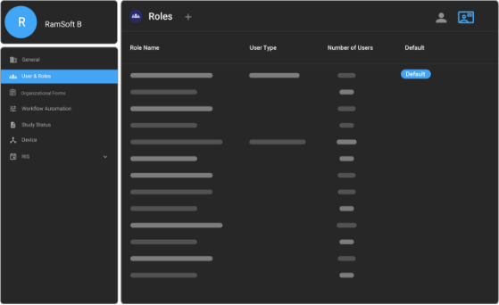

# User Access Control, Roles, and Privileges

In OmegaAI, users are associated with a managing organization. The organization they are affiliated with will determine what information the user
is able to access. Furthermore, each user or device has roles. A role determines what privileges the user has within the system.

However, referring and Consulting Physicians can access multiple organizational studies even if they are not associated with any organization. If their names are assigned under
the Referring or Consulting Physician field, they are granted the following privileges:

- **Image Viewer**: Read only

- **Worklist**: View studies they are assigned to

- **Diagnostic Report**: Read only, access to final reports only

- **Study Search**: Full access to records they are associated with

- **Patient Search**: Full access to records they are associated with

## User Access Control (UAC)

UAC is an essential part of OmegaAI that restricts the ability of users
to access only the information that they are authorized to access.

Since a user is part of the managing organization, the user can access
all information including that of the sub-organization(s) associated
with it, if any. However, the user's access to information is determined
by the role assigned to the user.

### Roles

The combination of roles and user privileges determines what functions a
user will perform on the system. OmegaAI has pre-configured roles and
user types based on the general tasks performed by users at medical
facilities.

#### Accessing Role Configuration

To manage user roles within OmegaAI, follow these steps:

1.  **Select the Organization:**

    - Navigate to the organization you want to manage. Note that user
      role configuration can only be performed at the top-level or
      master organization.

2.  **User Page:**

    - From the organization's dashboard, go to the **Users** page.

3.  **Role Configuration Icon:**

    - Click on the roles icon located at the top right of the screen to
      open the role configuration screen.

#### Role Configuration Screen

On the role configuration screen, you will find the following:

- **Role Name:** The name assigned to the specific role.

- **User Type:** Indicates the type of users associated with the role.

- **Number of Users:** Shows how many users are currently linked to each
  role.

- **Default:** Marks whether a role is the default for new users.
  
  

Interactions:

- **Duplicate:** Click the first icon on hover to duplicate a role.

- **Edit:** The second icon allows you to modify the role settings.

- **Delete:** The third icon can be used to delete a role, only if no
  users are currently associated with it.

#### Editing Roles

In the role editing screen, you will encounter multiple sections:

- **Main Level:** Lists main categories or screens accessible to the
  role.

- **Secondary Level:** Displays sub-options for the selected main
  category.

- **Tertiary Level:** Further details and specific features within a
  sub-option.

Functionalities:

- **Toggle:** Switch specific features on or off for a role at various
  levels.

- **Edit (Pen Icon):** Allows editing at the tertiary level, not
  applicable to all items.

- **Search:** Use the search function to locate specific fields within
  the tertiary level.

### User Types and their Roles

OmegaAI supports several user types, each corresponding to different
roles within the healthcare workflow:

- **Reading Physician**

- **Referring Physician**

- **Performing Physician**

- **Performing Technologist**

- **Transcriptionist**

- **Scheduler**

- **Front Desk**

Purpose:

- These types are used to group users and define what data populates in
  specific fields, like assigning a study to a reading physician.

### Workflow Implications:

- **Reading Physician:** Completing an action in an image or document
  viewer might sign off a final version of a report.

- **Technologist:** Similar actions signify the completion of their
  workflow, progressing the study from **Completed** to **Verified**.

In setting up a workflow, understanding how user types interact with
automated processes is essential. For instance, identifying the
appropriate user type for triggering specific actions can help in fraud
prevention and streamline operations.