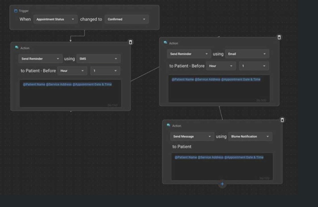

# Federated Login, Authentication, and MFA Configuration

## Overview

This section describes how to set up Business-to-Business (B2B)
federation with OmegaAI (OAI), focusing on federated login through
OpenID and SAML Identity Providers. Federated login allows users to
access multiple applications with a single set of credentials, ensuring both convenience and security. 
The described process includes collecting required information from the customer, coordinating policy updates with
OmegaAI developers, performing customer testing, and an optional role mapping step.

## Information Required

To initiate the federated login integration, user is required to provide a list of details for authentication via OpenID and SAML Identity Providers.

### OpenID

Please provide the following details:

- **Client ID**: A unique identifier for your application.

- **Secret**: A secret key used to secure communication.

- **Response Type**: The type of response expected.

- **Scope**: The scope of access requested.

- **Response_mode**: How the response is delivered to your client.

- **MetadataURL**: URL containing metadata about the OpenID
  configuration.

- **Domain_hint**: Directs the authentication request to the correct
  domain.

- **ClaimsMapping**: Maps token claims to user attributes.

- **User Attributes**: UserID, DisplayName, GivenName, SurName, and
  Email.

### SAML

Please provide the following details for SAML configuration:

- **WantsEncryptedAssertions**: Indicates whether assertions should be
  encrypted.

- **WantsSignedAssertions**: Indicates whether assertions should be
  signed.

- **PartnerEntity**: The entity identifier of your SAML partner.

- **IssuerUri**: The issuer's URI.

- **Domain_hint**: Used to streamline the login process.

- **Certificate**: Your public key certificate used for verifying SAML
  assertions.

- **ClaimsMapping**: Maps SAML assertion attributes to user attributes.

- **User Attributes**: UserID, DisplayName, GivenName, SurName, and
  Email.

Additionally, please add the following URL as a redirect URL in your
federated application settings:
\<https://omegaai.b2clogin.com/omegaai.onmicrosoft.com/oauth2/authresp\>

## Coordinate Policy Update with RamSoft Team

After you have provided the necessary details, please coordinate with
RamSoft Support to update the authentication policies. This coordination
is crucial to integrate the new settings without causing any disruptions
in service.

## Perform User Testing

Once the policy updates are completed, it is essential that you conduct
thorough testing to verify the functionality of the federated login.
This testing ensures all integrations are operational and secure prior
to going live.

## Role Mapping (Optional)

If your organization requires role-based access, we can assist in
mapping roles based on the claims provided by your Identity Provider
(IDP).

