# Link and Merge Patient Workflow

Linking patients connects different patient records that belong to the
same patient. Users should verify the patient record details and ensure
they are linking the correct records of the same patient. 

Merging patients merges two different patient records that belong to the 
same patient. While merging the different patient records into one, all their
associated orders, studies are also merged under one patient record. Users 
should verify the patient record details and ensure they are merging the 
correct records of the same patient.

## Linking of Patients from the Patient Info page

- Open the Patient info page from the Worklist.

- Hover over the Link Patient icon on the left hand side of the Patient
  info page.

 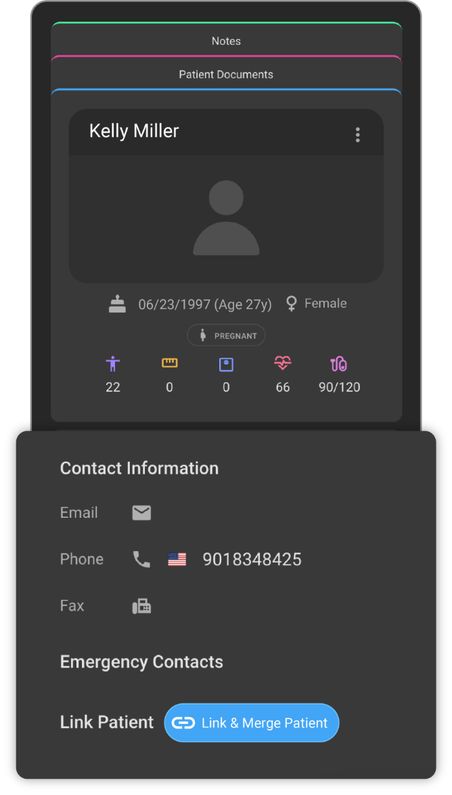

- Click on the Link or Merge Patient button.

- It will open the search box where the user can search for the patient
  within the original patient's managing organization to link a patient record.

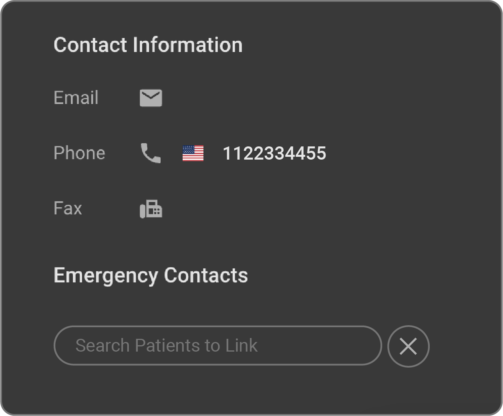

- In the Search box, while typing, patient records matching the search
  criteria is displayed.

- Users should carefully go through the complete patient record details
  displayed including the Patient Name, DOB, SSN, Managing Organization
  details etc., before finalizing the patient record. 

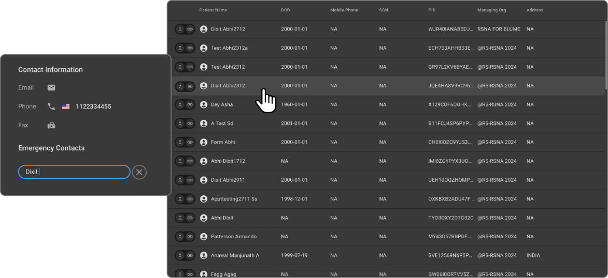

- Each patient record displays **Link** and **Merge** icons.

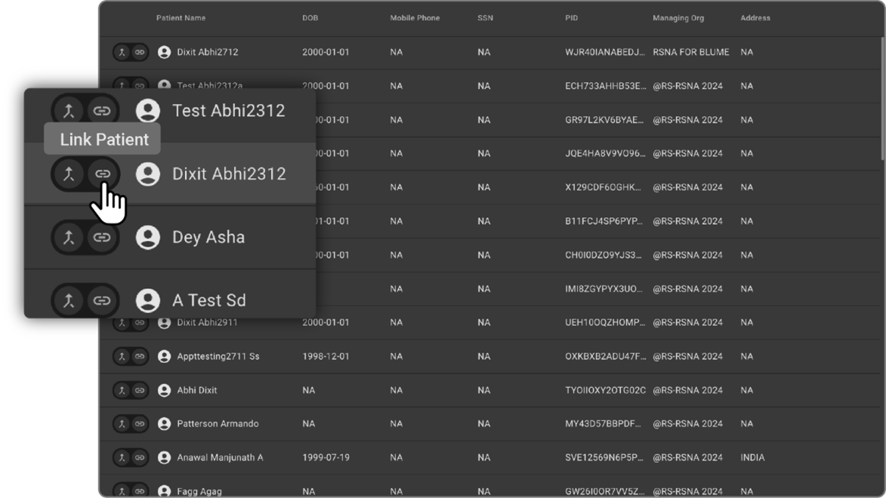

- Click on the Link button to open the Link patient drawer with the two
  patient records. The first one is the current patient record, and the
  second one would be the searched patient record.

    - If any of the info between the two patient records are different, then
  there would be a red color icon on the corresponding field name
  and the corresponding field value is also indicated in red color.

    - If any of the info between the two patient records ar same, then they
  would be indicated in White color.

    - Users should carefully analyze all the fields which are similar and
  different between the two records. Users should ensure that they are
  linking the same patients two different records.

    - The Link patient side drawer will have Close button on the top, Link
  and Cancel button in the bottom.

    - On click of close button on the top or Cancel button in the bottom,
  the Link patient side drawer is dismissed.

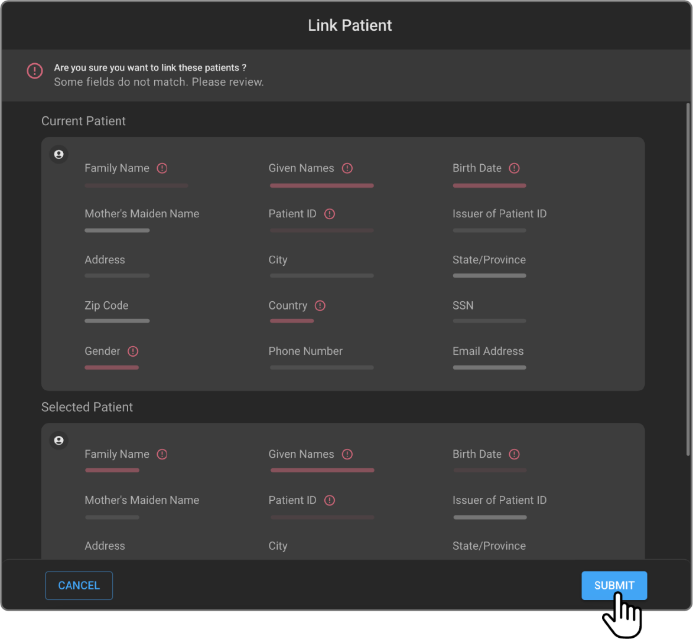

- When the user clicks on the **Link** button, both the patient records get
  linked, and the linked record is created.

## Display of Linked Patient record on the Patient Info Page

- All the linked patient records for a particular patient would appear
  as a card on the Patient Info page below the Link Patient Icon. 

- Click of each patient card would open the corresponding linked patient
  record.

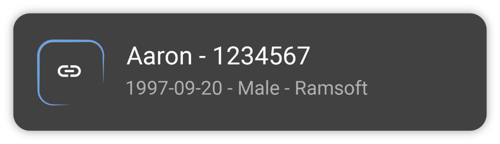

- If there are more than one patient record is linked for a particular
  patient, all the linked patient records can be accessed by clicking
  the arrow button.

## Unlink Linked Patient record from the Patient Info Page

- On hover of the linked patient record, Unlink option should be
  shown. On Click of the unlink the patient records are unlinked.

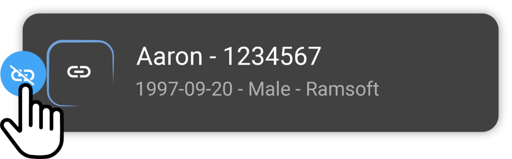

## Merging of patients from the Patient Info page

- Open the Patient info page from the Worklist.

- Hover over the Link Patient icon on the left hand side of the Patient
  info page.

 

- Click on the Link or Merge Patient button

- It will open the search box where the user can search for the patient
  within the original patient's managing organization to merge a patient record.

- In the Search box, while typing, patient records matching the search
  criteria is displayed.

- Users should carefully go through the complete patient record details
  displayed including the Patient Name, DOB, SSN, Managing Organization
  details etc., before finalizing the patient record.

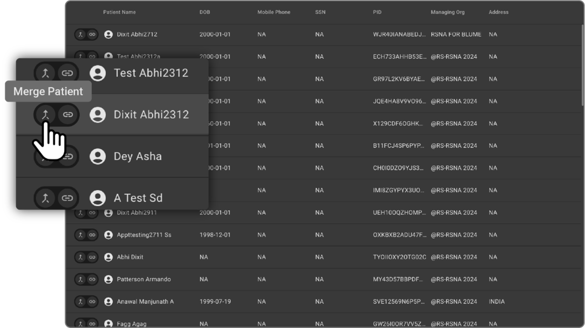

- Each patient record displays Link and Merge icon

- Click on the **Merge** button to open the **Merge Patient** drawer with the
  two patient records. The first one is the current patient record, and 
  the second one is the searched patient record.

  - If information between the two patient records differ, a red colour icon will appear on the corresponding field name while the field value will be highlighted in red.

  - If any of the info between the two patient records are same, then they
  would be indicated in White color.

  - Users should carefully analyze all the fields which are similar and
  different between the two records. Users should ensure that they are
  merging the same patients two different records.

  - The **Merge Patient** side drawer consists of the close button at the top, **Merge** and **CANCEL** at the bottom.

  - On click of close button or **CANCEL** button, the **Merge Patient** side drawer is dismissed.

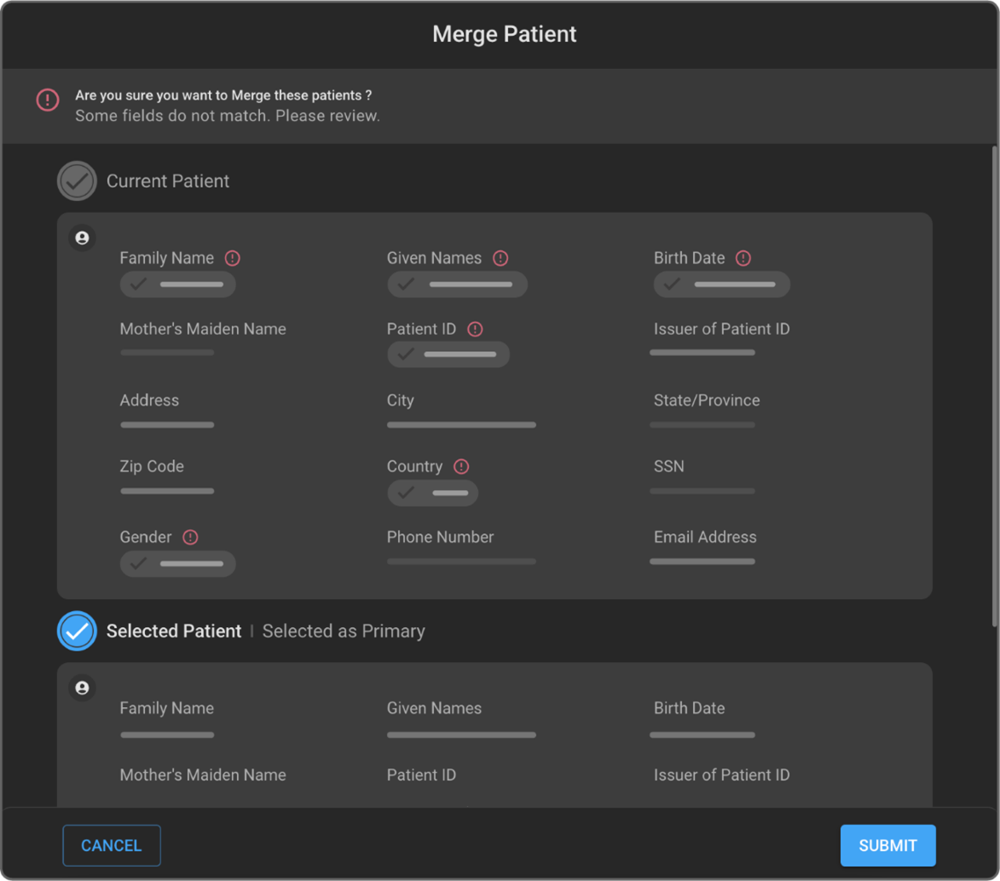

- User must choose the primary record between the patient records which
  they want to retain.

- Once they are done with the primary record selection, they would have
  the option to choose the values from the secondary record which they
  want to override on the primary patient record. 

- User has the option to retain either primary patient&aposs record as
  is or they can choose to override some of the values from the secondary
  patient record. 

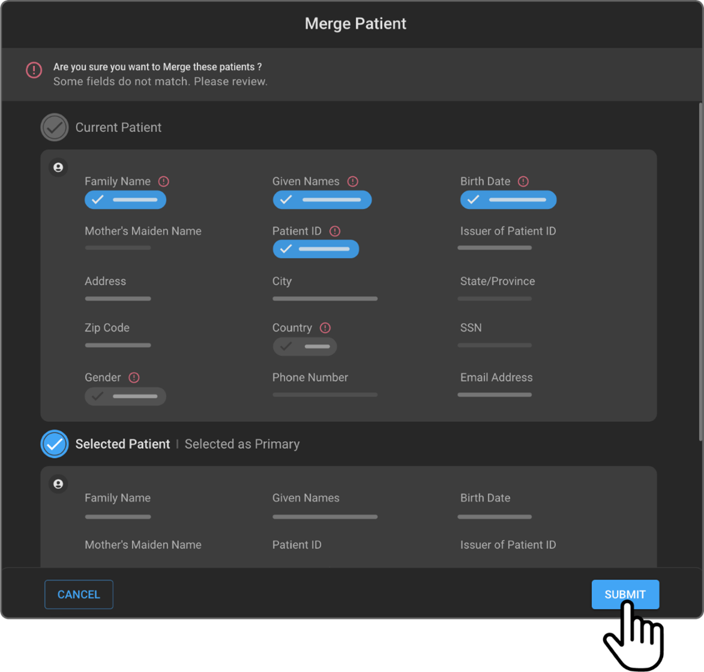

- When the user clicks on the Merge button, both the patient records are
  merged, and the updated details are shown on the patient info page
  along with the Patient merge success toast message.

- Patient Merge process if successful, cannot be undone.

## Linking & Merging of patients from the Worklist

Linking and Merging of patients can be done directly from the worklist.
If you select two patient records that belong to the same managing
organization, then the **Link** and **Merge** options will appear. Choosing the
**Link** or **Merge** will open the respective drawers with all the necessary
information. 

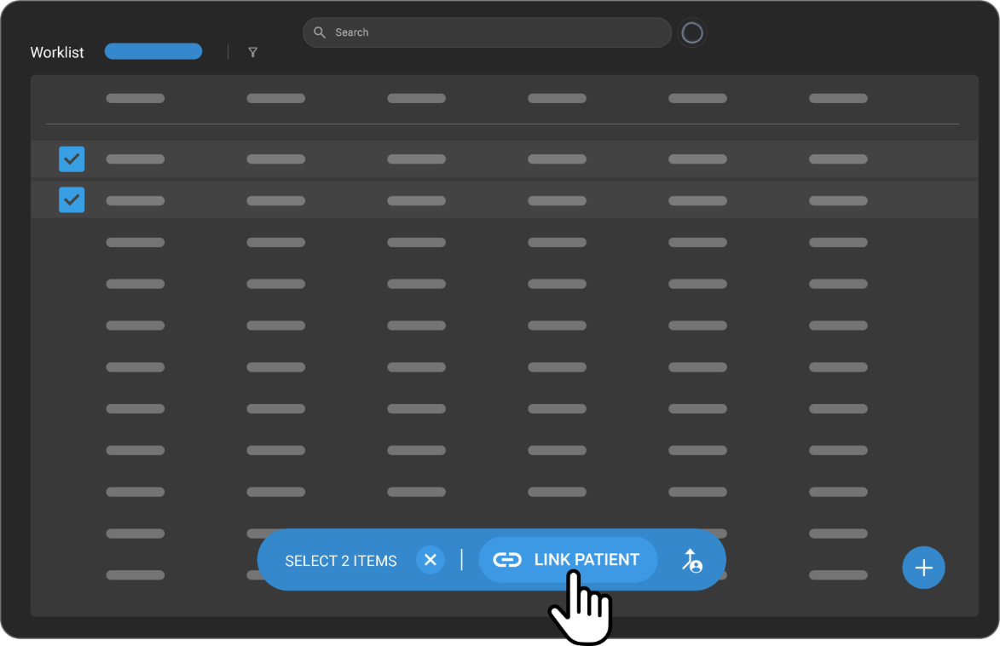