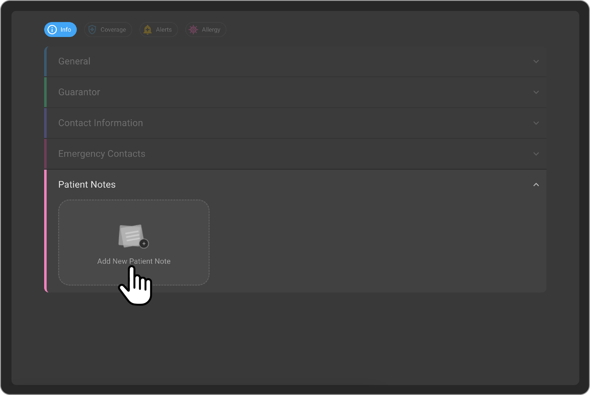
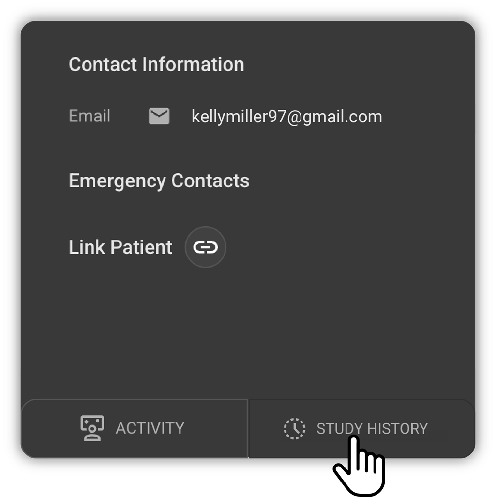

## Managing Patient Record

The Patient page is the primary page where the patients personal
details are stored. Lets see how to manage the patient record.

### Accessing the Patient Record

The patients page can be accessed from the worklist by clicking on the
wheel icon and then clicking on the Patient icon.

This is how the Patient page would be visible with all the patient
details.

### Patients General Information

The Patients General information is loaded by default when the patient
page is opened.

The Users would be able to View/Add/Edit the following information as
part of the General section

- Family Name

- Given Name

- Prefix

- Suffix

- SSN

- Patient ID

- Drivers License 

- Birth Date

- Gender

- Birth Sex

- Mothers Family Name

- Mothers Given Name

- Fathers Family Name

- Father's Given Name

- Marital Status

- Confidentiality

- Deceased Date

- Ethnicity

- Language

- Race

**Review/Edit Patient General information**

- Hovering over each field will enable in-line editing for that field.

- Users would be able to update the information of each field by
  clicking on each of them.

- Once they have updated the information, they can click the Save
  button appearing on the right-hand side of the General section.

- If the user wants to discard the changes made, they can click the
  Cancel button appearing on the right hand side of the General
  section.

### Patients Guarantor Information

A guarantor is a person who agrees to repay a patient's medical bills if
the patient cannot pay. They are responsible for ensuring that the debt
is paid. This is often required when the patient is underage,
financially unstable, or has a history of not paying their bills. The
guarantor is usually a close relative or friend of the patient who has a
stable financial situation.

In OAI, by default the patient themself are the Guarantor unless and
until it is changed to some other person.

**Review/Edit Guarantor for patient**

- Go to Patient record from home page.

- Expand the Guarantor section to view the Guarantor details of the
  Patient.

- The Guarantor is a patient record within the OAI system. The
  Guarantors Name, Email, Phone, Address and Relationship details would
  be displayed on the screen.

- When you hover over the Guarantor card, if the Guarantor's relationship to the patient is not 'Self,' you will have the option to open the Guarantor record in a new tab.

- When you hover over the Guarantor card, the Edit pencil icon will appear.

- Clicking the Edit pencil icon will open the Edit Guarantor side drawer.

- Make necessary changes by selecting the Relationship to the patient and search for the Guarantor's name.

- Once the Guarantor is added, Click on Update and the Guarantor record is updated.

- If the Guarantor is not present in OAI, then the Guarantor record must be created in OAI.

- Click on Add New to create a patient record for the Guarantor.

- Once the new Guarantor record is created in OAI, then the user should
  be able to select the relationship and click on update to save the
  Guarantor record.

### Patients Contact and Address Information

- Go to Patient record from home page.

- Expand the Contact information section to view the Contact and Address
  information details of the Patient.

The Users would be able to View/Add/Edit the following information as
part of the Contact information section.

- Email ID (Multiple)

- Phone Number (Multiple)

- Address

**Review/Edit Patient Contact information**

- On hover of each field, the in-line edit for each of the fields would
  be enabled.

- Users would be able to update the information of each field by
  clicking on each of them.

- Once they have updated the information, they can click the Save
  button appearing on the right-hand side of the Contact information
  section.

- If the user wants to discard the changes made, they can click the
  Cancel button appearing on the right-hand side of the Contact
  information section.

### Patients Emergency Contact Details

- Go to Patient record from home page.

- Expand the Emergency Contact section to view the Emergency Contact
  details of the Patient.

- Users would be able to View/Add/Edit the emergency contact details
  from the Emergency contact details section.

- When the user clicks on the Add Emergency contact button, the Side
  drawer will open.

- Enter the Emergency contacts Family Name, Given Name, Phone Number
  and Email address (Optional field) and save the information.

- Once all the information is added, click on the Save button. The
  Emergency contact details will be saved.

- If you want to Edit or Delete the emergency contact information, hover
  on the emergency contact card.

- You will get Pencil/Trash icon.

- On Click of the Edit button, the Edit Emergency contact details side
  drawer will open.

- Make necessary changes and save the information.

- On click of the Delete button, the emergency contact detail
  information would be deleted.

### Patients Notes

- Go to Patient record from home page.

- Expand the Notes section to view the Notes details of the Patient.

- Users would be able to View/Add/Edit/Delete the notes from the Patient
  Notes section.

- When the user clicks on the Add New Patient Note button, a small card
  to enter the Notes details will open.

- Enter the Notes information to be added as part of the Patient.

- Once all the information is added, click on the Tick mark button to
  Save the Notes information.

- Click on the Close button would discard the changes.

- If you want to Edit or Delete the Patient Notes information, hover on
  the Notes card.

- You will get Pencil/Trash icon.

- On Click of the Edit button, the Notes card will open in the Edit mode.

- Make necessary changes and save the information.

- Once all the information is added, click on the Tick mark button to
  Save the Notes information.

- Click on the Close button would discard the changes.

- On click of the Delete button, the Notes information would be deleted.

### Patients Coverage information

- Patients coverage information can be added from the Patient page,
  Coverage section.

- On Click of the + button, Add New Coverage drawer will open.

- While entering the Payer Name, User would be able to search and select
  from the list of payers which are added to the organization.

- Set the Coverage status from the top of the Add coverage page.

- Fill in the patients coverage details including the Payer Name,
  Coverage Effective date range.

- By default, the Member relationship to the patient is selected as
  Self and the Member Name is prepopulated with the Patients Name.

- User can change the Member relationship to the patient by clicking the
  drop down and select the appropriate relationship.

- Make necessary changes by selecting the Relationship to the patient
  and Search for the Member name.

- Once the Member is selected, the Member name field would populated
  with the selected record.

- If the Member is not present in OAI, then the Member record must be
  created in OAI.

- Click on Add New to create a patient record for the Member.

- Once the new Member record is created in OAI, then the user should be
  able to select the relationship and populate the newly created Member
  record.

- Enter the Member ID and Group Number details.

- User can select the Employer name by doing a Search for the Employer
  name from the list.

- If the Employer Name is not present in OAI, then the Employer record
  can be created in OAI.

- Click on Add New to create an Employer record for the Member.

- Once the new Employer record is created in OAI, then the user should
  be able to select the same and populate the newly created Employer
  record.

- User can optionally add the Members Insurance card image.

- Once the user is done with adding all the details, on click on the
  Save button, the coverage information would be saved.

### Add Alerts for a Patient

- Patients Alert information can be added from the Patient page, Alerts
  section.

- On Click of the + button, Add New Patient Alert drawer will open.

- Users would be able to enter the Alert description, Alert start and
  end date, Notes about the alert and the role for which the alert must
  be displayed.

- After entering all the details, on click of the Save button, the alert
  will be saved and displayed on the page.

- On Click of the Alert, the Edit patient alert side drawer will open
  where the alert details can be edited. After editing all the details
  and on click of the Save button, the edited alert details will be
  saved.

- On hover of the Alert card, the Delete icon will be visible. On click
  of the Delete button, the alert will be deleted.

### Display of the Patient Alerts

- The Patient Alerts would be displayed for the users whose role has
  been mentioned while creating the specific alert for a patient.

- The Patient Alert will be displayed on the Order Page, Study Page,
  Image Viewer, Document Viewer and the Study History pages.

### Add Allergy for a Patient

- Patients Allergy information can be added from the Patient page,
  Allergy section.

- On Click of the + button, Add New Allergy drawer will open.

- Users would be able to enter the patient's Allergy information by
  searching the Offending Agent or the Offending Agent Drug code.

- Users would be able to fill in the other details such as **Reaction Type**, **Start Date**, **Severity**, **Reaction Description**, **Recorded Date**, **Notes**.

- After entering all the details, on click of the Save button, the
  allergy information will be saved and displayed on the page.

- On Click of the Allergy card, the Edit Allergy side drawer will open
  where the allergy details can be edited. After editing all the details
  and on click of the Save button, the edited allergy details will be
  saved.

- On hover of the Allergy card, the Delete icon will be visible. On
  click of the Delete button, the allergy card will be deleted.

### Patient Activity

- Go to Patient record from home page.

- Click on the Activity Icon on the bottom of the left panel on the
  Patient page.

- User would be landing on the Patient Activity page where the Patient
  Activities such as Notes and Phone call records can be
  Added/Viewed/Edited.

- Users would be able to View/Add/Edit/Delete the notes from the Patient
  Notes section.

- When the user clicks on the + button, User would have the option to
  Add a Phone Call record or Note record.

- When the user selects to add a phone call record, they would be able
  choose the type of call as Inbound/Outbound/Voicemail/No answer and
  add a comment to it.

- When the user selects to add a note record, they would be able to add
  a comment to it.

- When the user clicks on the Edit icon, the user would be able to
  update the comment for each of the Activity records. After updating
  the activity record, user can click the Save button to save the
  changes or Cancel button to discard the changes.

### Study History

- Go to Patient record from home page.

- Click on the Study History Icon on the bottom of the left panel on the
  Patient page.

- User would be landing on the Study History page where the PatientΓÇÖs
  prior study details would be displayed.

- Users would be able to View the prior studies and their Forms, Final
  Images and Reports.

- When the user hovers over the prior study record, users would be able
  to see two icons.

- When the user clicks on Final Images and Report icon, it will open the
  preview pane on the right-hand side to show the Reports and Images.

- When the user clicks on Forms icon, it will open the Forms preview
  page and list of all the forms available as part of the Study.

### Patient Card

- Go to Patient record from home page.

- On the top left you would see the Patient card which has the following
  information of the patient wherever it is available.

  - DOB and Current Age

  - Gender

  - Drinking Habit details if available

  - Smoking Habit details if available

  - Pregnant or not information

  - BMI Value

  - Height

  - Weight

  - Heart Rate

  - Blood Pressure Value

