# Modality Worklist 

## **Introduction to Modality Worklist (MWL)**

A **Modality Worklist (MWL)** is a digital interface that connects imaging modalities (like CT, MRI, and X-ray machines) with scheduling systems (such as RIS). It provides a real-time list of scheduled imaging studies, ensuring that the right patient receives the right scan at the right time.

## Key Benefits

- Eliminates manual data entry
- Reduces patient misidentification
- Enhances workflow efficiency
- Improves patient safety

**Each entry in the MWL typically includes:**

- Patient demographics (Name, ID, DOB, etc.)
- Scheduled scan details (Modality, time, study type)
- Procedure metadata (Referring physician, Accession ID, etc.)

## **Why is Modality Worklist Important?**

MWL plays a critical role in radiology workflows by:

- Streamlining communication between scheduling systems (like RIS/HIS) and imaging modalities
- Preventing mismatches between patients and imaging studies
- Reducing manual data entry errors
- Enhancing patient safety by ensuring the right scan is performed on the right patient

In healthcare, accuracy is critical. A wrong scan or misidentification can lead to an incorrect diagnosis and treatment. MWL helps eliminate that risk.

## **Understanding the OmegaAI Workflow with MWL**

  **Organizational Hierarchy:**

- Managing Organization: Controls patient records and study statuses.
- Imaging Organizations: Branches or centres with imaging modalities (stations).
- Stations (Modalities): Devices like CT, MRI, etc. that receive MWL entries.

Let’s take an example to understand how MWL works in **OmegaAI**.

**Example:ABC Hospitals Network**

- **Managing Organization**: ABC Hospital
- **Imaging Organizations**:
  - ABC-1 (5 modalities/stations)
  - ABC-2 (10 stations)
  - ABC-3 (2 stations)

In OmegaAI:

- The **Managing Organization** (ABC Hospital) manages the **patients and study statuses**.
- Each **Imaging Organization** manages **stations (modalities)** and receives the study list for execution.
- These stations use MWL to display the relevant studies to technicians for scanning.

## **Study Status in MWL: Filtering and Workflow Tracking**

Study Status helps in tracking the **exact stage** of a patient’s scan journey. Organizations can customize these stages based on their workflow preferences.

Common statuses:

- **Scheduled**: Study is ready to be performed
- **Ready for Scan**
- **Completed**
- **Patient Due for Schedule**: Custom status indicating the patient is ready to be scheduled for a study

Technicians apply **MWL Study Status filters** to:

- View studies that are **scheduled** or **pending**
- Scan patients in a **sequential and organized** way
- Avoid missing or duplicating exams
- To enable real-time tracking of study progress

**Tip**: The statuses are defined at the **Managing Organization** level and passed down to imaging centres.

## **Step-by-Step Guide: Managing Devices & Stations in OmegaAI**

### A. Login and Navigate

1. Log in to OmegaAI using your credentials.
2. Select your **Managing Organization**.

 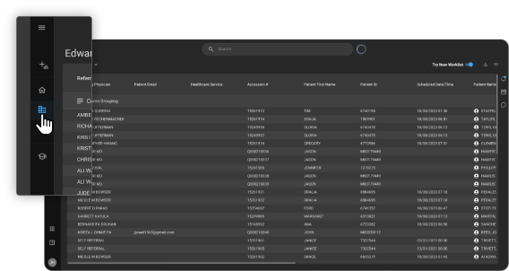

3. Click the **details icon** in the bottom-right corner of the org card.

 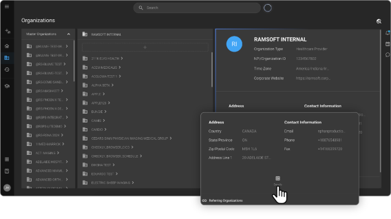

4. From the left-side menu, select **Devices**.

 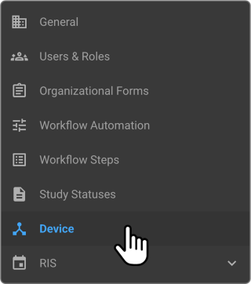

### B. Add or Edit Devices

1. Click the **“+” (plus)** icon to **add a new device**.

 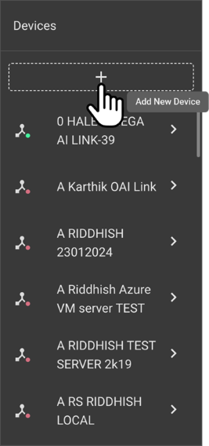

2. Enter the required information (AE Title, IP address, etc.)

 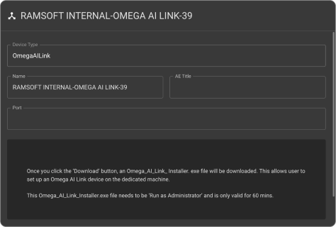

3. Click **Save**.

### C. Add or Edit Stations

1. Inside the selected device, go to the **Stations section**.

 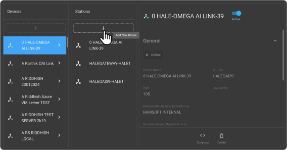

2. Click the **“+” icon** at the top to **add a new station**.
3. Fill in station details like name, modality type, etc.

 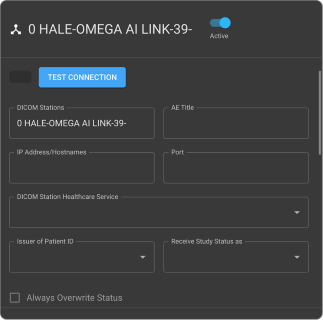

4. Click the **pen icon** to edit an existing station.

 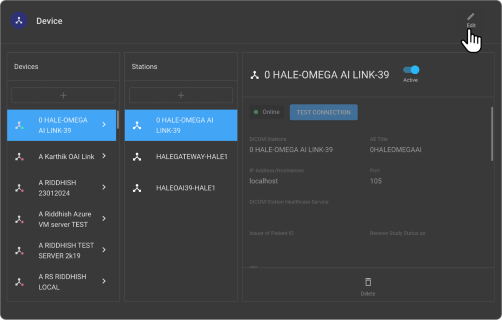

5. Use the **delete button** to remove a station if needed.
6. Toggle the **Active/Inactive switch** to control availability.

 

## **Step-by-Step Guide: Using Modality Worklist (MWL)**

### A. Access MWL

1. Navigate to the **Modality Worklist** tab.
2. Select the **Imaging Organization** you want to view.

 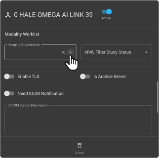

### B. Apply Study Status Filter

1. Use the **MWL Filter - Study Status** dropdown.

 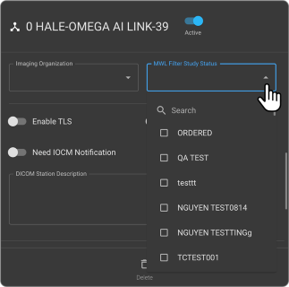

2. Select a status like **Scheduled** or **Ready for Scan**.

 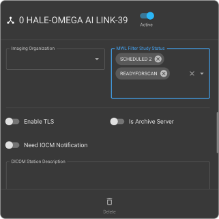

3. The worklist updates to show matching studies.

### C. Perform Study Validation

1. The technician matches the patient ID and name from the MWL with the patient's ID card.
2. Once verified, the scan can begin.
3. Upon scan completion, the study status updates (e.g., to **Completed**).

## **Summary**

|**Feature**|**Purpose**|
| :- | :- |
|**MWL**|List of scheduled studies available to imaging modalities|
|**Study Status**|Tracks the stage of a study (e.g., Scheduled, Completed)|
|**Filters**|Used by technicians to organize and streamline the scan workflow|
