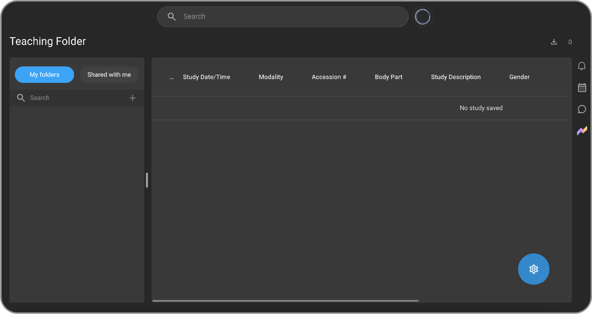
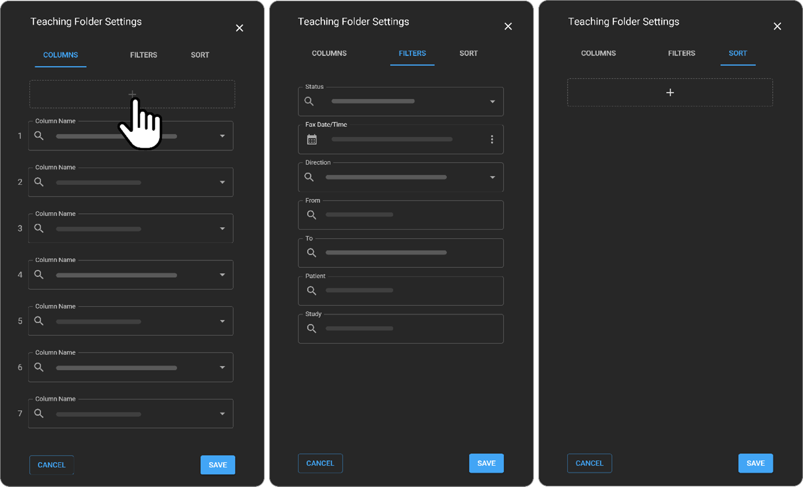

# Teaching Folder

## Overview

Teaching Folder is designed for professionals in the healthcare and
academic space, particularly radiologists and doctors. It enables users
to create and manage folders and subfolders to curate and share studies
(i.e. these will not be copies, but the original studies) for
teaching/training, and organizational purposes.

### How to Manage Teaching Folders

**Access Teaching Folder**

1.  From the left side navigation bar, select the **Teaching Folder**
    icon (graduation hat).

    

You will now be directed to the **Teaching Folder** screen (below is a
visual of the default screen).

    

**Teaching Folder Components and Functionalities**

**My folders**

The **My folders** section is used to add and modify your teaching
folders.

**Note**: This is a private folder, only the user has access to it. 

**Add a Master folder**

1.  Hover over the + icon (it will read, **Add Folder**), click.

    

2.  Enter the folder name.

    

3.  Press enter or click the check mark (by default it is grey, as soon
    as the folder name is filled it will turn blue) to save the name.
    Once it is saved the check mark will disappear.

**Add a Subfolder**

1.  Hover over the master folder, Main, and click the + icon to add a
    subfolder.

    

2.  Enter the subfolder name, and press enter or click the check mark to
    save it.

    

**Add a Study to a Teaching Folder**

1.  Click the Home icon to navigate to the Worklist.

2.  Via the Worklist, hover over the left side of the study you wish to
    add to the Teaching Folder and click the empty box.

A blue check mark will appear as well as the blue Worklist menu (at the
bottom of the Worklist page).

    

3.  Hover over the graduation hat (it reads, Add to Teaching Folder) and
    click it to add the selected study to the Teaching Folder.

4.  The Teaching Folder panel will open on the left of the Worklist. You
    can create a new master/subfolder or click an existing folder and
    click SAVE to save the selected study.

    

Once saved, a confirmation message will appear in the bottom left-hand
corner of the screen.

Once you navigate back to the Teaching Folder screen, the study will
appear in your selected folder (the number in the brackets indicates how
many studies are stored within the respective folder) and via the
Teaching Folder Worklist.

 

**Collapse Folders**

5.  In the case that you have an array of master folders and subfolders
    you can collapse a folder that you are not using and view only the
    folder(s) you are analyzing at the respective time.

To do so, click the upside-down arrow beside the master or subfolder you
would like to collapse. Below you will see subfolders B and C
collapsed.

**Edit Folder Name**

1.  Hover over the master or subfolder you wish to rename and click the
    pencil **Edit** icon.

2.  Enter the folder name and press enter or click the check mark to
    save the new name.

**Delete a Folder**

1.  Hover over the master or subfolder you wish to delete and press and
    hold down on the trash icon until the grey circle turns completely
    blue. Release finger off mouse. The folder will now no longer exist.

    

**Teaching Folder Study Management**

The **Teaching Folder Study Management** section is used to view,
remove, and track studies as well as manage settings.

**View Studies**

Studies that have been added to the **Teaching Folder** panel will
appear in the **Teaching**

**Folder Study Management**

**Remove Studies**

1.  To remove a study from a folder/**Teaching Folder Study
    Management**, select the folder that holds the respective study and
    hover over the study in the worklist. Click the empty box.

 A blue check mark and the blue Worklist menu will appear.

    

2.  Click the - icon from the Worklist menu.

**Important Note**: The study will disappear from the Teaching Folder
yet will still be available in the OmegaAI homepage Worklist.

**Access the Omega Dial via the Teaching Folder Worklist**

1.  Click once on the desired study, the Omega Dial will appear then
    click on respective icon to navigate to desired section.

    

**Note**: to access the Image Viewer without having to summon the Omega
Dial, click twice on the study. You will be directed to the Image Viewer
screen.

**Edit Columns via the Teaching Folder Worklist**

1.  Hover over the column field you wish to edit and follow the
    prompts.

    

2.  To reorder the columns directly from the Worklist, hover over the
    column field you wish to swap and drag and drop it accordingly.

    

**Manage Teaching Folder Worklist Settings**

1.  Click the blue Settings icon found in the bottom right-hand corner
    of the Teaching Folder Worklist.

    

The Teaching Folder Settings panel opens on the right-hand side.

    

2.  Customize existing columns via the dropdown menu accessible by the
    upside-down white arrow next to the **Column Name** field.

Once you click the arrow, a dropdown with column options will appear.
Select the one you wish to add to your **Teaching Folder Worklist**.

3.  To add a new column, click the + icon and enter the column field
    details via the dropdown or via direct text.

     

4.  To delete a **Column Name**, hover over the respective field and
    click the trash icon (reads, **Remove**).

      

5.  To change the order in which the Column names will appear in the
    Teaching Folder Worklist, hover over the Column Name field you wish
    to reorder, an icon with 6 dots will appear. Drag and drop the field
    to desired place.

     

6.  Click **SAVE** to save changes or **CANCEL** to discard.

7.  To edit filters, click the **FILTERS** section.

     

**Note**: The same editing logic applies as for the COLUMNS section (as
per steps 2-4, and 6).

8.  To apply sorting logic to the **Teaching Folder Worklist Column
    Names**, click the **SORT** section.

**Note**: The same editing logic applies as for the **COLUMNS** section
(as per steps 2-4, and 6)

    

9.  Click the down arrow icon (i.e. decending order) to change from
    decending order to acending order (upward arrow).  

    

**Shared with me**

The **Shared with me** section is used to keep track of folders that
other users have shared with you. A list with all the shared folders
will appear within the **Shared with me** panel.

**Share Teaching Folders with Users (Contacts) & Organizations**

Users can share master folders or individual subfolders with users and
organizations via the Share button.

**Sharing Folders with Contacts**

1.  Select the folder you want to share by clicking on it from the left
    panel.

2.  Click the **Share** button. The **Share** panel will appear on the
    right side of the screen.

    

3.  The Contact section will be selected by default. To share with a
    contact, click the + icon.

The **Share to contact** panel will appear.

4.  In the **Shared User\*** field, search for your contact by entering
    their user name, email and dropdown will appear, select your desired
    contact.

    

5.  Via the **Access** field you can choose what permissions you allow
    the user to have when accessing your shared folder(s). Select **Can
    view** or **Can edit**.

**Note**: **Can edit** access allows users to add or remove studies and
share the folder(s) with other users. While **Can view** only enables
recipients to view the folder(s).

    

6.  Click **SHARE** to share the folder, or **CANCEL** to discard
    changes.

**Sharing Folders with Orgaizations**

1.  Click **Organization** from the **Share** panel.

2.  Click the + icon. The **Share** to organization panel appears.

     

3.  In the **Shared Organization\*** field, search for the desired
    organization by typing its name (there is a search as you type
    functionality, thus you can select from the dropdown).

    

4.  In the Access\* field you will see there is only 1 permission
    available, **Can view**. As Organization-wide access is view-only by
    default. To grant edit access, users must be individually selected
    and given permissions.

    

5.  Click **SHARE** to share the folder, or **CANCEL** to discard
    changes.

**Other Functionalities**

Teaching Folder retains all the functionalities of the worklist,
including exporting, study count, and applying filters.

**Note:**

- When a folder is shared, all its subfolders are also shared.

- The studies saved in the folders are not duplicates; they are
  references to the studies on the main worklist. Any changes made to a
  study in the main worklist will reflect in the teaching folder.

- Once permissions (**Can view** or **Can edit**) are granted, they do
  not expire or have a time limit. They can be changed or revoked by the
  user who shared the folder.
