 
 # Actions

Once a trigger and conditions are met, actions define what happens next. Actions are system responses performed when the defined conditions within a workflow are satisfied. The system dynamically offers only relevant actions based on the selected trigger and conditions.

 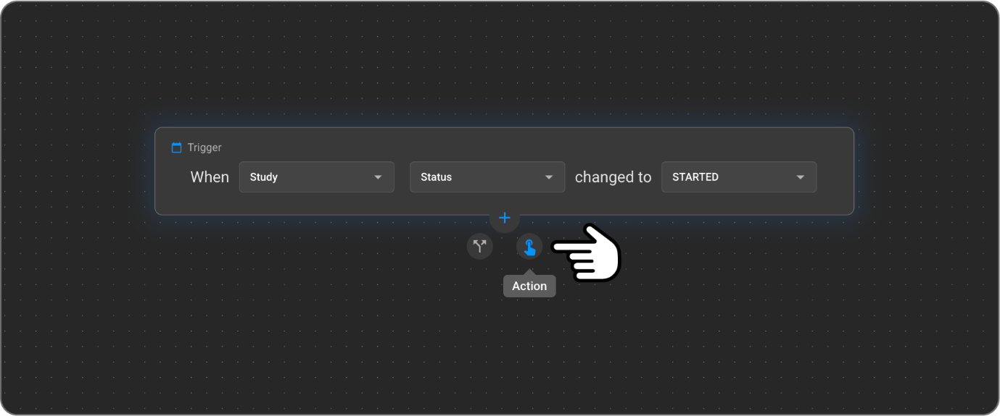

**Types of Actions and Detailed Examples:**

**1. Change Study:** Update various attributes of a study.

 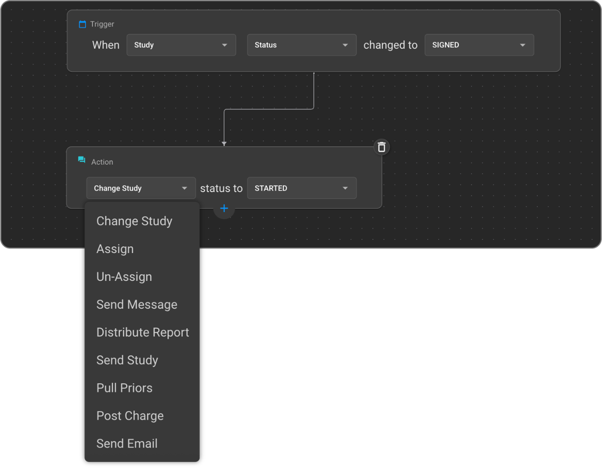

- **Description:** Allows modification of Status, Modality, Body Part, Reason for Exam, or Study Description. Users can choose from predefined lists or enter free text (for description).

**Example:** Automatically change the study status to "Ready for Review" once all images have been uploaded and basic patient information is confirmed.

**2. Send Message:** This step enables the system to deliver timely and personalized notifications to patients or care teams through multiple communication channels.

**Functionality Overview:**
Messages can be sent via:

a. **SMS**
b. **Email**
c. **Blume Notification**

The system supports **dynamic parameter tagging**, allowing automatic insertion of personalized data such as:

- **Patient Name**
- **Study ID**
- **Study Status**
- **Appointment Date/Time**

**How It Works:**

- Users can compose free-text messages using placeholders (e.g., Patient Name, Study ID).
- The system automatically retrieves the patient’s contact details from the study record.
- Messages are dispatched based on predefined triggers or workflow events.

 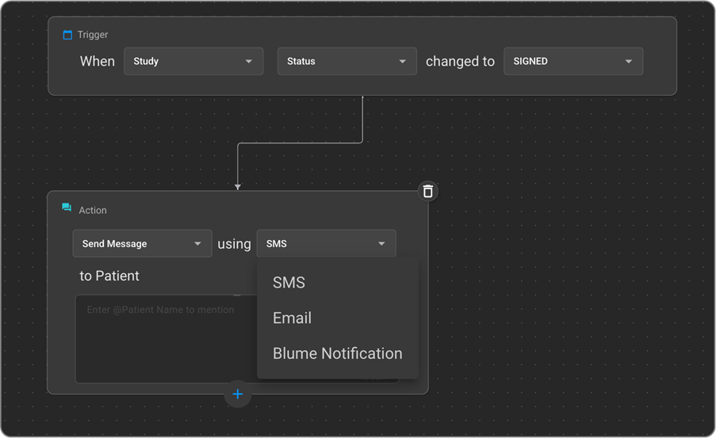

**Example:** When a study status is updated to **"Signed"**, the system automatically sends an SMS to the patient:
  **"Your study report for [Patient Name] is now complete and available."**

 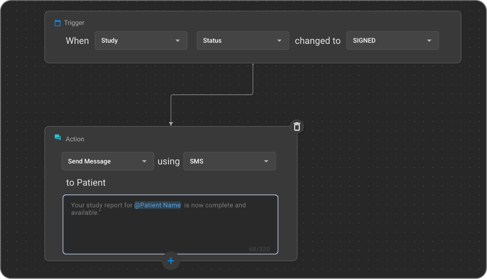

**3. Send SMS:** Choose specific recipients such as Reading Physician, Scheduler, or Front Desk.

**Example:** Send an SMS to the assigned "Scheduler" if a patient's appointment status changes to "No Show" to initiate follow-up.

**4. Send Notification:** Send internal system notifications to users, configurable by type and message content. These appear in the system's message center.

**Example:** Send an internal notification to the "QA Team" when a study's status changes to "Verified" to prompt their final review.

**5. Send Email:** This step enables the system to send personalized email notifications to individuals or organizations involved in the study workflow, ensuring timely communication and task coordination.

**Functionality Overview:**
Emails can be sent to a wide range of recipients, including: 

a. **Reading Physician**

b. **Performing Physician**

c. **Performing Technologist**

d. **Transcriptionist**

e. **Scheduler / Front Desk**

f. **Assigned Roles**:  
  - Reading / Referring / Performing Physician
  - Performing Technologist
  - Transcriptionist
  - Consulting Physician
  - Shared Player
  - Front Desk / Scheduler
  - Referring Organization(s)
  - **Specific User(s)** (manually selected)

 

**How It Works:**

- Users can create custom email templates using dynamic placeholders (e.g., Patient Name, Study ID, Report Link).
- The system automatically identifies and populates recipient details based on study assignments.
- Emails are triggered by specific workflow events (e.g., study status change, report finalization).

**Note:**
In the **Note Box** below the action options, users can insert dynamic tags to further personalize messages.

 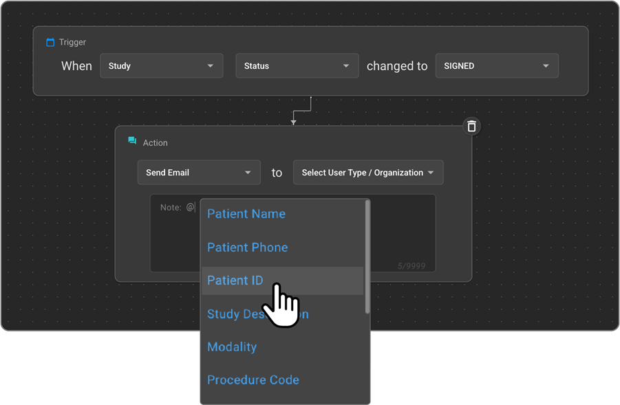

  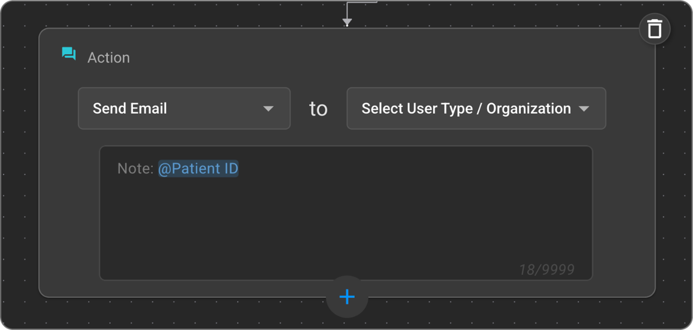

The following fields are available for tagging:

- **Patient Name**
- **Patient Phone Number**
- **Patient ID**
- **Study Description**
- **Modality**
- **Procedure Code**
- **Appointment Date and Time**
- **Service Address**
- **Accession Number**
- **Referring Physician**
- **Referring Organization**

These tags are automatically populated by the system at runtime, ensuring accurate and context-specific communication.

**Example:** When a study is finalized and marked as **"Signed"**, the system automatically sends an email to the **Referring Physician** with a secure link to access the completed report.

**6. Assign / Unassign:** This step allows users or the system to assign or unassign specific roles within a study or task, ensuring the right personnel are engaged at the appropriate stage of the workflow.

 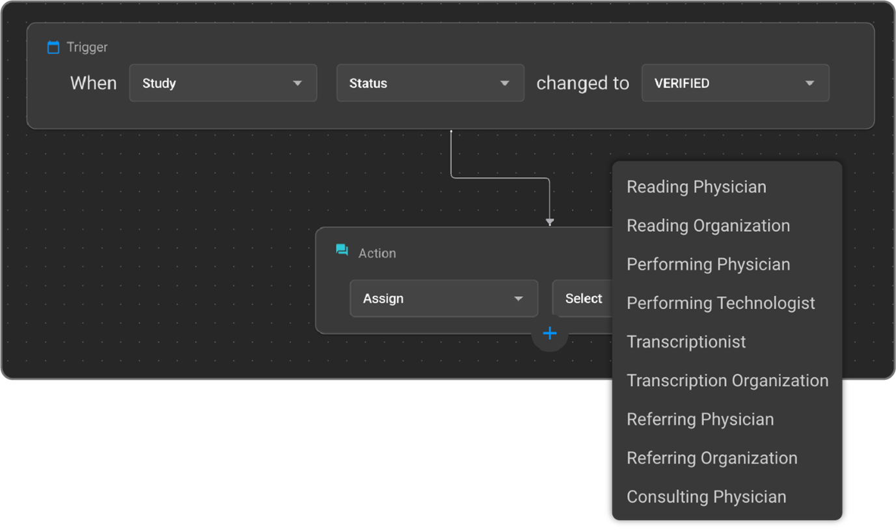

  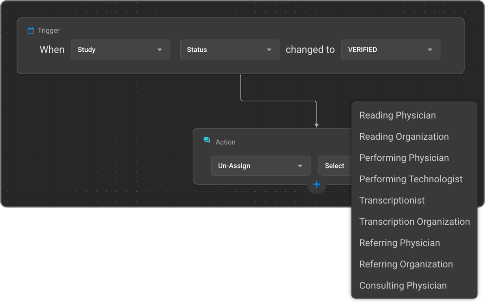

**Functionality Overview:**
Roles that can be assigned or unassigned include:

a. **Reading Physician**

b. **Reading Organization**

c. **Performing Physician**

d. **Performing Technologist**

e. **Transcriptionist**

f. **Transcription Organization**

g. **Referring Physician**

h. **Referring Organization**

i. **Consulting Physician**

**Example:** When a study status changes to **"Verified"**, the system automatically **unassigns** the previously assigned **Performing Physician** and **assigns** a **Transcriptionist** to begin the dictation process

**7. Distribute Report:** This step automates the delivery of finalized study reports to designated recipients, ensuring timely and secure communication. **Functionality Overview:**

- **Delivery Methods:**
  - **Email**
  - **Fax**
- **Trigger Condition:**
  Reports are only distributed when their status is **"Final".**
- **Delay Configuration:**
  A customizable delay (e.g., 15 minutes after sign-off) can be set to allow for final checks or system processing before dispatch.

**Email Delivery Options:**

- Referring Physician
- Referring Organization
- Managing Organization
- Specific Email Address
- Patient Email

**Note**: *The report will be emailed as a secure attachment. To open the attachment, the recipient must enter a password, which is a combination of the **patient's date of birth** and **last name**.*

**Example:** If the patient’s date of birth is 01-Jan-1990 and the last name is Smith, the password will be: 01011990smith.

**Fax Delivery Options:**

- Referring Physician
- Referring Organization
- Managing Organization

**Note:** _Fax messages are sent to the fax numbers already stored in the system for the selected recipients._

 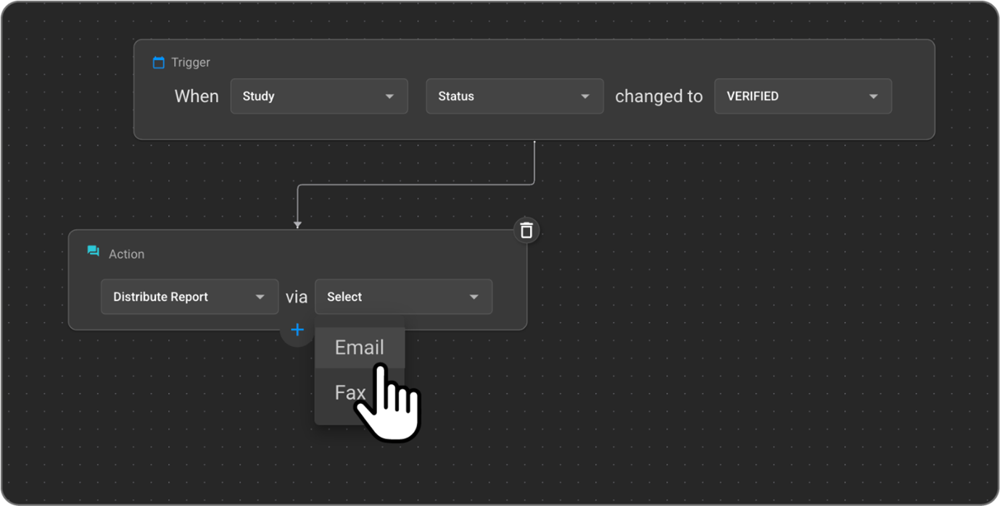

  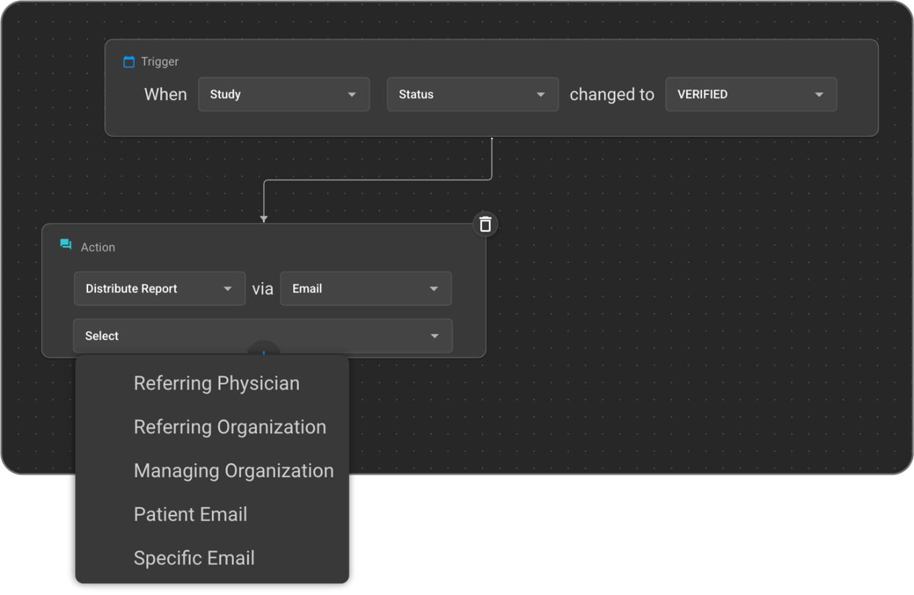

**Example:** Once a study is **verified and signed**, the system waits for **15 minutes**, then automatically **emails the final report** to the **Referring Physician** using the contact information on file.

**8. Study Report Sign-off:**

- Automates the signing-off process for study reports.  
- The Study Report Signoff action is a feature within the Workflow Automation (WFA) module in OmegaAI.  
- The Preliminary Report is converted into a Final Report, and the study status automatically changes to "SIGNED" when a Reading Physician or a Performing Physician signs the report.  
- As per the enhancement, it enables the system to automatically assign the reading physician when a report is signed, ensuring that the study record reflects the correct information.  
- This action applies only during the initial signoff of a study report.  

- **Description:** Used to automate the sign-off process after verification or QA approval.
  
**Example:** Automatically sign off on a study report once it has been verified by the QA team and all critical findings have been addressed.

When a user signs a study report:

- The system validates whether the user is authorized as a Reading MD or an Interpreting MD.
- If the user is authorized, the system automatically assigns this user as the Reading Physician for the study.
- Amendment Handling:
  
If a report is being amended after the initial signoff:
    - The system does not auto-assign or change the Reading Physician.
    - The action only applies to the initial signoff of a report.

**9. Send Study:** This step facilitates the transfer of imaging studies to another PACS or station within the network using **OmegaAI Link**, ensuring secure and configurable DICOM data exchange.

 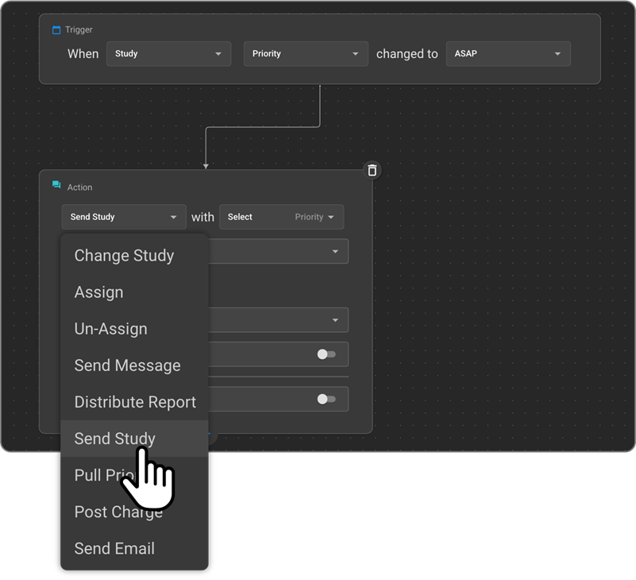

**10. Signed Report Trigger (Operation Trigger Type):**

- The Signed Report trigger is under the Operations Trigger Type in Workflow Automation (WFA).
- This trigger is especially used to automate actions such as report
distribution and notifications immediately after a diagnostic report is created, ensuring seamless and timely processing without delaying DICOM workflows.
- The trigger should function independently and should not interfere with existing Study Status SIGNED workflows. 
- Prevents delays in workflow automation due to asynchronous DICOM processing.

**Scope**

The Signed Report trigger applies to:

• Final Reports
• Signed Amendments

**Exclusions:**

Preliminary reports are not included.

**Trigger Activation Criteria:**

The Signed Report trigger is activated when any of the following events occur:

• A diagnostic report is uploaded as a final report via the Document Viewer (DV) GUI.  
• A final report is received in OmegaAI through HL7 bundle transaction ingestion.  
• A final structured Report is ingested via DICOM ingestion through OmegaAI Link.  
• A final report with DICOM tags is imported using the IMPORT GUI.  
• A final report is created or saved in OmegaAI’s Document Viewer (DV), including Signed Amendments (Done-Signoff).   

**User Interface Overview:**

- **Send Study Panel**
  This panel allows users to configure the study transfer with the following options:

  - **Key Fields and Options:**
  
- **Priority:**
  Select the urgency of the transfer:
  - High
  - Medium
  - Low

- **To (Organization):**
  Use the search field to select the destination organization (e.g., *HEALTH FIRST HEALTH PLANS*).
- **Via:**
  Choose the transfer method. Currently supported, **OmegaAI Link** (for DICOM transport).
- **To (Station):**
  Search and select the specific destination station within the chosen organization.
- **Anonymize Study:**
  Toggle this option to **remove PHI** (Protected Health Information) by randomizing patient and study identifiers.
- **Include Prior Studies:**
  Enable this to include previous studies in the transfer.
- **Prior Matching Model:**
  Optionally enable a model to automatically select relevant prior studies.
- **From (Archive):**
  Select the source archive and organization from which the study is being sent.

 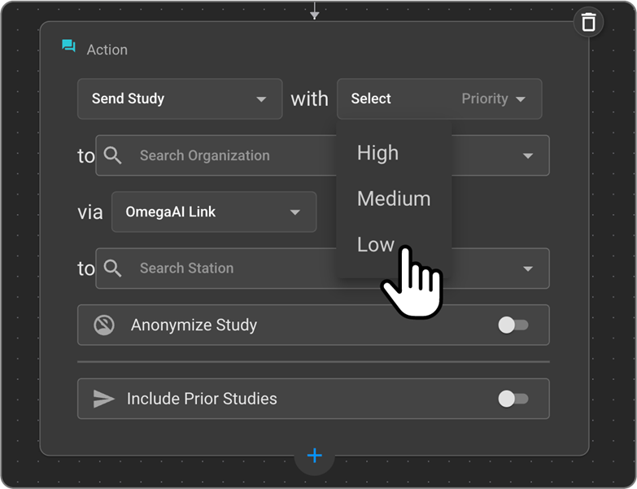

  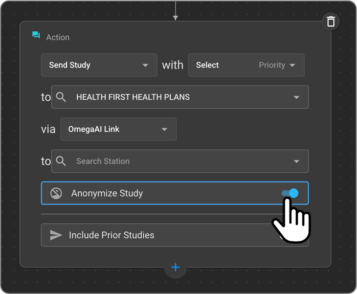

   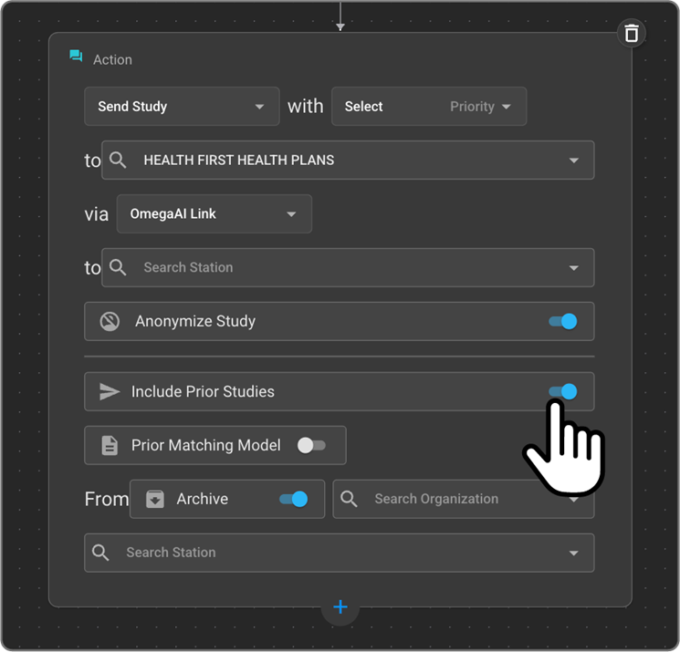

**Example:** When a study is marked as **"Signed"**, the system automatically:   

  - Sends the anonymized study
  
  - Includes **3 prior CT studies** from the past year
  
  - Transfers the data to **"XYZ Station"** at **"HEALTH FIRST HEALTH PLANS"**
  
  - Uses **OmegaAI Link** with **High** priority
  
 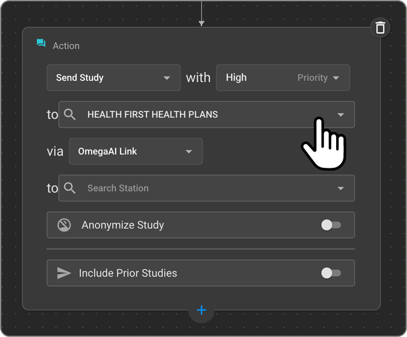

**10. Pull Priors:** To automatically retrieve relevant prior studies from selected PACS stations, ensuring radiologists have immediate access to historical imaging for accurate comparison and diagnosis.

  **Configuration Steps**

  _1. Add the “Pull Prior” Action_

- In the WFA rule editor, select the action: **Pull Prior**

 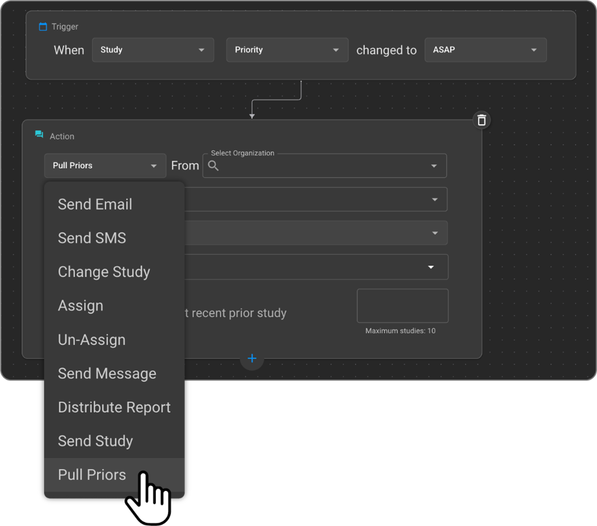

- This action fetches prior studies associated with the same patient from a specified organisation and PACS station.
  
  _2. Select Organisation and PACS Station_

- Use **Meta Search** to select:
  
  - **Organisation** (e.g., RamSoft Internal)
  
  - **PACS Station** (e.g., Radish)

 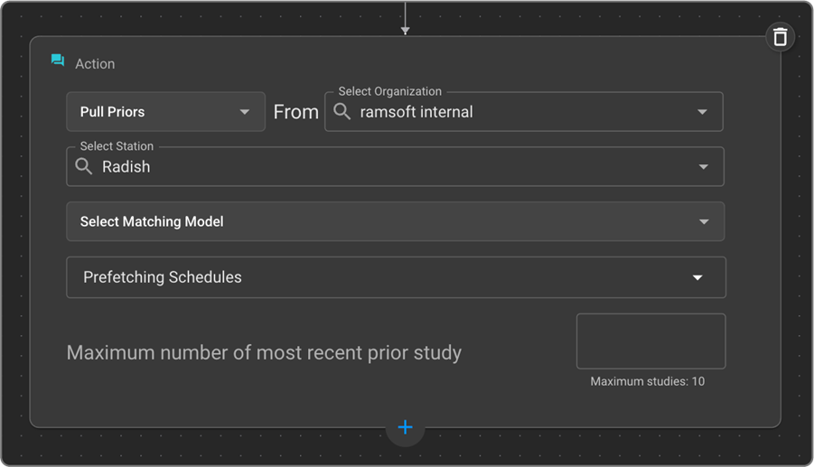

- *You can select multiple PACS stations simultaneously.*
  
  _3. Choose a Prior Matching Model_

- Click on the **Prior Matching Model** dropdown.

 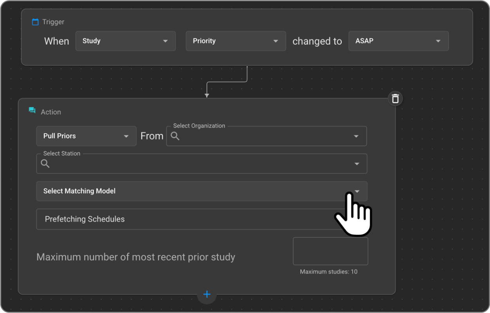
 
- You’ll be directed to a list of available models (e.g., 1 Year, CT Chest, etc.) on the left side of the screen.
- Select an existing model or click the **“+” icon** to create a new one.

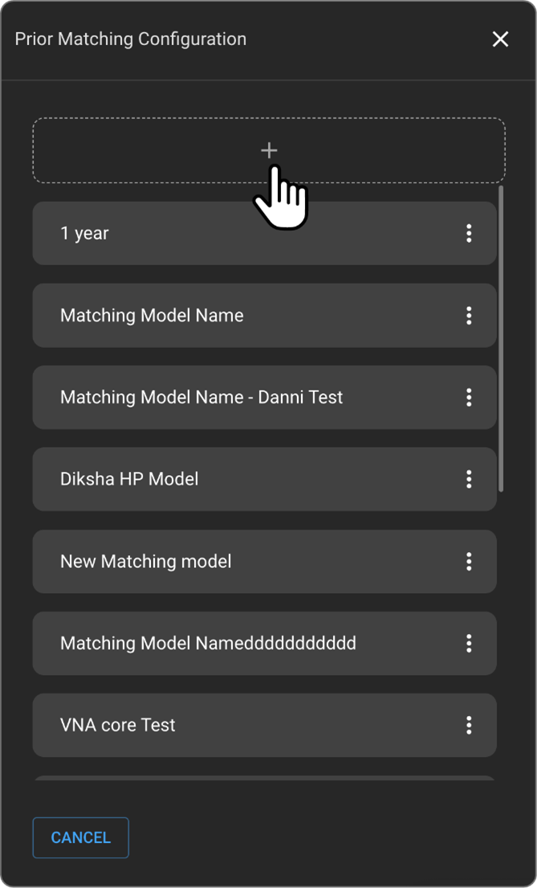

_4. Create or Customize a Prior Matching Model_

When creating a new model, you can define filters using the following fields:

|**Filter Type**|**Description**|
| :- | :- |
|**Body Part**|Click the box to populate options (e.g., Abdomen, Adrenal Gland, Brain, etc.)|
|**Study Date**|Filter by time range (e.g., studies from the last 6 or 12 months)|
|**Modality**|Click the box to select modalities (e.g., CT, CR, MRI)|
|**Study Status**|Filter by status (e.g., Verified, Completed)|
|**Study Description**|Add keywords like “Follow-up”, “Cancer Screening”, etc.|

- You can **customize each filter** by clicking on it individually.
- At the top, edit the **Query Model Name** to something descriptive like:
  - "CT Chest Priors Last 6M"
  - "MRI Brain Same Patient"

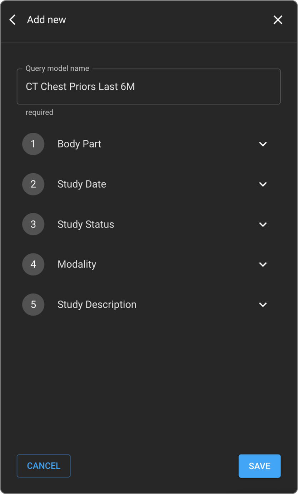

- After configuration, click **Save** to store the model or **Cancel** to discard changes.

**Note**: The Query Model defines the constraints for which prior studies will be fetched. It is fundamental to ensuring clinical relevance.

_5. Set Prefetching Schedule_

- **Default Option**: Prefetch relevant priors at any time
  - May increase system load.

- **Recommended Option**: Execute prefetching only in the time range from:
  - Once selected, define a **start and end time** (e.g., 6:00 AM – 10:00 PM)
  - Even if the action is triggered at any time, it will only execute during this time window.

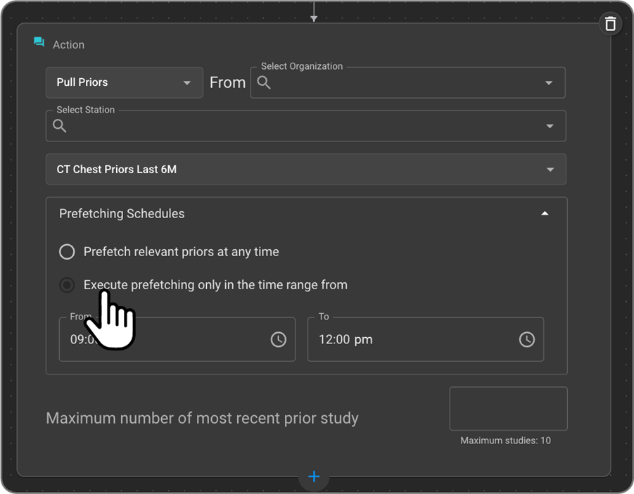

_6. Set Maximum Number of Prior Studies_

- Field: **Maximum number of most recent prior studies**
- **Default**: **10**
  - If left blank, the system pulls the latest 10 studies.
- You can enter a custom number (e.g., 5) to limit the number of studies pulled.

Example: If a patient has 30 prior studies and the limit is set to 5, only the **latest 5** will be fetched.

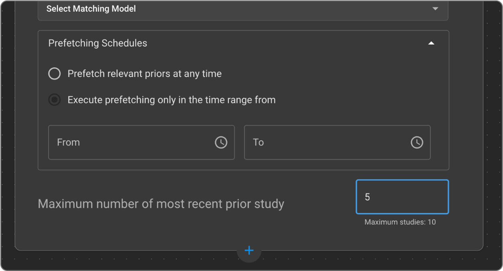

 **Example Use Case**

A **CT Brain** study is marked as **Verified**.
The WFA rule executes the **Pull Prior** action.
The system:

- Searches the RamSoft Internal organisation
- Pulls from the Radish PACS station
- Applies the **“CT Brain – Last 12M”** matching model
- Retrieves the **latest 5 CT Brain studies** from the past year
- Makes them available in OmegaAI for the radiologist to review

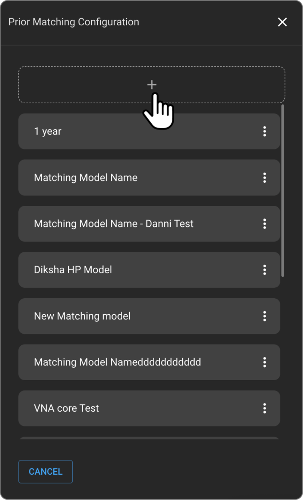

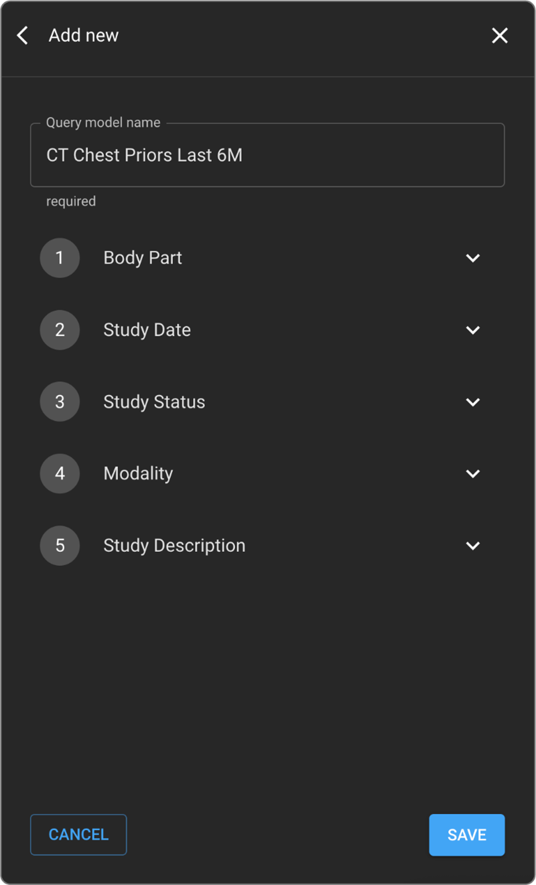

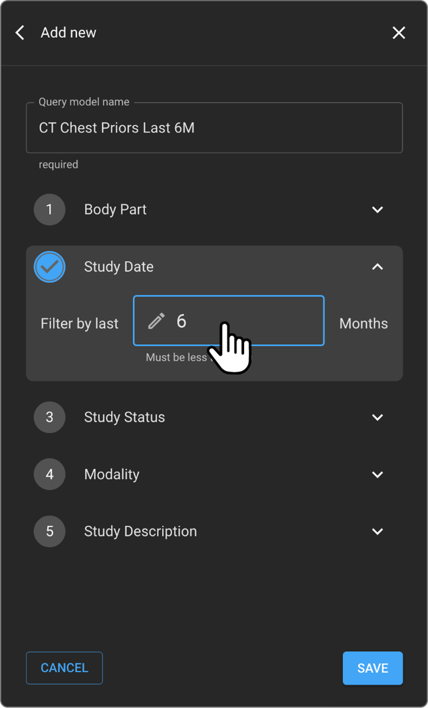

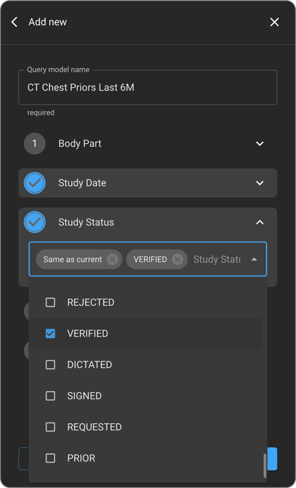

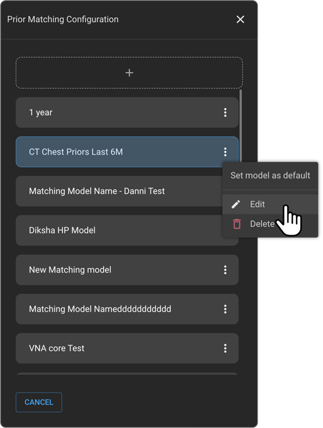

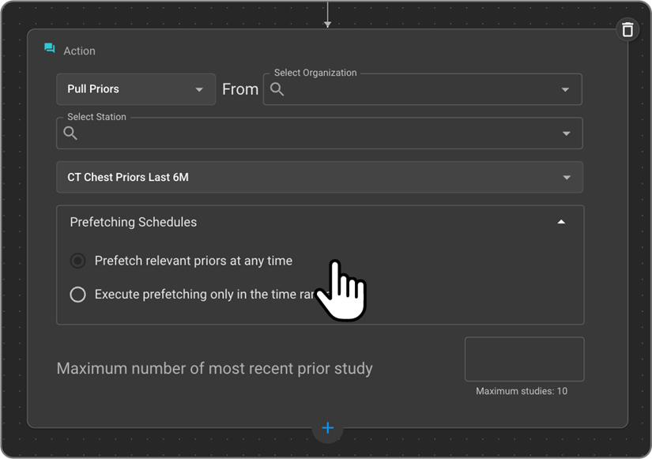

**11. Post Charges:** The **Post Charges** action in Workflow Automation enables seamless billing integration by transmitting charge information directly to the insurer once a study is finalized. This helps streamline revenue cycle management and reduces manual intervention.

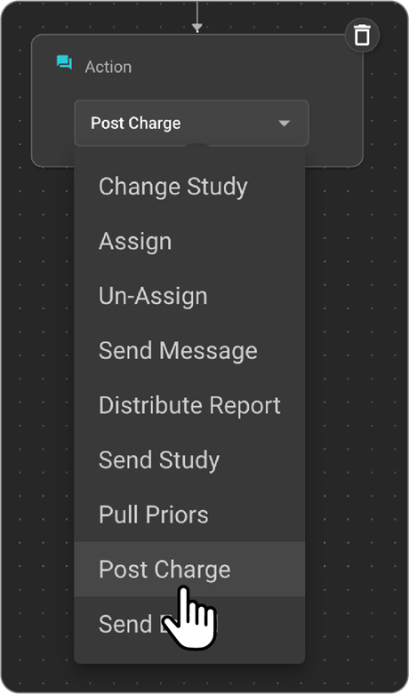

**Example:** When a study status changes to **“Signed”**, the system automatically posts the billing details to the insurance company using HL7 messaging standards.

## Yes / No Branch Logic

**Purpose**

- The Yes/No Branch Logic allows workflows to dynamically adapt based on whether specific conditions are met. This enables more intelligent and flexible automation by supporting two distinct execution paths for each condition.

 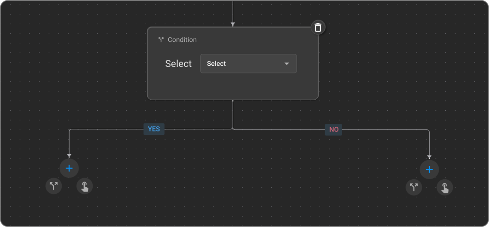

- **Yes Path:** This branch executes when all configured conditions for that specific path are met (i.e., evaluate to true).

 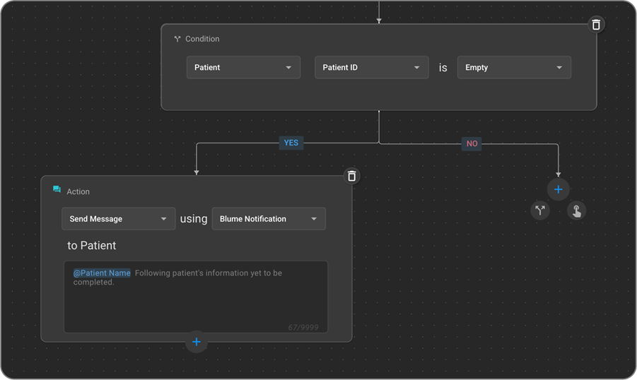

- **No Path:** This branch executes when the configured conditions for the "Yes" path are not met (i.e., evaluate to false), allowing for alternate actions to be performed. Each "Yes" and "No" path can, in turn, have a chain of sub-conditions and actions as necessary, creating intricate workflow designs.

 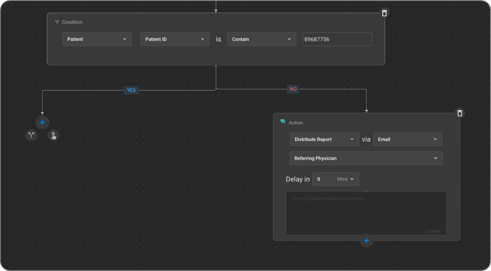

**How It Works**

Each condition in a workflow supports two branches:

- **Yes Path**
  Executes when the condition evaluates to **true** (i.e., all specified criteria are met).
- **No Path**
  Executes when the condition evaluates to **false** (i.e., the criteria are not met), allowing for alternate actions.

 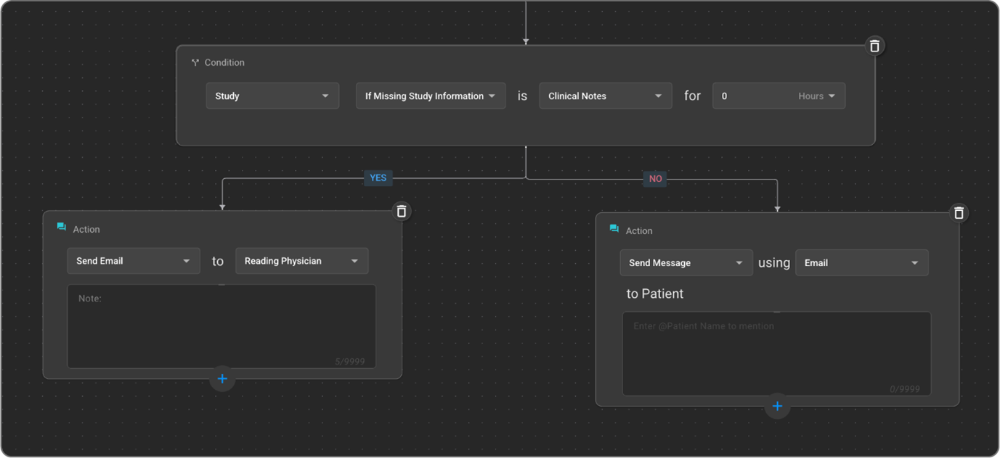

Both paths can include additional conditions and actions, enabling the creation of complex, multi-layered workflows.

**Example of Yes/No Branch Logic:**

**Trigger:**

- **Operation =** Done

**Condition:**

- Check if the Patient ID is missing

**Yes, Branch Action:**

- If the Patient ID is missing, send a Blume Notification to the Scheduler with a custom message:
  “*Patient ID is missing. Please complete the patient information before proceeding*.”

**No Branch Action:**

- *If the Patient ID is present, proceed to send the final report to the Referring Physician.*

