 
 
 # Adding Conditions

Once a trigger is configured, the workflow editor allows you to add conditions. A condition is a logical filter applied to a workflow trigger. Conditions help refine the scope of the workflow, ensuring that actions occur only in relevant scenarios for specific studies, patients, or assignments. They offer precision and control, making sure automation applies only to the intended use cases. The system dynamically offers only relevant conditions based on the selected trigger type.

**Types of Conditions and Detailed Examples:**

**1. Study Conditions:** These conditions are based on the attributes and metadata associated with a study.

 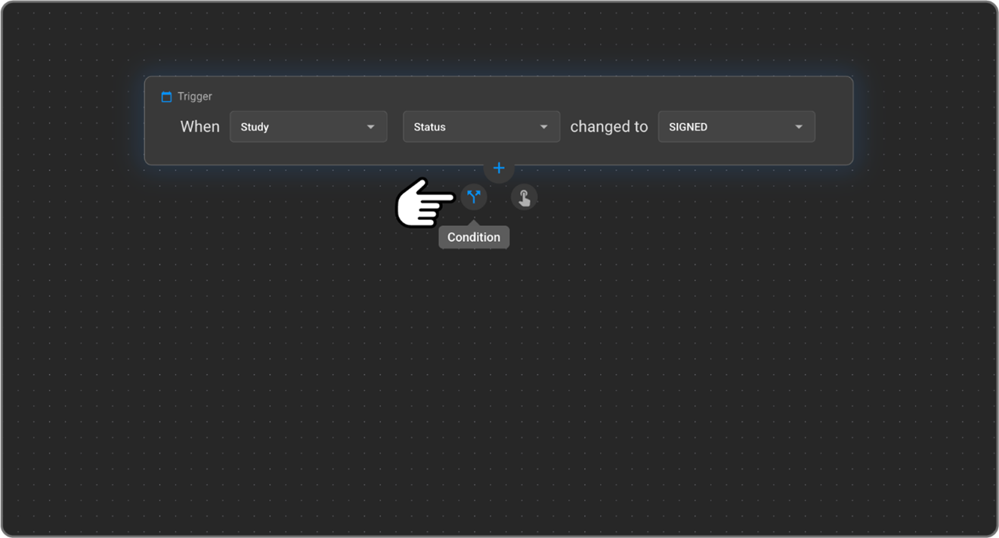

**Condition Type:**

- **Status:**

You can configure conditions to evaluate the current status of a study.

 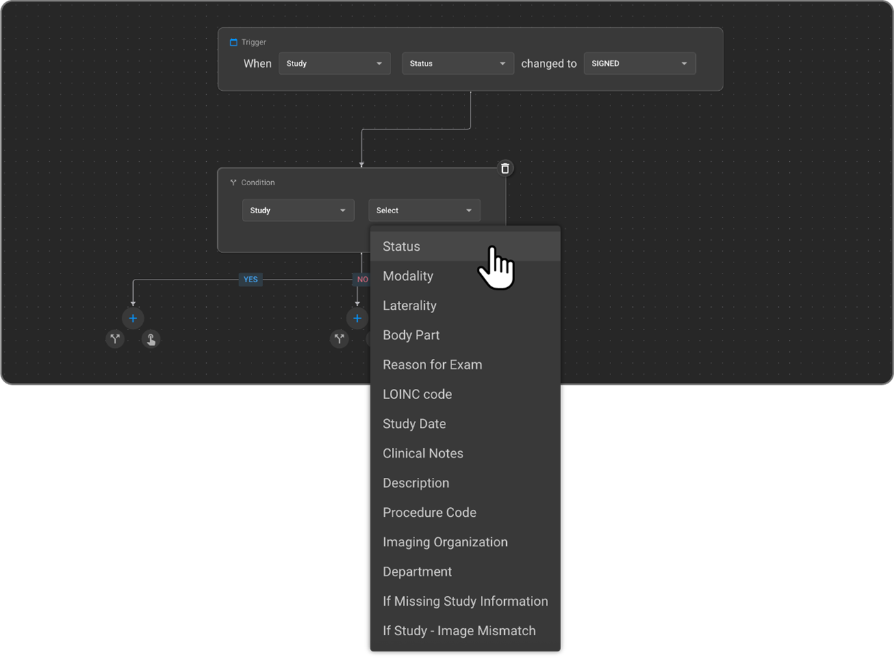

Supported statuses include:

   a. Scheduled 
   
   b. In Progress 
   
   c. Signed 
   
   d. Completed 
   
   e. Reported 
   
   f. Read 
   
   g. Ordered 
   
   h. and others as configured in the system 

**Example Use Case**

  _Trigger_: Study status changes to **"Signed"**
  _Condition_: Study status is also **"Reported"**
  _Purpose_: This ensures that the workflow only proceeds if the report is finalized and ready for distribution, avoiding premature actions on incomplete documentation.

 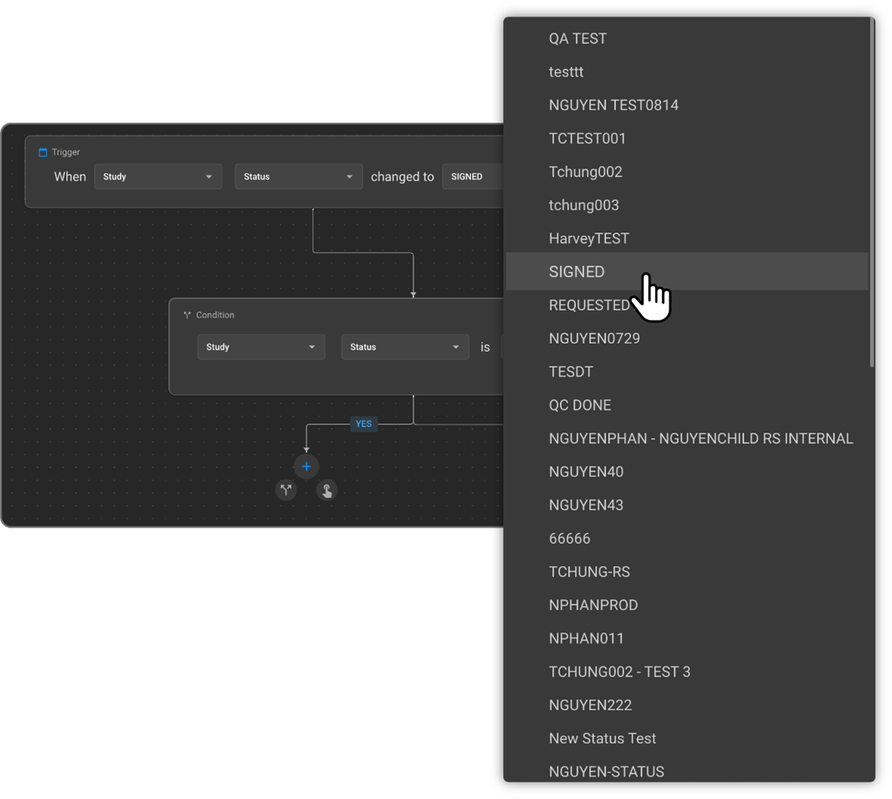

- **Modality:** These conditions allow workflows to be filtered based on the imaging modality associated with a study. This ensures that automation is applied only to relevant types of studies.

 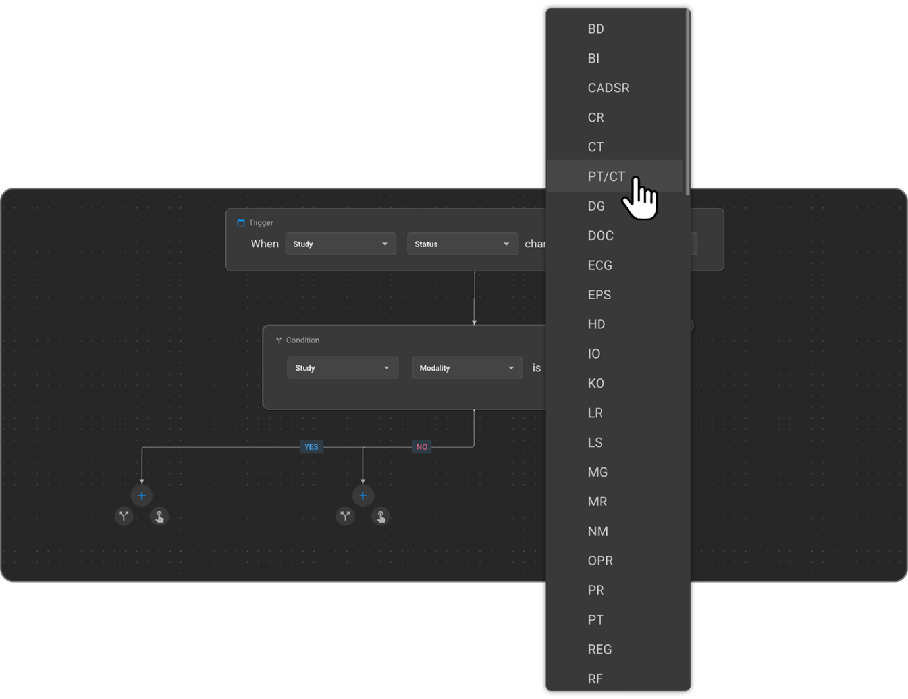

You can configure workflows to apply only to specific imaging modalities. Supported modalities include (but are not limited to):

a. CT (Computed Tomography)
b. PET (Positron Emission Tomography)
c. MRI (Magnetic Resonance Imaging)
d. Mammogram
e. X-Ray
  
**Example Use Case**

_Trigger_: Study status changes to "**Completed**"
_Condition_: Study Modality is MRI
_Automated Action_:

  Execute a follow-up workflow (e.g., notify a subspecialty radiologist or initiate a specific post-processing task) only for MRI studies, regardless of other modalities present in the system.

- **Laterality:** Laterality conditions allow workflows to be tailored based on the anatomical side or region involved in a study. This is particularly useful for ensuring clinical accuracy and consistency in documentation.

   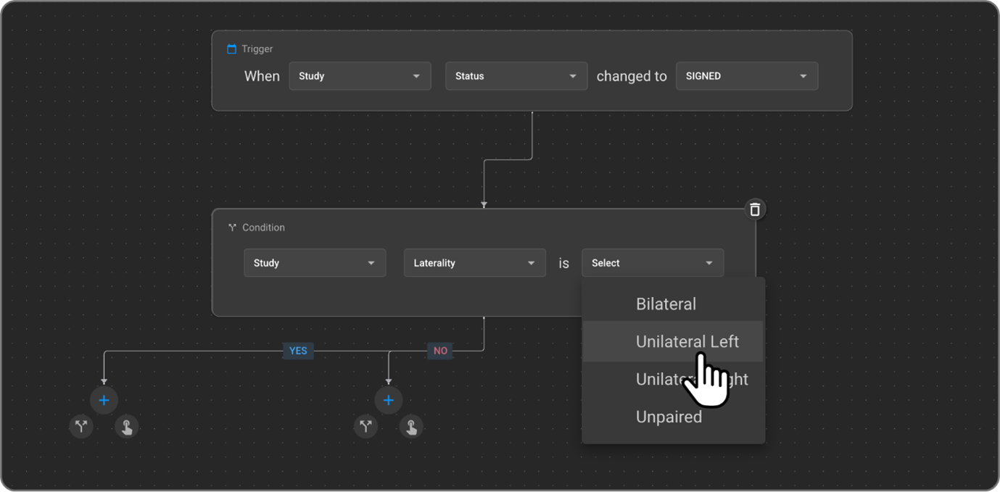

You can configure workflows to respond to specific laterality values. Supported options include:

a. Bilateral

b. Unilateral Left

c. Unilateral Right

d. Unpaired

Multiple laterality options can be selected to accommodate broader or more flexible workflow criteria.

**Example Use Case**

_Trigger_: Study is marked as **"Completed"**
_Condition_: Laterality is **"Bilateral",** but the study description references only one side
_Automated Action_:

  Trigger an alert or flag the study for manual review to ensure the documentation aligns with the selected laterality, helping prevent clinical discrepancies.

- **Body Part:** These conditions allow workflows to be customized based on the anatomical region or organ system involved in a study. This enables targeted routing, review, or escalation based on clinical specialization.

 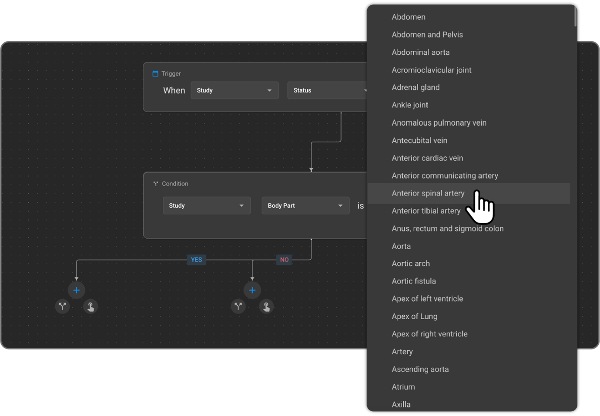

You can configure workflows to respond to specific body parts selected in the study metadata.

Common options include:

a. Abdomen

b. Brain

c. Leg

d. Chest

e. Spine

f. Pelvis

g. Aorta

h. Adrenal Gland

i. and other body parts as defined in the system

**Example Use Case**

_Trigger_: Study status changes to **"In Progress"**
_Condition_: Body Part is **"Abdomen"**
_Automated Action_:

  - Route the study to a **Gastrointestinal (GI) radiology workstation** or assign it to a subspecialist for interpretation.

This ensures that studies are directed to the appropriate clinical team, improving diagnostic accuracy and workflow efficiency.

- **Reason for Exam:** These conditions allow workflows to be filtered or triggered based on the clinical reason provided for ordering the study. This ensures that specific workflows are applied only when clinically relevant.

 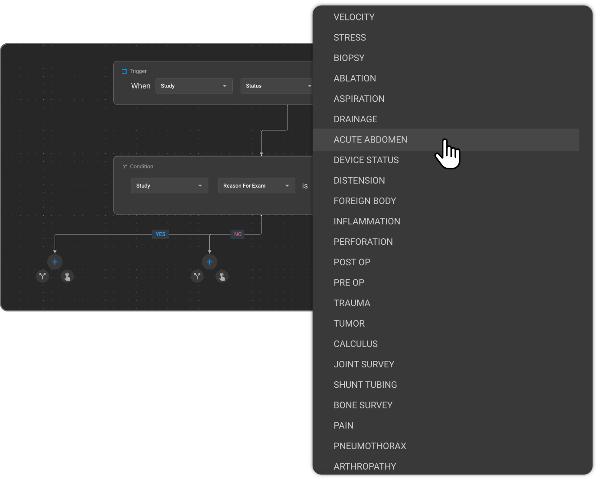

You can configure workflows to respond to one or more selected reasons for the exam. Common options include:

a. Trauma

b. Drainage

c. Tumour

d. Follow-up

e. Screening

f. Velocity

g. Perforations

h. and other reasons as defined in the system

Multiple reasons can be selected simultaneously to broaden the scope of the condition.

**Example Use Case**

_Trigger_: Study status changes to **"Scheduled"**
_Condition_: Reason for Exam is **"Trauma"**
_Automated Action_:

- Route the study to a trauma-specialized radiologist or prioritize it in the worklist for expedited review.

This ensures that urgent or specialized cases are handled appropriately and without delay.

- **LOINC Code:** LOINC (Logical Observation Identifiers Names and Codes) conditions allow workflows to be filtered based on standardized codes used for identifying laboratory and clinical observations.
  
   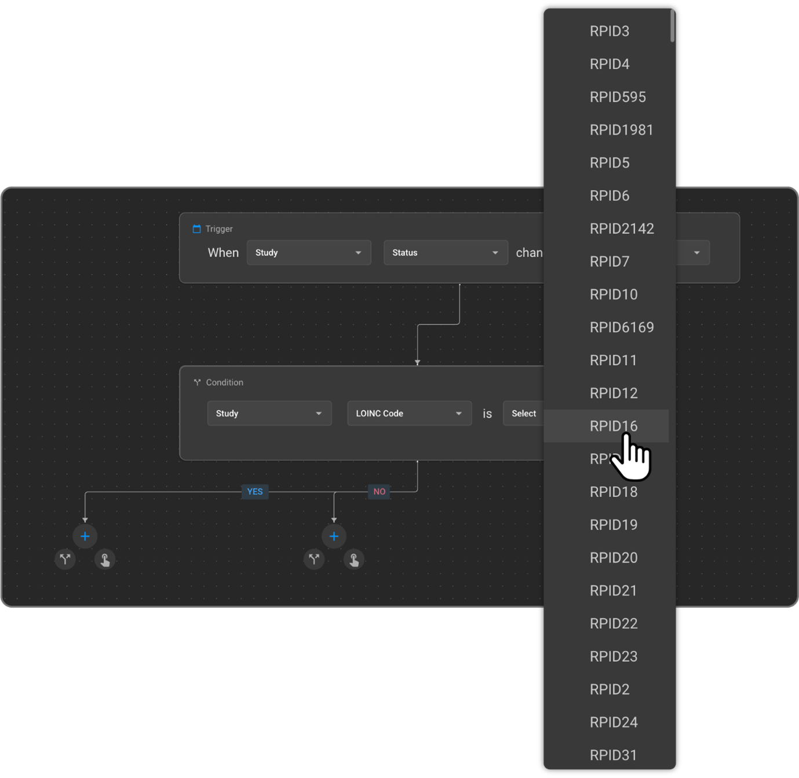

You can configure workflows to trigger only for studies associated with specific **LOINC codes**, ensuring alignment with standardized clinical data.

**Example Use Case**

  _Trigger_: Study is marked as **"Reported"**
  Condition_: LOINC Code matches a predefined value (e.g., for a specific imaging or lab test)

  _Automated Action_:

  Route the report to a specialized clinical system or notify a specific care team based on the observation type.

- **Study Date:** Study date conditions allow workflows to be filtered based on when a study was performed. This is especially useful for time-sensitive workflows such as audits, follow-ups, or retrospective reviews.

   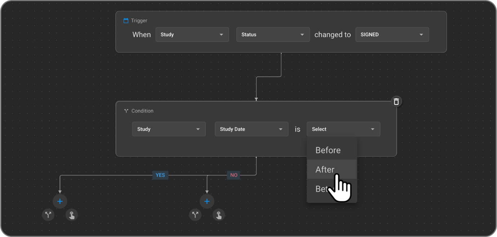

  You can define date-based filters using the following options:

  a. **Before** a specific date
  
  b. **After** a specific date
  
  c. **Between** two specific dates
  
  d. **Relative timeframes** (e.g., last 7 days, last 30 days)

**Example Use Case**

  _Trigger_: Study status changes to **"Completed"**
  _Condition_: Study Date is within the last 30 days
  _Automated Action_:

- Include the study in a monthly quality assurance review or trigger a follow-up reminder for recent cases.

This ensures that workflows are applied only to studies within a relevant time window, improving the precision and relevance of automation.

- **Clinical Notes / Description:** These conditions allow workflows to evaluate the **text content** of a study’s clinical notes or description fields. This is useful for identifying key terms, phrases, or patterns that may indicate urgency, special handling, or clinical relevance.

 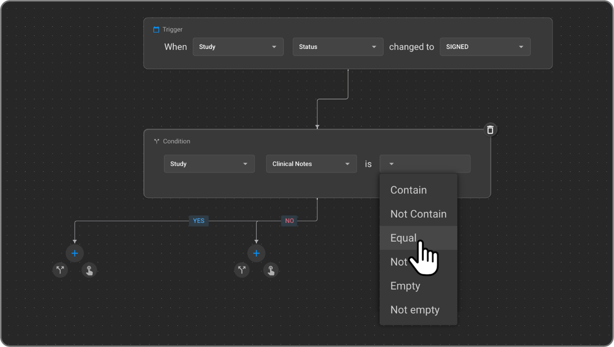

You can apply the following text-based filters:

a. Contains

b. Does Not Contain

c. Empty

d. Not Empty

e. Equal

f. Not Equal

These filters can be used to detect specific keywords or phrases, or to check whether the field has been filled out.

**Example Use Case**

_Trigger_: Study status changes to **"Signed"**
_Condition_: Clinical Notes contain the phrase **"critical finding"**
_Automated Action_:

- Route the study for immediate review by a senior radiologist or notify the referring physician with high urgency.

This ensures that important clinical insights are not missed and are escalated appropriately.

- **Procedure Codes, Imaging Organization, Department:** These conditions allow workflows to be filtered based on structured metadata related to the **procedure**, **imaging organization**, or **department**. This enables precise routing and action logic based on operational context.

 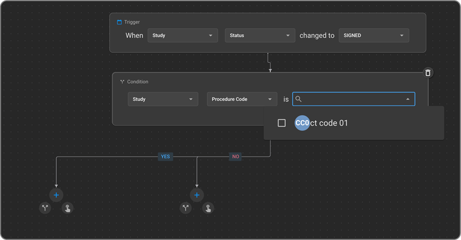

**a.** **Procedure Codes**: Select from standardized or custom codes (e.g., *CCO ct code 01*).

**b.** **Imaging Organization:** Choose from a list of configured organizations (e.g., RAMSOFT RADIOLOGY, RAMSOFT INDIA).

**c.** **Department:** Filter based on the department responsible for the study (e.g., Radiology, Cardiology).

 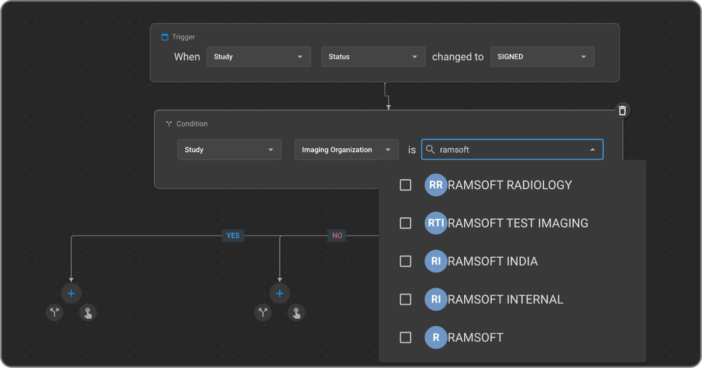

These values are typically selected via **meta search** from predefined system lists.

**Example Use Cases**

1.  _Trigger_: Study status changes to **"Signed"**
  _Condition_: Procedure Code is **"CCO ct code 01"**
  _Action_: Route to a specific post-processing queue or notify a designated team.

2.  _Trigger_: Study status changes to **"Signed"**
    _Condition_: Imaging Organization is **"RAMSOFT"**
   _Action_:

    - **If YES**: Proceed with organization-specific workflow (e.g., auto-distribution, internal QA).
    - **If NO**: Route to a general workflow or flag for manual review.

These conditions ensure that workflows are aligned with the procedural and organizational context, improving efficiency, compliance, and accuracy.

- **If Missing Study Information:** Triggers an action if any key study information (e.g., procedure code, reading physician) is missing. You can set time thresholds (e.g., "Missing for 2 hours").

 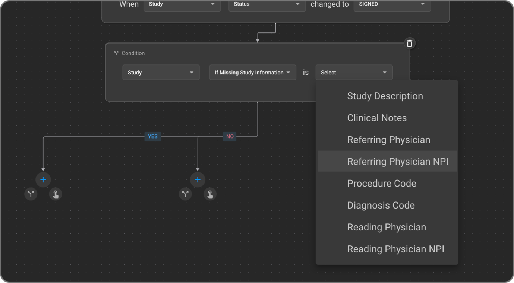

**Example:** If a study's procedure code is missing for more than 2 hours, trigger an alert to the radiology technologist.

 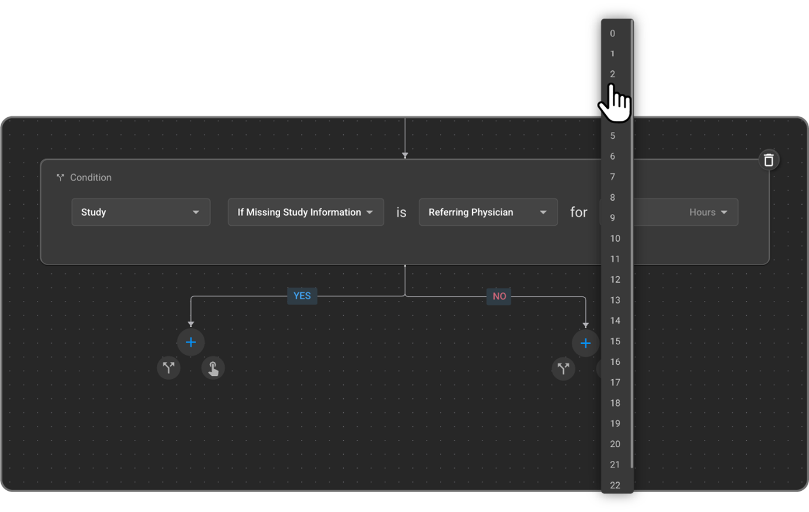

- **Study-Image Mismatch:** Detects inconsistencies between study attributes and image data.

 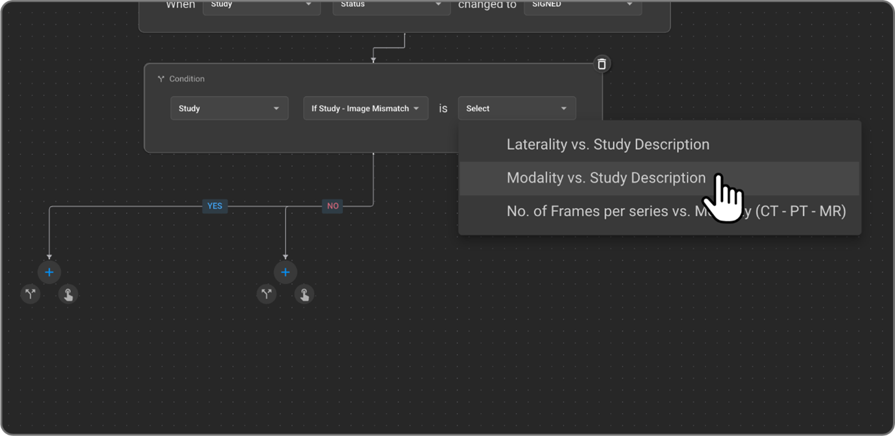

**Examples:** Laterality vs Description (e.g., description states, "Left Leg" but laterality is "Right"), Modality vs Description, or Number of frames per series vs Modality (e.g., a chest X-ray should not have 1000 frames).

  **2. Patient Conditions:** Patient conditions allow workflows to be filtered or triggered based on patient-specific attributes. These conditions help tailor automation to individual demographics, communication preferences, or data completeness.![A screenshot of a computer

 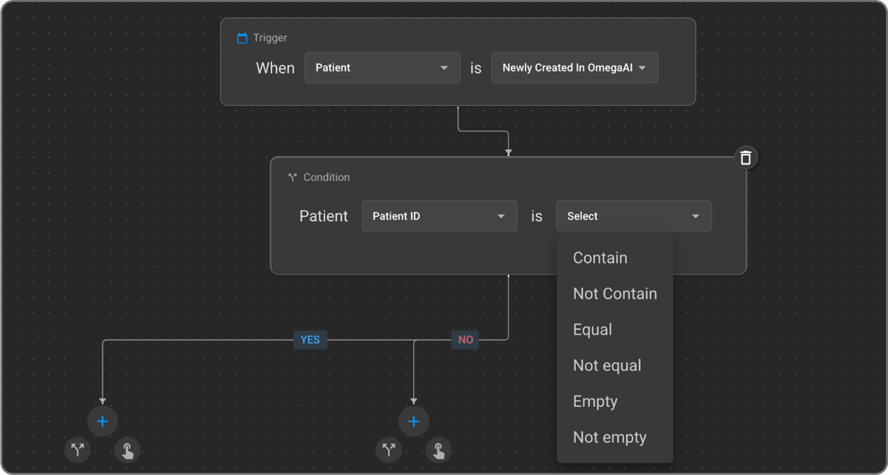

- **Patient ID, Email, Phone, Invite Status:** 
  Use operators such as:
  
  a. Contains
  
  b. Does Not Contain
  
  c. Equal
  
  d. Not Equal
  
  e. Empty
  
  f. Not Empty

**Example Use Case:**
  Trigger a reminder workflow only if the **Email field is not empty** and **Invite Status is "Pending"**.
- **Birth Date:** 
  Filter using:
  
  a. Before
  
  b. After
  
  c. Between
    _(A date picker is available for easy selection)._

**Example Use Case:**
  Trigger a paediatric workflow for patients **born after 2010**.

 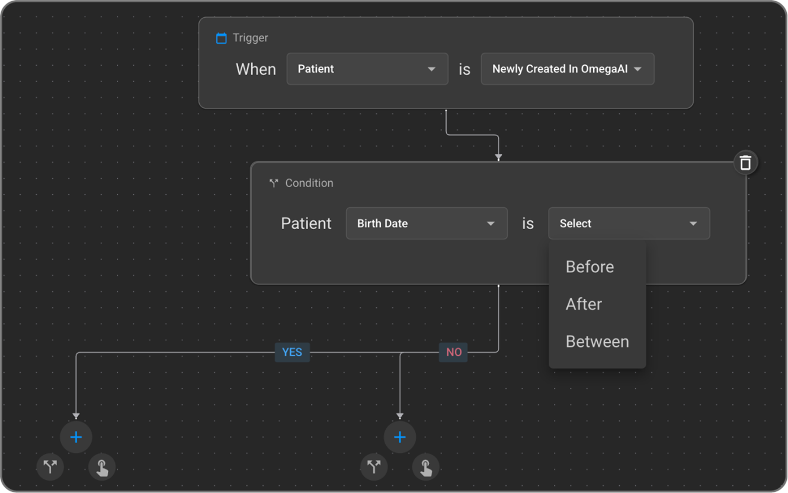

- **Birth Sex:**
  Choose from:
  
  a. Female
  
  b. Male
  
  c. Other
  
  d. Unknown

**Example Use Case:**
  Route mammogram studies only for patients whose **Birth Sex is Female**.
- **Language:** Select the patient’s language from a predefined list of supported languages.

**Example Use Case:**
  Send appointment reminders in the patient’s **preferred language**, such as English or Spanish.

 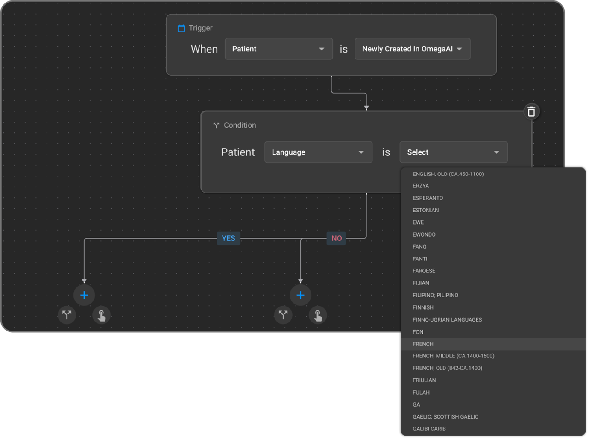

- **If Missing Patient Information Fields:** Checks whether required demographic fields such as _First Name_, _Last Name_, _Date of Birth_, or _Patient Location_ are missing.
  
   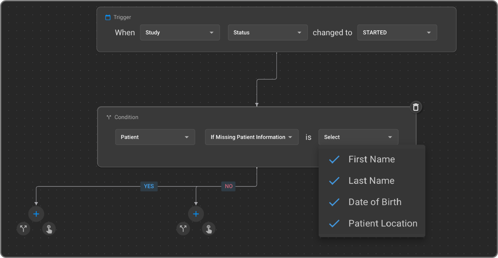

**Example:** If the trigger is "Operation Done" and the patient's _First Name_ or _Date of Birth_ is missing, notify the scheduler to follow up and complete the information.

 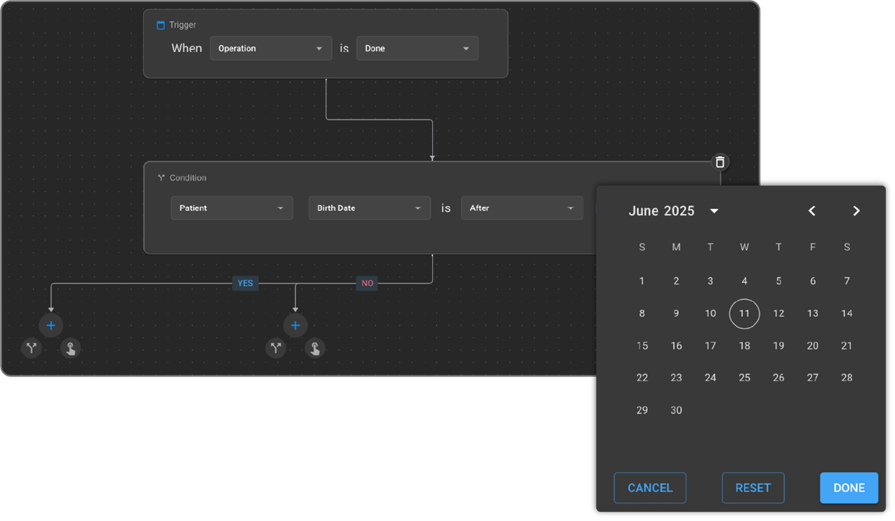

**3. Assigned Conditions:** Assigned conditions allow workflows to be triggered or filtered based on the personnel or organizational assignments associated with a study. These conditions are essential for managing task ownership, accountability, and routing logic within **OmegaAI**.

 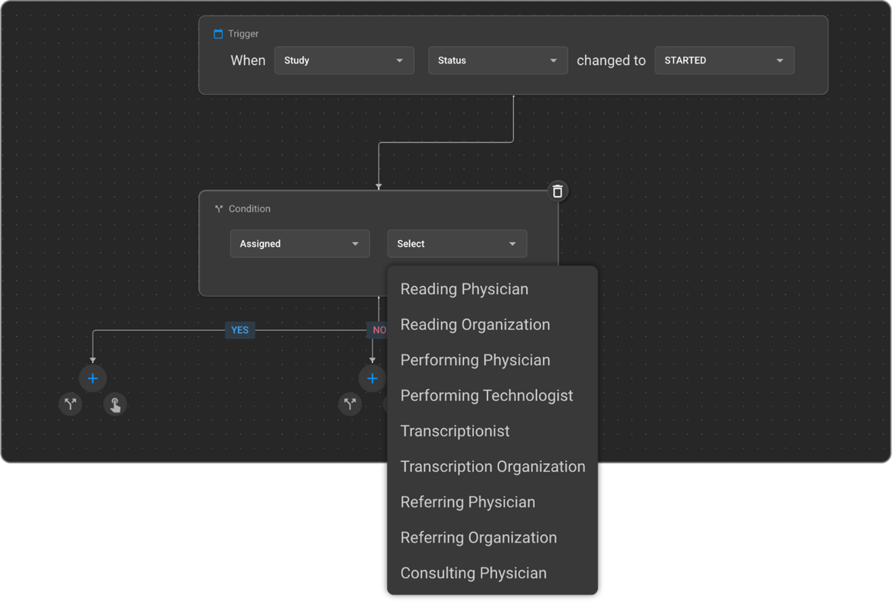

 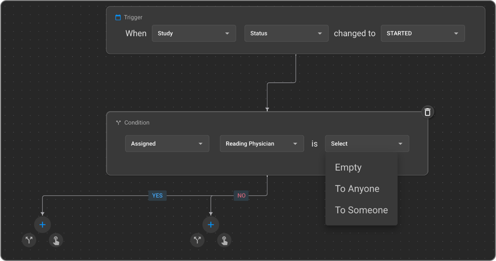

a. **Reading Physician / Organization:** Options include _Empty_, _Anyone_, or _To someone_ (using meta search to assign a specific user or group).

b. **Performing Physician / Technologist:** Same options as above.

c. **Transcriptionist / Organization:** Same options as above.

d. **Referring Physician / Organization:** Same options as above.

e. **Consulting Organization:** Same options as above.

**Example:** If a study is triggered by "Status = Verified" and the "Reading Physician" assignment is "Empty," the workflow can assign it to a specific available radiologist.

