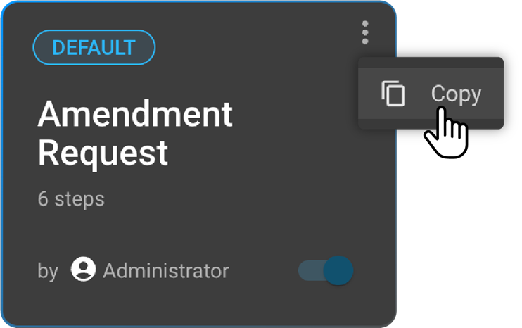
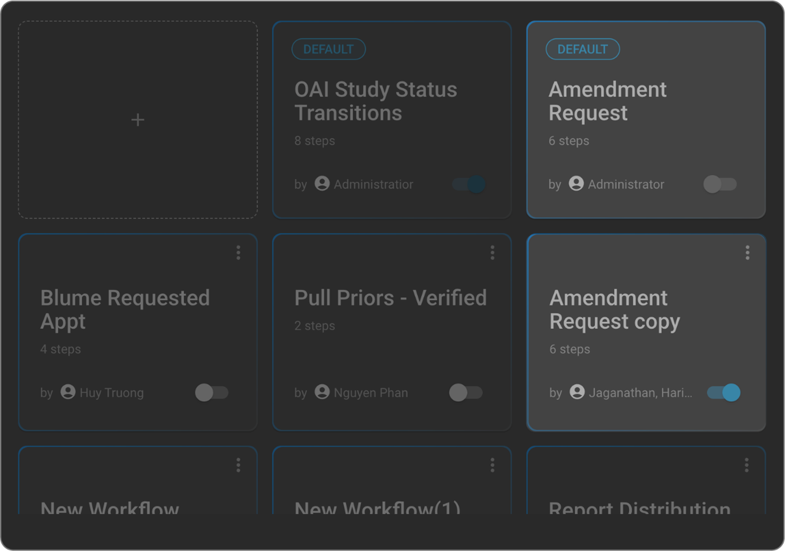
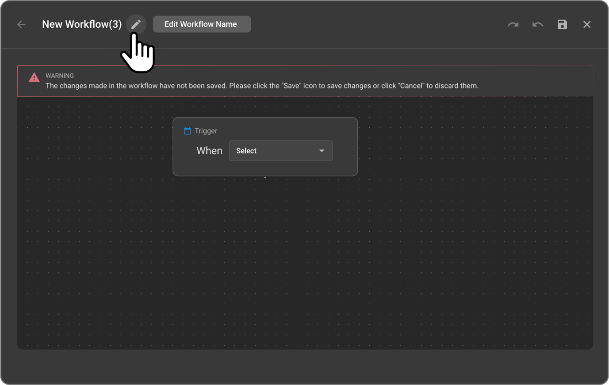
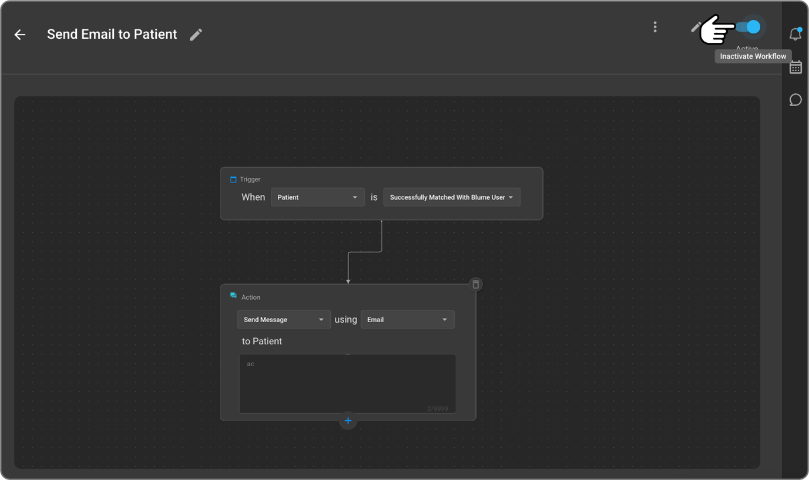
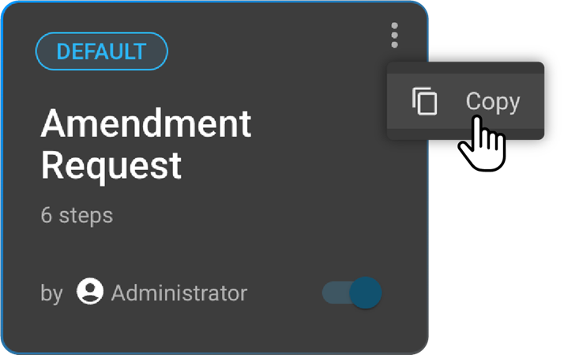
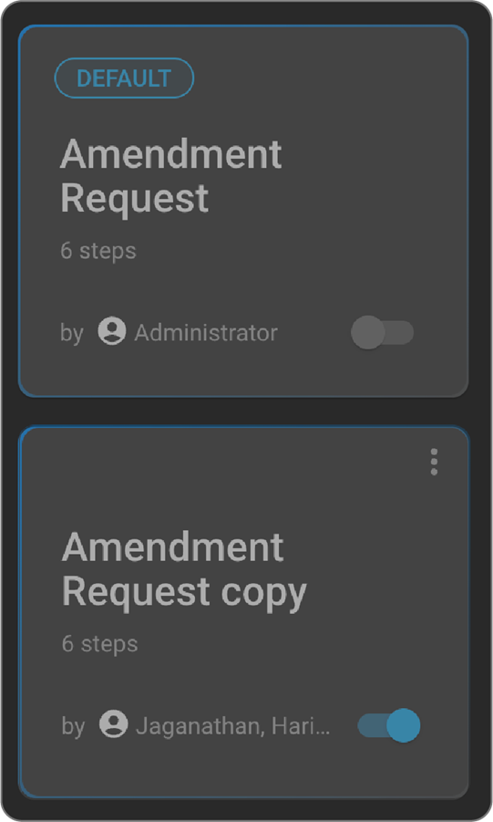
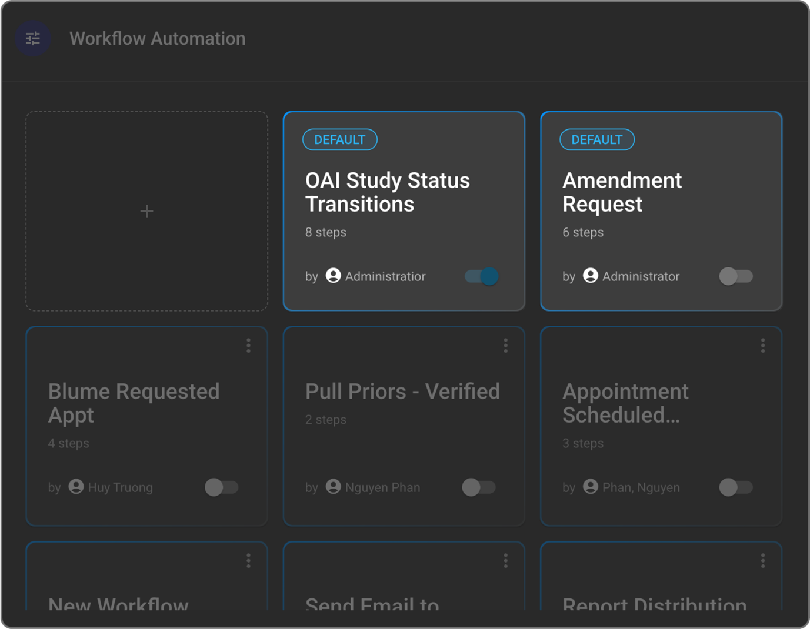
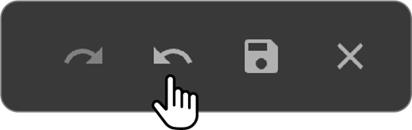
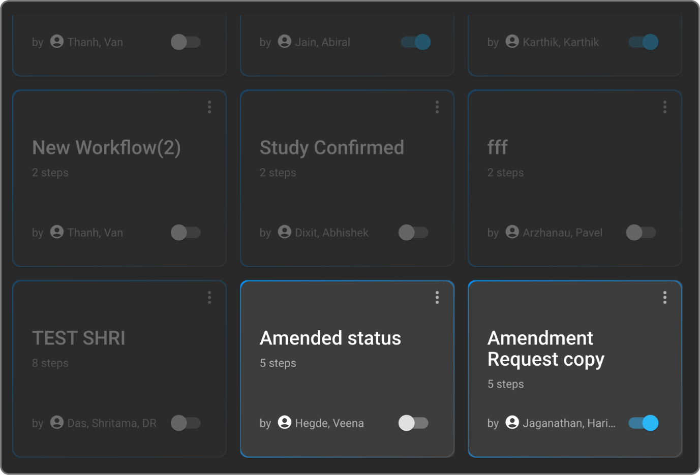

 
 
 
 
 # Copying a Workflow

OmegaAI does not allow direct editing or deleting of default workflows to maintain consistency across client environments. However, if a default workflow does not align with your organizational needs, it can be copied and customized as a new, editable workflow.

**Steps to Copy a Default Workflow:**

1. **Access the Workflow Automation Interface:** Navigate to the WFA interface for the desired organization.
1. **Locate the Default Workflow:** Identify the default workflow tile you want to copy from the grid view. Check for the tag on the top left of each tile.
1. **Open the 3-Dot Menu:** Click the three-dot menu in the top-right corner of the default workflow tile.
1. **Select "Copy":** Click on "Copy" to create a new workflow based on the default configuration.

 

- **Note:** *If the "Copy" option is not available, it indicates that a copy of this specific default workflow has already been created.*

 

5. **Edit the New Workflow:**

A new, editable workflow interface will open, pre-populated with the settings of the copied default workflow.

- You can rename this new workflow by clicking the edit icon next to the title.

 

- Modify the steps, triggers, conditions, and actions as required to fit your specific needs.
  
6. **Save and Activate the Workflow:** Click **Save** to preserve your changes to the new workflow.

    

 

- **Important:** If the new, copied workflow uses the same trigger as the original default workflow, you must **manually activate** the new workflow. Activating the new workflow will automatically deactivate the original default workflow that shares the same trigger to avoid conflicts.

**Important Notes on Copying Workflows:**

- Default workflows can only be **copied**, not deleted or edited.

 

- **Trigger Restriction:** Triggers cannot be used in more than one **active** workflow simultaneously. If a new workflow with an existing active trigger is manually activated, the original workflow using that trigger will be deactivated.
- **"Copy" Option Disabled:** Once a default workflow has been copied, the "Copy" option for that specific default workflow will be disabled until the newly created copy is either deleted or deactivated.

 

## Default Workflows

Default Workflows in OmegaAI are pre-configured automation workflows that are made available to all organizations and clients by default. These workflows are designed to support commonly used automation scenarios and provide a baseline for workflow configuration, helping users get started quickly with automation.

**Key Characteristics of Default Workflows:**

- **Non-Editable and Undeletable:** Default workflows cannot be edited or deleted by users. OmegaAI enforces this to maintain consistency across client environments and to ensure the integrity of predefined automation scenarios.

 

- **Serving as Templates:** They serve as foundational templates for various commonly needed automation tasks (e.g., report sign-off processes, notifications for critical findings).
- **Copy Functionality for Customization:** While default workflows are not directly editable, users can create a customizable version by using the "Copy" option available in their tile menu. This action generates a new, editable workflow that is based on the default configuration. This new workflow can then be fully tailored to meet specific organizational requirements without affecting the original default.
- **Copy Limitations and Behaviour:**
  
  a. If the "Copy" option is not available for a default workflow, it indicates that a copy of that workflow has already been created.
  
  b. Once a default workflow is copied, its "Copy" option will remain disabled until the copied version is either deleted or deactivated.
  
  c. If the new, copied workflow uses the same trigger as the original default workflow, users must manually ensure that the correct workflow (either the new copy or the original default) is activated to prevent conflicts in automation execution.

Default workflows are a valuable starting point and reference model for building customized workflows in OmegaAI. Organizations are encouraged to review these defaults, copy them where needed, and adapt them to align with their internal processes and specific operational needs.

## Centralization of Management of Study Statuses at the Master Organization Level

Restrict access of management of study status at child organizations to ensure consistency and prevent conflicts. This leads to uniformity and standardization of 
study statuses across the organization. Potential conflicts and inconsistencies in study statuses between the master and child organizations are eliminated. 
Administrative complexity is reduced by managing study statuses from a single point.

## Workflow Automation Usability

Every workflow can accommodate multiple actions and conditions. This
flexibility eliminates the need to create multiple workflows for similar
processes. The last person to edit a workflow is displayed in the GUI.
The software does not support the creation of duplicate workflows.

## Study Report Signoff

The **Study Report Signoff** action is a feature within the Workflow Automation (WFA) module in OmegaAI. 

Preliminary report gets converted into Final Report and study status automatically changes to SIGNED when a report is Signed by Reading Physician or Performing Physician. 

As per the enhancement, it enables the system to automatically assign the reading physician when a report is signed, ensuring that the study record reflects the correct information. This action applies only during the initial signoff of a study report.

**When a user signs a study report:**

The system validates whether the user is authorized as a Reading MD or Interpreting MD.

If the user is authorized, the system automatically assigns this user as the Reading Physician for the study.

**Amendment Handling: If a report is being amended after the initial signoff:**

The system does not auto-assign or change the Reading Physician.

The action only applies to the initial signoff of a report.

## Best Practices and Key Notes

Adhering to these best practices will help you manage your workflows effectively and avoid common issues.

- **Save Frequently:** Always remember to click the **Save** icon (disk icon) after making any changes to your workflow. The system **does not have an autosave feature**, and any unsaved modifications will be lost if you exit the editor.

 

- **Utilize Undo/Redo:** The "Undo" and "Redo" arrow icons are available on the top toolbar during editing. Use them to correct mistakes or revert changes, ensuring a smooth editing experience.

 

- **Leverage Default Workflows:** Default workflows are an excellent starting point. Review them to understand common automation scenarios and copy them to create custom workflows tailored to your specific needs, rather than building from scratch.

 

- **One Active Workflow per Trigger:** It is critical to maintain **only one active workflow per trigger** at any given time. The system will automatically deactivate an existing workflow if you manually activate a new one that uses the same trigger. This prevents conflicts and ensures predictable workflow execution.

 

- **Use Yes/No Branches for Complex Logic:** For workflows requiring nuanced decision-making, effectively utilize the "Yes/No" branch logic. This allows you to define alternative actions based on whether a set of conditions is met or not, enabling more sophisticated and flexible automation.

 

- **Dynamic Conditions and Actions:** Be aware that the system dynamically offers only relevant conditions and actions based on the trigger you select. This ensures that you are always working with appropriate options for your specific workflow.
- **Review and Test:** Regularly review your workflows and perform thorough testing to ensure they function as intended, especially after any modifications.
- **Deletion is Permanent:** Remember that deleting custom workflows is a permanent and irreversible action. Always double-check before confirming a deletion.

