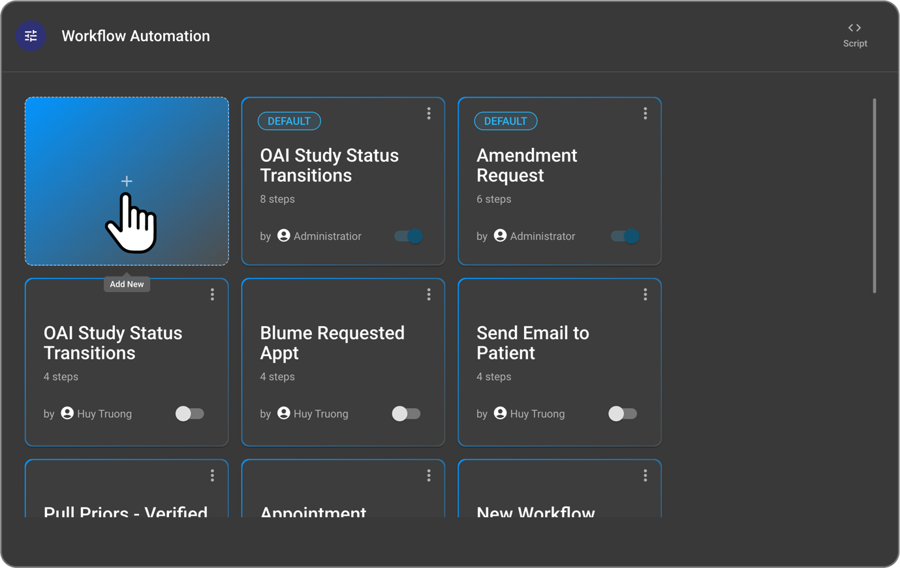
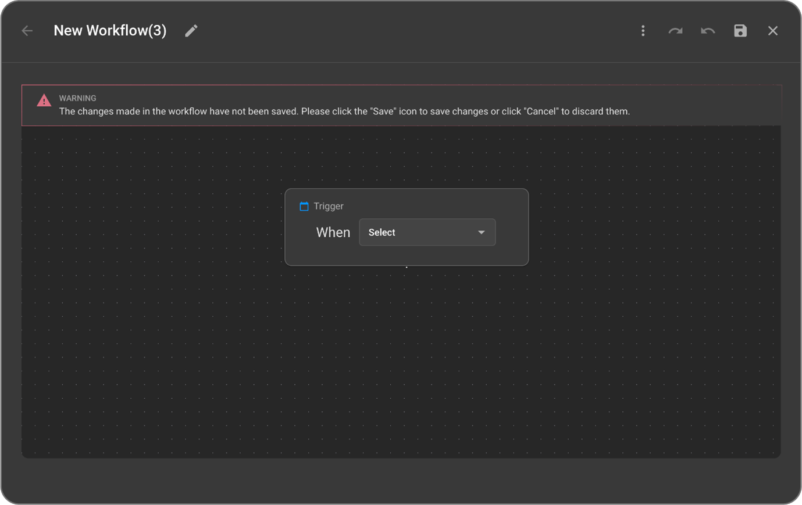
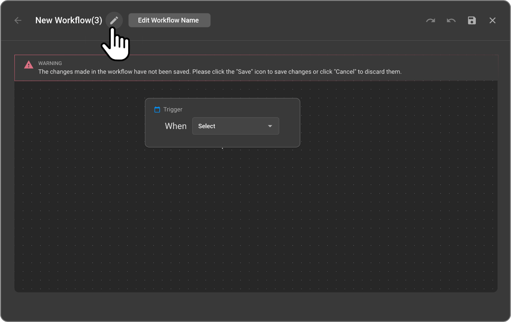
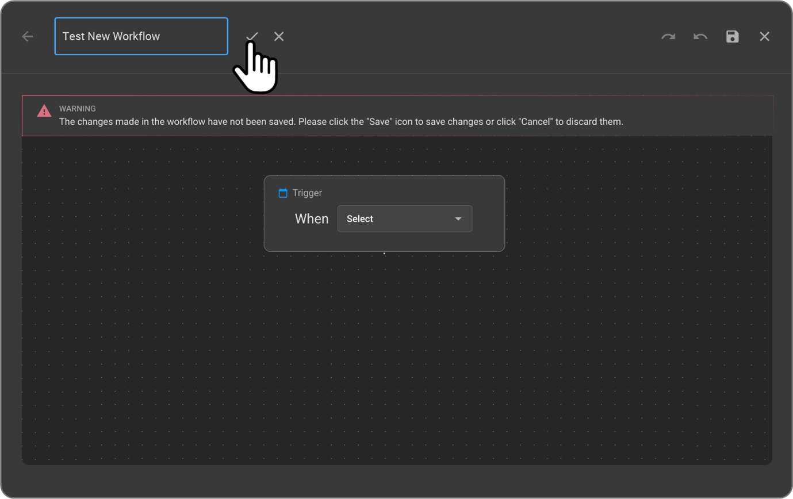
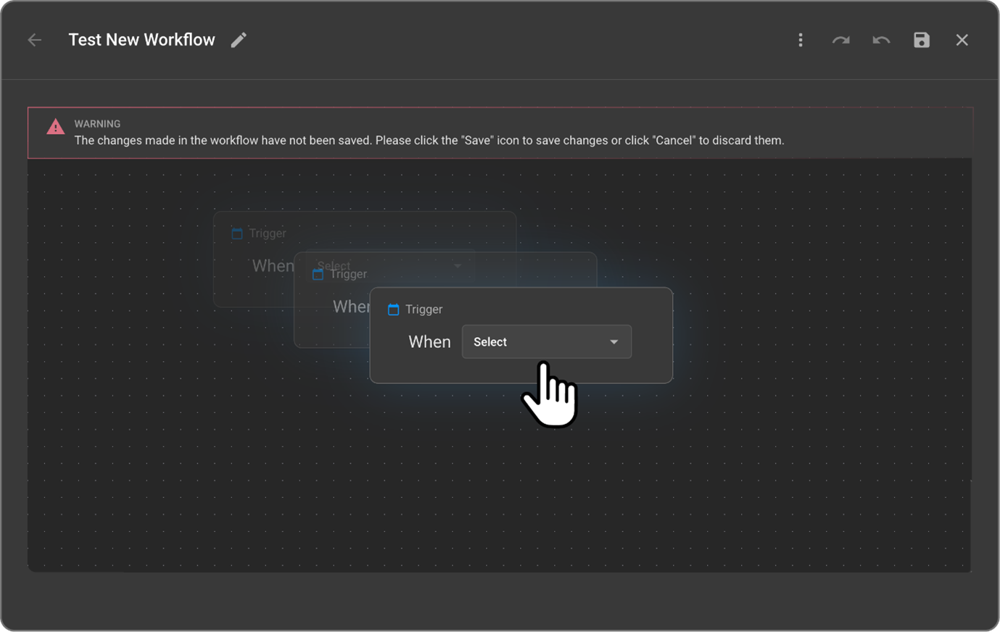
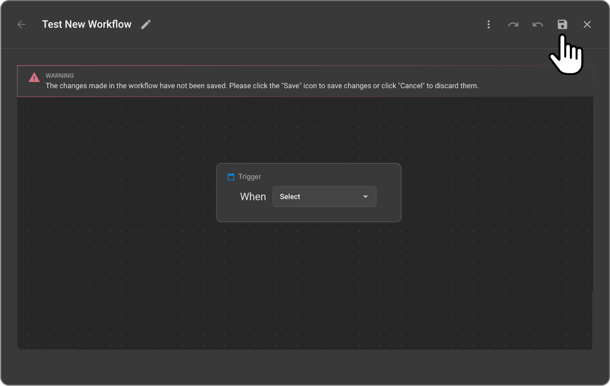

 
# Creating a New Workflow

The OmegaAI Workflow Automation interface offers an intuitive layout for viewing, accessing, and managing automation workflows. Once you have accessed the WFA interface, you can begin creating a new workflow tailored to your organization’s requirements.

## Steps to Create a New Workflow

1. **Initiate Creation:** Click the “+” (plus) icon, typically located at the top-right of the WFA grid view, to start creating a new workflow.

   

2. **Workflow Canvas Opens:** The workflow builder interface will launch, and you will see a default "Trigger" box on the canvas. A system message will also appear: "The changes made in the workflow have not been saved. Click the 'Save' icon to save changes or click 'Cancel' to discard them."

   

3. **Name Your Workflow:** At the top toolbar, a default label "New Workflow" will be displayed.      
   
   a. Click the **pen icon** (Edit Workflow Name) next to the title to rename the workflow.
  
   

    b. After entering the desired name, click the **tick icon** to confirm and save the new name.

   

   c. Click the **cross icon** to cancel or discard the name change.

4. **Define Workflow Logic:** Begin defining the workflow logic by configuring the trigger, followed by conditions and actions. You can move, drag, zoom in/out of the trigger or subsequent steps as needed for better layout and visibility.

   

   **Important Note:** *There is **no autosave** feature in this module. It is crucial to manually click the **Save icon** in the top right corner of the page frequently as you define and modify your workflow to retain changes. If not saved, your progress will be lost upon exiting the editor.*

   

