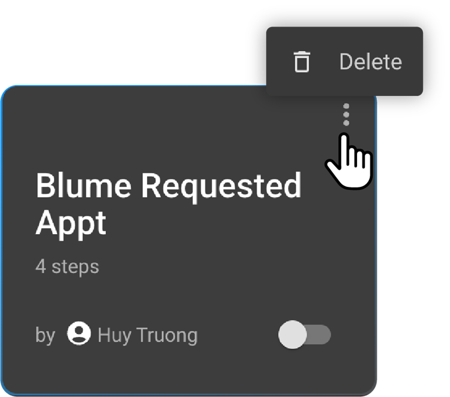
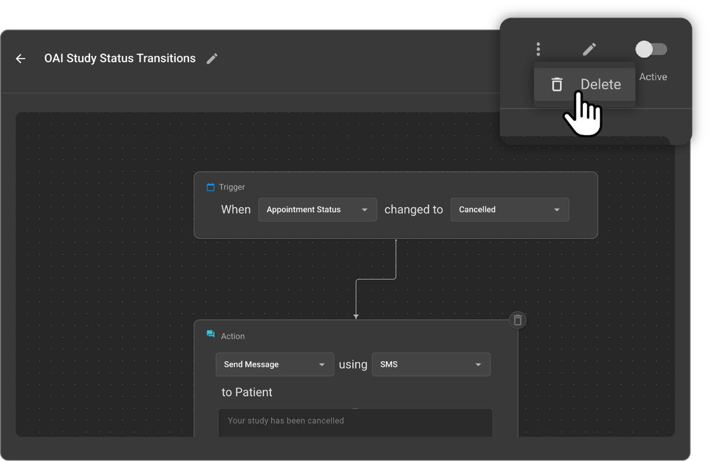

 
 
 
 
 # Deleting a Workflow

Deleting a workflow permanently removes it from the OmegaAI system. It is crucial to ensure you select the correct workflow, as deletion is irreversible. **Default workflows cannot be deleted.**

### Methods to Delete a Custom Workflow:

 **Option 1: Delete from the WFA Grid (Overview View)**
  
1. **Access the WFA Interface:** Log in to OmegaAI and navigate to the Workflow Automation (WFA) section for the desired organization.
2. **Select the Workflow:** Identify the custom workflow tile you wish to delete from the grid view.
3. **Open the 3-Dot Menu:** Click the three-dot menu located at the top-right corner of the workflow tile.
4. **Confirm Deletion:** Click and **hold** the "Delete" option to confirm the permanent deletion of the workflow. This action cannot be reversed.

 

**Option 2: Delete from Within the Workflow Editor**

1. **Open the Workflow:** Click the workflow tile from the WFA grid to open the workflow editor.
2. **Access the 3-Dot Menu:** In the top toolbar of the workflow editor, click the three-dot menu.

 

3. **Confirm Deletion:** Select the "Delete" option. You may be prompted to confirm the permanent removal of the workflow.

