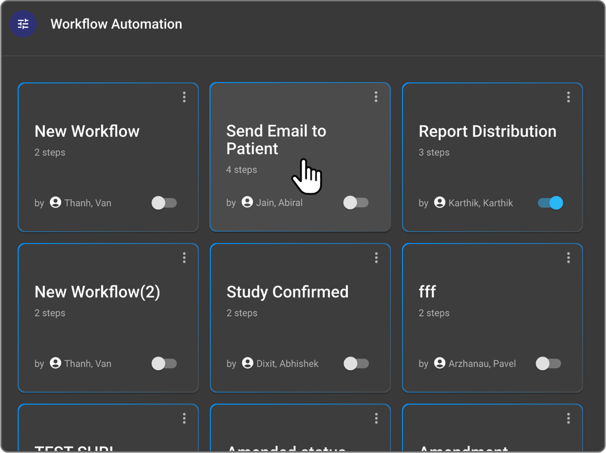
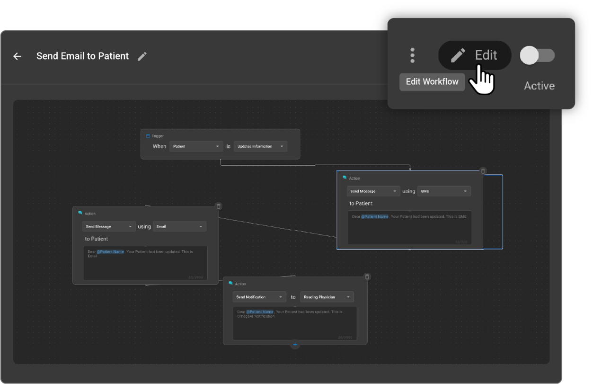
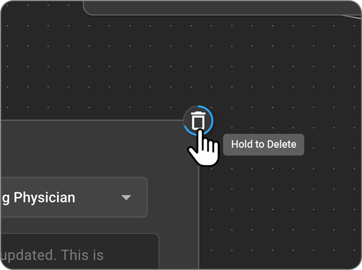
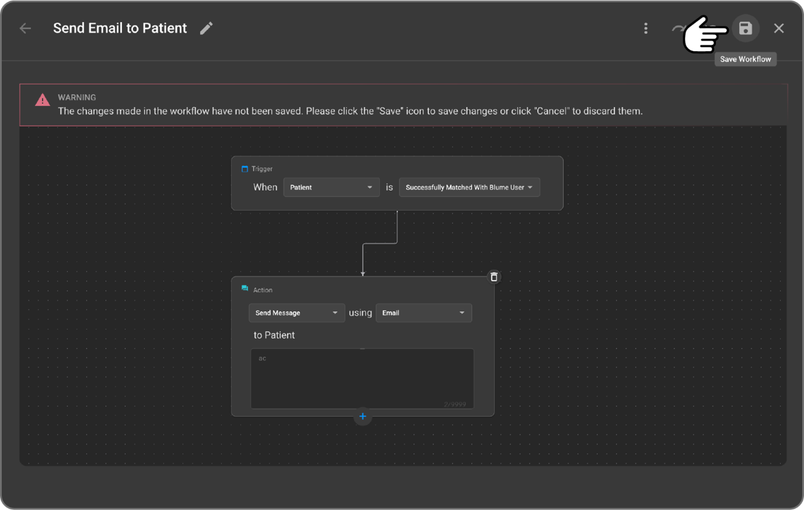

 
 # Editing a Workflow

Editing an existing workflow allows you to modify its components (triggers, conditions, actions) to align with evolving operational needs. It's important to remember that **default workflows cannot be edited directly**; only custom workflows or copies of default workflows can be modified.

**Steps to Edit an Existing Workflow:**

1. **Access the WFA Interface:** Log in to OmegaAI and navigate to the Workflow Automation (WFA) section for the desired organization.
1. **Select the Workflow:** In the WFA grid view, identify and click on the workflow tile you wish to edit. This will open its details and display the workflow canvas.

 

3. **Enter Edit Mode:** In the top toolbar of the workflow editor, click the "Edit Workflow" (pen icon). This action will enable editing capabilities for the workflow components.

 

4. **Modify Workflow Components:** You can now add, remove, or change Triggers, Conditions, and Actions as needed. Refer to the "Creating a New Workflow" section for detailed guidance on configuring these components.
   
- To **delete a specific step** (e.g., a condition or action box), click and hold the "Delete" icon located at the top-right corner of that step box.

 

5. **Save Changes:** Once all desired edits are complete, click the **Save** icon (usually a disk icon) in the top toolbar. The updated workflow will now be reflected in the main WFA grid.

 

6. To rename the workflow, click the pencil icon next to the workflow name while the workflow is in edit mode. Make sure to save your changes.

