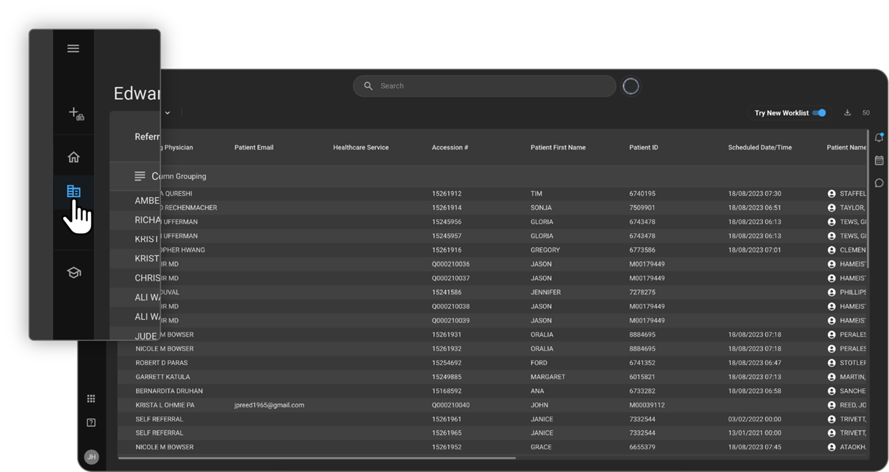
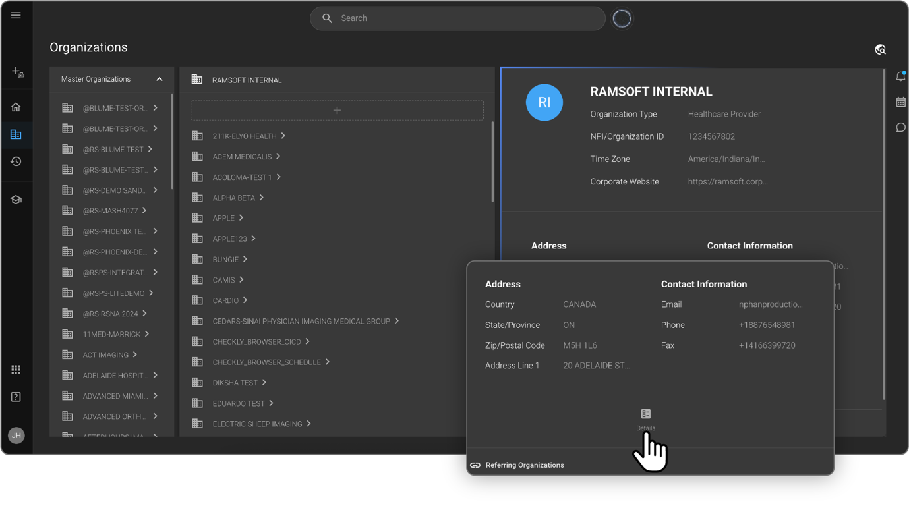
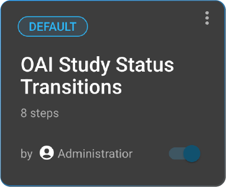
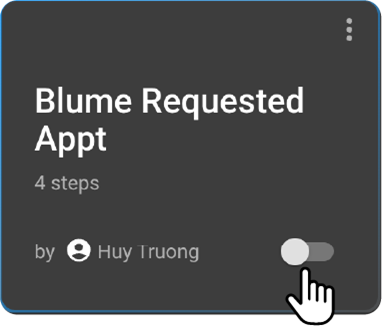
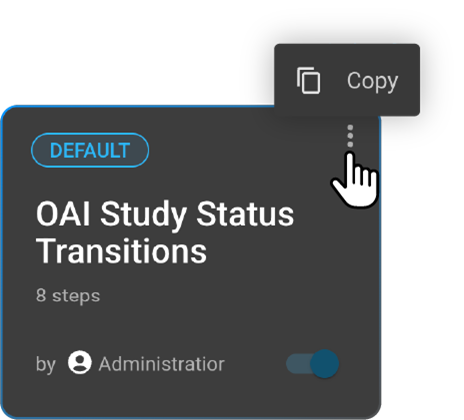
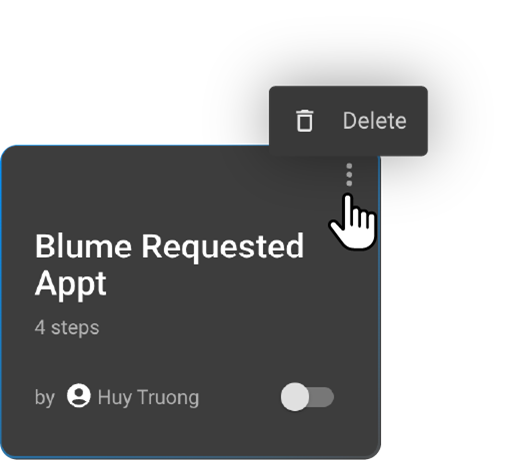

 
 
# Workflow Automation (WFA)

## 1. Introduction to Workflow Automation (WFA)

Workflow Automation (WFA) in OmegaAI is a powerful tool designed to automate routine and complex tasks within the OmegaAI system. It significantly reduces manual intervention, improves turnaround time, and supports consistent, rule-based decision-making. This functionality is particularly valuable in radiology and diagnostic environments, where timely communication, efficient task handoffs, and consistent system updates are critical to patient care and operational efficiency.

**Key benefits and capabilities of WFA include**

- **Automation of Tasks:** Automates repetitive or rule-based processes, reducing the need for manual intervention.
- **Streamlined Operations:** Helps to streamline operations and ensure consistent outcomes.
- **No-Code Configuration:** Users can define triggers, apply conditional filters, and execute system-driven actions without requiring any coding expertise.
- **Enhanced Efficiency:** Ensures faster communication, reduces delays, and frees up clinical and operational teams to focus on higher-value tasks, thereby enhancing accuracy and standardization.
- **Visual Management:** Provides a graphical user interface to create, copy, modify, and manage workflows visually.

## 2. Accessing the Workflow Automation Interface

The WFA interface in OmegaAI provides a consolidated grid view of all workflows configured for a given organization. This view includes both system-defined default workflows and any custom workflows created by the organization. Each workflow tile in the grid displays essential details and options for management.

**Steps to Access the WFA Module:**

1. **Log In:** Log in to OmegaAI using your appropriate user credentials.
2. **Navigate to Organizations:** From the main navigation panel, navigate to the "Organizations" section.

 

3. **Select Organization Details:** Select the desired organization (if multiple are available) and click the "Details" icon (usually located at the bottom or next to the organization name) to open its configuration settings.

 

4. **Select Workflow Automation:** In the configuration panel on the left-hand side, locate and select "Workflow Automation" (WFA), which is typically the fourth item in the list.

_Information Displayed in the WFA Grid Interface:_

Upon accessing the WFA interface, you will see a grid view where each workflow is represented by a tile. Each tile provides key information and action options:

- **Workflow Name:** The name given to the workflow.
- **Step Count:** The number of steps defined within the workflow (triggers, conditions, actions).
- **Creator:** The name of the user who created the workflow.
- **Enable/Disable Toggle:** A toggle switch to individually enable or disable the workflow, determining whether it is currently active.

- **Three-dot Menu:** Located at the top-right corner of each tile, this menu offers specific actions:
  - For **default workflows**, it provides a "Copy" option.

- For **custom workflows**, it provides a "Delete" option.

