 
 
# Understanding Triggers

Every workflow in OmegaAI begins with a Trigger Box, which appears by default on the canvas. A trigger is the starting event that activates a workflow. It is important to note that **only one workflow can be active per trigger at any given time**. If a trigger is already in use by an active workflow and you manually activate a new workflow using the same trigger, the existing workflow will be automatically deactivated to prevent conflicts.

## Trigger Categories and Detailed Examples

### Patient Triggers

Patient-based triggers initiate a workflow when specific patient-related events occur.

 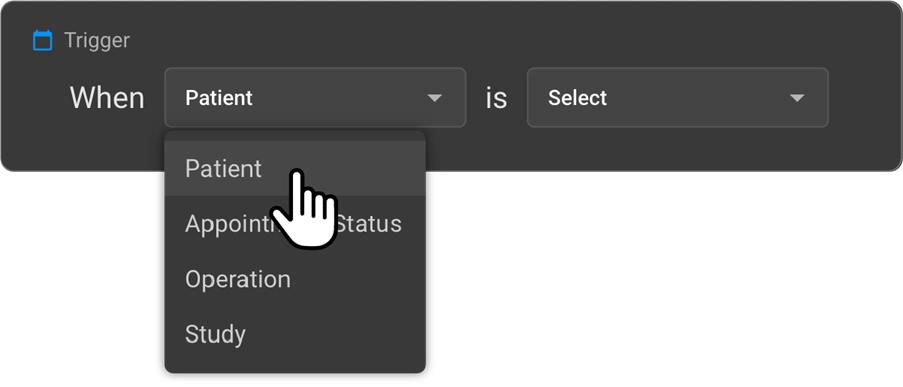

- **Newly created in OmegaAI:** This trigger is activated when a new patient record is created within the OmegaAI system, for instance, via the Blume platform.

 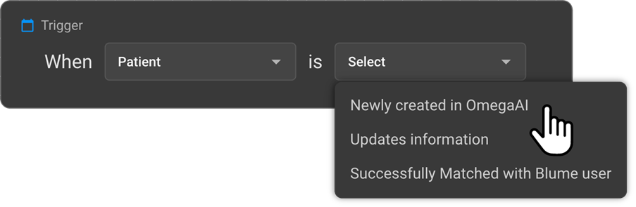

 **Example:** Once a patient's account is created, the system triggers a workflow to send a welcome email to the patient or initiate the onboarding process, guiding them through initial setup.

- **Updates information:** This trigger activates when any patient information is modified within OmegaAI, such as contact details, address, or insurance information.

 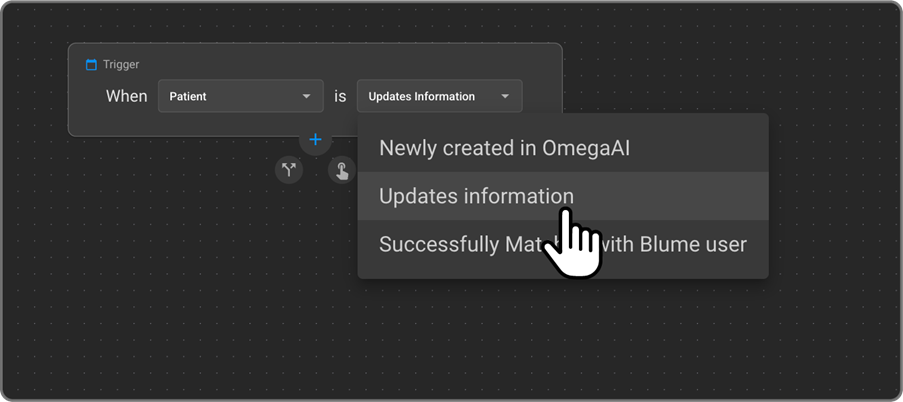

**Example:** If a user updates a patient’s phone number, it triggers a workflow to notify the administrative team or sync the updated data with integrated external systems like a CRM.

- **Successfully matched with Blume User:** This trigger is initiated when the system detects that a newly created Blume user account successfully matches an existing OmegaAI patient record.

 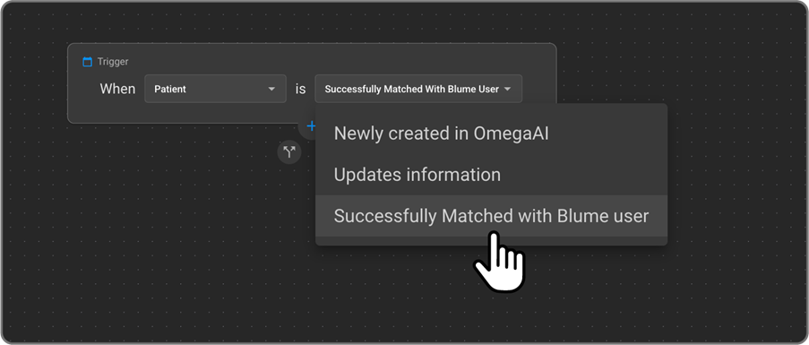

**Example:** If a patient registers through Blume using an email address that already exists in OmegaAI, the system automatically links the two records. Upon successful matching, a workflow may be triggered to confirm the match, notify internal teams (e.g., support staff), or update the patient’s linked status in the system.

### Appointment Triggers
Workflow automation can be initiated based on changes in the lifecycle status of patient appointments. These status changes serve as key triggers for launching specific automated actions within the system.

 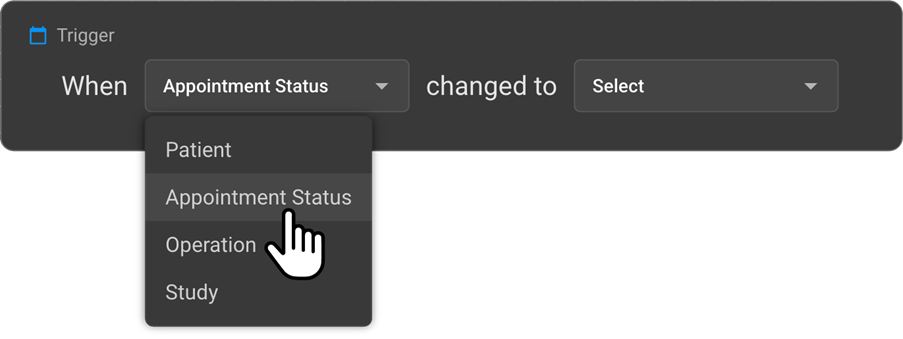

- **Supported Appointment Statuses**
  - Requested
  - Scheduled
  - Confirmed
  - Arrived
  - Ready for Scan
  - No Show
  - Cancelled

 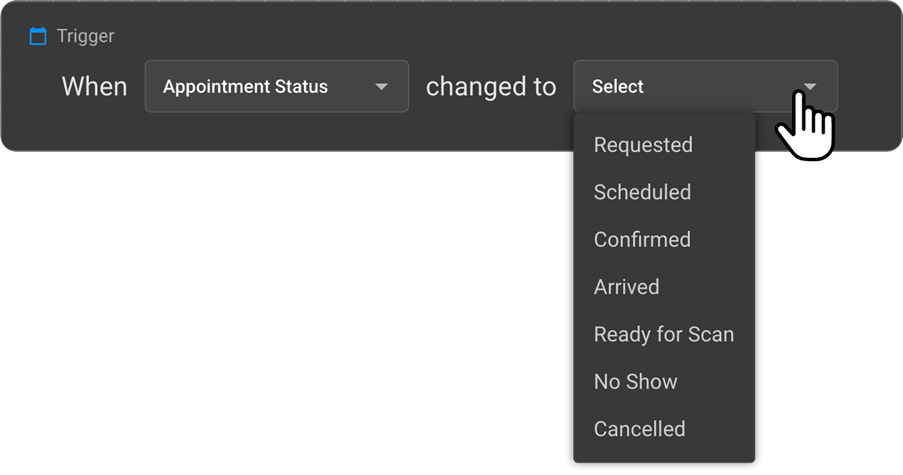

**Example Use Case**

  _Trigger_: Appointment status changes to **"No Show"**

\
  _Automated Actions_:

   a. Send an automated SMS to the patient with a link or instructions to reschedule.

   b. Generate an internal notification for the front desk team to follow up with the patient. This approach ensures timely communication, improves patient engagement, and enhances operational efficiency by reducing manual follow-ups.

### Operation Triggers

Operational triggers are based on key events that occur during the clinical and diagnostic processes within **OmegaAI**. These events can be used to initiate automated workflows that ensure timely communication, escalation, and documentation.

 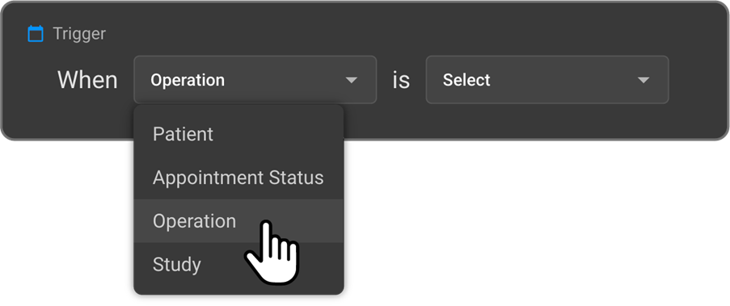

- **Supported Operational Events**

  - Done
  - Critical Finding Flagged
  - Amendment Request
  - Signed Report

 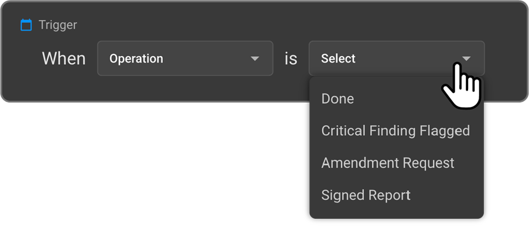

**Example Use Case**

_Trigger_: Operation marked as **Done**

_Condition_: **"Critical Finding Flagged"** is true

_Automated Actions_:

  a. Immediately send an urgent notification to the assigned reading physician.

  b. Notify the designated consulting organization for prompt review and action.

  c. This automation ensures that critical findings are escalated without delay, supporting faster clinical decision-making and improving patient safety.

### Study Triggers

Study-related workflows can be triggered based on specific parameters of a study.

 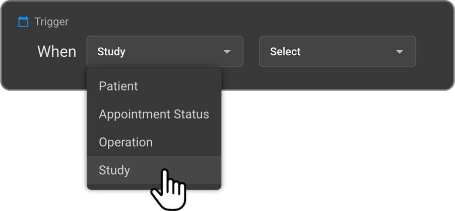

 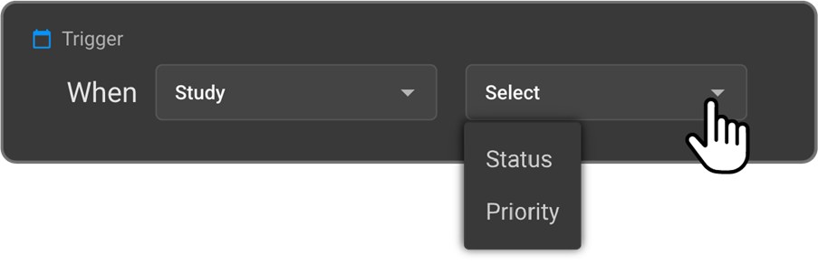
 
**Trigger Options**

1. **Status-Based Triggers**:
   A workflow can be triggered when a study transitions to a specific status.

   _Supported statuses include:_

   1. Scheduled
   2. Completed
   3. Verified
   4. Signed
   5. Reported
   6. In Progress
   7. Arrived
   8. Started
   9. To Be Amended

**Example Use Case:**

_Trigger_: Study status changes to **"Signed"**

_Automated Action_: Automatically distribute the finalized report to the referring physician.

2. **Priority-Based Triggers**: Workflows can also be triggered based on the **priority level** assigned to a study. 

 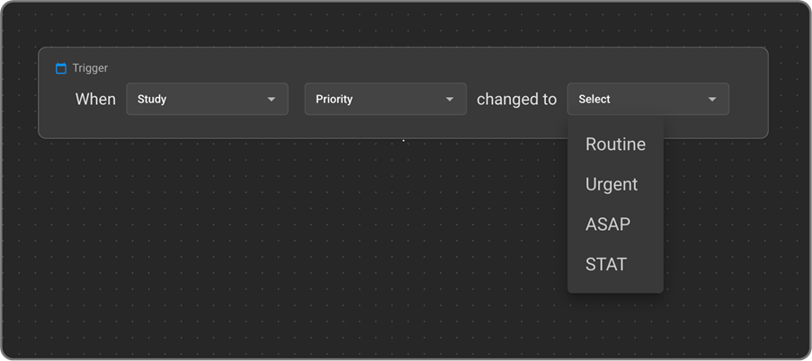

Supported priority levels include:

- Routine
- Urgent
- ASAP
- STAT

**Example Use Case:**

_Trigger_: Study priority is "**STAT**" and status changes to "**Signed**"

_Automated Action_: Distribute the report to the referring physician with a "**High** **Priority**" flag for immediate attention.

These triggers ensure that high-priority and time-sensitive studies are handled with the urgency they require, improving care coordination and response times.

