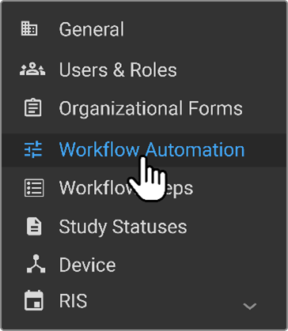
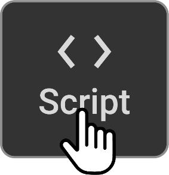
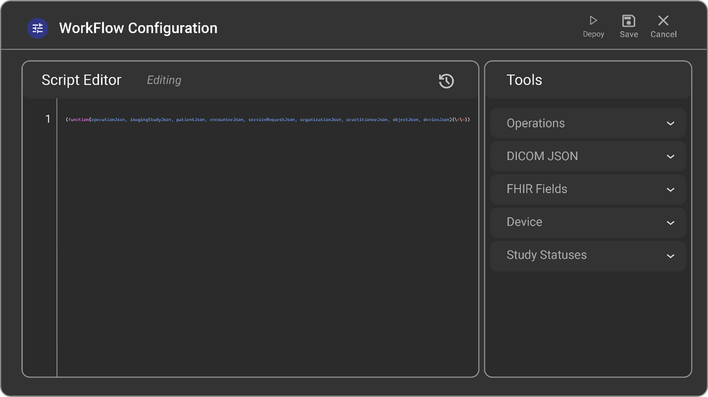

# Workflow Scripting


## Scripting

### DICOM Scripting

DICOM Scripting attributes DICOM Proxy and DICOM Wb.

### DICOM Proxy

**Operations:**

DICOM scripting within the DICOM Proxy currently supports 4 operations:

- **DICOM Send (CSTORESCU):** Sending DICOM objects to another entity.

- **DICOM Receive (CSTORESCP):** Receiving DICOM objects from another
  entity.

- **Outbound Find (CFINDSCP):** Applying scripts on the result dataset
  of C-FIND operations, which return search results.

- **Inbound Find (CFINDSCU):** Applying scripts on the request dataset
  of C-FIND operations, which contain search parameters.

Operation Types are defined as enums in **DICOMOperationType.cs** of
**RamSoft.Common**. This provides users flexibility to determine the
scenario in which they want to execute their logic.

**Sample Script:**

This script modifies the accession number by pre-pending it with 'RAM'
when receiving objects. If accession number is '1234', then the result
will be 'RAM1234'.

```javascript
(function() {
    var accessionNum;

    // For Operation DICOM Send
    if (Operation === 'CSTORESCU') {
        // Read for AccessionNumber
        if (DICOMObject["00080050"]) {
            accessionNum = DICOMObject["00080050"]["Value"];
        }

        // Update for AccessionNumber
        if ("00080050" in DICOMObject) {
            DICOMObject["00080050"] = {"vr" : "SH", "Value": [ 'RAM ' + accessionNum]}
        }
    }
})();
```

### DICOM Web

**Operations:**

DICOM scripting within the DICOM Web involves several operations:

- **Search Inbound (SearchInbound):** Searching for DICOM objects in the
  inbound direction.

- **Search Outbound (SearchOutbound):** Searching for DICOM objects in
  the outbound direction.

- **Retrieve Inbound (RetrieveInbound):** Retrieving DICOM objects in
  the inbound direction.

- **Retrieve Outbound (RetrieveOutbound):** Retrieving DICOM objects in
  the outbound direction.

- **Store Inbound (StoreInbound):** Storing DICOM objects in the inbound
  direction.

- **Store Outbound (StoreOutbound):** Storing DICOM objects in the
  outbound direction.

Operation Types are defined as enums in **DICOMOperationType.cs** of
**RamSoft.Common**.

**Sample Script:**

This script demonstrates various scenarios of modifying DICOM attributes
based on different operations.
```javascript
(function () {
    var patientName;
    if (Operation === 'SearchOutbound') {
        // Read for PatientName
        if (DICOMObject['PatientName']) {
            patientName = DICOMObject['PatientName'];
        }
        // Update for PatientName
        if ('PatientName' in DICOMObject) {
            DICOMObject['PatientName'] = 'SearchOut^' + patientName;
        }
    }

    if (Operation === 'SearchInbound') {
        // Read for PatientName
        if (DICOMObject['PatientName']) {
            patientName = DICOMObject['PatientName'];
        }
        // Update for PatientName
        if ('PatientName' in DICOMObject) {
            DICOMObject['PatientName'] = 'SearchIn^' + patientName;
        }
    }

    var accessionNum;

    if (Operation === 'StoreOutbound') {
        // Read for AccessionNumber
        if (DICOMObject['00080050']) {
            accessionNum = DICOMObject['00080050']['Value'];
        }

        // Update for AccessionNumber
        if ('00080050' in DICOMObject) {
            DICOMObject['00080050'] = { vr: 'SH', Value: ['StoreOut^' + accessionNum] };
        }
    }

    if (Operation === 'StoreInbound') {
        // Read for AccessionNumber
        if (DICOMObject['00080050']) {
            accessionNum = DICOMObject['00080050']['Value'];
        }

        // Update for AccessionNumber
        if ('00080050' in DICOMObject) {
            DICOMObject['00080050'] = { vr: 'SH', Value: ['StoreIn^' + accessionNum] };
        }
    }

    if (Operation === 'RetrieveOutbound') {
        // Read for AccessionNumber
        if (DICOMObject['00080050']) {
            accessionNum = DICOMObject['00080050']['Value'];
        }

        // Update for AccessionNumber
        if ('00080050' in DICOMObject) {
            DICOMObject['00080050'] = { vr: 'SH', Value: ['RetrieveOut^' + accessionNum] };
        }
    }

    if (Operation === 'RetrieveInbound') {
        // Read for AccessionNumber
        if (DICOMObject['00080050']) {
            accessionNum = DICOMObject['00080050']['Value'];
        }

        // Update for AccessionNumber
        if ('00080050' in DICOMObject) {
            DICOMObject['00080050'] = { vr: 'SH', Value: ['RetrieveIn^' + accessionNum] };
        }
    }
})();
```

## Workflow Scripting Using the Script Editor

The Workflow Script Editor empowers users to tailor workflows using
JavaScript scripting. This feature grants managing organizations the
flexibility to design custom scripts that define their workflow, which
can then be inherited by child or imaging organizations. The Script
Editor provides shortcuts for commonly used operations, JSON DICOM
resources, and other parameters, facilitating seamless customization.

## Steps to Configure Workflow Using the Script Editor:

1.  **Access Workflow Scripting:** Navigate to the Workflow Automation
    section.



2.  **Open Script Editor:** Click on top right side of Workflow
    Automation, which will direct you to the Workflow Scripting page.



3.  **Edit Script:** Click on the "Edit" button to open the script in
    the Workflow Script Editor. This action will reveal the Tools
    drawer, containing various options to streamline script creation.

4.  **Utilize Tools Drawer:** The Tools drawer offers several
    functionalities:

> **Operations:** Features shortcuts for Fetch, Retrieve and Route,
> Route, and Status Transition operations, facilitating workflow
> customization.
>
> **DICOM JSON:** Helps compose the DICOM JSON structure necessary for a
> Fetch operation.
>
> **FHIR Fields:** Provides access to commonly used FHIR fields for easy
> integration. You can drag and drop these fields into the Script
> editor.
>
> **Devices:** Displays the list of stations associated with the
> specific organization.
>
> **Study Statuses:** Displays a list of study statuses for reference.



5.  **Script Creation:** You can either directly type the workflow
    script in the Workflow Script Editor or utilize the shortcuts
    provided in the Tools drawer to streamline script creation.

6.  **Deploy Script:** Once the script is created, click on "Deploy."
    This action ensures that the script is ready and executed when the
    relevant event occurs.

7.  **Save or Discard Changes:** After creating or editing the script,
    you can choose to "Save" to retain the changes or "Cancel" to
    discard them.

## Customizing Workflow with Operations:

1.  **Fetch Operation:** Executes a C-FIND against all archive stations
    associated with the managing organization using the OmegaAI Link
    device. This operation searches for studies based on defined search
    parameters within the C-FIND JSON structure. Note: Only DICOM
    stations with the "Archive Server" option enabled will be searched.

2.  **Retrieve and Route Operation:** Fetches a study from an archive
    station and subsequently routes it to another station. The common
    use case is to send a study within the system along with the
    pre-fetched prior studies.

**Sample Fetch and Routing Script:**
```javascript
(function(operationJson, imagingStudyJson, patientJson, encounterJson, serviceRequestJson, organizationJson, practitionerJson) {
    function getExtensionValue(imagingStudyJson, url, type) {
        let data = imagingStudyJson['extension'].find((item) => {
            return item.url == url;
        });
        return data ? data[type] : null;
    }

    if (getExtensionValue(imagingStudyJson, 'http://hl7.org/fhir/us/core/StructureDefinition/status', 'valueString') == 'COMPLETED') {
        let findDICOMJson = {};
        findDICOMJson["00100020"] = { "vr": "LO", "Value": [ patientJson.identifier[0].value ] };
        findDICOMJson["00100010"] = { "vr": "PN", "Value": [ patientJson.name[0].text ] };
        // Find related studies
        host.fetch(imagingStudyJson, patientJson, findDICOMJson);
    }

    if (operationJson.type == 'Fetched Studies') {
        let studies = operationJson.studies;

        // determine which studies is relevant
        for (let study of studies) {
            if (study.description == 'PET/CT SKULL TO MILD THIGH') {
                host.retrieveAndRoute(study, 'toronto-hgua', 3);
            }
        }

        // Route to device
        host.route('toronto-hgua', 3);
    }
})();
```

3.  **Route Operation:** Sends a study within OmegaAI to another system.
    This operation is accomplished by posting a DICOM store task, which
    is then processed by the OmegaAI Link device. Note: A common use
    case involves sending a study within the system along with
    pre-fetched prior studies.

**Sample Script for Routing Objects:**

This script will send individual objects as soon as they are received
or imported.

```javascript
(function(operationJson, imagingStudyJson, patientJson, encounterJson, serviceRequestJson, organizationJson, practitionerJson, objectJson, deviceJson) {
    if (operationJson.type == 'DICOM Object Received' || operationJson.type == 'DICOM Object Imported' ) {
        // Route object to device (objectJson, imagingStudyJson, deviceName,deviceId)
        host.routeObject(objectJson, imagingStudyJson, '11MED PACS LitePowerServer', 51);
    }
})
```
