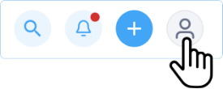
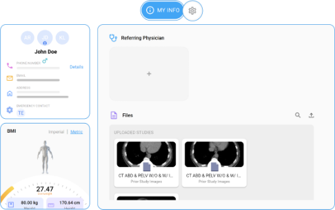
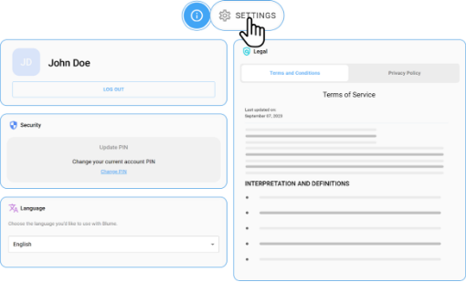
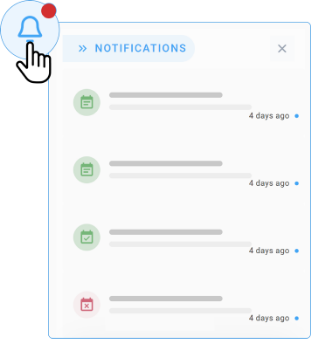
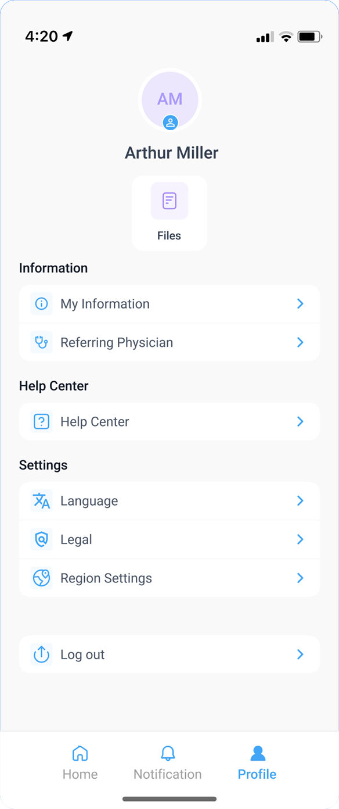
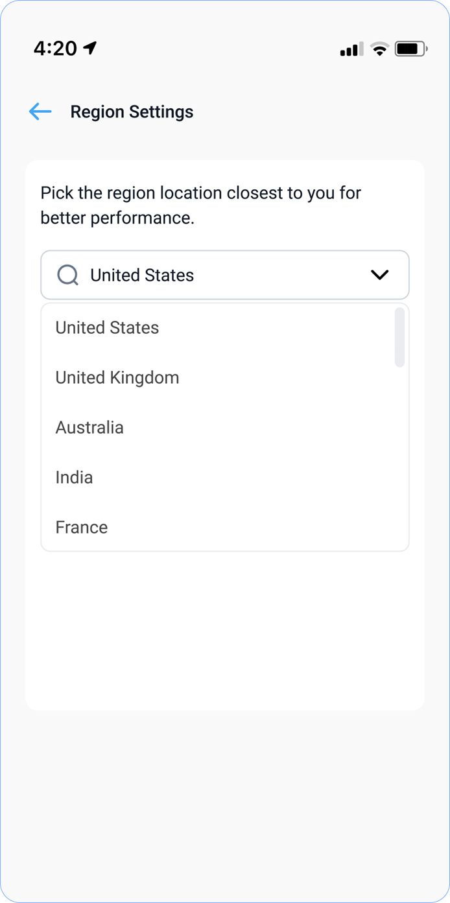
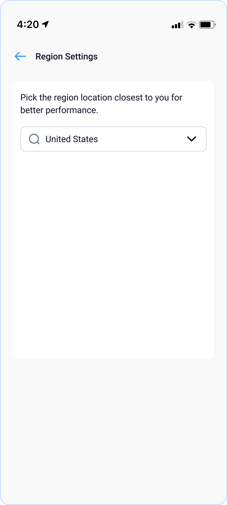

# Patient Engagement Capabilities

## My Profile

The My Profile section of Blume application offers the following
capabilities:

### My Info

After you click the My Profile icon from the top right corner of the
Blume homepage, by default the **MY INFO** icon will be selected.

This section includes information such as:

- **General Information**: Personal Information, Address, Contact
  Information, Emergency Contacts

- **Body Mass Index (BMI)**: Imperial, Metric

- **Files**: Documents and studies. The supported file formats JPEG,
  PNG, PDF, MP4 and DICOM.

- **Referring Physician**: Physician Details

    

### Searching for Information and Using AI Assistance**

## Search

Patients can use search to easily retrieve desired material within Blume
Patient Portal.

### Search for Information on Specific Functions or Features

You can type your query in the search box. As you type, the search
returns information that's relevant to your query. Additionally, when
you click the search bar, a list of your recently searched and viewed
queries are displayed.

#### Searching for Specific Functions or Features:**

1.  **Using the Search Box:**

- Type your query directly into the search box.

- Relevant information will be displayed as you type.

2.  **Recent Queries:**

- Clicking the search bar displays a list of your recently searched or
  viewed queries for quick access.

3.  **Search Categories:**

- Help Articles: Located at the top of the Help Center homepage

- Appointments: Denoted by the search icon at the top of the homepage.

- Fetches data from Studies, Share, and Help Center.

- All Option: Displays results from all categories.

- Filter Option: Refines your search results to narrow down information.

#### **How to Use AI for Definition and Explanation Searches:

1.  Navigate to Global Search at the top of the homepage.

2.  Input keywords, including medical terms, abbreviations, or complex
    phrases.

3.  An AI window will appear on the right navigation panel.

4.  The AI reads and interprets the term, providing a clear definition
    and explanation in the popup window.

### Viewing Notifications

**To view your notifications, click on the bell icon located at the top right corner of the home page. A list of notifications will appear, sorted by date.**

- *Unread* notifications are marked with a <u>red</u> dot beside them.

- *Read* notifications are marked with a <u>blue</u> dot.

- If there is a *new* notification, a <u>red</u> dot will also appear
  beside the bell icon on the home page.

### Managing Physician Information and Profiles

**Adding Information About Your Physician**

To add details about your referring physician follow the following steps:

1. Click on the **Profile** icon at the top right corner of the page.

2. Toggle to **My** **Info** from the menu.

3. You can see the Referring Physician option at the center.

4. Click the plus **(+)** icon in the dotted box.

5. A window will open to add new referring physician details, ΓÇ£*Add New
  My PhysicianΓÇ¥*

6. Fill in the required details (PhysicianΓÇÖs Name, Specialization, Phone
  number, email ID) and click **Add** to save the information.

#### Editing or Updating Referring Physician Information

**To edit or update your referring physicians details follow as below:**

1. Click on the ***Profile*** icon at the top right corner of the page.

2. Select **My Info** from the menu.

3. Hover over the **Referring Physician Information** row until the
  **Edit** icon appears.

4. Click on the **Edit** icon to open the **Referring Physician** window.

5. Cards with physician details will appear on the right side of the
  screen.

6. Hover over the card to access the **Edit** and **Delete** options.

7. Click on the **Edit** icon, modify the details, and click **Save** to
  update.

#### Removing a Referring Physician from the List

**Follow the steps below to delete a referring physician from your profile:**

1. Click on the **Profile** icon at the top right corner of the page.

2. Select **Referring** **Physician** Information from the menu.

3. The Referring Physician window will display existing physician details
  in card format at the bottom of the screen.

4. Hover over the card to see the **Edit** and **Delete** options.

5. Click and hold on the **Delete** icon. The physicianΓÇÖs details will be
  removed from the list.

#### **Switching Profiles to View Selected Information**

**To switch between profiles:**

1. Click on the Profile icon at the top right corner of the page.

2. Toggle the My Info button on.

3. On the left side, you will see all profiles linked to your account.

4. Select a profile from the icons on either side of the primary account
  holders profile.

5. Click on the profile photo you want to switch to. The selected profile
  will move to the center and be highlighted.

### Managing Documents

#### **Uploading Documents**

1.  Go to Profile and toggle My Info on.

2.  Below the Referring Physician section, find the Files section.

3.  Click on the arrow icon to upload.

4.  Click on the Upload icon and select/browse files from your system.

5.  You can upload multiple documents at once, and a progress pop-up
    will indicate the upload status.

6.  Scroll down to view your uploaded studies/documents.

7.  Alternatively, you can drag and drop files to upload:

8.  Open the folder containing the file you wish to upload.

9.  Drag the file into the Documents section.

10. The image will appear on the screen. (Supported file formats: JPEG,
    PNG, PDF, MP4, and DICOM.)

#### **Viewing Documents**

1.  Click on the Files tab on the Profile page.

2.  Use the **Search Bar** above the "Documents" heading to search by
    text.

3.  All uploaded documents, images, and videos will be displayed in
    **tile format**.

4.  Click on a tile to open and view the document/image/video.

#### **Deleting a Document**

1.  Go to your Profile and toggle on My Info.

2.  Scroll down to the **Files** section.

3.  Hover your cursor over the document tile you want to delete.

4.  Click the **circle** on the left corner of the tile to select the
    document.

5.  A **toolbar** with the following options will appear:

- Delete

- Download

- Share

- Rename

To delete one or multiple documents, **select the desired files**
and **hold the Delete button** until the action is confirmed.

#### **Downloading a Document**

1.  Go to your Profile and toggle on My Info.

2.  Scroll down to the **Files** section.

3.  Hover your cursor over the document tile you want to download.

4.  Click the **circle** on the left corner of the tile to select the
    document.

5.  A **toolbar** with the following options will appear:

- **Delete**

- **Download**

- **Share**

- **Rename**

  1.  Click on the Download icon. You can see the progress in the pop-up
      window.

      1.  Alternative Download Options from Completed Appointments

          1. Go to the Completed Appointments section and click on Download Results
             to download reports and images.

          2. You can also click **View Reports** to open them in a new window and
             download them using the **Download** button at the top right corner.

          3. To download images, click **View Images** and use the **Download**
             icon at the bottom of the Image/Document Viewer.

          4. In the Image Viewer, locate the **toolbar at the top** and click on
             the **three dots** icon.

          5. Select **Download Images** or **Download Study** to proceed.

#### **Sharing a Document**

1.  Go to your Profile and toggle on My Info.

2.  Scroll down to the **Files** section.

3.  Hover your cursor over the document tile you want to share.

4.  Click the **circle** on the left corner of the tile to select the
    document.

5.  A **toolbar** with the following options will appear:

- **Delete**

- **Download**

- **Share**

- **Rename**

   1.  Click on the Share icon.

   2.  A Share Window will appear.

   3.  You can share the documents with the listed healthcare providers.

#### **Renaming a Document**

1.  Go to your Profile and toggle on My Info.

2.  Scroll down to the **Files** section.

3.  Hover your cursor over the document tile you want to rename.

4.  Click the **circle** on the left corner of the tile to select the
    document.

5.  A **toolbar** with the following options will appear:

- **Delete**

- **Download**

- **Share**

- **Rename**

    1.  Click on the Rename icon (pencil symbol).

    2.  The **Rename Window** will appear on the right side of the screen.

    3.  Choose a name by either:

    4. Selecting from the **Predefined Options**-You can choose from the
       dropdown menu.

    5. Entering a **Custom Name** of your choice.

    6. Click **Save** to apply the new name.

#### **How do I give consent for auto-sharing uploaded documents?**

You will be prompted to provide consent for auto-sharing your uploaded
documents while requesting or rescheduling an appointment.

1.  <u>Choose a Slot</u>: Select the preferred date & time from the
    available slots.

2.  <u>Upload Attachments</u>: You can upload images, reports, or other
    relevant documents by browsing and selecting files from your system.

3.  <u>Consent Prompt:</u> After uploading, a prompt will appear
    requesting your consent for document sharing

4.  <u>Review the Informed Consent Statement:</u> Carefully read the
    statement, which outlines that by agreeing, you authorize the
    sharing of your documents, images, and studies for healthcare
    treatment.

5.  <u>Confirm Agreement:</u> Click on "I Agree" to proceed.

### Settings

To access Settings, click the SETTINGS wheel beside the My Info icon at
the top centre of the page.

The Settings page includes the following information:

- Security: Update PIN

- Legal: Terms and Conditions and Privacy Policy

- Language: English, Spanish, French, Hindi

- Logout

### Change Password or PIN

#### **To change your PIN, follow these steps:**

1.  Log in to your account.

2.  Navigate to the top right corner and click on your profile name to
    access the Profile.

3.  Click on the Profile Icon and select the Settings tab.

4.  Under the Security section (below your profile name), locate the
    message: "Change your current account PIN."

5.  Click on Change PIN.

6.  Enter your Current PIN to proceed. A message will appear: "Enter
    current PIN to reset new PIN."

7.  After entering the current 6-digit PIN, click Edit.

8.  If the PIN is incorrect, an error message will appear: "Incorrect
    PIN, please try again."

9.  You have three attempts to enter the correct PIN. If unsuccessful,
    your account will be temporarily locked out for security reasons. A
    message will state: "Your account is temporarily locked to prevent
    unauthorized use. Try again later."

10. If the PIN is correct, you will be redirected to a new page to Reset
    Your PIN.

11. Enter a New PIN and then Re-enter it to confirm.

12. If the PINs do not match, an error message will appear: "PINs do not
    match. Please try again." The Update button will be disabled until
    matching PINs are entered.

13. Once the PINs match, the Update button becomes active. Click Update
    to complete the process.

14. A success message will confirm: "Your PIN has been successfully
    reset."

15. Click Done to return to the Security Page under the Settings tab.
    You can now navigate to other sections as needed.

When using Single Sign-On (SSO) methods like Gmail or Facebook, the system does not prompt users to set or change a PIN. The option of changing the PIN is not supported. 

This is because users are authenticated through their external accounts, which already have their security measures in place.

For users who sign in with methods other than SSO, where they provide all their details and set up a PIN during the signup process, the Change PIN option becomes 

available. In these cases, since the user has explicitly set a PIN for security, they will be able to change it later.

This distinction ensures that only users who initially set up a PIN will have the option to modify it. Users authenticated through third-party services will not encounter 

the Change PIN option because the system does not handle their PIN setup.

### Terms and Conditions & Privacy Policy

1.  Click on the Profile Icon.

2.  Toggle and Navigate to the Settings tab.

3.  On the rightmost side of the page, under Legal, click Terms &
    Conditions or Privacy & Conditions as needed.

4.  The relevant legal information will be displayed.

### Change the Language

1.  Click on the Profile Icon.

2.  Navigate to the Settings tab.

3.  Under the Language section on the left, you will see the message:
    **"Choose the language youΓÇÖd like to use with Blume.**

4.  Select your preferred language from the dropdown list:

- **English**

- **Spanish**

- **Hindi**

- **French**

### Logout of Blume

1.  Go to the Home Page and hover over your username icon at the top
    right corner.

2.  A **drop-down menu** will appear with two options: **Profile** and
    **Logout**.

3.  Click on **Logout** to sign out.

Alternative Method:

4.  Click on Profile to navigate to the My Info page.

5.  Go to **My Settings**.

6.  Find your **username** and click the **Logout** button below it

### Creating a new Blume account using the Blume’s Login / Signup flow

Topics include the following:

**Signup (Create Account)**:

a) Using **Email id, Phone number, & PIN** (Local account).

b) Using **Social IDPs** (GOOGLE, FACEBOOK, MICROSOFT, APPLE)

**Login**:

c) Using **Email id, Phone number** (Local account)

d) Using **Social IDPs** (GOOGLE, FACEBOOK, MICROSOFT, APPLE).

 

**Signup (Local Account)**:

1. Click on the **Register** button in the **Sign in to Use Blume** screen.

2. Register window opens.

3. Enter the mobile number or email id under **Sign up with your details** section.. . .

4. Click on the **REGISTER** button.

5. System performs check on whether phone number and email ids are unique and not already associated with a blume account.

6. If these parameters are new - then proceeds to the next step to create an account.

7. If either of these parameters are already associated with blume, then an error message “Blume account with similar credential already exists” appears.

**Signup (Social Account)**:

1. Click on the **Register** button in the **Sign in to Use Blume** screen.

2. Register window opens.

3. Click on any of the social symbol.

4. Authentication happens using social credentials.

5. User is directed to the information page.

6. Enter FIRST NAME, LAST NAME, DATE OF BIRTH, and PHONE NUMBER.

7. Signup button brightens after all the information is entered.

8. Mobile number authentication takes place, where OTPs are verified.

9. “Verify and proceed” button is enabled after entering the valid OTP.

10. Blume account is created and user gets directed to the home page of the Blume.

 

**Login (Phone number)**

1. Click on **Login with Phone** option.

2. Based on the browser’s location - the country flag/country code is show by default.

3. Click on the **Procced** option.

4. If the phone number is not available in B2C, then we show the error - “The provided phone number is either invalid or not linked to any Blume account”.

5. If the phone number is valid, the user next proceeds to B2C PIN screen.

6. The phone number is auto populated already from the previous screen.

7. Enter the 6-digit PIN.

8. If the PIN is invalid, then we show the error - “The provided PIN is invalid. Please click “Forgot your PIN” to reset your PIN.”.

9. If the entered PIN is correct, then user is taken to MFA/Authentication screen.

10. Click on the **Proceed** button, the entered phone number has to be authenticated to login.

11. The **Verify and Proceed** becomes enabled on entering valid OTP.

 

**Login (Email)**:

1. Click on **Login with emai**l option.

2. Click on **Procced** button.

3. If the email is not available in B2C, an error message “The provided email id is either invalid or not linked to any Blume account” appears.

4. If the email id is valid, the user proceeds to B2C PIN screen.

5. The email is auto populated already from the previous screen.

6. Enter the PIN to enable **proceed** button.

7. User proceeds to MFA/Authentication screen.

8. Click the **Proceed** button, to authenticate to login.

9. The **Verify and Proceed** becomes enabled on entering OTP.

 

**Login (Social Account)**

1. The email that the user chooses for social signup needs to be validated with the social IdP.

2. Click on **Login with emai**l option.

3. Provide the social account email.

4. Click on **Proceed** button.

5. If the email is not registered in our system, an error message “The provided email id is either invalid or not linked to any Blume account” appears.

6. If the email id is valid, the user proceeds to respective Social identity provider authentication screen.

7. If successfully authenticated by third party social account, then the users logs into the Blume account.

8. If authentication is failed, the user will be directed back to the Blume login screen.

## FAQs for Creating and Accessing a Blume Account

### Signup Process

#### 1. How can I create a Blume account? 

You can create a Blume account using: 

Email ID, Phone Number, and PIN (Local Account) 

Social Identity Providers (Google, Facebook, Microsoft, Apple) 

#### 2. What is the process for signing up with an email ID or phone number? 

1. Click the Register button on the "Sign in to Use Blume" screen. 

2. Enter your email or phone number under the "Sign up with your details" section. 

3. Click REGISTER. 

   If your credentials are unique, you can proceed. Otherwise, you'll see an error: “Blume account with similar credential already exists.” 

#### 3. How can I create an account using a social account (Google, Facebook, Microsoft, or Apple)? 

1. Click the Register button on the "Sign in to Use Blume" screen. 

2. Select a social account by clicking its icon. 

3. Authenticate via your social account credentials. 

4. Provide additional details like First Name, Last Name, Date of Birth, and Phone Number. 

5. Verify your phone number with an OTP to complete the signup process. 

#### 4. How Do I Create a New Blume Account? Explain the steps involved?

You can create a Blume account using two methods:

1. Using *Email ID:* To create a Blume account using your email ID,
   phone number, and PIN, follow these steps:

   1.  Access the Registration Page:

        - Click on the **Register** button at the bottom of the **Sign In** page
           on the Blume portal.

        - The **Registration** window will open.

     2.  Select Signup Method:

          - Choose **Sign up with your details** to create the local account.
  
     3.  Enter Your Details:

          - Provide the required details, including **Given Name**, **Family
            Name**, **Date of Birth (DOB)**, and **Email ID**.

           (Note: If the email ID has already been used to sign up for another patient, 
           an error message will appear: "This email already exists. Please use another email.")

      4.  Create a PIN:

           - Create a **6-digit PIN** and re-enter it to confirm.

       5.  Complete Registration:

            - Click on the **REGISTER** button.

            - The system will check to ensure that the **email ID is unique** and
               not already linked to an existing Blume account.

           - If these details are new, the system will proceed to create the
             account.

       6.  Verify Your Account:

            - After clicking **Register**, a **unique verification code (OTP)** is
              sent to your registered email.

            - Enter this OTP on the sign-up screen to verify your account.

            - If you did not receive the OTP, click on **"Resend OTP"** below the
              OTP box.

        7.  Account Creation Confirmation:

             - Once the OTP is verified, your account is created, and you will be
                **automatically redirected to the home page/dashboard** of your Blume
                account.

2.  Using Social IDPs (*Google, Facebook, Microsoft, Apple*)

     To create a Blume account using a social identity provider (Social IDP), follow these steps:

     1.  Access the Registration Page:

          - Click on the **Register** button at the bottom of the **Sign In** page
             on the Blume portal.

          - The **Register** window will open.

      2.  Select Signup Method:

           - Choose **Sign up with Socials** to use one of the available social
             identity providers. 

       3.  Select a Social IDP:

            - Click on the relevant social platform's icon: **Google**,
              **Facebook**, **Microsoft**, or **Apple**.

        4.  Authenticate Using Social Credentials:

            You will be redirected to the respective social platform's login page:

             - **Facebook:** Enter your credentials on the Facebook login page.

             - **Google:** Choose from the list of email addresses already used on
                  your browser or select **Use another account**. After selecting,
                  verify your login by clicking **Continue**.

                 *(Note for Google Users: After selecting your email, you will be asked
                   to verify your login. Click Continue to proceed.)*

              - **Microsoft/Apple:** Enter your credentials to continue. (For
                 **Apple**, use your **Email ID** or **Phone Number**.)

     5.  Complete Registration on Blume:

          - After authenticating with the chosen social IDP, you will be
            redirected to the Blume registration page.

         - Enter your **Given Name**, **Family Name**, and **Date of Birth
           (DOB)**.

      6.  Finalize Account Creation:

           - Click on **Register** to complete the signup process.

           - Your Blume account will be created, and you will be **redirected to
              the home page** of Blume.

             **Note:**

             - When signing up using **Social IDPs**, no PIN is required, as
               authentication is managed through the social platforms security
               measures.

            - If you use a **local account**, you must set up and verify a **6-digit
              PIN** for security.

#### What details do I need to provide to sign up?

You will need to enter your ***Given Name***, ***Family Name***, ***Date of Birth*** (DOB), and ***Email ID***.

#### Can I use my phone number, email ID, or both to sign up?

You can sign up using your email address only. 

#### Can I sign up using my social media accounts?

Yes, you can sign up using your Facebook/ Google/Microsoft or Apple accounts.

#### Can I use the same email address to sign up for multiple family members?

Yes, you can use the same email address to sign up for multiple family
members. The healthcare provider can link multiple patients to a single
account and you can switch between the profiles to view reports/images
and appointments. 

#### What should I do if I get, a User Already Exists error during sign-up?

1. You can try signing up with a different email address. 

2. Enter the 6-digit PIN created during sign-up and click on Proceed.

3.  If you are getting the same error, you can try to Reset your PIN.

4.  Click on Forgot PIN to reset it.

5.  A 6-digit OTP will be sent to your registered email.

6.  Enter the OTP and click Resend if you didn't receive it.

7.  Click Verify and Proceed to continue.

8.  If the <u>issue persists</u>, contact your healthcare provider to change the email address used initially for sign-up.

### Mobile App

#### Is there any mobile application available for easier access?

Yes, a mobile application is available for seamless access to your
account. You can download it from the **Google Play Store** for
**Android devices** and from the **Apple App Store** for **iPhones**.
The app provides a user-friendly interface, allowing you to conveniently
manage your studies, appointments, and reports on the go.

#### How do I sign up through a mobile app?

1.  Go to <u>Google Play Store</u> for Android/<u>App Store</u> for Apple devices.

2.  Go to the Home screen of your device.

3.  Locate the downloaded app.

4.  Click the icon.

5.  You will be directed to the Sign In page.

    - If you are already registered, you can use your email address in the
      email search box and click on Proceed.

    - You will be directed to the home page of the Blume Patient Portal.

6.  If you are first time user, click on the Register button below the
    search box.

7.  You can either use your socials to log in or register using your
    email id.

8.  For social IDP

    - **Facebook**: Enter your Facebook credentials.

    - **Google**: Select an email from the list or use another account, then
      click Continue to verify.

    - **Microsoft**/**Apple**: Enter your credentials (use your Email ID or
      Phone Number for Apple).

    - Complete *Registration*: After authentication, fill in your Given
      Name, Family Name, and DOB on the Blume registration page.

    - Finalize Account Creation: Click Register to complete the signup and
      be redirected to Blume's home page.

9.  For registering through your email:

    - **Access the Registration Page:** Click on the Register button on the
      Blume Sign-In page to open the Registration window.

    - **Select Signup Method:** Choose "Sign up with your details" for local
      account creation.

     - **Enter Your Details:** Provide your Given Name, Family Name, DOB, and
       Email ID. (Note: If the email is already registered, an error message
       will appear.)

     - **Create a PIN:** Set and confirm a 6-digit PIN.

     - **Complete Registration:** Click REGISTER. 

     - **Verify Your Account:** Enter the OTP sent to your registered email.
       Click "Resend OTP" if needed.

      - **Account Confirmation:** After OTP verification, your account is
        created, and you are redirected to your Blume dashboard.

### Registration

#### Can I register on behalf of someone else, such as a family member or a minor?

Yes, you can register on behalf of a family member. However, to link
multiple patient profiles to your registered account, you must contact
your healthcare provider and ensure that the same email address used
during registration is provided for all profiles.

#### Do I need to provide my insurance details during registration?

No, you do not need to provide any insurance details during registration.

### Verification

#### Why do I need to verify my email during sign-up/registration?

It is required for authentication and to avoid fraudulent activities.

#### I didn't receive the verification code. What should I do?

1.  Check your spam or junk folder.

2.  Ensure your email is entered correctly without any mistakes.

3.  Click on the verify button to resend the OTP.

4.  Check your internet connection.

5.  If the issue persists, contact your healthcare provider for
    assistance.

### Login Process

#### 1. What are the login options for accessing my Blume account? 

You can log in using: 

Email ID or Phone Number (Local Account) 

Social Identity Providers (Google, Facebook, Microsoft, Apple) 

#### 2. How do I log in using my phone number? 

1. Click Login with Phone. 

2. Enter your phone number and click Proceed. 

   If the phone number is registered, proceed to enter your 6-digit PIN. 

3. Authenticate your login by verifying an OTP. 

   **Note**: If the phone number is invalid or not linked to an account, you'll see: “The provided phone number is either invalid or not linked to any Blume account.” 

#### 3. How do I log in using my email address? 

1. Click Login with Email. 

2. Enter your email address and click Proceed. 

   If the email is valid, enter your PIN and verify your login with an OTP. 

   **Note**: If the email is invalid or not linked to an account, you'll see: “The provided email id is either invalid or not linked to any Blume account.” 
 
#### 4. How do I log in using a social account (Google, Facebook, Microsoft, or Apple)? 

1. Click Login with Email. 

2. Provide your email associated with the social account. 

3. Authenticate using the respective social identity provider. 

   **Note**: If the email is not linked to a Blume account, you'll see: “The provided email id is either invalid or not linked to any Blume account.” 

#### 5. What should I do if my login PIN is invalid? 

If your PIN is invalid, you'll see: “The provided PIN is invalid. Please click 'Forgot your PIN' to reset your PIN.” Follow the reset process to regain access. 

#### 6. What happens if my social account authentication fails? 

If authentication with a third-party social account fails, you will be redirected back to the Blume login screen to try again. 

#### 7. Is OTP verification mandatory for all logins? 

Yes, OTP verification is required for both phone number and email logins to complete the authentication process. 

#### 8. How do I log in to my account?

1.  Open the Blume login page on the web or mobile app.

2.  Enter your registered email and click **Proceed**.

3.  If auto-login is enabled, you will be redirected to the Blume Patient Portal.

4.  If prompted, enter your 6-digit PIN and click **Proceed**.

5.  Click **Change** to correct your email or **Forgot PIN** to reset it.

6.  Enter the OTP sent to your email to verify and access the Home page.

#### 9. What happens if I use Single Sign-On (SSO) with Gmail or Facebook?

- If you use SSO methods like Gmail or Facebook, the system does not
           prompt you to set or change a PIN.

- This is because authentication is managed through your external
  account's security settings. As a result, the Change PIN option is not
  available for users who log in through SSO.

#### 10. How do I log out of my account?

1.  Go to the home page and hover over your username icon at the top right corner.

2.  A drop-down menu will appear with two options: **Profile** and **Logout**.

3.  Click on **Logout** to sign out.

4.  Alternatively, click on **Profile** to go to the My Info page. Then,
    navigate to **My Settings**, find your username, and click the **Logout** button below it.

#### Can I stay logged in on my device?

1.  Yes, you can stay logged in on your mobile device.

2.  On a browser, you will be automatically logged out after a long
    period of inactivity. However, if auto-login is enabled for your
    registered email, you can simply enter the email to log in
    directly.

### Password/PIN

#### What should I do if I forget my PIN?

1.  Go to the Login page and enter your registered email ID, then click Proceed.

2.  Re-enter your email or correct it if needed.

3.  Click on Forgot PIN to reset it.

4.  A 6-digit OTP will be sent to your registered email.

5.  Enter the OTP and click Resend if you didn't receive it.

6.  Click Verify and Proceed to continue.

#### How can I change my PIN on Blume?

To change your PIN, follow these steps:

1.  Login to your account.

2.  Navigate to the right top corner.

3.  Click on your *profile name* to go to Profile.

4.  Click on the *Profile* Icon.

5.  Select the *Settings* tab.

6.  Under the *Security* section on the left side (below your profile
    name), you will see the message, "*<u>Change your current account
    PIN</u>*."

7.  Click on *Change PIN*.

8.  Enter your Current PIN to proceed. A message will appear saying,
    "<u>Enter current PIN to reset new PIN</u>."

9.  After entering the current 6-digit PIN, click the *Edit* button.

10. If the PIN is incorrect, an error message will display:
    "<u>Incorrect PIN, Please try again</u>."

11. You have <u>3 attempts</u> to enter the correct PIN. If
    unsuccessful, your account will be <u>temporarily locked,</u> for
    security reasons, and an error message will state, "<u>Your account
    is temporarily locked to prevent unauthorized use. Try again later.</u>"

12. If the PIN is correct, you will be redirected to a new page to Reset Your PIN.

13. Enter a *New PIN* and then Re-enter it to confirm.

14. If the pins do not match, you will see an error message: "<u>PINs do
    not match. Please try again.</u>" The *Update* button will be
    <u>disabled</u> until the matching pins are entered.

15. Once the PINs match, the *Update* button becomes *active*. Click
    Update to complete the process.

16. You will receive a success message: "<u>Your PIN has been
    successfully reset</u>."

17. Click on *Done* to navigate back to the *Security Page* under the
    Settings tab. You can then continue to other sections as needed.

#### Who can change their PIN on Blume?

- The Change PIN option is only available to users who created a PIN
  during the signup process.

- This applies to users who registered by manually entering their
  details and setting up a PIN, rather than using SSO.

- Since they explicitly set a PIN for security, they can modify it later.

- Users authenticated through third-party services (SSO) will not see
  the Change PIN option because their authentication is managed
  externally.

  **Note**: This distinction ensures that only users who initially set up a PIN within Blume can change it, maintaining security for all users.

### Security

#### Is my personal information secured during the registration process?

Yes, your personal information is secured during registration in
compliance with HIPAA regulations.

#### Why do you need my Date of Birth or contact information?

To verify your age (for minors) for medical, administrative, and
communication purposes.

#### Do you have 2-factor authentication?

Yes, we offer 2-factor authentication for enhanced security. During
registration, you will be required to verify your email address by
entering the OTP sent to your registered email. Additionally, during
login, after entering your email and 6-digit PIN and clicking "Proceed,"
you will be directed to a verification page. There, you must enter the
verification code sent to your email to complete the authentication
process and access your account.

#### What do I do if my account is hacked or compromised?

Please contact *Technical Support* without any further delay.

### Miscellaneous

#### Are there any fees associated with creating/maintaining a patient portal?

No, There are no fees associated with creating a patient portal.

#### How do I link my account to multiple healthcare providers?

If the email used for registration is associated with multiple
healthcare providers, they will automatically appear under the
Healthcare Provider section on your home page of the Blume Patient
Portal.

#### Can I access my Patient Portal during international travels?

Yes, you can access your account while traveling if you have an internet connection.

#### Can I access my account from multiple devices?

Yes, You can access it.

#### Will my data sync across all the devices (if I am using multiple devices)?

Yes, your data will sync across all devices.

## Access Notifications

1.  The bell icon  of the home page displays notifications.

2.  The unread notifications are marked in blue colour dots.

3.  Clicking on unread notification displays detail page of the
    notification.

4.  The read notifications can be deleted by clicking on the Delete
    icon.

5.  If there are new notifications, the bell icon shows red dot.

    

## Mobile Application

#### Is there a mobile app available?

Yes, the Blume mobile app is available for both Android and iOS. You can
download it from the Google Play Store (Android) or Apple App Store
(iPhone) to easily manage studies, appointments, and reports.

#### How do I sign up on the Blume mobile app?

- Search for **Blume** in the **Google Play Store** (Android) or **Apple
  App Store** (iPhone) and install it.

#### How do I register for a new account?

- Open the app and click **Register**.

- Choose **Social Login** (Facebook, Google, Microsoft, Apple) or **Sign
  up with Email**.

- If using **email**, enter your **name, date of birth, and email ID**,
  set a **6-digit PIN**, and click **Register**.

#### How do I verify my account?

- Enter the **OTP** sent to your email to verify your account.

- Once verified, you will be redirected to the **Blume dashboard**.

#### How is my region selected when I log in for the first time?

- When a new user logs into the Blume mobile app for the first time, the
  system automatically detects and assigns the region based on physical
  location. For example, if a user from Sri Lanka logs in, the system
  will automatically set the region to
  [**https://blume.omegaai.in**](https://blume.omegaai.in).

    

#### What are the available regional links?

- **India & neighbouring regions** [https://blume.omegaai.in](https://blume.omegaai.in)

- **Canada** [https://blume.omegaai.ca](https://blume.omegaai.ca)

- **US & neighbouring regions** [https://blume.omegaai.com](https://blume.omegaai.com)

#### Can I change my region manually?

- Yes, users can manually change their region from **Profile Settings**.
  However, changing the region does **not** grant access to data from a
  different region.

For example:

- A user registered under the India region can manually switch to .com
  (US), but their data will still be fetched from the India database.

- The same restriction applies to all regions.

#### What if I already have an account?

- On the **Sign In** page, enter your **registered email** and click
  **Proceed** to access your account.

### Selecting Region on the Mobile App**

#### How is my region determined when I log in for the first time?

- When a new user logs into the Blume mobile app for the first time, the
  system automatically detects and assigns the region based on its
  physical location. For example, if a user from Sri Lanka logs in, the
  system will automatically set the region to
  [**https://blume.omegaai.in**](https://blume.omegaai.in/).

#### What are the available regional links?

- **India & neighbouring regions**
  [**https://blume.omegaai.in**](https://blume.omegaai.in/)

- **Canada**
  [**<u>https://blume.omegaai.ca</u>**](https://blume.omegaai.ca/)

- **US & neighbouring regions**
  [**<u>https://blume.omegaai.com</u>**](https://blume.omegaai.com/)

#### Can I change my region manually?

- Yes, users can manually change their region from their *Profile*
  Settings. However, changing the region does not grant access to data
  from a different region.

For example:

- A user registered under the *India* region can change their region
  setting to .**com** (*US*), but their data will still be fetched from
  the *India* database.

- The same rule applies to all regions.

#### Does this feature apply to OmegaAI as well?

- Yes, the automatic region selection and regional access restrictions
  apply to OmegaAI in the same way.
