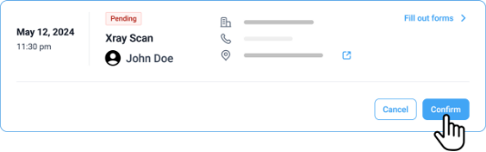
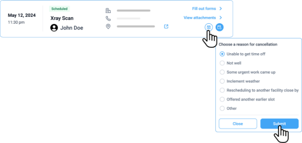
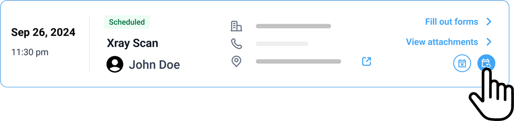
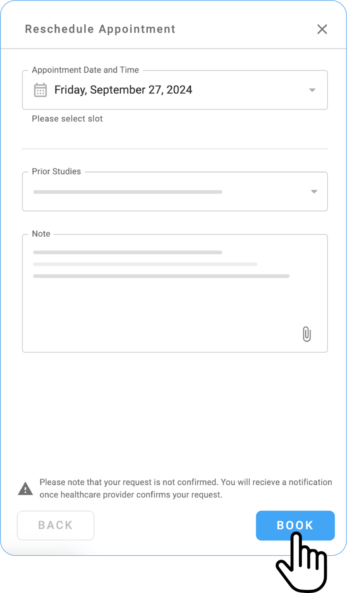
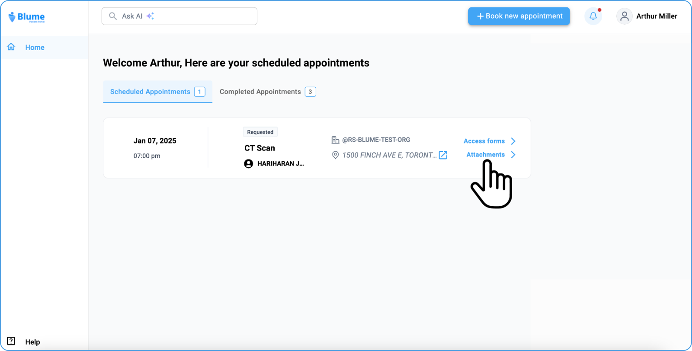
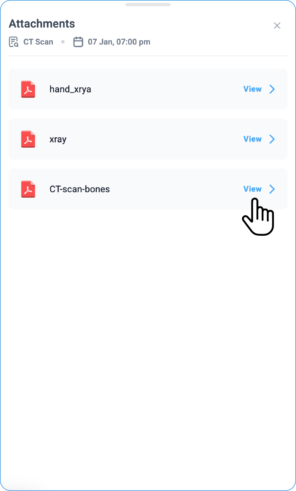
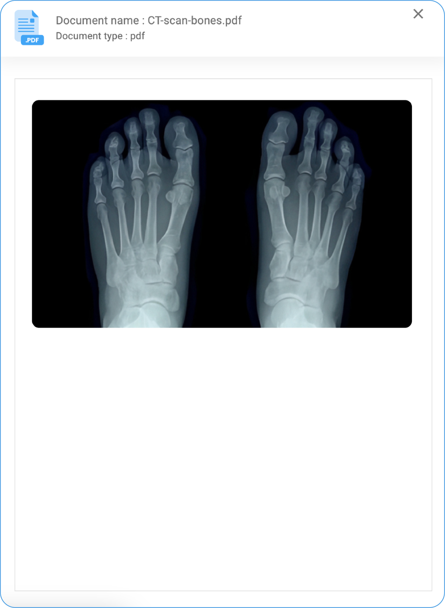
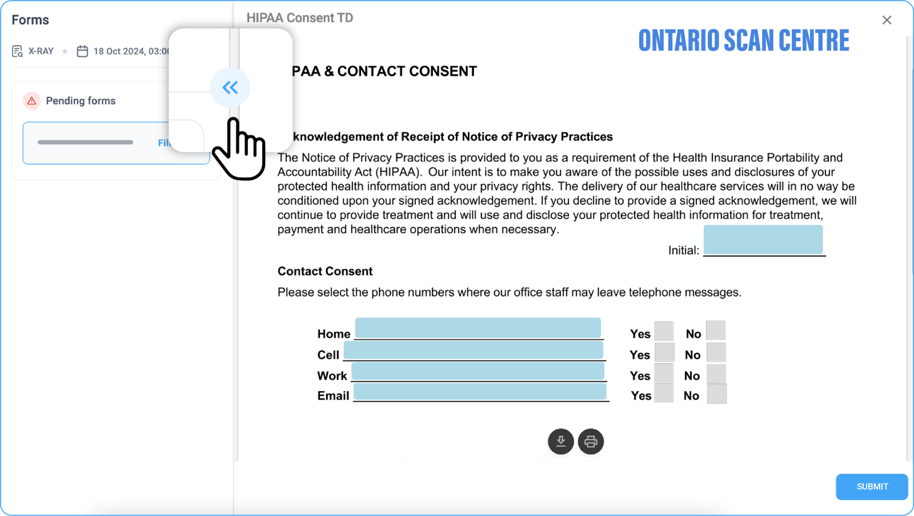
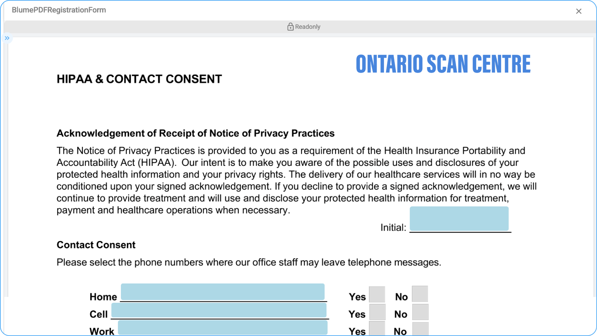

# Patient Managed Scheduling & Onboarding

Patients can self-schedule imaging appointments. They can take a photo
of their referral form with their smartphone and send it directly to the
imaging centre.

The scheduled studies appear under Scheduled Appointments tab of the
home page.

## Managing Appointments in Blume

## Viewing Schedules

- Go to the Scheduled Appointments tab on the home page.

- Your scheduled and completed studies will be listed here.

## Confirm Appointment

1.  Go to the **Pending** appointment card.

2.  The option to confirm would be shown.

3.  Click on the **Confirm** button to confirm the appointment.

    

## Cancel Appointment

1.  Pending appointments can not be cancelled.

2.  Click on Cancel button.

3.  The reason for cancellation appears.

1.  Provide the reason and click on Submit.

2.  The cancelled status appears on the appointment.

3.  For Scheduled appointments, perform the following:

4.  Click on the Cancel icon.

5.  The reason for cancellation appears.

6.  Provide the reason and click on Submit.

7.  The cancelled status appears on the appointment.

    

## Reschedule Appointment

Scheduled appointments have an option to reschedule.

1.  Click on the **Reschedule** button.

2.  Reschedule Appointment window appears.

3.  Enter the details.

4.  Click on **Request**.

5.  Reschedule request is sent to the Imaging Centre.

6.  Appointment goes to the Requested status.

    

    

## Getting Directions to an Imaging Center

1. Open the Scheduled Appointments tab on the left side of the home page.

2. Locate the appointment with the Scheduled status.

3. The address of the imaging center is displayed on the appointment card.

4. Click the address to open it in Google Maps.

5. View directions and distance on Google Maps.

## Viewing Appointments with Imaging Centers

All appointments are listed under the Scheduled Appointments tab on the left side of the home page.

## Checking Appointment Status

Appointments are color-coded based on their status:

1.  **Blue**: Scheduled

2.  **Grey**: Pending

3.  **Red**: Cancelled

4.  **Yellow**: Requested

You can also confirm or cancel appointments directly.

## View Attachments in Full Screen 
 
1. Navigate to **Scheduled Appointments.**

2. Locate the **appointment card** for the desired study.

3. If an attachment is available, you will find it below the **Access
   Forms** option.

4. Click on the Attachment option.

5. The attachment will appear as a **thumbnail preview** on the right.

6. Click on **View** to enlarge and see it in full screen.

   

   

   

## Viewing Forms in Full Screen

1. Click on **Access Forms** under **Scheduled** or **Completed
  Appointments**.

2. A list of available forms will appear on the **left side**.

3. Click on the **desired form** to open and view it in full screen.

## Viewing and Filling Forms

1. Open the Appointments tab (Requested/Scheduled/Completed).

2. Select the specific appointment.

3. Click on Access Forms.

4. Pending and completed forms are categorized into:

5. Registration Form

6. Clinical Form

7. Choose the required form to view or fill it in full screen.

   

   

    
 

