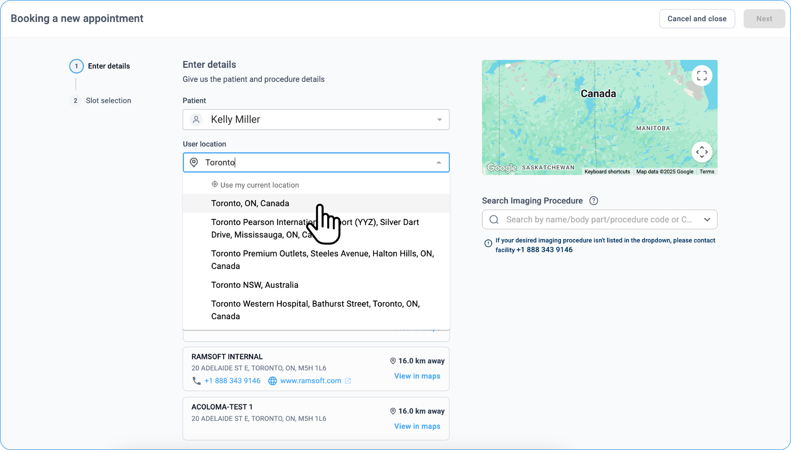

# Patient Managed Scheduling & Onboarding

Patients can self-schedule imaging appointments. They can take a photo
of their referral form with their smartphone and send it directly to the
imaging centre.

The scheduled studies appear under Scheduled Appointments tab of the
home page.

## Managing Appointments in Blume

## Viewing Schedules

- Go to the Scheduled Appointments tab on the home page.

- Your scheduled and completed studies will be listed here.

## Confirm Appointment

1.  Go to the **Pending** appointment card.

2.  The option to confirm would be shown.

3.  Click on the **Confirm** button to confirm the appointment.

    

## Cancel Appointment

1.  Pending appointments can not be cancelled.

2.  Click on Cancel button.

3.  The reason for cancellation appears.

1.  Provide the reason and click on Submit.

2.  The cancelled status appears on the appointment.

3.  For Scheduled appointments, perform the following:

4.  Click on the Cancel icon.

5.  The reason for cancellation appears.

6.  Provide the reason and click on Submit.

7.  The cancelled status appears on the appointment.

    

## Reschedule Appointment

Scheduled appointments have an option to reschedule.

1.  Click on the **Reschedule** button.

2.  Reschedule Appointment window appears.

3.  Enter the details.

4.  Click on **Request**.

5.  Reschedule request is sent to the Imaging Centre.

6.  Appointment goes to the Requested status.

    

    

## Getting Directions to an Imaging Center

1. Open the Scheduled Appointments tab on the left side of the home page.

2. Locate the appointment with the Scheduled status.

3. The address of the imaging center is displayed on the appointment card.

4. Click the address to open it in Google Maps.

5. View directions and distance on Google Maps.

## Viewing Appointments with Imaging Centers

All appointments are listed under the Scheduled Appointments tab on the left side of the home page.

## Checking Appointment Status

Appointments are color-coded based on their status:

1.  **Blue**: Scheduled

2.  **Grey**: Pending

3.  **Red**: Cancelled

4.  **Yellow**: Requested

You can also confirm or cancel appointments directly.

## Search Imaging Procedure & Requesting New Appointment

**Step 1: Request an Appointment**

1. Click the **Request Appointment** button on the top right corner.

   

3. In the **Request Appointment** window, provide the following
  details:

  - **Select Patient Name** from the dropdown. If multiple profiles are
    linked, ensure you choose the correct one.

    
    
  - **Enter Current Location.**

    

  - **Select Healthcare Provider** based on the scan type and location.

    

  - Under **Other Healthcare Providers**, you will find providers who
    do not accept online bookings. Expand their details and contact
    them directly if needed.

**Step 2: Search & Select Imaging Procedure**

- **For Desktop:**

  - Navigate to **Search Imaging Procedure** on the right side, below
    the Google Map.

   

  - Use the **dropdown menu** to search by **body part, scan name, or
    procedure code**.

- **For Mobile:**

  - After selecting your location and provider, the **Search Imaging
    Procedure** option will appear.

     

  - Choose the required **scan/imaging procedure** from the dropdown
    menu.

  - If the required procedure is not listed, contact the facility directly
    at **+1 888 343 9146** for assistance.

**Step 3: Select Appointment Slot**

- Choose a **date** from the calendar and an available **time slot**
  from the options provided.

  

**Step 4: Upload Attachments & Provide Consent**

- **Upload relevant documents** (images, reports, etc.) by browsing and
  selecting files from your system or mobile device.

  

- **Review and accept the Informed Consent** by clicking to confirm
  agreement.

- Optionally, add any additional details in the **Notes Box**.

**Step 5: Submit Appointment Request**

- Click **Submit** at the top right to send the appointment request to
  the imaging facility.

  

- An **appointment confirmation alert** will appear, and you will be
  redirected to the **Registration Form** section.

  

  

  

  

## FAQ for Request Appointment in Blume

### 1. Where can I find the option to request appointment?

The **Request Appointment** option is located in the top-right corner of the Blume homepage.

### 2. What information is required to request an appointment?

You will need to provide the following:

* Patient Name
* Scan Type
* Current Location
* Preferred Healthcare Provider
* Date and Time for the appointment
* Optional comments (if any)

### 3. How do I choose a healthcare provider?

Healthcare providers are filtered based on the scan type you select and the location you enter. Simply select the one that suits your requirements.

### 4. What if I need to add attachments to my appointment request?

After clicking Next post healthcare provider selection, you will be prompted to upload any required attachments before submitting your request.

### 5. How do I know if my appointment request has been submitted successfully?

Once you click Request, the system will confirm that your appointment request has been sent to the imaging facility.

### 6. Can I include any special instructions or notes?

Yes, you can enter any comments or special instructions in the Comments field before submitting your appointment request.

### 7. What happens after I request an appointment?

Your appointment request will be forwarded to the imaging facility for processing. You will receive a confirmation once your request is reviewed.

## Request appointment without signing up/logging into Blume

1. The facility name appears on the left top of the margin.

2. Hospital link appears on the right-top of the margin.

3. Select the **Imaging Procedure** from the drop down.

4. Search for a procedure code/ scan type.

5. Choose the required procedure and click on **Next**.

6. Selected imaging procedure name appears on top of the window.

7. Choose your location through Google map.

8. The corresponding list of imaging centres appear.

9. Choose the appropriate location and click on Next.

10. The imaging procedure along with imaging centre details appear on top.

11. Select the date and time.

12. Tick the recaptcha.

13. Click on CONFIRM APPOINTMENT DETAILS.

14. Add additional information, if any in the next window.

15. Click on Next.

16. Appointment Reserved window appears with timer to register.

17. The chosen imaging procedure, centre, and date and time appears.

18. Choose the name of the physician from the drop down.

19. The countdown time appears on the right side.

20. Enter the registration details.

21. Click on CONTINUE.

22. Appointment requested alert with the details appear.

23. Patient receives a mail with booking details.

## How do I choose my imaging procedure?

Use the drop-down menu to select your imaging procedure. For example, type “CT” to see a list of available procedures, then select the one you need.

## How do I find a location for the imaging procedure?

Choose your location using Google Maps; a list of imaging centers nearby will appear. Select the one most convenient for you and click "Next."

## What do I do after selecting a procedure and location?

After confirming your procedure and location, choose a date and time for your appointment, complete the reCAPTCHA, and then click "CONFIRM APPOINTMENT DETAILS."

## Can I add extra information to my appointment?

Yes, you can add additional information in the next window that appears after confirming your details.

## What does the “Appointment Reserved” window mean?

The "Appointment Reserved" window appears with a timer allowing time to enter your registration details. This confirms your selected procedure, center, date, and time.

## Do I need to enter details about my physician?

Yes, select your physician's name from the drop-down list when prompted.

## How do I finalize my appointment request?

Enter your registration details, then click "CONTINUE." A confirmation message with your booking details will appear.

## How will I know my appointment request is confirmed?

You will receive an email with the appointment details once your request is confirmed.

## How do i find my imaging procedure?

Check the order form prescribed by your doctor, if they are still not sure, guide the patient to contact imaging facility through the url.

## How to access the appt to cancel/reschedule?

Guide them to sign up/sign in via blume by clicking on the invite email.

PS: invite email will go out only if they are a new user.

## View Attachments in Full Screen 
 
1. Navigate to **Scheduled Appointments.**

2. Locate the **appointment card** for the desired study.

3. If an attachment is available, you will find it below the **Access
   Forms** option.

4. Click on the Attachment option.

5. The attachment will appear as a **thumbnail preview** on the right.

6. Click on **View** to enlarge and see it in full screen.

   

   

   

## Viewing Forms in Full Screen

1. Click on **Access Forms** under **Scheduled** or **Completed
  Appointments**.

2. A list of available forms will appear on the **left side**.

3. Click on the **desired form** to open and view it in full screen.

## Viewing and Filling Forms

1. Open the Appointments tab (Requested/Scheduled/Completed).

2. Select the specific appointment.

3. Click on Access Forms.

4. Pending and completed forms are categorized into:

5. Registration Form

6. Clinical Form

7. Choose the required form to view or fill it in full screen.

   

   

## Expanded Request Appointment Drawer 
 
1. Click the **+ Request Appointment** button on the top right corner.

2. The **Request Appointmen**t drawer will expand, displaying the
   required fields to proceed with the booking.

3. Fill in the necessary details such as **Patient Name, Imaging
   Procedure, Current Location, and Healthcare Provider.**

4. Click **Next** to proceed with selecting a date, and time slot, and
   uploading relevant documents.

    

    
 
    

 ## Adding Attachments to Appointments

1. Create an appointment using **Request Appointment** option.

   The appointment card appears with the status under Scheduled Appointments.

2. Click on **Upload Files** option.

   The **Attachments** drawer appears on the right side.

3. Click on **Upload** button, browse for the file and attach.

   **Attachments** window appears in the next screen with preview of the attachment.

   The **Upload Files** option is replaced by **Attachments** in the appointment card.

## Public Booking

In the case that a Patient is unable to see the facility to book
appointments, the facility must follow the below steps.

1.  Log in to OmegaAI (https://www.omegaai.com/).

2.  Navigate to the **Organization** page from the left side navigation
    bar.

3.  Select the particular facility.

4.  Click on **Details**.

    

5.  From the left menu, click on RIS and then Preferences.

    

6.  Check if Public Booking is Allowed for this facility.

    

    - If booking is not allowed, click on the **Edit** icon in the top right corner.

      Enter into **Edit** mode. Toggle the status to **Public Booking Should Be Allowed**. Click on **Save**.

    - If booking is allowed, and patient is not able to see the facility, it indicates that patient - location is not within 500km radius of this
      facility.

      Enter the address of facility for facility to appear.

7. Click on **Attachments** to upload more files.
