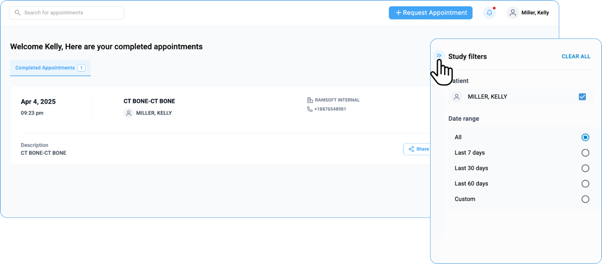
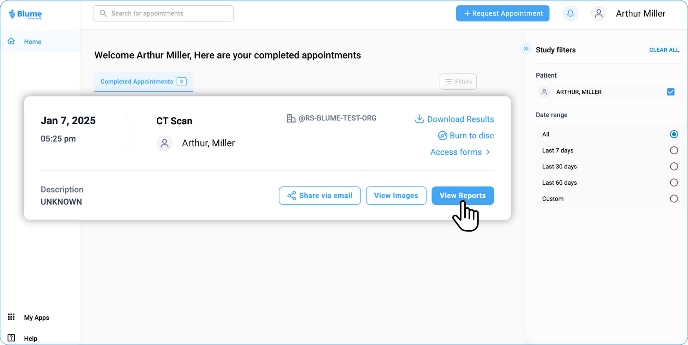

# Studies

All your studies appear under the **Completed Appointments** tab of the
homepage, which is the first page that opens when you log into the
patient portal. By default, the studies are displayed based on the
recent or the latest studies.

However, if you have sorted or filtered the studies based on any other
criteria and want to view the latest studies, on the far right-corner of
the homepage, click the Filter option.

## Viewing Recent Studies

By default, the studies are displayed based on the recent or the latest
studies.

This guide provides a detailed overview of how to view, manage, and
share your medical studies using Blume, ensuring a smooth and intuitive
experience.

## Viewing Studies

1. **Where can I view my studies?**

   All your studies are listed under the **Completed Appointments** tab on the homepage.

2. **How can I view my latest studies?**

   By default, studies are displayed chronologically, with the most recent ones appearing first.

If you have applied filters or sorted studies differently, you can reset the view to show the latest studies by clicking the **Filter**
icon on the top-right corner of the homepage.

**Note**: 

Appointment Card & Filter Panel — Design Update (Web View)_

In the latest design update for **Blume Web View**,

The **Appointment Cards** are now displayed in **full-screen mode** to enhance clarity and provide
a more streamlined viewing experience.

Additionally, the behaviour of the **Filter Panel** in the **Completed
Appointments** section has been adjusted. Previously, the filter panel
would open automatically by default whenever you accessed the Completed
Appointments.

Now, the filter panel will remain **collapsed** by default. Users can simply click the **Filter** button to open and apply any desired filters
as needed.

This update helps maintain a cleaner interface while keeping filtering options easily accessible.

## How do I view study details?

You can view study details in two ways:

**<u>View Images</u>**

1. Go to the Home Page and navigate to Completed Appointments.

**Note**

   * Select the desired study and check for any applied filters.

   * If multiple profiles are linked, ensure the correct profile is selected.

  

4. At the bottom of each study, you will see two options: **View Images**
  and **View Reports**

  

(*along with Share via email)*.

5. Click on **View Image**

6. Wait for the Image Viewer to load.

7. On the left panel, you will see patient information, including *prior*
  and *current* studies listed under *Study Explorer*.

  

8. In the center of the page, the viewport of the Image Viewer displays
  the images. You can customize and adjust the images as needed (refer
  to the Viewing/Adjusting Images section for more details).

  

9. To download the image, use the toolbar at the top or the download icon
  at the bottom.

  

10. The reports also visible along with the image.

**<u>View Reports</u>**

1. Go to the Home Page and navigate to Completed Appointments.

   **Note**

   * Select the desired study and check for any applied filters.

   * If multiple profiles are linked, ensure the correct profile is selected.

2. At the bottom of the desired study, click on **View Report**.

  

3. All available reports will be listed in the left panel.

  

4. Click on a report to open and view the details.

5. You can scroll up and down to navigate through the report.

7. The toolbar at the bottom provides options to <u>zoom in/out</u>, see
  <u>page numbers</u>, <u>download,</u> and <u>print</u> the report.

  

8. An additional *download* option is available in the top right corner.

  

9. Once done, click *Close* to return to the Home page.

  

## Sharing Your Studies with Others

### How do I share a study?

1. Open the Study: Navigate to the desired study you wish to share.

2. Access the Sharing Options.

3. Locate and click the *Share via Email* option below the study.

4. Two sharing options will appear:

    1)  *Copy the link*:

          - Click the <u>copy the link</u> option.

          - Paste the link into your browser

          - Verify access by entering the <u>patients ID/SSN/HC</u> or <u>Birth
            Date</u> to view the study.

           (External users without a Blume login can receive a read-only link to
           view the shared study.)

     2)  *Share with a New Contact:*

          - Click + <u>Share with a New Contact</u>

          - Enter the contacts <u>Name & email address</u>

          - Click the <u>share</u> button to send or <u>cancel</u> button to
            delete or re-enter the details.

**Note:**

- Previously added contacts will be listed below for direct selection.

- Multiple contacts can be selected and shared simultaneously.

- You can also share the study with existing healthcare providers listed
  under the Healthcare Provider List.

- Organizations associated with patients using the same registered email
  address will appear here for easy sharing.

### How do I create or add a new contact to share my studies?**

1. Click + **Share** with a New Contact.

2. Enter the contacts **name** and **email** **address**.

3. Click the **Share** button to send or **Cancel** to delete or re-enter
  the details.

### Can the contacts with whom I have shared my studies further share them with other people?**

By default, all your contacts can only view and download the studies that you share with them. They cannot share the studies
with other individuals.

## Contacts Accessibility to Your Shared Studies

By default, all your contacts can only view the studies that you share
with them. However, if you want them to share your studies with other
people, you must explicitly give them permission to do so.

1.  To allow a contact to further share your studies with people:

2.  Click the Share icon

    

3.  The SHARE drawer opens.

4.  From MY CONTACT LIST, select the contact to whom you want to give
    permission to further share the study or studies with others.

### Removing Contacts from My Contact List  

1. Click the Share icon A blue and black logo

2. Description automatically generated in the study. 

3. The SHARE drawer opens. 

4. From MY CONTACT LIST, select the contact you want to remove. 

5. Hover over the contact for delete icon to appear. 

6. Click on the icon to delete the contact. 

7. The contact is removed from your contact list. 

## Viewing and Adjusting Study Images:**

### How can I enlarge or zoom out of an image?**

1. On the homepage, go to the Completed Studies, open the desired study, and click View Images.

2. On the image viewer, Right-click anywhere on the study image to open the adjustment wheel.

3. You can locate the looking glass icon on the lower side of the wheel. When you hover the cursor over the icon, it
   brightens up in Blue and you can see the name in the middle of the wheel, **Magnify**.

4. Select the **Magnify** option.

5. Hold the left mouse button and move the mouse in desired directions over the image to see the magnified view of the
   part/region of the image.

6. Alternatively, you can also locate the **Up-Down Arrow inside a Circle** icon, which represents the **Zoom In/Out**
   function.

7. **Hover** your cursor over the icon to see it illuminate and display its name, **"Zoom,"** at the centre of the wheel.

8. Click on the Zoom icon.

 **Zooming Options:**

- **Scroll Method:** Press and hold the **left-click button** on your
  mouse and scroll **up** to zoom out or **down** to zoom in.

- **Click Method:** After clicking on the Zoom icon, **left-click** once
  to reveal three options:

- **Actual Pixels (100%):** Displays the image at its original
  resolution.

- **Fit to Viewport:** Automatically adjusts the image to fit the
  viewer screen.

- **Fill the Viewport:** Enlarges the image to fill the entire viewer.

  - To return to the study details page, click the left arrow at the
    top-left corner.

 ### How Do I Flip the Image?**

 1. Click on View Images to open the image viewer.

 2. Right-click on the image to open the Adjustment Wheel**.**

 3. Locate the rectangular box icons around the wheel marked with H
    **(Horizontal Flip) and** F **(Vertical Flip).**

 4. (Alternatively, press "H" or on your keyboard while the wheel is open.

    - Flip Options:

    1. Click on the "H" icon **to flip the image** horizontally**.**

    2. Click on the "F" icon **to flip the image** vertically**.**

 
### How Do I Rotate the Image?

1. On the Adjustment Wheel, locate the Free Rotate icon and click on it.

2. **Left-click and hold** on your mouse, then **move** it to rotate the image as desired.

3. Alternative Rotation Options: **Left-click once** to access quick rotation options:

- **Reset** Restores the image to its original position.

- **Rotate +90 **Rotates the image **clockwise** by 90 degrees.

- **Rotate -90 ** Rotates the image **counterclockwise** by 90
  degrees.

- **Rotate 180** Flip the image **upside down**.

### How Do I Pan the Image?

1. Click on the Palm/Hand icon in the Adjustment Wheel or press "T" on your keyboard while the wheel is open.

2. **Left-click and hold** on to the image, then **drag** it in any direction to pan as needed.

3. Additional Alignment Options: **Left-click once** to access more options:

- **Reset** Restores the image to its original position.

- **Align Top** Moves the image to the top of the viewport.

- **Align Right** Align the image to the right side.

- **Align Bottom** Moves the image to the bottom of the viewport.

- **Align Left** Align the image to the left side.

- **Align Vertical Center** Centers the image vertically.

- **Align Horizontal Center** Centers the image horizontally.

 ### How Do I Adjust the Contrast/Brightness of the Image?**

1. Locate the Window Level icon on the Adjustment Wheel or press
   "W" on your keyboard while the wheel is open.

2. **Left-click and hold**, then **move** the cursor to adjust
   contrast and brightness as needed.

3. Additional Adjustment Options: **Left-click once** to access
   preset options:

- **Auto** ΓÇô Automatically adjusts contrast and brightness.

- **Reset to Default (40/400)** ΓÇô Restores the default
  contrast/brightness settings.

- **Configure Preset** ΓÇô Allows customization of contrast/brightness
  settings.

 ### How Do I Focus on Specific Image Areas?

1. Locate the Shutter Rectangle feature on the Adjustment wheel to
   mask unnecessary areas and highlight specific regions for better
   diagnostic efficiency.

2. Alternatively, press F6 on your keyboard while the adjustment
   wheel is open to activate the Shutter tool.

3. Left-click and drag on the image to draw a rectangle over the
   area you wish to focus on.

4. The selected region will remain visible, while the surrounding
   areas are masked.

5. Additional Shutter Options- After activating the Shutter tool,
   left-click once to access different shutter shapes:

- **Rectangle Shutter**: Masks the area outside the drawn rectangle.

- **Circle Shutter**: Masks the area outside a drawn circle.

- **Freehand Shutter**: Allows you to draw a custom shape to mask
  specific areas.

    **Ellipsis Drawer** **Options**

      - The Ellipsis Drawer (three-dot menu) on the study page offers
        the following functionalities:

        1.  **Print Image**: Prints the selected study image.

        2.  **Toggle Overlays**: Toggles overlays on or off. By default,
            overlays are on.

        3.  **Pop-out in New Window**: Opens the study in a separate window.

        4.  **About Image Viewer:** Displays information about the OmegaAI Image Viewer.

        5.  **Customize Wheel:** Allows customization of the Markup and Adjustment tool wheels.

To enhance your experience with the OmegaAI Image Viewer, the adjustment
wheel offers many other variety of customization tools.

To access these additional tools, toggle down the adjustment wheel menu.

Below is a list of available tools along with their primary functions:

1.  **Cobb Angle:** Locate the **Cobb Angle** tool on the adjustment
    wheel and click on it to measure the degree of spinal curvature,
    aiding in scoliosis assessment.

2.  **Length:** Locate the **Length** tool on the wheel and click on it
    to calculate the distance between two points on the image, useful
    for measuring anatomical structures.

3.  **Drag Probe:** Click on the **Drag Probe** tool to move a probe
    point across the image and assess pixel values or other parameters
    dynamically.

4.  **Probe:** Select the **Probe** tool to analyze specific pixel
    values, providing information on intensity or density at a
    particular point.

5.  **Angle:** Click on the **Angle** tool to determine the angle
    between two intersecting lines, assisting in anatomical evaluations.

6.  **Annotate:** Use the **Annotate** tool to add text or markers to
    the image for documentation or instructional purposes.

7.  **Plumb Line:** Select the **Plumb** **Line** tool to draw a
    vertical reference line, helpful in assessing alignment or
    structural deviations.

8.  **Cardiothoracic Ratio:** Click on the **Cardiothoracic** **Ratio**
    tool to calculate the ratio of the cardiac width to the thoracic
    width on chest radiographs, aiding in the evaluation of heart size.

### How Do I View Multiple Images or Series in Different Layouts?

1. If there are multiple images or series of images, you can
   customize the display layout to enhance your viewing experience.

2. Locate and click on the **Change Layout icon** in the **image
   viewer toolbar** at the top of the screen.

3. Select the desired layout format to switch between a
   **single-frame view** or a **multi-frame display** for comparing
   multiple images simultaneously.

## What Studies are visible in Blume?

1. **Blume displays studies that are in the following workflow states:**

- COMPLETED

- EXAM COMPLETED

- PATIENT ARRIVED

- VERIFIED

- PRIOR

- SIGNED

Note: *Blume begins displaying studies once they reach a workflow step of COMPLETED or later. The study includes images and final reports as added by the facility. There are no additional restrictions preventing the study data from syncing into Blume.*

2.  **Non Displayed Study Statuses:**

The following statuses are not visible in Blume:

- ORDERED

- SCHEDULED

- CANCELLED

- NO SHOW

Note: *Access to features such as viewing studies, sharing studies,
managing appointments, and self-scheduling within Blume depends on the
organization's licensing configuration on Breeze. The availability of
these functionalities may vary based on the specific license purchased
by your healthcare provider. If you encounter restricted features,
please contact your healthcare provider for more information regarding
their current Blume license settings.*

## How to Provide Feedback on the Blume?

**Follow the steps below to submit feedback on Blume:**

**Step 1: Complete a Study**

Once you finish viewing a study, return to the Home Page.

**Step 2: Feedback Pop-Up**

A feedback pop-up will appear at the right bottom of the page with the
following message:

*"How is your experience with the Blume App so far?"*

You will see two options below the message:

- Good (≡Thumbs Up)

- Bad (≡Thumbs Down)

**Step 3: Providing Detailed Feedback (Optional)**

If you click the Bad (≡) option, a text box will appear with the
prompt:

 *"How can we improve your experience?"*

 Enter your feedback in the text box.

**Step 4: Submit Feedback**

Click the Submit button to send your feedback.

**What Information Is Recorded?**

The following details are logged for each feedback submission:

- Name

- Email

- Organization

- Date and Time of submission

- Feedback comments

Note: The feedback prompt appears only once for each user.

## How to download studies documentation?

1. Access the Completed Appointment section.

2. Navigate to <u>Completed Appointment</u> and select the desired
  study.

3. Click the Download Results option on the right corner of the
  selected study.

  

5. The downloaded files will be in ZIP format, containing reports and
  images that can be extracted on your device.  

6. The results can also be copied on a CD using the Burn to CD option.
  (Note: This feature is only available on web browsers.)

 

8. Alternatively, click View Reports/View Images at the bottom of the
  selected study to open the study/image.

 

10. To download the study, navigate to the toolbar at the top of the page
  after clicking on View Reports.

 

12. Click Download.

13. To download the image, click on View Images.

  

15. Locate the three vertical dot icons on the top of the image viewer
  toolbar and click to expand.

  

17. Select the Download option choose Download Image or Download Study
  from the drop-down menu.

18. You can Enter the File name and desired image resolution in pixels and
  hit the Download button at the bottom of the screen.

 

19. Another method to download the reports is Using the Blue Document
  Viewer Icon.

  

21. After clicking *View Image*, wait for the image viewer to load

22. Select the *Download* button at the bottom of the page to save the
  file.

   

24. If a printer is connected to your system, you can click the print
  button to proceed with the printing option.

   

26. You can also click on *Show Pages* to view all the pages of your
  document/report.

   

28. You can choose to Zoom In /Zoom Out option for your convenience.

## What is the usage of Burn to Disc feature in Blume?

1. Navigate to **Completed Appointment** tab and select the desired study.

2. Click on **Burn to Disc** option to download results and copy it on a CD. 

**Note**: 
This feature is only available on web browsers compatible with windows laptop comprising CD slot and not on MacBook.
Allows you to burn the current study onto a disc and initiates the download of a small executable file.
The executable file downloads the images to the system and facilitates burning them onto a CD.

## HIPPA Compliant Study Share

1. Click the Share icon   in the study.

   The SHARE drawer opens.

2. You can either the share the study via email or share the link to the study.
  
   **To share the study via email:**

   From MY CONTACT LIST, select the person with whom you want to share the study.

   The study is shared with that selected individual. You can select multiple people  
   at the same time.

   1. Click the SHARE button located at the bottom right-corner.

      The study is shared with the person(s) you selected. A mail is sent to the user. 

      External users, who don’t have blume login account are also eligible to get the shared 
      study. 

      A link to image viewer containing the study image in read only mode is shared.

   2. Healthcare providers section shows the options shared with and Not shared with My Contact List shows only shared with list.•
   
   3. If you decide not to share the study, click the CANCEL button located at the bottom left-corner.

**To share the link with someone:**

    1. Click the Copy the link button.
       
       The study link is copied.

    2. Paste the link and share it as a text message.

       The link is sent to the recipient.
 
