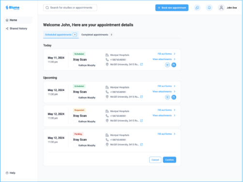
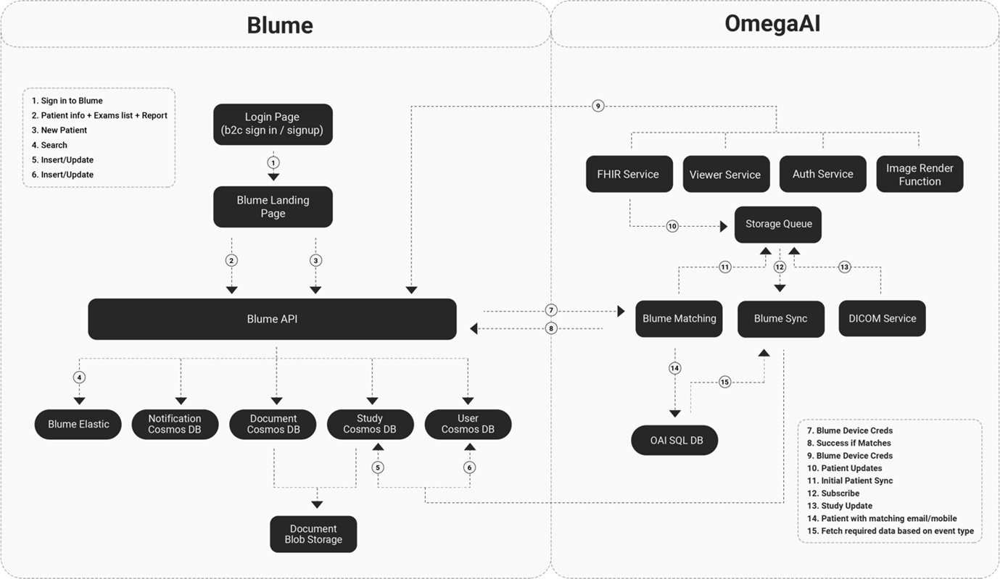

## Introduction to Blume

Blume is a powerful, all-in-one patient engagement application designed
to improve the healthcare experience by offering patients seamless
access to their medical records, images, and communication tools with
healthcare providers. Available on both **Android** and **iOS**, Blume
empowers patients to take control of their healthcare journey anytime,
anywhere, with ease and convenience.

Blume offers a highly intuitive and patient-centric platform that
enables users to manage various aspects of their healthcare, including:

- **Accessing medical images and reports** on the go from a single,
  centralized platform.

- **Sharing medical images and reports securely** with doctors, family,
  or friends.

- **Self-scheduling appointments** and sending appointment requests
  directly to healthcare providers.

- **Submitting intake forms remotely** for a streamlined care
  experience.

- **Gaining a 360 view of medical history**, offering a comprehensive
  record of the patient's health journey.

With Blume, patients can maintain greater autonomy over their health
information and care delivery, ensuring a more informed and engaging
healthcare experience.

This guide will help you use Blume's features to enhance the patient
journey.

## Quick Look: Key Features of Blume

Blume is designed to provide patients with a seamless and intuitive
healthcare management experience. Below are the key features offered by
the application:

- **Profile Management:**
  Patients can easily create and manage their profiles, update personal
  details, and ensure that healthcare providers have the most up-to-date
  information.

- **Centralized Medical Records Access:**
  Blume offers a single, secure platform where patients can view their
  complete medical history, including diagnostic images, reports, and
  files from previous procedures.

- **Secure Image and Report Sharing:**
  Patients can securely share medical images and reports with doctors,
  family members, or friends through Blume, eliminating the need for
  physical media such as CDs.

- **Appointment Scheduling and Management:**
  Patients can request appointments, receive confirmation notifications,
  and set reminders. Additionally, Blume allows users to fill out and
  submit intake forms remotely before arriving at healthcare facilities.

- **AI-Powered Report Explanation:**
  Integrated AI tools provide easy-to-understand explanations of complex
  medical terms, enabling patients to comprehend their medical reports
  better.

- **Document Upload:**
  Patients can upload prior studies, medical images, and videos directly
  through the app. This feature helps improve communication with
  healthcare providers by providing a complete view of the patients
  health history.

Blumes comprehensive set of features empowers patients to take control
of their healthcare journey while enhancing communication with medical
professionals.

Blume empowers patients and healthcare providers to navigate their
entire healthcare journey through the below highlights. With Blume -
highly intuitive user interface, patients can easily and efficiently
perform a broad range of activities such as following:

- Accessible from smartphone

- Patient centric health record and care delivery

- Securely sharing medical images and reports with doctors, family or
  friends.

- Patient Autonomy

- Single point of access to medical image and reports

- Comprehensive, 360° view of a patient's medical history

- Self-scheduling and appointment requests

- Completion and submission of intake forms remotely

## Understanding Data Architecture & Flow

