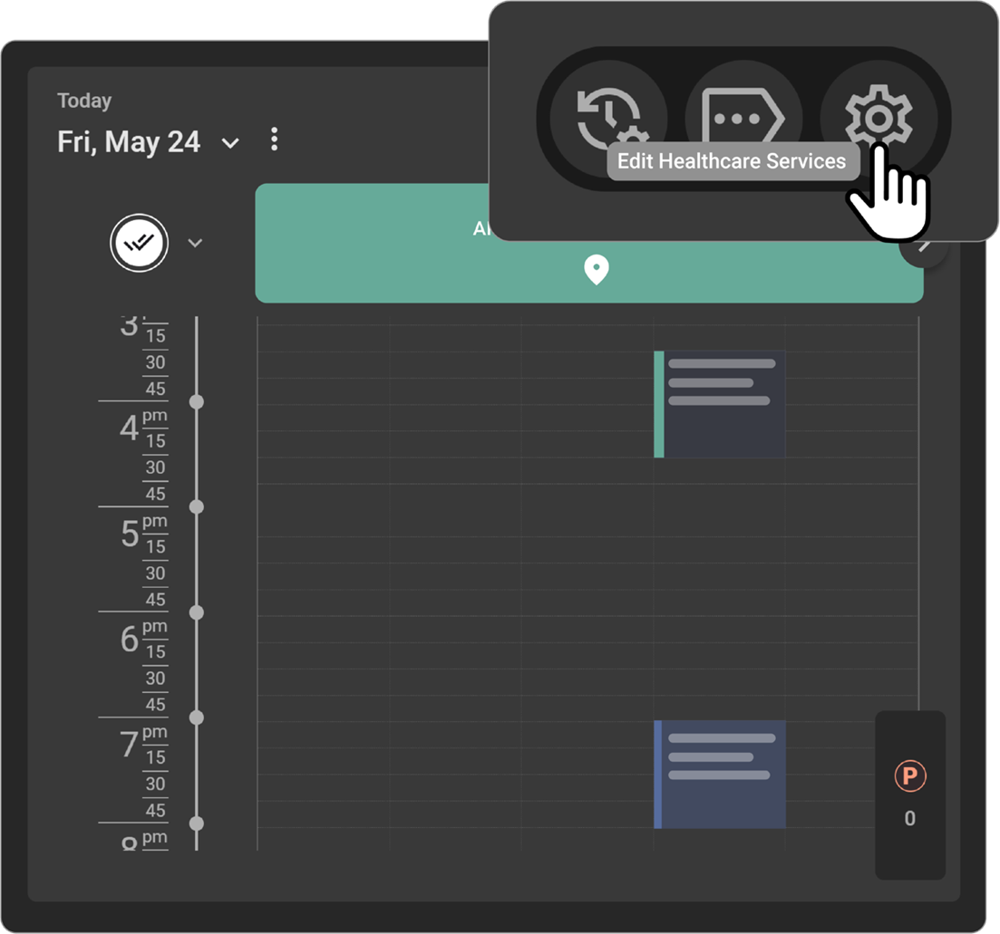
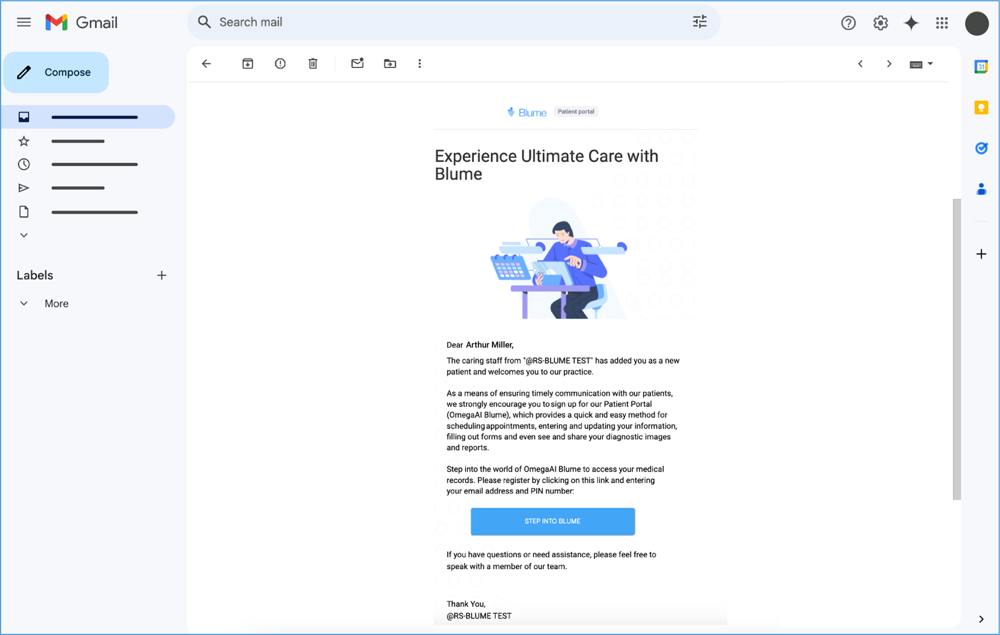
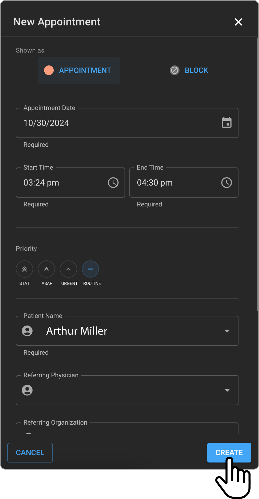
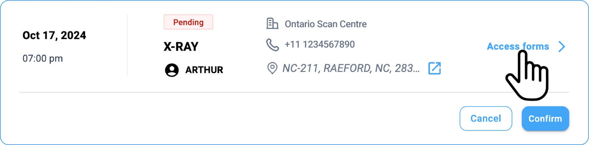
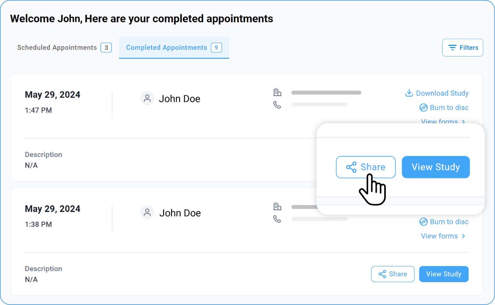

# Blume & OmegaAI

## Forms Visible in Blume

Forms must be configured in OmegaAI. Registration forms created at the
master organization level will be visible to patients of all child
organisations. This will be visible only once for a new patient under
the first appointment in Blume.

Clinical Forms must be set up at the Imaging Organisation level. Based
on the procedure code/modality for which it was configured, only those
specific forms that match with the appointments modality/study set will
be visible under the patients appointment card. These forms will be
visible to the patient each time there is an appointment with the
relevant modality/study set.

### View Forms in Blume

1. Click on the **Appointments** (**Scheduled** or **Completed**) tab.

2. Go to the specific appointment.

3. Click on **View Form** option or **Fill out Form** option.

4. **Pending Forms** and **Completed Forms** sections appear.

5. Both forms consist of **Registration form** and **Clinical Form.**

6. Choose the required form and view or fill out the form in full screen.

### Forms that are not Visible in Blume

To create a form that is not visible to the patient, but only to the imaging facility's staff, forms need to be configured as Organizational forms
by the facility. For more details, refer to Getting Started, Setting Up Forms section: Accessing Organizational Forms.

**Appointment Statuses Available in Blume**

| **RIS (Workflow Steps)** | **FHIR Appointment** | **Blume** |
| ------------------------ | -------------------- | --------- |
| Ordered                  | Proposed             | Requested |
| Scheduled                | Pending              | Pending   |
| Waitlist                 | Waitlist             | Pending   |
| Confirmed                | Booked               | Scheduled |
| Arrived                  | Arrived              | Scheduled |
| Ready for scan           | Checked-in           | Scheduled |
| No Show                  | No-show              | Cancelled |
| Cancelled                | Cancelled            | Cancelled |
| Completed                | Fulfilled            | Completed |

The study status in the worklist may be different from the appointment
status on the OmegaAI Scheduler. If customer wants to change any status,
modify the study status mapping from **Organization** settings on
OmegaAI.

In the **My Appointments** tab, the current days and future appointments
are shown. Past status is added in Blume to indicate that the
appointment time has passed, while the study may still be in progress.

### Blume Invite Email Sent to Patient from OmegaAI

When a patient is created in OmegaAI, a Blume Invite Email is
automatically sent to the patient.

**Note**: Patients email must be entered in General Information section
of the Patient page.

In the case that the patient's email was not added to the Patient page,
follow the below steps.

1.  Go to the Patient page via the Omega Dial found on the OmegaAI
    Worklist page. Click once anywhere on the Worklist to call out the
    Omega Dial menu, then click Patient

    

2.  Click on the home button in the top right corner.

    

3.  Click on Edit button.

4.  Add Patient Email.

    

    

Blume invite will be triggered if the patient email was not previously
used for signup in Blume and is the first patient email that was added
for the patient.

### Blume Resend Invite Email to Patient from OmegaAI

**Workflow**

If an email added through Patient Info page is not registered in Blume
account, follow the below steps to resend the invite:

1.  Login to Omega AI.

2.  Go to Home page and access the worklist.

3.  Select Patient from Omega Dial Menu.

4.  Under the Patient Info page, expand the Contact Information.

5.  The unregistered mail id is marked with Unknown status.

6.  Right next to the email id, click on the blume icon.

7.  RESEND INVITE option appears.

8.  Click on the Resend button to trigger another invite email.

9.  The status of the mail id is changed to Active after account creation.

10. Reinvite option will be available only for primary email.

    **Note**: Resend button will be enabled only with BPP/ AFD license.

### Setting up an Appointment Reminder for Patients via OmegaAI

There is no automatic trigger. Therefore, a reminder needs to be set up
from Workflow Automation.

## Accessing Help Center

1. Go to the Help option towards bottom left corner of the homepage.

2. The help categories appear along with search box.

3. Select the respective category and browse through the articles.

Or

1. You can type your query in the global search box on the homepage. As you type, the search returns information that's relevant to your query. Additionally, when you click the search bar, a list of your recently searched and viewed queries are displayed.

2. Search can be categorized into Search help articles on top of the help centre home page and Search for Appointments denoted by search icon on top of the homepage. The search for appointments fetches data from Studies, Share and Help Center. The All option shows results from all the categories. The search results can be filtered.

## End to End WorkFlow

### Adding Healthcare resource in OAI**

1.  Log in to OmegaAi with administrative privileges.

2.  Navigate to the "Resources" section in the dashboard.

 

3.  Click on "Create New Resource

 

4.  Fill in the necessary details (e.g., resource name, type,
    specialty).

5.  Assign the resource to specific departments or users if required.

6.  Save and verify the new resource entry.

 

## Form Configuration

1.  Navigate to Blume Settings from My App.

 

2.  Click on "+" icon to Create New Form.

 

3.  Publish Form window appears.

4.  Select a template Registration Form or Clinical Form from the drop
    down.

5.  Add relevant fields (e.g., patient information, medical history).

 

 

6.  Customize field properties (mandatory, optional, etc.).

 

7.  Click on Publish button on top right corner to publish the form.

 

 

8.  Click on three dots and select the Unpublish option to discard the
    form.

 

### Creating new order

1. Go to the Order creation section.

 

2. New Order window appears.

 

3. Input the patients details and select the healthcare resource or
  service required.

4. Generate the order and save it for further processing.

### Creating new patient

1. Access the patient registration module.

2. Go to New Appointment.

3. Click on Add New under Patient Name.

 

4. Enter the patient's demographic and contact information.

5. Click on Create button to add them to the system database.

6. A message appears confirming the creation of new patient with the
  imaging facility.

 

### Scheduling an appointment

1. Open the appointment scheduling module.

2. Select the respective date and time in the scheduler.

 

3. New Appointment window appears.

4. Select the healthcare resource.

5. Enter the patient details.

 

6. Click on Create button.

 

 

7. Scheduled message appears with details.

8. Confirm the appointment details and save the schedule.

 

### Blume onboarding

1. Upon creating new patient, message stating creation of the new patient
  appears.

2. Click on Step into Blume button in the message.

 

3. Enter the registration details and click on Register.

 

4. Perform OTP verification of the registered email id.

 

 

### Appointment confirmation

1. Go to the scheduled appointment.

2. Click on Confirm button.

 

### Filling form

1. Access the required form in Blume.

 

2. Complete each field with patient or order-specific data.

3. Save and submit the form as required by the process.

 

### View form OAI

1. Access the image viewer feature within OAI.

2. Load patient images for review and analysis.

 

### View image viewer

1. Access the image viewer feature within OAI.

2. Load patient images for review and analysis.

 

**Write and sign report**

3. Open the reporting module in OAI.

 

4. Draft the report and sign it digitally.

 

5. Save the completed report to the patientΓÇÖs file.

 

### View study in blume

1. Navigate to Blume study section.

 

### Share The Study

 

 

1. Locate the patient study and review associated documents and images.

### Flow 2 - Self-Scheduling

1. Click on Request Appointment.

 

2. In the New Appointment window, enter the patient details, location,
  healthcare services and click on Next.

3. Select the date and time.

 

4. Click on Book.

 

### Filling form

1. Click on Access Form from the study.

 

2. Instruct patients to complete the self-scheduling form.

3. Ensure they provide all necessary information for appointment setup.

 

### Confirming appointment in OmegaAI

1. Access OmegaAI and verify the appointment request.

2. Right click and select Confirmed option from the list.

 

3. Confirm or adjust as necessary, finalizing the booking for the
  patient.
